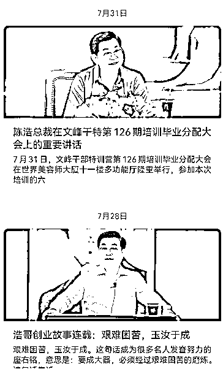
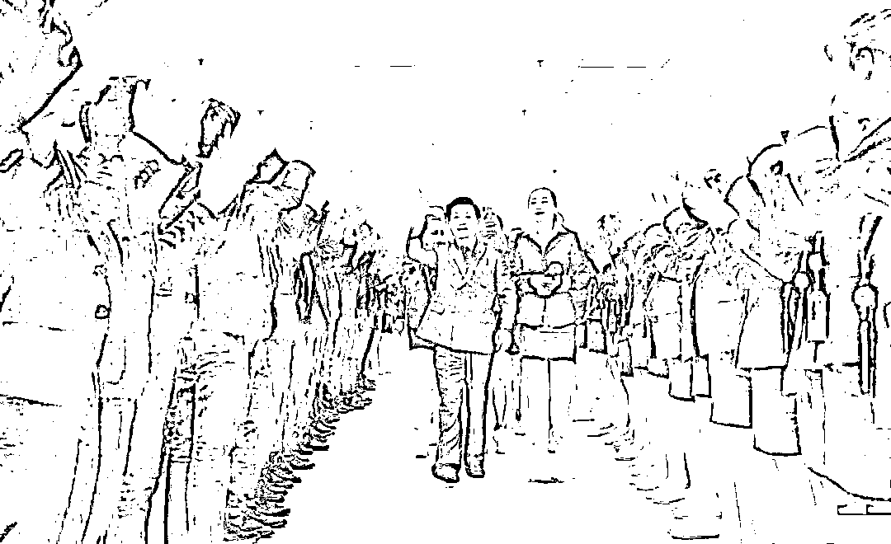

# 你以为不拍文峰浩哥的马屁，你就很有骨气了？

> 原文：[`mp.weixin.qq.com/s?__biz=MzU3NDc5Nzc0NQ==&mid=2247510410&idx=2&sn=61e935a13538644e93b756d1e89aed78&chksm=fd2e0b54ca5982424c3eb2887d73bddfc4f322c63250d2d625fe063f247d395fa3e63ca4a7a6#rd`](http://mp.weixin.qq.com/s?__biz=MzU3NDc5Nzc0NQ==&mid=2247510410&idx=2&sn=61e935a13538644e93b756d1e89aed78&chksm=fd2e0b54ca5982424c3eb2887d73bddfc4f322c63250d2d625fe063f247d395fa3e63ca4a7a6#rd)

有人让我聊一个公司，什么文峰公司总裁秘书拍老板马屁的事儿。 

拍马屁，很常见的，这都能上热搜，显然拍的很有水平。

我看了下，大概是这么些说法： 

“只有浩哥的思想才是帮助我们成功的唯一方向”

“浩哥是有天眼的，我们要相信他的安排，他的决策一定是最好的安排，你们不理解，说明没有悟透浩哥的思想。”

“凡事只要过了他的眼睛和大脑，一切都会变得通透”

然后他们文峰公司的公众号，成天发布浩哥思想，浩哥命令，就类似上图。

然后正当我好奇浩哥到底开了家啥公司，看到下面这张图，原来是开理发店的，下面都是他的小弟小妹。

搞了半天，合着是个 tony 老师。 

我想，这就是网友们不忿的根源。你一个伺候人的 tony 老师，装的什么叉。你又不是星宿老仙，搞什么法力无边，你又不是神龙教主，搞什么寿与天齐，你又不是任我行，搞什么一统江湖。

听起来网友们都很有骨气是吧？ 

我来泼一盆冷水吧。 

这种骨气实际上是建立在无关性上，这东西不叫骨气，这东西叫做通过差异找优越感。

你看，文峰的员工拍自己老板马屁，人格多么低下，而我敢于拆穿这些彩虹屁，我的人格多么高贵。

是这样么？真的是这样么？

咱们重温一个昔日我举过的例子。

我说过，以前第一次创业的时候，去很南边某个省，拜访当地甲方的一个地市级的分公司的一把手，主要是请他们买我们的产品。

有没有成功呢？没有。 

当天去了三个人，常务副总，我，我还带了一名销售。我们仨坐在他面前讲方案，他闭目养神，看都不看我们一眼，就这么一货。

我们在当地待了一周，拿不下来，无功而返。

后来他来我们这里开会，我安排销售盛情接待，双方成了朋友。我们在他们市，布了一套设备，作为展示。

再后来，我们被收购了，被行业内某民企集团收购。而那位地市总的顶头上司，就是那个省的甲方的大头头，赴京开会。

收购我们的大 BOSS，借此机会，想要建立合作关系，就在会后把甲方一群人都接到了集团总部。

那天大厅里被提前清空了，集团董事长一个人站在正中间，迎接几个副总们簇拥着的甲方大 BOSS。 

一楼大厅里一排电梯，全都封闭了，只留下中间一部，我们董事长和甲方大 BOSS，两个人乘坐电梯。 

我正纳闷，那其他这些领导呢？比如人家集团的二把手，以及各地市分公司的一把手们，这群人都 50 多了，所有电梯都封闭，他们这是准备干啥？

正纳闷，人家这群人，训练有素的小跑着爬楼梯去了。我笑着跟那位地市总打招呼，他赶紧对我摆摆手示意，意思是没功夫，然后爬楼梯爬的比兔子还快。

结果随他们爬上去，才发现，他们老大待在电梯里不出来，等着他的下属们列队，气喘吁吁爬上去后列成两列，然后他再走出电梯，在我们董事长的陪同下，去参观。 

我事后就跟一个同事聊这种马屁文化，言语中颇为不屑。

我的同事跟我讲，这有啥，你看不起人家你就以为自己品味有多高么？其实不是这样的。

说到底，你不靠这份工作过日子，这不是你的主要收入来源。看似你是这个行业的人，其实你不是，这才是你清高的本质原因。 

我听完秒懂，他说的太对了。 

我并没有什么了不起的，我只是敢于不拍这位主的马屁而已，换一个，就未必了。 

就像当天拍马屁的那群人，有谁会把这个什么文峰洗发店的老板浩哥放眼里？

一个都不会。 

但是那又如何呢？换个场合，换个哥，他们敢不拍彩虹屁么？只怕一个比一个拍的更积极，更有创意。

你看微信上有多少人在骂马云？可是你去微博上看看，又有几个人敢骂马云呢？

没意思的，很多所谓的道理，你年轻的时候听起来特别有理，等你岁数渐长，阅历渐深，你就会觉得没啥用。 

我不是说道理不对，道理本身很对，问题是，没劲。

没劲的本质不是因为对不对，而是因为执行不下去。

我也觉得拍马屁挺不对的，问题是，能不能执行下去？能，还是不能？ 

这世上总有人在某些场合拍马屁的，我这个在很多人眼里什么马屁都不拍的人，也常常拍很恶心的马屁。 

我常挂在嘴上的那句话，市场永远是对的，如果不对，请参考第一条，是不是马屁？是不是对市场的谄媚？

是，当然是。 

作为一个交易者，市场一秒钟就可以让我一无所有，那我怎么可能不恐惧，怎么可能不跪地，怎么可能不拍马屁？ 

你把这点事儿想清楚，你和他们有什么区别？有吗？ 

并没有。

文峰的洗头妹洗头弟们拍浩哥的马屁，星宿派的弟子拍丁春秋的马屁，我昔日的同行同事们拍那个甲方大 BOSS 的马屁，我拍市场的马屁。 

大家都是混口饭吃，谁又比谁高贵呢？五十步笑百步，能笑出什么来？