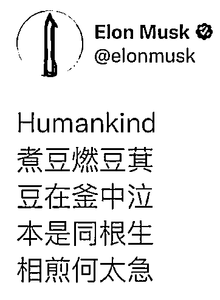

# 马斯克与曹植的七步诗

> 原文：[`mp.weixin.qq.com/s?__biz=MzU3NDc5Nzc0NQ==&mid=2247509008&idx=2&sn=68c12f0e75a934be6251256ba455d92d&chksm=fd2e06ceca598fd8ede86aac5b587dc57c963e5d280482e95669f94e942286fd78aa09d31966#rd`](http://mp.weixin.qq.com/s?__biz=MzU3NDc5Nzc0NQ==&mid=2247509008&idx=2&sn=68c12f0e75a934be6251256ba455d92d&chksm=fd2e06ceca598fd8ede86aac5b587dc57c963e5d280482e95669f94e942286fd78aa09d31966#rd)

马斯克在外网上发的中文版七步诗已经刷屏了，这种场景很少见，头一次见到国人，包括旅居海外的国人，或者已经加入别国的华人，这么整齐划一的在一个平台上讨论古诗。 

大家也不吵架了，都在安安静静的讨论这首小时候学过的中文古诗。

我们复习一遍： 

煮豆燃豆萁，豆在釜中泣。本是同根生，相煎何太急。

相传，是曹丕要害弟弟曹植，逼他七步做诗，诗的主题是兄弟，但不能出现兄弟二字。 

曹植就做了这首诗。

这诗是不是曹植做的，也不一定，因为有很多版本。也有的版本写作：煮豆持作羹，漉菽以为汁。萁在釜下燃，豆在釜中泣。本自同根生，相煎何太急。

就如同千年前一首说不清的诗，马斯克发的帖子下面也是议论纷纷，有着各种解读。

多数人认为这是一份菜谱，很显然他们不是华人群体。

那么更接近一些的解读是什么呢？是说马斯克在暗指币圈的此起彼伏，亦或者，这段时间很多人对他逼捐。 

包括联合国。

此前联合国粮食计划署忽悠，sorry，敲错了，呼吁，呼吁马斯克捐他个 60 亿，美元。60 个美国小目标。

说这点钱对于他这种身家早已超越比尔盖茨+巴菲特总和的人来说，毛毛雨啦。

但是，这笔钱可以避免 4200 万人饿死。

马斯克回应的也很马斯克，他马上就说，你出具一份清单，给我们证明下，这笔钱是如何避免 4200 万人饿死的，只要你能证明，我马上就去卖股票。

从这个角度看，似乎和这首诗，还真的有点应景。 

读者想知道的是我的看法，我的看法不在这首诗，而在这首诗之前的那个英文单词。 

你注意，全诗开始第一个词是什么？是作者么？不是的，是 Humankind。

Humankind，人类，当然，也有可能是指同名的游戏，那我就猜不透了。也许马斯克是玩游戏有感。

如果 Humankind 是指人类，那我觉得更应景一些。

[从我们大号聊沙丘的两期内容来看](http://mp.weixin.qq.com/s?__biz=MzU0MjYwNDU2Mw==&mid=2247502049&idx=1&sn=dbc4afccc4cce1b7fc28b2000729c102&chksm=fb1aa49dcc6d2d8b94df104fe50cf23c9c5bfa7c76564255288b1bd647d3a40498b7cc835359&scene=21#wechat_redirect)，我解释了一个很重要的概念就是香料，沙丘里的香料在人类历史上一直存在。

香料曾经是土地，欧洲贵族争来争去不就是那点土地么，土地上产粮食。

香料曾经是石油，你看中东王子们富的流油。 

香料也曾经是货币是资本，你看巴菲特的传奇。 

香料在今天是什么？是数据，是流量，是关注度。

你觉得马斯克和巴菲特最大的不同是什么？马斯克没有房产，没有土地，但他有关注，他的一言一行都能引起极大的关注。 

就这首中文诗，引发了几千人打赏，你注意，是给马斯克打赏，给全球首富打赏，给一个比比尔盖茨和巴菲特加起来还富有的人打赏，这说明什么？

说明人之道并不是损有余而补不足。并不是谁需要钱大家就会给谁钱，谁需要资源大家就会给谁资源，不是的。 

马斯克不需要钱大家还是会给他钱，你觉得为什么？ 

马云曾经说过一句话，他说，从来都是钱追着人走，不是人追着钱走，人追着钱是赚不到钱的。 

我知道你可能不喜欢这人，但是不意味着他这句话不对，他这句话说的很真实，很到位。 

人赚钱是赚不到钱的，那赚的都是辛苦钱。包括你去经商，你去低买高卖，赚的还是辛苦钱。 

无非体力上筋疲力竭或者脑力上耗尽心思，本质都一样。 

钱赚人比人赚钱容易的多，什么叫做钱赚人？就是钱追着你跑。 

你提出了一个概念，说我要飞向宇宙，于是各种钱都拥到你身边，说：带我发财带我飞。 

不一定都能飞的，我相信绝大部分都做了燃料，但是大家还是乐此不疲。 

这就是马云说的，钱追着人走。 

钱为什么追着人走？因为人带来了预期，人改变了他人的预期。 

那么换句话说，你能够掌握越多人的预期，你就越接近“首富”。你注意我这里首富打引号了，人类不同历史时期下钱的意义是不同的。 

吕不韦那个时代，钱是土地。所以他要奇货可居，不能封侯，不能食邑十万户，即便是大商人也没有意义。

而到了电影《沙丘》里描述的一万年后，钱是香料，只有香料能够提高人的算力，有算力你才是人，没算力，那就是猴子。猴子能拥有什么？猴子连自己的命运也主宰不了。

马斯克所在的时代下，显然，钱是关注，是数据，这是一个 DT 的时代，不是 IT，是 DT。 

你想清楚这件事，再去看看联合国粮农署的建议，难道不会发现点什么吗？ 

如果马斯克不是今天这样一个马斯克，他致力于去解决联合国说的那些事儿，你觉得他还能得到这么多资本的青睐么？ 

换句话说，他还能继续“有钱”么？ 

这两句话很短，但是我们有点跳跃，我不清楚大家是否真的看懂了。

看懂上面这几句话，并不容易，那需要你真的理解，钱究竟是什么。 

如果能够跟得上节奏，我们继续往下。 

很显然，马斯克没有什么选择，如果还想继续被关注，如果还想继续控制大家的预期，如果还想继续拥有这么多的“念力”。那么他就只能做自己。

如果他转身真的去做联合国粮农署说的那些事儿，他就会被抛弃，被资本抛弃，被关注抛弃，被念力抛弃。 

**说到底，是人类自己不愿意救助自己。**

你注意，前一个自己和后一个自己，意指不同，自行理解吧。 

人类自己宁愿把资源汇聚到马斯克手里，汇聚到一个个预期手里，汇聚到各种靠谱的或者不靠谱的概念里，也不愿意去救助 4200 万人，虽然他们和我们同属人类。 

你再回去念那首诗，把人类放在前面。 

人类，冒号，煮豆燃豆萁，豆在釜中泣。本是同根生，相煎何太急。

有没有点意思了？