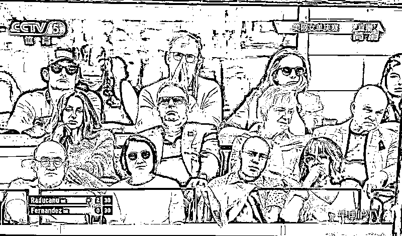

# 科比见过凌晨四点的洛杉矶，农妇见过凌晨五点的乾安县

> 原文：[`mp.weixin.qq.com/s?__biz=MzU3NDc5Nzc0NQ==&mid=2247506827&idx=2&sn=1f93a39950f77b3002307015797ef6a5&chksm=fd2e7955ca59f043057298e740ca14604c023014d29af01bac15c107cb5e8437e1d27a93fe5d#rd`](http://mp.weixin.qq.com/s?__biz=MzU3NDc5Nzc0NQ==&mid=2247506827&idx=2&sn=1f93a39950f77b3002307015797ef6a5&chksm=fd2e7955ca59f043057298e740ca14604c023014d29af01bac15c107cb5e8437e1d27a93fe5d#rd)

我今天是来问答问题的，关于部分读者问我的关于第三次分配的问题。 

有些大 V 说，搞好第一次分配，第二次分配就好了，他们不认为第三次分配意义重大。

读者问我怎么看，我来表达下自己的观点。 

第一次分配很简单，就是看谁能力强，看谁运气好。而能力强，运气好有时候与出身也是有关系的。

科比五大经典名言之一，就是问你们谁见过凌晨四点半的洛杉矶。 

这里面的重点有两个，一个是凌晨四点半，另一个是什么？是洛杉矶。 

其实洛杉矶已经说明很多问题了，起码是个国际化的大城市，充满着机会。你让科比出生在东北的乾安县，你看他能不能打进 NBA。 

当然，我不是否定科比的能力。前面也说了，能力，运气缺一不可，否则就算在洛杉矶，凌晨四点半起来也只能清扫马路。

作为对比，举一个这些天很多大 V 聊过的例子，2020 年 4 月 15 日凌晨五点半，吉林省松原市乾安县公路上发生的一起交通事故。 

三车相撞，12 人死亡，其中 9 人是中老年女工。 

她们这么早起来做什么呢？搭车去 40 公里外种洋葱，因为要省车钱，拼车，以至于超载，发生了这起事故。 

这是一个悲伤的故事，是一个生活中负担沉重的故事，有很多人从很多方向去解读。

你说勤奋，科比早上起来训练很勤奋，农妇同样早的起来搭车去远方地里干活，难道不勤奋么？ 

可是科比的成功，或者说，科比赚那么多钱，是她们可以企及的么？ 

你注意，我并不是在挑拨什么，我认可收入的差距，这里面原因很复杂。你不可能指望一个农妇用同样的勤奋能够换取科比的收入。 

但是，现实中的这个例子，恰恰证明第三次分配的意义。 

我知道有人会讲，有第二次分配呀，如果说第一次分配是大家凭本事，在丛林里搏杀，自己挣钱。那么第二次是什么？是收税，以及福利制度。 

你赚的多，你交的也多，她赚的少，她可以不交，她赚的再少，她拿补贴。 

这个逻辑链看起来是个闭环，但你注意，只是看起来。这里面是存在一定的问题的，比如，他赚的多，但是收不上来。 

收不上来的原因很多也很复杂，比如潘跑跑，[我们聊过黑石终止收购 SOHO。](http://mp.weixin.qq.com/s?__biz=MzU3NDc5Nzc0NQ==&mid=2247506619&idx=1&sn=6013deb319783caeb9d063185dd99185&chksm=fd2e7865ca59f173feedd6469981f00f7ee0cdc0e925357feea1a5e4cfe6e9ea398f6226512e&scene=21#wechat_redirect)

但即便终止了，之前，潘跑跑也带走了大量的财富，而且他此时此刻，人就在国外。

他跟她的老婆张欣，在看女单的网球赛。

如果你看过万通六君子的发家史，就知道这边批人的财富来自于那个制度还不健全的时代，你可以认为他们钻了空子，也可以认为他们赶上了快车道。

但无论如何，他们的财富都来自于这片土地。

那他们有过一丝一毫的感恩与回报之心么？并没有。 

国内任何灾情从不见潘跑跑的身影，但是他对于美国倒是大方的紧，一捐款就是上亿美金。

而他的儿子，网友们应该也很熟悉，你可以认为已经是个黄皮白心的香蕉人了。

你看到了，第二次分配最大的问题就在这里。你要面对富豪们各种各样的规避责任的手段。 

这个话题我之前说过，毕竟全世界不是一个国家，如果全世界只有一个国家。两次分配就够了。 

第一次分配看能力，看运气，第二次分配负责调解能力与运气产生的过大的悬殊。 

但问题是，当世界上有一百多个国家的时候，富豪就有了很多选择。 

你像新加坡，就打出了永久免征企业所得税的牌，这意思很显然，争取国际富豪。 

你说有办法么？理论上有，实际上困难重重。 

比如马耳他当年就因为对境外企业免税，企图虹吸国际资本，引起欧盟的不满，对马耳他进行处罚。

但处罚有用么？即便马耳他，新加坡这种小国会有所顾虑，那么大国呢？

大国与大国之间呢？你想过没有？ 

所以，实际上每个国家都是离不开第三次分配的。第三次分配，当然是说你要主动的，自愿的，承担起你应该承担的责任。 

但是我们想一想，一个人，连第二次分配都绞尽脑汁去规避，你指望他主动的，积极的承担起第三次分配的责任，指望的上么？ 

所以就需要有制约手段，这是不可避免的，这也是合理的。 

你总不能利用我的市场红利，在我这里赚钱，又钻空子，甘蔗没有两头甜嘛。 

换句话说，如果你愿意良性的，健康的，长久的，互惠互利的发展，那当然是欢迎的，你赚钱，也愿意回馈，这是一种合作关系。 

反过来说，如果你想的就是捞一笔闪人，那你闪不闪得了，就值得深思了。

这些调节手段都是必要的，也是站在了道德制高点上的。 

说白了，科比是人，农妇也是人，科比可以日进斗金，但是科比应该承担起科比的责任，而农妇，至少应该有选择，可以不那么早起，可以不一群人挤在超载的车上。

这才是我们要争取的平衡。