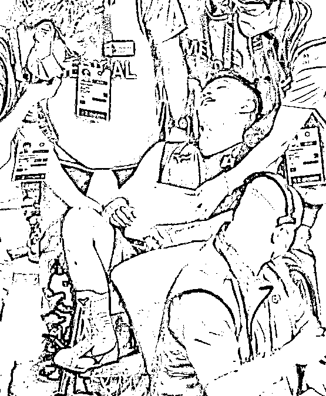

# 闭着眼睛送田中亮明晋级的裁判与睁着眼睛的当代柯大侠徐静波

> 原文：[`mp.weixin.qq.com/s?__biz=MzU3NDc5Nzc0NQ==&mid=2247505790&idx=1&sn=9514ebd1a3cadd04cd86ff2bd78be480&chksm=fd2e75a0ca59fcb612ac4d865551b75a2b7bb5877aadd49a0f5991e31313d069bb259c6ef468#rd`](http://mp.weixin.qq.com/s?__biz=MzU3NDc5Nzc0NQ==&mid=2247505790&idx=1&sn=9514ebd1a3cadd04cd86ff2bd78be480&chksm=fd2e75a0ca59fcb612ac4d865551b75a2b7bb5877aadd49a0f5991e31313d069bb259c6ef468#rd)

我之前说“[不是肖若腾失去了金牌，是日本人铸造的金牌，配不上他](http://mp.weixin.qq.com/s?__biz=MzU3NDc5Nzc0NQ==&mid=2247505579&idx=1&sn=ebd2fce33a991a72f83d7f416de1cf89&chksm=fd2e7475ca59fd63011cc0e031ed452c60abec1543de08e54b35e9a00183f9c10ac88951c89f&scene=21#wechat_redirect)”。 

我的观点很鲜明，东京奥运会的裁判就是偏袒，已经偏袒到赤裸裸的地步了。 

部分读者跟我较真，说裁判是公平的，裁判就是公平的，裁判一定是公平的，日本选手桥本虽然落地的时候一只脚踏出了垫子，但是他没有踏出运动会，当然是他赢。

只要他那只脚没有踏出日本的国界，都算他赢。 

于是我又写了一篇，[东奥会的“裁判们”，是很“清白”的，是很“纯洁”的](http://mp.weixin.qq.com/s?__biz=MzU3NDc5Nzc0NQ==&mid=2247505592&idx=1&sn=a9014249b9ea80fb7d0eb3d9909aa275&chksm=fd2e7466ca59fd701962b98a651b42ab47191a800fc90e145a72bb765bd3106de3996c5306ba&scene=21#wechat_redirect)。

这是桥本的一小步，也是日本的一大步。

日本当然是有原则的，日本的原则就是日本人必须赢，必须的。 

你看日本拳手田中亮明，就这么赢了。 

他在拳台上，都被打趴下了，都被打的不省人事，都被打的坐在轮椅上吸氧，而他的对手，毫发无伤的拳手帕拉姆，还是输了。

帕拉姆没有选择，要么打死田中亮明，偿命，只要打不死他，就是自己输。

所以我说日本人原则性很强嘛，**只要日本选手还活着，最终的胜利一定属于他们。** 

所以本届奥运会的宗旨并不是更高，更快，更强，而是一不要脸，二不怕死，当然，必须是日本人才有效。

那我还有什么好反驳的呢？都这样了，还说日本裁判是公平的人，要么你自己瞎了，要么，你懂得，我也懂得。 

没有人能够叫醒一个装睡的人，我又怎么可能。

就像沉寂了几个月的徐静波徐老师又跳出来了，从日本奥运会的开幕式谈起。 

徐老师是这么介绍日本奥运会开幕式的，他说，日本的奥运会开幕式不是为了热闹，而是为了精神。 

是一种是什么精神呢？是一种为全世界遇难的新冠病毒患者哀悼的精神。 

你现在明白为啥人家为策划开幕式前后投入几百亿日元，钱花哪儿去了都不知道，我告诉你，都烧了。 

烧给那些遇难的患者了，都买成纸钱了。 

剩下的，一丁点儿拿出来办开幕式，办的让你看了之后有一种沮丧的感觉。沮丧就对了，要的就是这个效果。

我不由得对徐老师的敬仰，又加深了几分。 

这都被你发现了，不愧是旅日多年的大 V，你真懂。

光会欣赏还不够，徐静波老师说，这届奥运会与以往不同，它主要体现的是一种精神。 

什么精神呢？是迎难而上的精神，是为死难者哀悼的精神。

我看到了，确实如此。 

日本人顶着新冠疫情扩散的压力，顶着单日新增确诊人数一万多的压力，也要办奥运。 

我本以为是为了钱，看来是我狭隘了。徐静波老师说，都是为了运动员啊。 

日本看到那么多运动员准备了四年，如果没有比赛，怎么对得起他们的训练？ 

我懂了，原来如此，原来日本人果然是为了运动员准备的这场盛会。 

不过，是为了哪国运动员呢？

看在轮椅上不省人事的田中亮明，我忽然又明白了些什么。

迎难而上，果然够励志。 

你说他都被打倒了，都被打到不省人事，但是他还是要晋级，为什么呢？

为什么呢？徐老师，您倒是来说说看。

我猜，徐静波老师会说，这是一种精神，一种勇于担当的精神。

田中亮明是担心啊，他担心晋级后挨打，这么艰巨的任务交给帕拉姆，帕拉姆不能胜任啊。

你说论挨揍，谁能比日本人牛？舍我其谁哉？全世界有谁挨过“小男孩"和"胖子"的揍？ 

日本人有经验啊，所以必须晋级。 

有什么比一个昏迷不醒的拳手在醒来后，发现自己是胜利者，更令全世界感动的呢？ 

此处应有掌声。 

感动日本的同时，徐老师不忘记踩我们一脚。

他说，奥运精神不应该像我们国人一样只盯着金牌。 

那应该盯着什么呢？徐老师，您出来走两步？我们应该盯着裁判么？ 

身残志坚？一群看不见但仍然坚持在裁判岗位上兢兢业业工作的人？

又或者已经被打到不省人事依然坚持晋级的拳手？

这是什么精神？这是日本精神，这是日本的奥运精神啊。 

兄弟们，我好感动，我好敬佩。

徐静波老师不愧是当代柯镇恶柯大侠，睁着眼睛说瞎话。 

不过人家柯镇恶的眼睛，是梅超风弄瞎的，我都纳了闷，这么多裁判，外加我们公正无私，从不双标的徐老师，你们的眼睛，又是谁弄瞎的呢？

金庸的书上说令狐冲一剑刺瞎十五个黑衣人，老实交代，当年蒙面偷袭华山派的，该不就是你们几个吧？