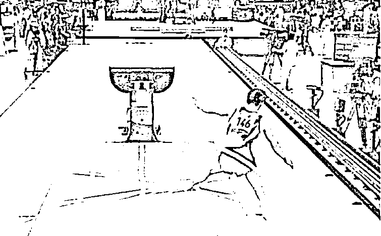
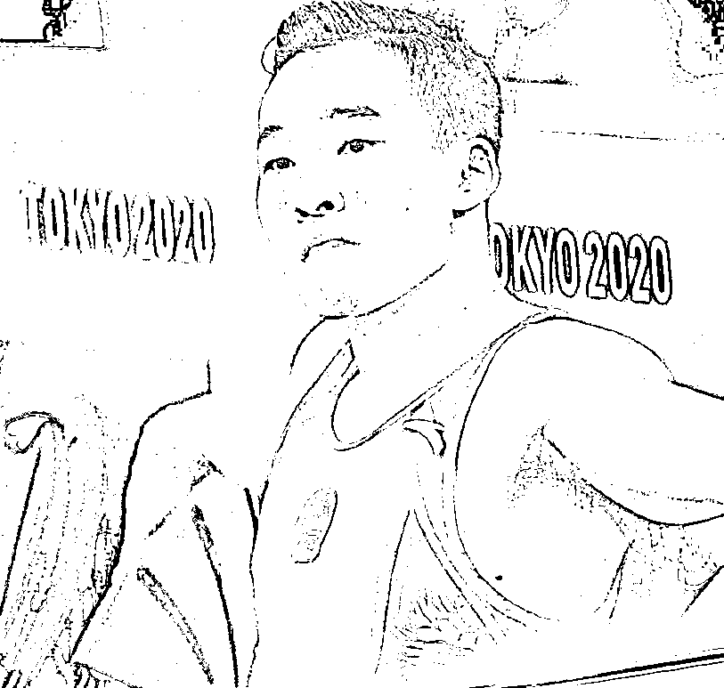

# 不是肖若腾 失去了金牌，是日本人铸造的金牌，配不上他

> 原文：[`mp.weixin.qq.com/s?__biz=MzU3NDc5Nzc0NQ==&mid=2247505579&idx=1&sn=ebd2fce33a991a72f83d7f416de1cf89&chksm=fd2e7475ca59fd63011cc0e031ed452c60abec1543de08e54b35e9a00183f9c10ac88951c89f#rd`](http://mp.weixin.qq.com/s?__biz=MzU3NDc5Nzc0NQ==&mid=2247505579&idx=1&sn=ebd2fce33a991a72f83d7f416de1cf89&chksm=fd2e7475ca59fd63011cc0e031ed452c60abec1543de08e54b35e9a00183f9c10ac88951c89f#rd)

很多人都为肖若腾摘银感到遗憾，因为他从头到尾零失误。

而最终摘得金牌的来自东道主的日本选手桥本，他最后落地是这样的： 

失误成这样，傻子都知道结果，但是很遗憾，你要看裁判是谁。 

从镜头上看，得知结果后，肖若腾也蒙了一下，不过迅速回过神来，只是留下了这么一个表情。

这个表情很有意思，以后可以做成网络表情包了，我估计会成为一个梗。

很多人肺都被气炸了，见过不要脸的，没有见过这么不要脸的，这日本人什么时候学的跟韩国人一样了？ 

我曾经说过，韩国人的体育精神是一个梗，看来日本人想要取代这个梗。 

不过生气没有必要，真的没有。 

说到底，我们今天这个 level，多一块金牌，少一块金牌，又如何？

我们早已不是几十年前，需要一两块金牌鼓舞自信的时代了，那个年月一去不复返。 

不过话说回来，日本也是个大国，也是个体育大国。为了一块金牌，至于么？ 

我想过你不要脸，但我没有想过你能为这点事儿不要脸。 

说实话我对日本的好感是经年累月的，毕竟我们 80 后都是看日剧，日漫，玩日本游戏长大的。 

但今天真的要像北野武一样哀叹一句，日本堕落了，真的堕落了。 

日本以前也不怎么要脸，可人家好歹是为了战略目标。

你说二战的时候，日本偷袭珍珠港，好歹偷袭的也是珍珠港不是？ 

你见过偷袭珍珠港的，你见过偷袭厕所的么？ 

**不要脸也要看为什么呀**，为了战略目标不要脸，别人或多或少还能理解，就这，就这，为了一块金牌出卖国格，你们至于么？ 

日本没落到这程度了？没见过金牌么？自卑到这份上了需要用这种手段偷一块金牌？

就算真的沦落到这份上了，那也选个好点的目标呀。 

你好歹找个过得去的理由，找个模棱两可的理由，找个有争议的理由，犯得着么？犯得着让一个落地都落到垫子外面的人当冠军么？ 

你让全世界怎么看日本呢？你让全世界怎么想日本呢？ 

这种事儿我本以为只有韩国人才能干出来。 

当年韩国人在自己举办的世界杯上进入 16 强的时候，大家衷心的为他鼓掌。 

当韩国人进入 8 强的时候，只剩下韩国人自己为自己鼓掌。

当韩国人进入四强的时候，连韩国人也不鼓掌了，大家都很尴尬，尴尬的无与伦比。

因为韩国人也在想一件事，接下来该怎么收场。

接下来要告诉全世界什么？要告诉大家，韩国队即将进入世界杯决赛？还是要爆个冷门夺冠？ 

从此之后，韩国人的体育精神成了全世界的梗，人称足球赛场上的阿四，就像某个阿三的梗一样。 

不要脸也有个度，过头了，就成了自取其辱。 

所以我说肖若腾的表情包非常好，比他全程零失误还要好，最后连表情都零失误。

他没有愤怒，没有质疑，只有淡淡的不屑。 

你注意是淡淡的，淡淡的就是告诉大家，我早就想到了。 

不是肖若腾失去了金牌，是日本人铸造的金牌，配不上他。

以后再遇到谁跟你说日本是他的精神故土，你什么都不用回答，轻轻的甩出肖若腾的表情包，足够了。