# 我们不再是我们，我们依然是我们，谷老师对海鲜有几种理解方式？

> 原文：[`mp.weixin.qq.com/s?__biz=MzU3NDc5Nzc0NQ==&mid=2247504107&idx=1&sn=2c4f2374fbe4d613dadfb41d061c0e76&chksm=fd2e7235ca59fb236e893b5b6374ce870122601e7043e96af2de47fe4acc0e3726a3619373eb#rd`](http://mp.weixin.qq.com/s?__biz=MzU3NDc5Nzc0NQ==&mid=2247504107&idx=1&sn=2c4f2374fbe4d613dadfb41d061c0e76&chksm=fd2e7235ca59fb236e893b5b6374ce870122601e7043e96af2de47fe4acc0e3726a3619373eb#rd)

很多人让我骂谷老师，但我还真的不舍得骂，因为这哥们吧，那是相当的搞笑。 

谷老师是个什么人呢？是个旅游达人。他做了一件什么事儿呢？他说，我们以后不要吃海鲜了吧，这么吃海鲜，回头地球上的海鲜都被吃光了。 

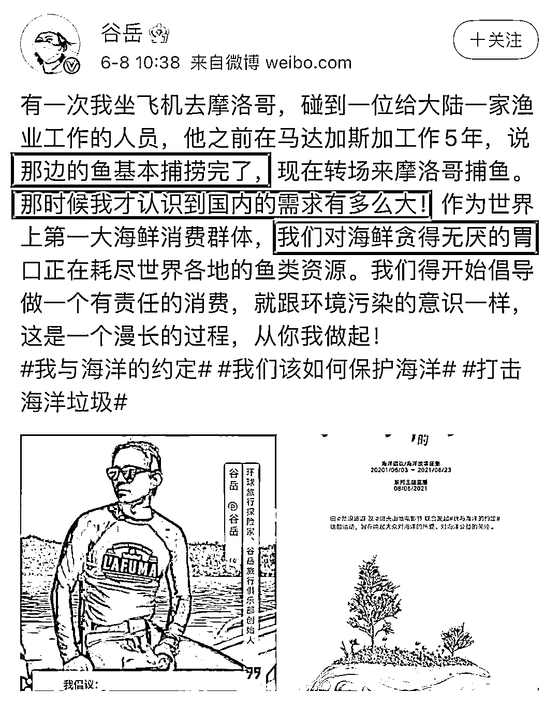

我起初以为他是个素食主义者，最起码也是个环保主义者吧。后来看到互联网上转发他以前的微博，笑了。

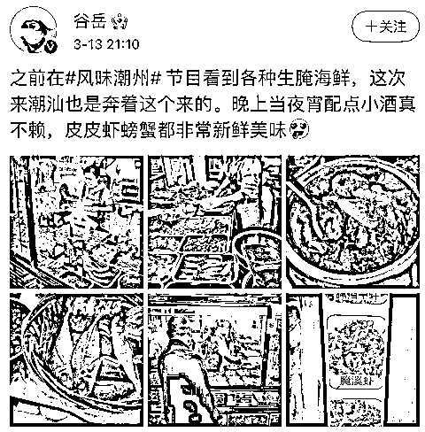

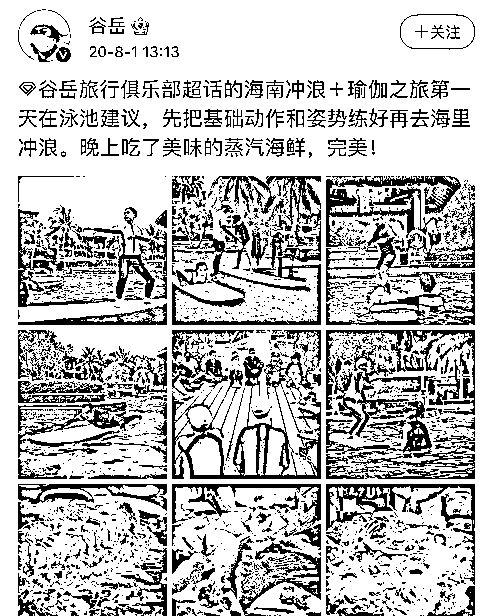

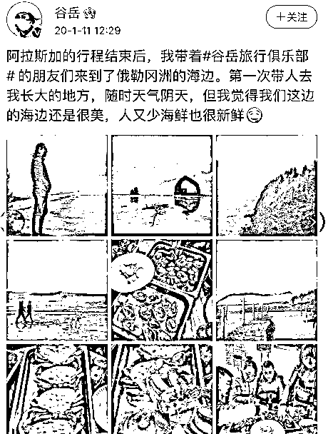

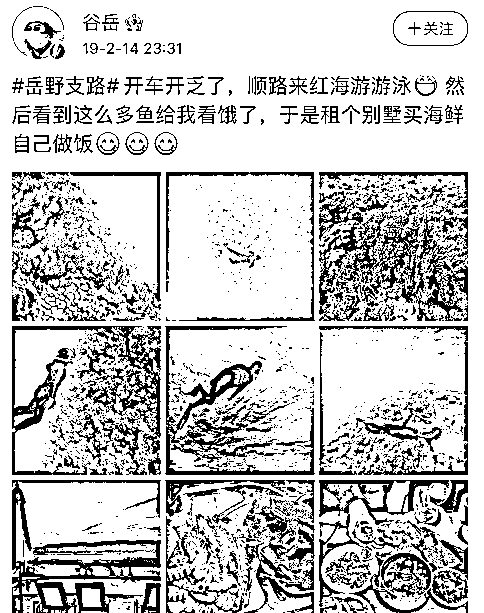

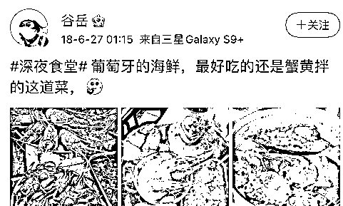

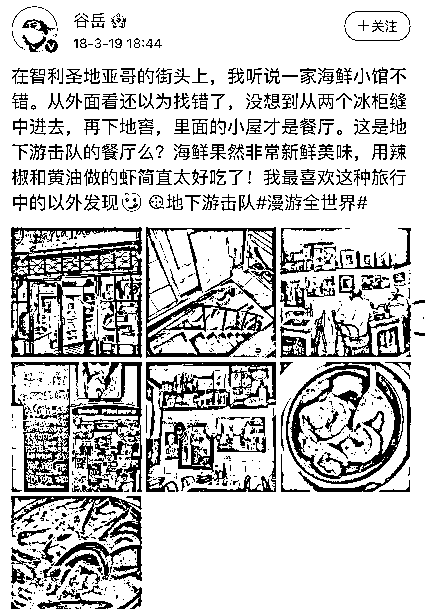

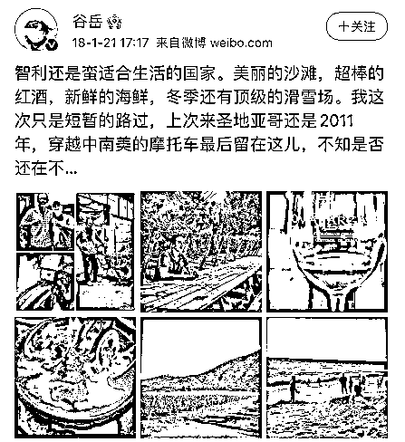

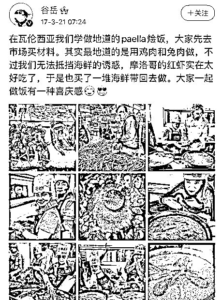

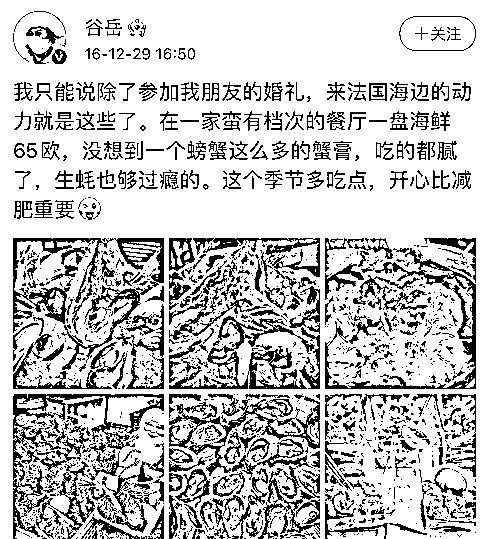

可见他是个热爱美食的人，尤其热爱海鲜。有人把他历年周游世界到处吃海鲜的图攒了一个集合，供大家欣赏。

可以说，这个地球上有的海鲜，他都没放过，包括鲸鱼，海豚之类的。

那这么一个海鲜的狂热爱好者，竟然建议大家不要吃海鲜了，几个意思？

让我来猜一猜。

**第一种可能：**

谷老师是一个从不利人，专门利己的人。他怕大家一起吃海鲜，他没得吃了。至少也是害怕吃海鲜的人太多了，物价上涨，导致他要花费更多的钱才能吃到更稀缺的品种。

如果是这样，那这人倒算坦诚。不过犯不着打着环保的旗号，你就光明磊落的把你的小九九说出来，怕什么，又没人笑你。

**第二种可能：**

谷老师是个爱国的人。他怕日本人倾倒核废水，污染了海洋，污染了海鲜，有心提醒，但觉得这么直说理由显得不够高大上，需要加一个为了什么的借口。

为了什么呢？为了环保么？

海洋被日本人污染了，那海鲜自然也被污染了，污染后的海鲜我们不吃，留给谁吃？留给日本人吃？ 

他要是这么想的，那这个用心还真是蛮良苦的。 

**第三种可能：** 

经过我仔细观察，我忽然发现，谷老师他是美国人啊，11 岁就移民美国了，美籍华人。 

这个就有意思了。 

一个美国人，说我们以后不要吃海鲜了，几个意思？

我们指谁？ 

我们不再是我们，我们依然是我们？他是李晨的好朋友么？

这个我们到底是指美国人还是指中国人？ 

如果是指美国人，为什么发微博用中文？

现如今中文在美国已经这么流行了吗？不发中文美国人已经看不懂了么？

如果是指中国人，可他谷老师明明自己已经是个美国人了呀。

谁跟你我们？谁跟你我们？

**第四种可能：** 

谷老师是身在曹营心在汉。之前奥巴马说，如果中国人都像美国人那么浪费资源式的生活，地球就要完了。 

这是妥妥的双标。 

莫不成谷老师是在讽刺奥巴马？

他明明是一个美食博主，是一个海鲜达人，故意跳出来警告大家吃海鲜对环保的危害，这里面几个意思？ 

主动送人头？通过一种虚伪的表达方式来揭露美国的虚伪？

这是一种行为主义艺术的讽刺么？

当然了，还有第五种可能，那就是这些他压根儿没想过。

那倒要问问谷老师了，你是当你自己傻呢？还是当网民们傻呢？

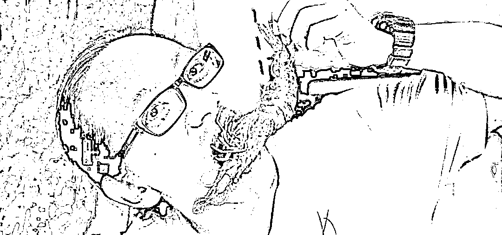