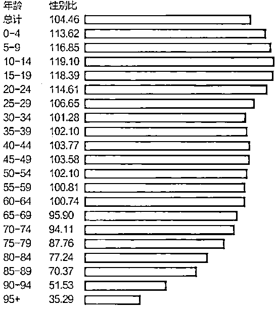

# 一本正经的胡侃男女比例失衡问题的解法

> 原文：[`mp.weixin.qq.com/s?__biz=MzU3NDc5Nzc0NQ==&mid=2247502982&idx=1&sn=ca033cc04b2b38681c2ad53325c19671&chksm=fd2e6e58ca59e74e18d051be291f958d337d5491280d6f90af41d0142f6a005746a55d1f2947#rd`](http://mp.weixin.qq.com/s?__biz=MzU3NDc5Nzc0NQ==&mid=2247502982&idx=1&sn=ca033cc04b2b38681c2ad53325c19671&chksm=fd2e6e58ca59e74e18d051be291f958d337d5491280d6f90af41d0142f6a005746a55d1f2947#rd)

有人让我聊最新的报告中，体现出来的所谓男女比例失衡问题，也就是男性总体上比女性多了 3490 万。 

我知道你们想让我聊什么，无非是男的多，女的少，打光棍的多，娶媳妇的少。 

关于婚姻的话题昨天聊过了，今天不复述。 

我觉得单纯的从这个总体数字上看问题的人，都没有养成量化的思维习惯。

站在量化的角度，这个数据你要从两个方面去分析，一个是年龄段，一个是地域。 

全国总的现存人口中男的比女的多 3490 万这个数字是没有意义的，这个总的包括 3 岁以下的，80 岁以上的，这跟结不结婚挨得上么？ 

你们家孩子 3 岁就早恋啊？所以咱们要看一份分年龄，分地域的详细数据。

从年龄的角度看，人刚出生时男女的比例是 114：100，也就是每 100 个女宝宝，对应 114 个男宝宝。男宝确实比较多。

这个数值到什么时候达到高峰呢？到 10~19 岁达到高峰，每 100 个女生对应 118，119 个男生。 

也就是说，数据显示，女婴夭折的概率要高于男婴。 

但是从 19 岁开始，男生的比例就急速下降，尤其你注意在 24 岁的时候，每 100 个女青年还能对应 114 个男青年，可是转过头，25~29 岁期间，就发生了断崖式下跌。每 100 个女青年只能对应 107 个男青年了。 

是什么原因呢？ 

男性比女性更倾向于暴力以及危险活动，比如酗酒，打架，飙车，极限运动，等等等等。 

咱们通常所谓的大龄男女，你觉得是什么时候？难道是 19 岁么？

当然不是，是指 30 岁。

30 岁的时候男女比例是 101：100，每 100 个女生对应 101 个男生而已。 

不对呀，是不是？感觉不对呀。好像男女比例没有那么夸张呀，为什么感觉娶媳妇那么难？ 

这里面有三个原因。 

**第一、**30 岁适婚不等于 30 岁才开始谈恋爱。人可能 19 岁就开始谈恋爱了。

而我们注意到 19 岁的时候，男女比例是多少？是 118：100。

所以，如果你 19 岁就有女朋友，那你一定是男性中的精英。

**第二、**男性通常会选择比自己小的女性，这进一步加剧了不平衡。

我们应该发现什么年龄的女性是同龄人里面占比最低的？24 岁之前的女性。 

可是男性恰恰表现出极度的专一，他们无论 18 岁，38 岁，还是 58 岁，78 岁，喜欢的始终是 24 岁的女生。

这种倾向进一步加剧了不平衡。 

**第三、**这个原因是女性导致的。

**女性有一个择偶最低线，不满足这个，即便男女比例 100：100，甚至倒过来 99：100，也没用，因为有一部分女性会选择终身不婚，除非满足她的最低线要求。**

**这就是所谓的大龄剩女问题。** 

**从 30 岁开始，男女比例已经变成 101：100 了，很接近了。但是很多大龄女性依然选择不婚，这就使得即便比例接近，也没啥用。** 

**那么我们看下解决方案。** 

**其实方案很简单，一个字：拖。**

**我们注意到，数据显示，从 65 岁开始，女性已经多于男性了，尤其 95 岁以上，一个老头要面对三个老太太。** 

**很显然，女性寿命长嘛。** 

**所以只要你努力健身，不抽烟不喝酒，身子骨硬朗，坚持活到 95 岁以上，恭喜你。**

**你将成为很稀缺的老头子哦，有三个老太太在同时抢你呦。**

**那你说前面咋办？** 

**很简单，你注意数据显示前面谁多？前面男生多，尤其是 15~24 这段时间。**

**所以我们要怎么样办？要尽量内部消化，男男组 CP。你想想广电为什么对《山河令》的热播睁一只眼闭一只眼？这里面表达了多少内涵？**

**你品，你仔细品。**

**说到这里，有数据派的读者一定会就着我的研究报告，自行分析所谓的地域差别。** 

**你们会看到这样一组数据，各省份的男女性别比。** 

**其中广东省的男女比例是最高的，113：100，而辽宁、吉林最低，99.7：100，男的竟然比女的少。**

**所以还在打光棍的读者按耐不住内心的小激动，准备收拾行李去辽宁吉林了对吧？** 

**你这么想就掉坑里了。这就是昨天大号里我说的，很多人知其然不知其所以然。** 

**可见你前面的数据分析也没听懂。** 

**为什么辽宁、吉林女的多？只能说明一件事，因为年轻人都跑出去了，跑到广东去了。** 

**前面的数据分析已经明白告诉你，岁数越大，女的越多。也就是说，辽宁吉林，遍地老太太。** 

**你跑去干嘛？发扬第二春，去找老太太么？** 

**兄弟，年轻的女性哪里多？恰恰是深圳多。你看着男女比例高的地方，年轻的女孩子反而多。** 

**所以正确的做法是什么？是根据自己的年龄来。** 

**如果你 25 岁以下，找不到女朋友怎么办？别着急，内部消化，可以男男组 CP 先。**

**如果你 29 岁了，找不到女朋友怎么办？反其道而行之，就跑去深圳这种地方，这种地方年轻女性才多。** 

**要是还找不到呢？那就健身去嘛，争取活到 95。岁月是一把杀猪刀，它会替你消灭那些曾经的竞争对手的。**