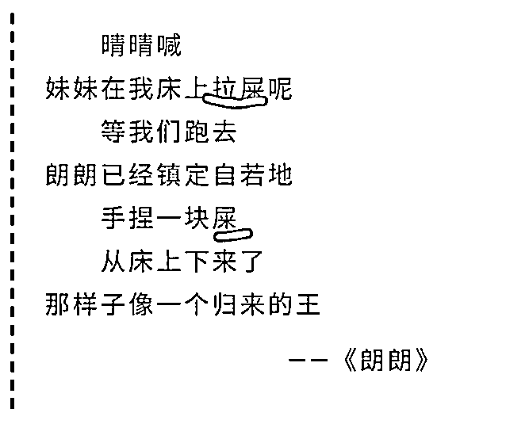
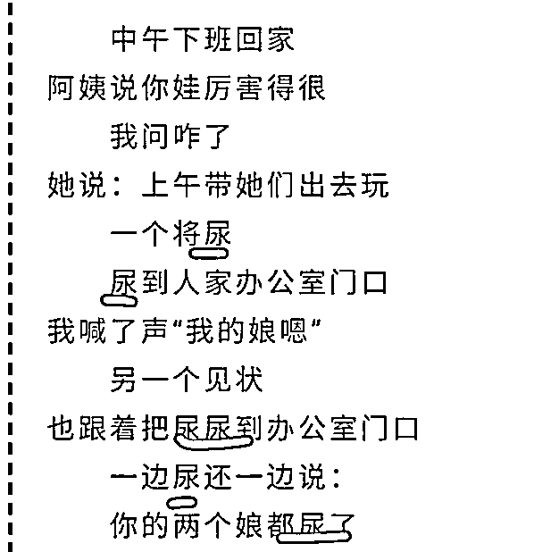

# 怎能看贾平凹的女儿贾浅浅？

> 原文：[`mp.weixin.qq.com/s?__biz=MzU3NDc5Nzc0NQ==&mid=2247499306&idx=1&sn=1f9fc6538b7721c1ae3d1c553cfe8243&chksm=fd2e5cf4ca59d5e2e9cc9c1d06e458d03b208671db3b2ca606cc35b284d204c12abb7d18af3d#rd`](http://mp.weixin.qq.com/s?__biz=MzU3NDc5Nzc0NQ==&mid=2247499306&idx=1&sn=1f9fc6538b7721c1ae3d1c553cfe8243&chksm=fd2e5cf4ca59d5e2e9cc9c1d06e458d03b208671db3b2ca606cc35b284d204c12abb7d18af3d#rd)

1 月 28 日，文学艺术界刊物《文学自由谈》发布文章《贾浅浅爆红，突显诗坛乱象》，引起舆论热议。

能上热搜人家还是要有点什么的，比如她的诗： 

诸如此类，屎尿屁的有很多，让我想起我儿子小时候，似乎小孩子都很喜欢聊屎尿屁，聊着聊着，别人没逗乐，自己先乐不可支。

甚至乐的打奶嗝。

可是贾浅浅已经不是个小孩了，她今年 42 了，西北大学文学院副教授，陕西省青年文学协会的副主席。 

这事儿爆出来被大家取笑很正常，又发现一个打着爹幌子混文坛的。 

我倒没有想取笑人家什么，我觉得这事儿唯一的价值就是给今天的文青们一个比较接近事实的预期。 

或者说吧，给你把幕布掀开了，让做着文学梦的人看看。

我知道咱们有些读者还抱有文学梦，看后台留言就知道。 

我这人也很实在，不跟你来虚的，咱们就聊名利二字。 

如今早已不是 80 年代了，80 年代你做文学梦我都能够理解，因为名利双收。

那个年代的作家，诗人，跟明星差不多，但是你知道为什么吗？ 

因为那时候念过书的人少，80 年代，20 岁的青年中，大学生能有 5%不错了。

但是现在 20 岁的年轻人里面，恐怕一半都是大学生，如果在大城市，比例就更高。

在大家都接受过高等教育的时代里，你拽两句文糊弄谁呢？不现实嘛。 

如果是利，利就更谈不上。 

2004 年 ，英达继《我爱我家》之后，推出了另一本情景喜剧叫做《西安虎家》，里面有个虎老三就是个作协的成员。 

有一集描述他出书，为了 5 万册的发行量，为了 10%左右的版税，总共也就大概 10 万块钱。 

按照书商的要求一个劲的修改内容。

本来的书名叫梦萦长安，先是被改成梦遗长安，最后被改成一个老流氓作家的临终忏悔。 

没办法，为了卖书，就是这回事。

你要想清楚一个问题，在一个只有 5%的人接受高等教育的时代，也就是慢速发展的时代。职业作家通过一些采风，生活体验，就能够写出深刻的作品。

毕竟那些作品也不是写给 95%的人看的，95%的人是不看你写的那玩意的，他们主要看戏。 

但是随着高等教育的普及，再指望几个没有社会阅历的文人写出深刻的作品，就很难了。 

说实话，知识爆炸的太快了。老百姓今天想弄清楚国际商品期货交易，明天想弄清楚芯片与操作系统。这些事情你指望职业文人，没有办法去做。 

这些问题的阐述不是靠采风，体验生活能够解决的。

这也是为啥文科全面的衰落，很多人只能去做一些文字辅助性的工作。就是这个原因。 

**在这个大的读者背景下，如果你坚持传统的文学创作道路，除了极个别的人，可以靠描述千古不变的人性，成为文学大师。大部分人，都是无法出头的。** 

事实上，今天作为实体书作家，你写一本书，想要卖超过 5 万册，都极难。

真卖 5 万册，你也就挣 10 万块钱，这钱搁在今天，好地段一平米房子都买不了。 

所以这已经不是贾平凹的时代了。 

贾平凹的《废都》我读过，禁书，我初中就读过。那本书发行了 2000 万册。

搁在今天，那种话题，有这个发行量是不可想象的。 

所以时代变了，当诗人，当作家，绝大部分人，要名没有，要利也没有。 

真要是靠投稿，挣得那点稿费能活下去见鬼了。 

人总要找饭辄的，为了吸引眼球，搞些屎尿屁实属正常。

能搞屎尿屁，还是托了爹的福，毕竟有个名人爹罩着，要不是这一点，说一句很俗的话，就是吃内什么，都赶不上热乎的。

这就是现状。

实际上这个现状说穿了就是因为受过教育的人太多了，每年制造出来的文字也太多了，想要脱颖而出，太难了。

别说贾浅浅，就算她爹，那已经是传统实体书作家里面绝对的头部富豪之一了。

贾平凹的收入能有多少呢？

能和郭敬明那种书商比？绝对不可能。

能和南派三叔那种畅销书作者比？也绝对不可能。

事实上，他的收入，连那些头部的情感大 V 都比不上。

这就是现状。而且会持续放大，趋势很明显。

别说传统书作家，连那些报社，那些杂志，都未必能生存下去，何况给他们投稿的。 

所以我觉得，这件事给读者最大的启示，应该是下面这句话。 

如果你还做文学梦，没问题，但建议你不要全职，你好歹找份正式工作。

你只听说爱因斯坦发表相对论，但你知道么？他是专利局的职工。

他是领着专利局的薪水，摸鱼的时间写的相对论。

刘慈欣也是这样的，他是写了《三体》，得了雨果奖，但他是领着电厂工资，业余时间完成的。 

一时摸鱼一时爽，一直摸鱼雨果奖。

**大家都聪明着呢，都有一份稳定的正式工作。** 

路遥当年要是能有个副教授的编，也不会走的那么早，海子就更是如此。 

所以你看人家贾浅浅，人家她爸是名人，她都还懂得先给自己弄个副教授干干，工资领着，回头再创作那些不着四六的歪诗。 

这一点很重要。切记，切记。