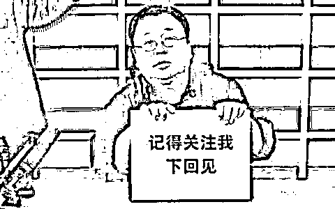
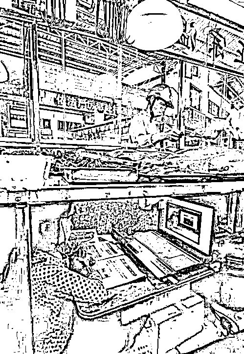

# 彪悍的男人都这样了，留学生怎么就不能平常心？

> 原文：[`mp.weixin.qq.com/s?__biz=MzU3NDc5Nzc0NQ==&mid=2247488567&idx=1&sn=68062e11ab5b6fabf37923874a15dd27&chksm=fd2db6e9ca5a3fffd673224548fd4eba18bc7a628e8e3fbd733e17e36ce83598b44dc5a27bca#rd`](http://mp.weixin.qq.com/s?__biz=MzU3NDc5Nzc0NQ==&mid=2247488567&idx=1&sn=68062e11ab5b6fabf37923874a15dd27&chksm=fd2db6e9ca5a3fffd673224548fd4eba18bc7a628e8e3fbd733e17e36ce83598b44dc5a27bca#rd)

有读者问我一问题，是关于倪副主任的一条建议。

很多标题党说，留学生一时半会儿也无法返校，国外的疫情看着压不住。那面对失学也不是个事儿，所以倪主任就建议说，可以去读高职高专。

结果网上就炸了。 

说什么“愿你留学半生，归来仍读大专”。 

这个标题确实容易让人误解，如果人家是宾大的，读了两年，你回来让人去蓝翔学挖掘机，或者新东方学烹饪，人家铁定不干。

但我仔细看了倪主任的建议全文，他没这意思。

他的原意是说，如果你在国外念了一半，比如大二，大三，面对失学的困难，建议国内的高校接受你，让你完成学业。

这种接受是需要细则的，比如考核什么的。

好比你在国外念藤校，念了两年，那回国是不是可以让清华北大接受你，认可之前的学分，让你从大三念起。

这只是一种建议，你当然可以不去，就算人家高校接受你。同理，你想转学去清华，考核不通过，人家也可以不接受你。

这是两厢情愿的事儿。

如果你在国外，只读了一个学期，或者念的学校很 LOW，国内不承认，那么是不是有大专，职高愿意接收你，并且你也愿意去，两厢情愿的情况下，帮你完成学业。

这是他完整的建议。 

当然被喷的一塌糊涂。 

其实我说句实话，太多人的预期太高了，真的。 

我们在海外大部分留学生并不是去读名校，也有很多人是国内考不上，出国念很普通的学校。

如果你原本念藤校，合理的预期是转清华北大，如果你原本念的是极差的，根本无需考试，只要掏钱即可就读的学校，那么回来能够转二本，其实很不错的。 

这叫合理的预期。

假如所有人，无视自己的情况，一律指望迎娶白富美，当上 CEO，分分钟走上人生巅峰，那这个社会是病态的。

你想想为什么那个澳洲女生会被绿地一个高管骗，用区区两万块钱两个包就哄得她婚内出轨，怀孕？

因为自己的预期实在太高了。 

太多人把自己的人生想象的不正常。

美女常有，有钱人不常有。

真的不是随随便便就能找到一堆有钱的舔狗，把自己分分钟送上巅峰。 

没有这种事的，尤其在疫情面前，更要学会降低预期。

今年创记录的有 874 万大学生毕业，就业之难，可想而知。 

可都没有什么声音议论，你知道为什么？ 

因为在职的 TMD 都保不住工作，谁管你刚毕业的呢？

理解这意思么？ 

孩子他爸妈都不见得能保住工作，谁管这孩子能不能找到？

一个家庭，到底是靠父母养着，还是靠没工作的孩子去养着的呢？

现状不能维持，讨论什么未来？

所以我都不理解为啥有这么多人去喷高职高专。 

很 LOW 么？

难道我们所有人都是藤校毕业的？是这样吗？ 

给你们看一个男人。

你想一想，这哥们，以前多高调一个人？ 

乔帮主转世灵童，吊打每个行业的存在，彪悍的人生不需要解释。

现在呢？

直播带货还债，求关注。 

看到了么？

求关注。

彪悍的男人，行业终结者，在求关注。

丢人么？

不丢人。

这就是现状，拜托同学们认清现状。

当然，喷，不只有这一个原因。

此前，留学生群体本就积累了较多的怨言，只不过借这件事，发泄了一下。 

因为很多学子滞留海外，回国很难，航班极少，几乎是要凭运气去抽签，而且抽中了机票也非常贵。 

所以就有很多不满。 

关于这件事，很多大 V 都有聊，他们基本上是冷嘲热讽，当然，冲着地方官和航空公司。 

既然有这么多人冷嘲热讽，咱就不跟风了，我来谈一点有深度的。 

如果从情感上讲，我也站在留学生一侧，回不了家，一定很难过，毕竟国外疫情控制的一直不好。 

但是，换个角度看，如果你是地方官。 

放开航班航线的限流是容易的，可是一旦因此导致疫情的蔓延，后果是严重的。

**每个城市都有留学生，可每个城市又不只有留学生。**

我给你看一张图： 

这是某个城市复工的集贸市场，图中女孩的父母在卖熟食，而这个孩子就在案板下面学习。

你知道假如一个人确诊会引起什么吗？ 

会使得很多人被隔离，很多人暂时失业乃至引起长期失业，而这些失业的人，没有钱去市场里买菜，这女孩的爸爸妈妈，就会被波及，跟着失业。

她们一家，就会陷入贫困。

这样的家庭，有很多很多，一个城市里有外卖小哥，有送货的大叔，有小区门口卖菜的阿姨，也有围绕这个城市周围养蜜蜂的，种果树的，各式各样讨生活的。 

每一次隔离，影响的并不仅仅是隔离的那几个人，而是连锁性的影响了生态链内所有企业，所有从业者的生计。 

得肺炎，不是致命的，但失业，真的是致命的。

人生病不一定会死，但不吃饭一定会死。

留学生是学生，这个案板下的小女生，也是学生。 

能理解这意思么？ 

作为地方官，他在开车，遇到了紧急情况，刹车坏了，现在左转向，压死一个，右转向，压死十个，笔直冲过去，11 个都活不了。

你让他怎么选择？

他怎么选择都是错的，可他必须选择。否则他就不配坐这个位置。

如果你不只有情绪，听我一席话。

**念书很重要，但也要看和什么比。**

你得理解，**让这个国家千千万万个爸爸妈妈有工作，才是当下最重要的事情。**

既然国内刚毕业的大学生，可以先去深造，甚至待业，国内的小女生，可以在案板下面上网课。 

那留学生，也是一样的。

一样，才是把你当自己人。

有福同享，有难同当。才是自己人。

你要学会在海外独自生活，要学会保护自己，要学会照顾自己，尤其在暂时回不了国的情况下。

所谓精英，不是占便宜，而是有担当。

人有时候，在学校里未必能学到什么，社会给你的毒打，才更让人成长。

因为，男人的胸怀是委屈撑大的。

说实话，留学生回不了国，我很难过，就如同我看到案板下上网课的女生。

但如果换个角度，或许，祸兮，福之所依。

愿我们所有的学子，无论海内外，经历过这场苦难，都能像《无问西东》里面一样，成为新的一代，英雄儿女。