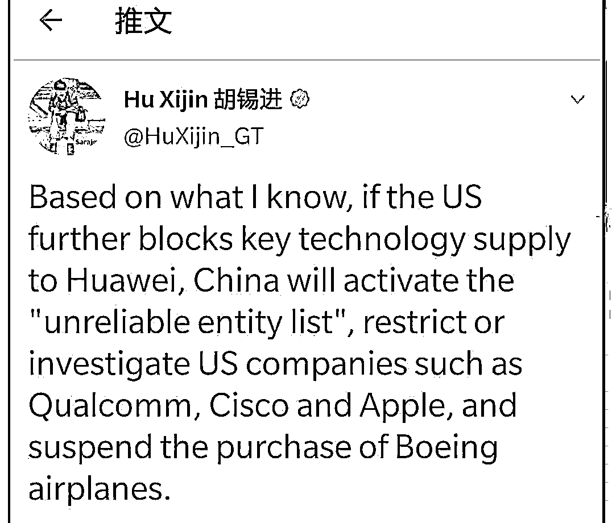

# 关于美国限制华为的突发消息和老胡的强硬回击

> 原文：[`mp.weixin.qq.com/s?__biz=MzU3NDc5Nzc0NQ==&mid=2247488295&idx=1&sn=914d0e7f65b123803064ff62538917ae&chksm=fd2db1f9ca5a38ef4d256a9be000453deac88aea6ab8a91ef0cc6b6acb4f0d351c5f9321e4b1#rd`](http://mp.weixin.qq.com/s?__biz=MzU3NDc5Nzc0NQ==&mid=2247488295&idx=1&sn=914d0e7f65b123803064ff62538917ae&chksm=fd2db1f9ca5a38ef4d256a9be000453deac88aea6ab8a91ef0cc6b6acb4f0d351c5f9321e4b1#rd)

很多读者问我 5 月 15 号的消息，大概是什么呢？

就是美国商务部下属的工业安全局公布了一项“旨在保护美国国家安全的计划”，说白了就一个目的：

限制华为制造半导体。

该措施要求全世界所有的半导体厂，无论晶圆还是 IDM，只要有用过美国软件设备的，一律要得到美国的许可证，才能够为华为生产芯片。

实际上去年已经搞过一轮华为，这次之所以又来，目标直指台积电。

换句话说，这次的意思是说，哪怕台积电这种企业，为华为生产芯片，也得通过美国的许可。

这个不讲理就不用讨论了，就好比我们家是开饭店的，比如就叫西贝吧。

去年我不欢迎某个客人，起初我要求，西贝旗下所有分店，接待这名客人，都得来我这里报备，获得许可。

现在呢，我要求，所有餐饮店，哪怕是海底捞，哪怕是东来顺，你接待这个客人，也得来我们西贝，获得许可。

理解这意思吧。赤裸裸的霸权。

老美这么干不稀奇，老美一贯如此。何况川普正在竞选，竭尽全力也要找点事儿。

何况最近川普和奥巴马闹起来了，川普要求参议院传唤奥巴马，奥巴马竖起中指，vote。

投票。

意思就是说，美国人别再被这哥们忽悠了，用脚投票，改选民主党吧。

俩前后总统能撕破脸，着实不容易。当然，这还是奥巴马挑的事儿。

奥巴马直截了当的批评川普是美国绝对的混乱与灾难。

因为从头到尾，这哥们上蹿下跳，除了把股市搞崩了，几分之一的人口失业，外带全球第一的确诊人数，政绩上确实乏善可陈。

有个脱口秀非常好，川普是一种情绪，我觉得很形象，读者可以看一看。

📹 [`v.qq.com/iframe/preview.html?width=500&height=375&auto=0&vid=g0954fp1cdl`](https://v.qq.com/iframe/preview.html?width=500&height=375&auto=0&vid=g0954fp1cdl)

但不管怎么说，人家川普还是想连任的。

他在连任上，可从来不荒唐，思路一直很清晰。

作为美国总统，只要局面对自己不利，最聪明的方式就是找中国麻烦，秀自己强硬派的姿态。

这样能赢得不少好感，好感就是选票嘛。

华为就是在这种大背景下，遭遇又一轮的限制。

其实说实话，我挺想川普连任的。人同此心，心同此理，我相信大部分中国人也想他连任。

他虽然看起来像个炮仗，雷声大，但你仔细算算帐，这哥们属于杀敌 1000，自损 2000 的主。

理解这意思吧。

竞争是不可避免的。

换句话说，我们想一点苦日子都不过，是绝对没可能的。

那既然有些事不可避免，你是和一个杀敌 1000 自损 800 的较劲，还是和一个杀敌 1000，自损 2000 的较劲呢？

如果是我，我觉得还是川普连任的好。

要搞就搞嘛，反正迟早要搞，有些事儿，与其让儿孙们解决，倒不如我们这一代人一鼓作气。

这个道理我曾经说过，中国今天舞台上，全都是富一代，偶尔有个二代也是傀儡，他爹在后面掌舵的。

这是最好的搞事情的局面。

富一代嘛，都是搞事情起家的，什么苦没吃过，什么事儿没遇过，什么流氓没耍过，谁特么还怕谁不成？

富一代  VS  富五代，这是最好的阵容。

真要是富二代 VS 富六代，这事儿还不好说了。

在这种局面下，老胡的回复就很有意思，他 15 号在推特上发了个帖子。

什么意思呢？

老胡说，如果你搞华为，我们就搞高通，思科，苹果，波音.....

话音刚落，这几家公司的股票就开始跌。

非常有意思。

这就是说，假如你黑虎掏心，就别怪我猴子摘桃。

反正都是冲着那玩意儿去的，男生都知道。

很多读者问我，老胡这人以前挺中庸的，最近怎么变得好狠斗勇？

其实你没观察仔细，如果你细心一点，会发现他只针对美国勇。

这是很精明的一种谋略。

要知道美国希望的，是我们和周边其它国家搞事情，比如和印度。 

这样他爽了，美元是避险货币嘛，我们一搞事情，资金流出，流向美国。

所以我们不能和周边国家搞事情，任何事都要冲着美国去。

这意图很清晰，要搞事就咱俩搞，咱俩捆一块，你让我不安生，你也别安生，如果资本不流向我，也绝不能流向你。

有点意思吧，外行看热闹，内行看门道，老胡的团队，其实精巴的很。 

我理解读者为什么问我这个话题，还是担心华为，乃至我们的科技，甚至担心国家。

去年我就说过，写过连续几十篇有关华为的文章。

其实重点就一条，我反复告诉读者，**有操心华为的功夫，不如拿来操心操心自己。**

我当时写那些内容的时候，媒体上铺天盖地的忧虑，尤其之前有过中兴的先例。

但你今天回顾，会觉得我当年的文章，篇篇料事如神。

其实没啥神奇的，相信媒体成天打嘴炮，不如相信资本市场。

资本市场看好的东西，也许会错，但概率远低于大众。

有钱人是怎么有钱的？难道有钱人都是傻的？怎么可能呢？ 

天底下就没有比资本家，比投资人更精的。

事实证明，资本市场，极少会走眼。 

华为 2019 年销售收入 8588 亿元，同比增长 19.1%，净利润 627 亿元，同比增长 5.6%。人均收入 110 万。

要知道，9 亿网民，7 成月收入低于 5000。

这两个数据对比一下，你会觉得很可笑。

这都操的哪门子心？闲吃萝卜淡操心。

其实今年一季度，你去看数据，外资是流入的。这和媒体上铺天盖地的悲观情绪相差是不是很大？

的确很大。

这就是我说的，钱比人靠谱多了。钱是不会骗人的。 

钱看好谁，多半谁就是赢家，最起码，100 次里面，99 次都这样。

其实资本看好新兴市场的原因很简单，我之前说了，舞台上都是富一代。 

啥叫富一代？

努尔哈赤，完颜阿骨打，就这号的。

你说努尔哈赤当年十三副铠甲都能起家，今天咱都入了关了，兵强马壮，这点自信，还没有么？ 

说到底，这就是资本为什么相信我们，就这么点事儿。 

当下这帮企业主，你别管他们土不土，骨子里好狠斗勇，人家是正经八百从小作坊干成今天这个规模的。 

枭雄是一种难以形容的生物。

如果你真的见过枭雄们到底是怎么成长起来的，就不会为他们操心。

多为自己操操心。

狼群是很狠的生物群，但作为一只羊，待在狼群里，你自身的压力，是巨大的。 

这才是我一直奉劝读者的。

作为强者，没啥比有奔头更爽。梅花欢喜漫天雪嘛。强者都喜欢搞事，搞事才方便淘汰别人，才方便自己出人头地。

作为弱者，没什么比跟上队伍更重要的。别回头群体赢了，你被淘汰了。

这是非常朴实的建议。

千万不要学下面这种人。

这哥们是谁呢？

是个喷子，网络上最常见的喷子，骂钟南山，被拘留了。

我不是针对他有看法，而是我觉着，人都混成这样了，还特么成天咸吃萝卜淡操心。

我相信这哥们吃饭，菜里都没有几滴油，成天操联合国秘书长的心，图啥？

我们这只狼群团队，这种分化越来越明显了。

有些人真的是急速的奔跑，看都不往后面看一眼。

而有些人，蹲下来骂，蹲下来仇恨，只会让自己越来越穷，越来越 OUT，被甩的无影无踪。

真的，真就是这样。

这不是古代，人多没用的。尤其随着人工智能的急速扑来。

人要是没脑子，再多都啥都不是，再多都啥用不顶。

好好操操自己的心，好好为自己谋划谋划，把自己的日子过好。

可长点心吧，别浪费时间弄那些没名堂的事儿了。

即便你不信我说的，回去各问各妈，我相信天下父母给出的都是这番话。

除非你不是亲生的。