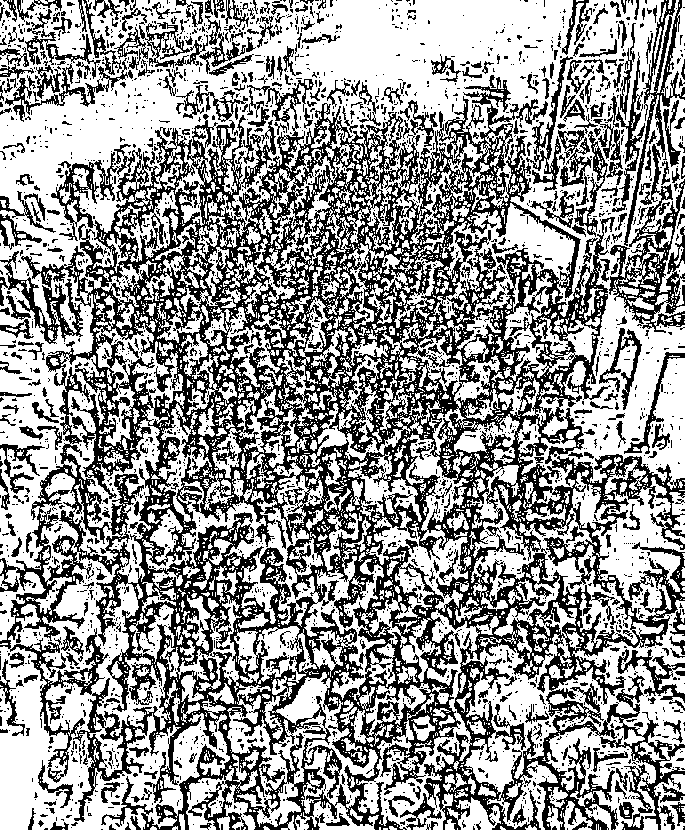

# 能哀思，说明你混得好

> 原文：[`mp.weixin.qq.com/s?__biz=MzU3NDc5Nzc0NQ==&mid=2247487280&idx=1&sn=9d8ec99b4512ba53222238e5c52b7555&chksm=fd2dadeeca5a24f86c9bfce82424ff247877552fa53498094023f38d0ff90c5b42a8a7cac3a4#rd`](http://mp.weixin.qq.com/s?__biz=MzU3NDc5Nzc0NQ==&mid=2247487280&idx=1&sn=9d8ec99b4512ba53222238e5c52b7555&chksm=fd2dadeeca5a24f86c9bfce82424ff247877552fa53498094023f38d0ff90c5b42a8a7cac3a4#rd)

很多人问我，为什么昨天清明节也不写个悼文。

我给你听一小段手机录的，昨天某大寺大和尚们的祈祷。 

[🔈 梵音祷告](https://res.wx.qq.com/voice/getvoice?mediaid=MzU3NDc5Nzc0NV8yMjQ3NDg3Mjc5)

其实如果见了现场，你会更加震撼。只是未经许可，不便上图。

有些话怎么说呢，假话很动人，真话很伤人。

所有一切的追思，哀悼，本质是什么？

本质是我们混得好。

再把话说难听点，因为我们有钱，这是一切哀思的起点。

要是咱没钱，那就不叫哀思，那叫欲哭无泪。

我提到的那个大寺里，昨个金碧辉煌，巍峨庄严，大法师们戴着口罩祈祷逝者安息。

场面很排场，因为他们是数的着的富庙。

本身香火就很旺，香客们也舍得出手，他们庙里的布施本子都是密密麻麻，所以做什么事儿都大气。

我看到今年他们寺也往疫区捐了很多次钱，不仅仅是开展宗教祈祷。

当然他们往年也这样，修桥铺路，救济山区。

这是我一直的观点，很多事儿，说穿了，是富，不仅仅是因为善。 

他们寺招人，开的价码不比码农们低，你可想而知，那是个堪比互联网大厂的庙。

我昨天听着大师们的声音，脑子里想什么来着？

想的全是印度。

因为佛教就是打印度来的。

我们虽然整天开玩笑说什么印度是人中蝙蝠，天生自带抗体，但那也只是说说的。

有钱谁乐意当人中蝙蝠呢？

说到底，那都是无奈。

这张图来自 BBC。

图上是印度封城后，好些人赶忙回家。

底下很多评论。

有人说，这不是乱搞么？很多人没带口罩，人挤人的，给病毒的传播制造环境。

说这话的人，完全不了解这个世界。

照我说，印度封城，完全是人道主义的灾难。

印度这个国家的富人，和我们一二线城市的中产阶级一样，平均收入接近发达国家。而穷人，和非洲最穷的地方一个档次。

我们平常说一个人穷，是指他月光，或者负债累累。

但再怎么样，不会饿死。

他总有手机，总有支付宝，总能信用消费，买口吃的，哪怕各种平台上拆了东墙补西墙，也能活一阵。

可印度不一样。

这帮人是真穷到兜里就 20 块钱，拖家带口，啥也没有。

他们平日里在孟买，也许就是洗衣服，做佣人，干一天挣一天的吃食，家里隔夜粮都没有。

你莫迪忽然就说封城，让人家怎么生存？

武汉是开着一堆私家车企图上高速被堵回去，很多网友说好可怜，背影好似一条流浪狗。

大哥，想当流浪狗，也得有辆车。

这些在孟买的印度底层，连买车票的钱都没有。

他们怎么回乡？

拖家带口，拉着小孩，靠走。

谁知道他家在几百公里，还是一千公里之外呢。

走路不是最惨的，最惨的是口粮呢？

他们不需要地方住，露天躺着就行，也不需要水，严重污染的恒河水都喝的下去，找点雨水就能对付。 

可人不能不吃饭啊，他兜里就二十块钱，一路上吃什么？

但不走，你让他们在城里怎么待下去？都隔离了，谁雇他们？

对于这些人来说，新冠肺炎，那算个事儿么？

印度的这些穷人，根本就活不到需要考虑新冠肺炎的那个岁数啊。

说到底，是这帮中产阶级以上的自己怕死，逼着莫迪封城。

可这么一来，印度很多人干一天挣一天口粮的经济平衡就被打破了。

不信你回头等着瞧，这场瘟疫下来，印度饿死的，比病死的都多。

这就是人生啊。

你忙着追思哀悼一群 80 岁以上的往逝者，可印度不知道有多少 8 岁以下的，可能会因为差口吃的，就那啥了。

那啥了，都没空追思。这就是人间。

我不是建议咱们去帮人家，没这意思。

印度的富人们都不管，关咱什么事儿。

把时光往前推四十年，我们的境遇不见得比他们强，这中间最大的经验教训是什么？

是做对了两件事。

1、坚持搞经济。

2、让所有人都受教育。

如果我们当年还跟那儿掰扯意识形态，今天能是世界工厂么？能有这么多资源么？

**有人的地方一定有阶层，而能够让人在不同阶层之间流动的，唯有教育！**

人要是有脑子，再穷都还有翻盘的可能，人要是没脑子，靠救济是没有用的。

我知道某些读者是白左，我也不来和你辩。你自己好好想一想。

你有钱的时候，可以给佛重塑金身，可当你没钱的时候，佛能给你什么？

佛要是真有灵，能看着印度人过成这样？

所以我昨天没有推送任何哀思。

哀思这玩意没啥用，人这东西，早晚都得走，你得走我也得走。

关键是要走的有价值。

要让后人知道，路要往哪儿走。

只要后人过的好，兜里有钱，还怕追思不宏大？

要是后人过的不好，哭有什么用呢？人自身难保的时候，都是欲哭无泪的。