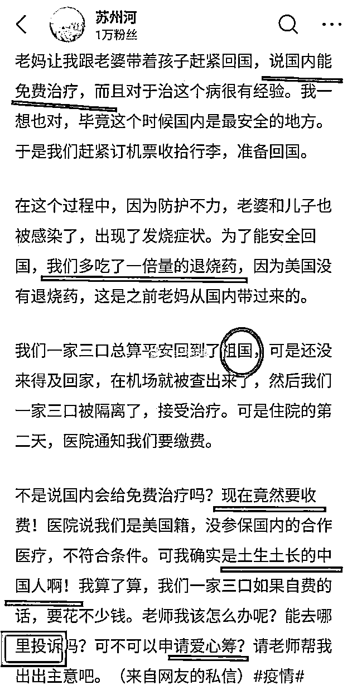

# 今天零时起，回国进京 14 天观察，无论国籍，费用自理

> 原文：[`mp.weixin.qq.com/s?__biz=MzU3NDc5Nzc0NQ==&mid=2247486966&idx=1&sn=6d6ef606c14a7480f7295557899bdc50&chksm=fd2daf28ca5a263ef0bd94c648be31cea2d1a8efa49bd7c788a4dadf3dfc3b34b1b47ace20b9#rd`](http://mp.weixin.qq.com/s?__biz=MzU3NDc5Nzc0NQ==&mid=2247486966&idx=1&sn=6d6ef606c14a7480f7295557899bdc50&chksm=fd2daf28ca5a263ef0bd94c648be31cea2d1a8efa49bd7c788a4dadf3dfc3b34b1b47ace20b9#rd)

读者问了我一个问题，昨天问的。如图：

这个怎么说呢？

文中这位网友并没有在国内交纳社保，当然不可能免费医疗。

当然，如果他有走商业保险，那可以找商业保险赔付。

至于投诉，这很荒唐，免费与否和你的社保关系关联，何况你现在已经是别国国籍。

至于申请爱心筹，我觉得还是算了，如今从美飞回国内的机票一票难求，贵的炒到 10 万以上都有，你能一家三口飞的回来，不会差这几十万的诊费，何况如果轻症，费用很低的，没几个钱。

为了这个申请爱心筹，那是亵渎爱心。

当然，海外输入风险这会儿变成一个重要的风险了。

现在是我们风景独好，马上要疫情扫尾了，但是欧洲变成了疫情的新中心。

所以严防死守成为未来很长一段时间的重点，这个问题好几天前我就反复撰文表示，海外回来的最好集中隔离 14 天，否则，一旦前功尽弃，那损失可大了去。

所幸，昨晚看到一个视频。

北京的副秘书长在视频里表示，从 3 月 16 日，也就是今天的零时起，无论什么国籍，哪怕是国人在海外拿了绿卡，或者其他情况，你进京都要隔离 14 天观察，如果产生费用，自理。

我相信，各地都会跟进，否则其他城市就成了口子。

这么做，我个人觉得，海外的朋友应该能够理解。

1、如果你不是华裔，那这没啥不好理解的。

你本来就是外国人嘛，你待在英国，人家都不管你，你自己要来看病的，这里给你治病，你掏钱总是应该的。

天底下谁家也没有吃霸王餐的道理嘛。

2、如果你是华裔，已经加入别国国籍，或者仅仅是拿了绿卡之类。

我认为也可以理解。

那就走正规流程嘛。

你有社保，怎么做；你没社保，有商业保险，怎么做；你啥也没有，怎么做。

这很合理。

自己家的孩子也得守规矩，何况亲戚家的，不就这点理儿。

何况，再把话说得透彻点，这会儿能买得起欧美归国机票的，真的不差那几万块钱。

我看了下统计数据，那些免费治疗的，重症可能真的要花几十万，轻症其实费用不大。

即便重症，出的起国的，谁都不差这几十万，这会儿就别再折腾了。

为了这点钱去弄什么爱心筹，弄虚作假，就太没意思了。

我相信海外的同胞绝大部分素质很高，否则前期也不会拼命为国内同胞筹集口罩，至于个别人，大家监督就好。