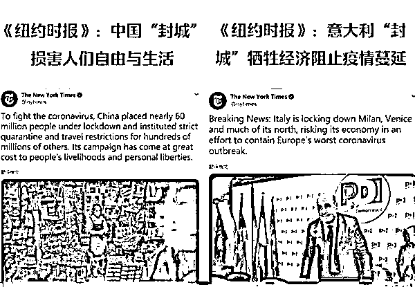

# 人家要骂你 ，甭管你怎么做，人家都会骂你的

> 原文：[`mp.weixin.qq.com/s?__biz=MzU3NDc5Nzc0NQ==&mid=2247486919&idx=2&sn=c85e81381a1b8f167611075dbbd4d977&chksm=fd2daf19ca5a260facf9bf50cd78bc2e9009bcedeaf17933b724599a2cc9b68d0c9c19106307#rd`](http://mp.weixin.qq.com/s?__biz=MzU3NDc5Nzc0NQ==&mid=2247486919&idx=2&sn=c85e81381a1b8f167611075dbbd4d977&chksm=fd2daf19ca5a260facf9bf50cd78bc2e9009bcedeaf17933b724599a2cc9b68d0c9c19106307#rd)

最近，国内的新增病患已经逐步在清零了，但是，国外输入的患者，越来越多。

北京的廖某 8 人，浙江的王某叶某 6 人，郑州的郭某，都是从意大利回来的确诊。

更糟糕的是，他们隐瞒了，还到处搭乘公共交通系统，造成大面积的人群不得不被迫隔离。

更重要的是，还有些找不到的，去哪儿了呢？会不会有可能被感染，二次传染呢？

当然，这些人都被立案了。

我觉得吧，不仅仅是要针对隐瞒旅居史的确诊患者立案，凡是回国人员，都应该先隔离 14 天。

有人说，你这个建议不讲道理。

就像一个半月前，我在大号的提议也被很多人痛斥。

我说那个拿着关公大刀坐镇村口，别说人，连邻村的狗也被阻挡不得进入的壮汉，是好样的。

很多人告诉我，他是个匹夫，因为他不讲道理。

他妨碍了邻村的狗，前来本村，找花花谈恋爱的自由。

我看完留言就拉黑了，我懒得解释。

任何事都是要讲成本的，不谈成本的自由，是个鬼自由。

在传播模型中，一传十，十传百，百传千，千传万。

有人说，你怎么不往下说了？

还有往下么？

万以后，你怎么控制？

任何资源都是有限度的，一旦过了临界，谁也无可奈何。

我们要做的不是傻等着临界发生，而是在一的时候，就用强硬的手段，终止这个模型。

人，当然有各种权利，岁月静好的时候，别说人，隔壁村的狗，也是有权利随便来勾搭花花的。

问题是，这个权利如果超过了资源限度，那他就不能行使。

你一个隐瞒的确诊导致 1000 个人隔离 14 天，那就是 14000 天。

一个人一辈子才几万天啊？哥哥。

你自己才能活几万天啊？哥哥。

随手一把，就消灭了 14000 天，我觉得判个无期都轻了。

更何况，仅仅是 1000 个人么？他们不会在无意识的情况下二次传播么？

这是什么？这是人类的罪人啊。

恶意隐瞒病情，就是人类的罪人。

因为实际上，他等于在大规模的收割别人的性命。

事实上，如果我们清醒一点，就应该知道，病毒在国外大规模长时间蔓延已经无可避免了。

我很早就说过，说了多次。

比如美国，死亡数据几十人，确诊可不可能只有几百一千？可不可能？

按照常识，上万都不稀奇。

我们说个最极端的情况，假如我国以外地区根本无法控制传播，那你准备怎么办？

是跟他们一起么？一起放弃么？

我相信是个人也不同意呀。

那有什么好说的呢？

严防死堵，死堵国外引入的病毒，这就是唯一能做的。

这么做，一定会引起很多人不满，无论是海外旅行回来的，还是其他国家的媒体。

但这个问题，根本不需要一驳。

我曾经说过无数次，你究竟是想赢，还是想辩个输赢？

同理，现在你只需要想清楚一件事，你到底是想活，还是不想让人家骂你？

我想活，我现在就表态。

爱骂骂去。

反正无论如何，想骂你的人，终归会骂你。

这张图来自纽约时报。

同一天，同一时段，先后两条。

同一个话题，完全相反的结论。

你看到了，我们封城，纽约时报骂我们，意大利封城，纽约时报夸他们。

so，你还想不通么？

你怎么做，人家都会骂你的，因为人家想骂你，就这么简单。

所以，别想那些有的没的。

学会在严防死守的状态下保持海外贸易与联系，这就是大家要克服的。

其实也没那么难，视频会议，转账，自我隔离，戴口罩，方法有的是。

如果我们坚持一下，完全有可能做到全球彻底控制不了，我们独善其身。

这就是我们努力的方向。

管好自己是你帮助别人的前提。

好好想想，我们要的，究竟是什么？