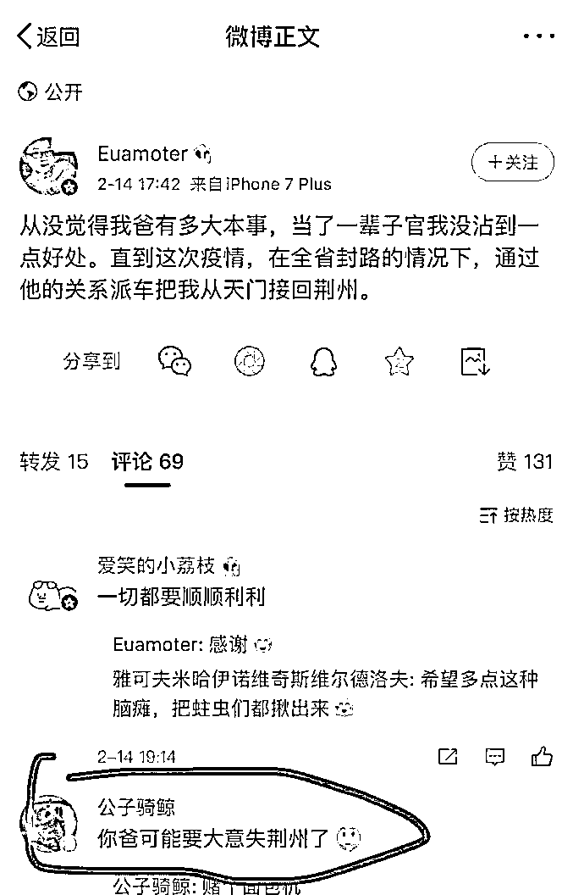
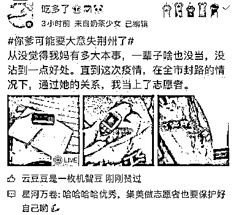
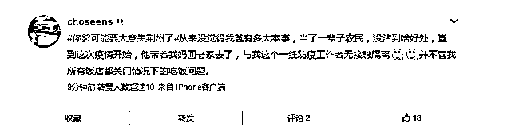
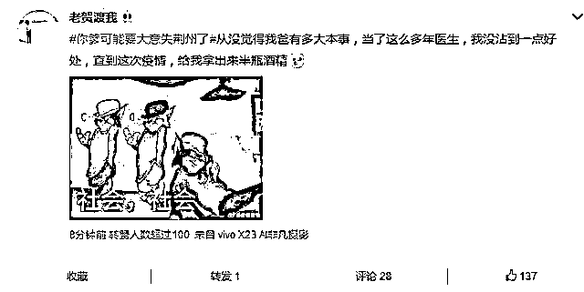

# 用“从来没觉得我爸有多大本事”造个句

> 原文：[`mp.weixin.qq.com/s?__biz=MzU3NDc5Nzc0NQ==&mid=2247486625&idx=1&sn=e71ef6258558035a6cbd20f09b59b210&chksm=fd2dae7fca5a27696c566838f3e56e166adf2f4237d85233ea979ed53ca25babf23c06c91298#rd`](http://mp.weixin.qq.com/s?__biz=MzU3NDc5Nzc0NQ==&mid=2247486625&idx=1&sn=e71ef6258558035a6cbd20f09b59b210&chksm=fd2dae7fca5a27696c566838f3e56e166adf2f4237d85233ea979ed53ca25babf23c06c91298#rd)

这是读者点名要听的段子，某儿子坑爹，迫使他爹不得不”大意失荆州”。

这个故事的来龙去脉非常简单，大概就是某人发微博。

他说他爸，是当官的，而且派车违规把他从天门送到了荆州。

结果呢，立刻上了热搜，话说这种时候敢撩拨网友的，也是奇葩。

你也不想想，14 号还没复工呢，网友们都躺家里，看人家直播睡觉都有几千万人围观，你丢个段子出来，岂不是要被全国人民人肉一把。

果然，他被人肉出好多素材。

1、曾经晒过，2019 年支付宝全年支出 286 万。

2、曾经晒过，自己在海外吃饭，一顿饭吃了 70 多万。

......

网友们肯定很开心，这是要被大家挖出什么大西瓜了么。

当然后来让大家很失望，这哥们的爹只是个小科长，支付宝里晒的是流水，流水就是进进出出转账，而那个所谓的 70 多万一顿饭是当地货币，折合 RMB300 多块。

我之所以没写，是因为这事儿实在太小了。

当然，也有有意思的地方，比如很多网友，拿他发明的这个句式开始了造句。

造的句子很搞笑，比我更有相声天赋。

要说这事儿，有什么好聊的呢？

也有。

因为它和我们大号前几天发的文章：[老实人如果吃亏了，今后谁还肯去做老实人？](https://mp.weixin.qq.com/s?__biz=MzU0MjYwNDU2Mw==&mid=2247488350&idx=1&sn=fdf07f9ea13d4472fc58e569a8bb79a9&chksm=fb197f22cc6ef6340d7983d480b435593fc646b6afbefe8821474f7705d3fb12d320007d178b&token=415770412&lang=zh_CN&scene=21#wechat_redirect)

以及今天发的文章：[到底谁才是那个“大王叫我来巡山”的“小钻风”？](https://mp.weixin.qq.com/s?__biz=MzU0MjYwNDU2Mw==&mid=2247488390&idx=1&sn=85997d09c4c48cd038caa43ddd413e79&chksm=fb197ffacc6ef6ecb24dadfa3075c8170565aed3be53f25c4982eed90ea4942439a09a16924d&token=415770412&lang=zh_CN&scene=21#wechat_redirect)

是很应景的。

我们前几天聊什么？

不能让老实人吃亏，对吧。

你觉得为什么不能让老实人吃亏呢？仅仅是害怕打击积极性，以后没人做了老实人了么？

并非如此。

不让老实人吃亏的下半句，是不让老实人吃亏，才能不让今后变了的前老实人，或者他们的后代，沾便宜。

这话没啥复杂的，古人说了八百遍，赏罚分明。

你想想，赏罚为啥要分明？

他有功，你不赏，他有过的时候，你又怎么罚呢？

你罚他，他跟你翻旧账，历史上他做了这个那个，他也曾经是有功之臣，他也曾经是个老实人，可你也许漏掉了，也许只是提拔他，却没有给他应得的经济利益。

他被提拔了，有了权力，你不对他昔日的功劳进行奖赏，他会不会生出心思，自己伸手去拿呢？

你现在看出来赏罚分明的必要性了吧。

**赏一定要及时，罚才能到位。**

我在大号里，曾经聊过一个昔日在村口用凉水浇头，后来考个三本，最后走上生产线做工人，被我的前前前老板慧眼识英，拉去做工程师，一年之内做到部门经理，手下一群 985 的博士。

我没有讲过这个哥们后来的故事，后来他只在那家公司里做了两年，就去创业了。

再后来，我才认识他。

有一次，我们聊起带队伍，他的一番话，就是今天“赏罚分明”这个主题最好的诠释。

他说赏，一定是及时的。人家做完事，当天就赏，不过夜。他不会让员工做了一年，立了很多功，等到年底一并赏，不会的。

你这么做，员工弄不清楚自己到底是因为资历熬到了，还是公司惯例，还是因为事情搞定了，他弄不清的。

他弄不清，就不会有积极性。

他跟我聊过一个例子，他曾经把一个应届毕业两年的测试，一天之内，薪水从不到 3000 块加到 7000 块，让她做组长。

因为某件事做的好。

那个故事发生在十几年前，那时候 7000 块可以买一平米学区房，今天要 7 万。

从购买力上看，这就是当年的年薪百万，从比例上看，一夜薪水翻三番。

原因讲的很清楚，因为什么事情，做到什么程度，公示，当事人知道，其他员工也知道。

这意思就是告诉所有人，你们也可以，你们做到，你们也一样。

这叫做赏。

什么叫罚呢？同一年，他开掉了 27 个人。

那一年他们公司一共才 50 多号人，开了一多半。

所以他跟我说他那一年的工作就四件事。

开人，招人，赏人，罚人。

赏到位了，你不会怕罚的，对方也不敢居功自傲。

因为你赏过了，甭管他曾经有什么功劳，当你把足够配得上他功劳的赏金当众宣布的那一刹那，也就意味着，咱俩结清了。

我不欠你什么，一切清零了，你又要重头开始了。

那你如果犯了错，当然严惩，有什么好说的呢？

**犯错不惩你，对得起你立功时的奖励么？**

很多人把这件事比作“大意失荆州”。

历史上关羽怎么失的荆州？他又为什么这么跋扈与大意？

提领荆州，身居要职，居然要跑回去和马超比武，以至于诸葛亮都要亲自写信拍他马屁，称赞他是美髯公。

可想而知，关羽昏头跋扈到了什么地步。

蜀汉从刘备到诸葛亮，一味的纵容他，是因为陈年旧账不清不楚。

关羽究竟有多大功，赏清了么？

如果你不跟他清算陈年的历史旧账，那关羽究竟算一个员工，还是算大股东？

这件事，掰扯清了么？

蜀汉历史上最大的问题就是关羽张飞究竟是老板还是员工，从头到尾都是一屁股糊涂账。

这一点，远不如“赏罚分明”的曹操。

很多时候，“赏罚分明”这四个字做好了，做到位了，很多事就避免了。

一个曾经的老实人，为啥后来不老实了呢？

因为他发现，做的好，没得赏嘛，因为他发现，做差了，也不见得会被罚。

你有没有想过这句话的潜台词？

“我从来没觉得我爸有多大本事，......”

这句话的潜台词是什么？

这句话的潜台词就是：“我爸吃亏了”。

这句话的潜台词就是：“我爸曾经是个老实人，但没有得到应有的回报。”

所以，今天违规回报给我一点，也算补偿。

你琢磨，是不是这个味道。

所以，你再回头去看大号里那两篇文章，体会出我的用意了么？

要让你爸得到他应得的回报，你爸得到了回报，那咱可就两清了。

从此之后，你爸是你爸，你是你。

过去的你爸是过去的你爸，今后的你爸是新人，一切重来吧。