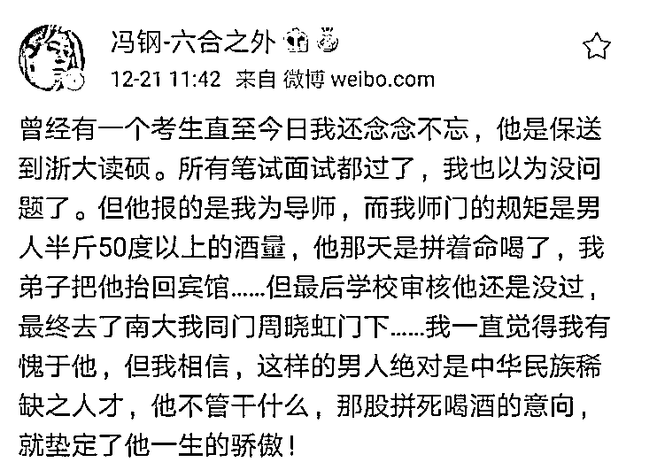

# 我们怎么去应对喝不了半斤免进门的浙大教授？

> 原文：[`mp.weixin.qq.com/s?__biz=MzU3NDc5Nzc0NQ==&mid=2247486156&idx=1&sn=67162cfce490b508c0e16be5b61515d3&chksm=fd2da812ca5a21045aeb1363068a447ec5794d46279dbf2db845187fe6c9674385f1762fef11#rd`](http://mp.weixin.qq.com/s?__biz=MzU3NDc5Nzc0NQ==&mid=2247486156&idx=1&sn=67162cfce490b508c0e16be5b61515d3&chksm=fd2da812ca5a21045aeb1363068a447ec5794d46279dbf2db845187fe6c9674385f1762fef11#rd)

研究生招生要考什么？除了学识，难道还有酒量？

浙江大学教授冯钢近日因其“出格”言论卷入舆论争议。

12 月 21 日，冯钢在其个人认证微博账号@冯钢-六合之外发声称：

呵呵。

平心而论，这段话让人浮想联翩。

首先我就想起了星爷的那段经典台词。

曾经有一份真挚的爱，摆在我面前，可是我没有珍惜，如果要给这份爱加上一个期限，我希望是一万年。

曾经有一瓶半斤的 50 度白酒摆在我面前，可是我真的喝不下去，如果导师再给我一次机会，我希望打包带回去慢慢喝。

我看了网友和他的争论，骂翻了，很好笑。

网友的意思就是说他斯文扫地，而且翻出他以往的言论，比如对女生不尊重。

他曾经表示过女生读研有啥用，最后都不搞学术，混个文凭，大约是为了嫁人，还占这么多名额，不如留给男生。

原话不是这个，大概这意思。

网上对骂嘛，自然帽子满天飞。这位教授也很搞笑，居然还击，还振振有词，越发热议了。

我首先表个态，我极其厌恶被强迫喝酒。

因为我个人身体原因，喝酒，很容易引发肠炎。

所以正常情况下，一次饭局我最多喝一杯啤酒。唯一一次干了一杯黄酒，是因为敬酒的是行业领袖，级别高岁数大，而且人家先干了，连解释的时间都没留下。

正常情况下，这种号称什么师门规矩是喝 50 度白酒，还得半斤的，我的确很反感。

但是，社会上的潜规则无处不在，你不要以为只有上财教授潜规则女学生才叫潜。

其实酒桌上强迫你喝，也是潜。

只不过前者可以上升到法律的高度，拿起法律武器捍卫自己的权利，后者说实话，你闹不起来的。

我曾经聊过一个故事。

有一次，人家一定要让我干了一杯啤酒，要么干了，要么当众亲某位美女一口。

我两个选项都拒绝。

于是大家起哄，问我是不是个男人。

酒嘛，又不肯喝，当众亲某位美女一口，让大家趁机偷拍个照片，也不敢，那果然不是个男人。

按说这种事，如果换个文化环境，你是可以告的。比如在西方，别人这么起哄，你可以起诉他们，理由有很多，而且一告一个准。

所以外企里不会有这种事儿，也不敢有。大都是自助餐，任何事都随意。

但我们的文化氛围就这样，你还真没地儿告去。

所以当天我很大气的站起来，笑着告诉大家：“我认怂，我不是个男人”。

冯钢说的那番话，什么喝酒的是民族稀缺之人才，这话显然是不正确的。

但你无可否认的是，它就是你时时刻刻都能听到的，尤其在酒桌上。

喝酒不是一种嗜好，那是一种战斗力的体现，尤其职场里。

职场里有句话：

酒都不敢喝，还敢做什么？酒都喝不好，啥能干的好？

所以喝酒不是因为你喜不喜欢，擅不擅长，人家看的是你的胆色。

人家一杯酒，亲一口摆在我面前的时候，想看的是我的下限。

他们想看我有没有胆，有没有色。

你说一个男人，既无胆，又不好色，人家当然觉得你不是个男人。

至于我当年落落大方的站起来认怂，原因也很简单。

因为那时候我已经在投资市场里证明过自己了。

说穿了，我有没有胆色，也不是他们几个兵篓子能评价的。所以我不在乎。

这就好比冯钢劝你酒，你是他的校长，没搭理他，很正常，因为你不想搭理他。

可问题在于，假如你是他的学生呢？

假如我当年的身份仅仅是甲方的一个架构师，那我还真的很为难。

理解这意思吧，这就是我说的，人在矮檐下，人家要潜你。而且呢，潜的又不够大，你闹都闹不起来。

咋办？

凉拌。

没办法的，就是忽悠，就是演戏。

人生如戏，全看演技。

我在大号里去年写过很多昔日读研时候的故事，刚参加工作时候的故事。

那时候就是靠演戏，靠鸡贼，靠忽悠，靠蒙混过关，也没别的招。

比如我想提前在研一修掉研二的课，插班去高年级的课堂上参加考试。

没辙呀。

只能两头忽悠，一头忽悠研管办的老师，骗他说系主任已经答应了，还伪造了证明。一头骗系主任说研管办的老师已经答应了，两头盖章。

我就是暗地里琢磨这俩人的年龄，身份，地位，行事风格以及内心的小九九，笃定他们不会彼此确认，这样就不会穿帮。

为了提前出去实习，赶紧离开实验室。没少给师娘送化妆品，甚至陪导师的儿子打游戏，让他们侧面帮我去吹风，放我走。

其实人在矮檐下的时候，就是这些鸡鸣狗盗的方法，你没法硬怼的，因为实力不济。

事实上，如果你特别会来事儿，真到了酒桌上，导师也不会逼你。

因为你和他关系特别好，他会对你区别对待，也许会逼别人，但多半会对你偏心。

我知道很多人反感这个，因为我自己就挺反感这个。

凭啥嘛，凭啥哥不能走直路，非得绕道。

但人生真的是这样，你有两条路，一条是一开始就硬杠，结果自己翅膀没硬就夭折了；另一条是一开始虚与委蛇，直到某一天，腰杆挺了，忽然翻脸了。

我曾经写过一篇文章，叫做：

[人最重要的，是随时翻脸的能力](http://mp.weixin.qq.com/s?__biz=MzU3NDc5Nzc0NQ==&mid=2247486120&idx=1&sn=bd9f0837efe5410e107e1e9f4480cc9d&chksm=fd2da876ca5a2160e5b2c91fdb435e93ae4ddce5b397d3de3a81a85bed6dbd7d16bc4f96c9c3&scene=21#wechat_redirect)

说明我很年轻的时候，时时刻刻都在琢磨这件事，都在以这个为目的。

但其实我这人从来也没真的翻过脸，由此可见，我挺能忍的。

当年刚创业的时候，我们的大股东，某集团二把手，某位副总裁和我喝酒。

他在某市新开个了研究院，希望我去带队伍，说白了，就是想把我收编了，归在他的旗下。

其实他不知道我有很多身份，在这里只是冰山露出来的一角。

他的大 BOSS 要来收我做马仔，甭管答不答应，倒也不显得失礼。

他来收我，他真的没这资格。

我当然觉得他是个傻叉，尤其在我面前一会儿装前辈，一会儿装成功人士，一会儿指点江山，一会儿表示要提携后辈。

但我可不可能表现出任何不屑的神色？不会的。

肯定是满嘴的恭维，满眼的清纯，但是找一些已经存在的意外，让整件事黄掉。

这就是我告诉你的，基本的演技是必要的。

什么时候该演书呆子，什么时候该演技术狂人，什么时候该演情商低，什么时候该演仰慕的小眼神，都要根据场合，都要根据剧本。

虽然我们不是中戏毕业的，但这些基本功，都要有。

出来混嘛，要敬业。

事实上，我直到职场的最后一天，都演的尽职尽责，从没有跟任何人翻过脸。

很多事，你想明白了，就不会有那么多的不理解。

所谓的教授，也就是个普通人，他也会有各种认知缺陷。你不能按照孔子那个标准去要求，这不现实。

他如果调戏女生，这太严重了，当然要狠抓狠打，就像我们曾经在上财的文章里说的，让那个调戏女生的教授永无翻身之日，以此提高成本，杀鸡儆猴。

但强迫喝酒，你根本找不到哪个部门能帮你把这货给办了。

既然如此，只能想办法绕开这个问题。

说白了，人嘛，都是充满了缺点的，如果他就是不改，情节又够不上严重。能咋办呢？

就像前面有座灯塔，我们是条船，他不绕，那我绕吧。

人生长的很，重要的事多的很，犯不着跟这些弄不灵清的较劲。

人生最重要的，的确是随时翻脸的能力。但真要是大事小事事事都翻，那也怪累的。

大号文案链接：[每个上班的都该听一次实话](https://mp.weixin.qq.com/s?__biz=MzU0MjYwNDU2Mw==&mid=2247487951&idx=2&sn=fc752d06c9caa6389b034d3eca0840de&chksm=fb197db3cc6ef4a57bf9d768f894310ca9ea3cefc98512adad540db5252c6f40161fe01f1787&token=103831233&lang=zh_CN&scene=21#wechat_redirect)