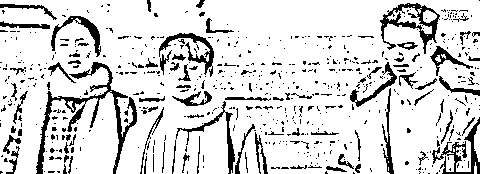
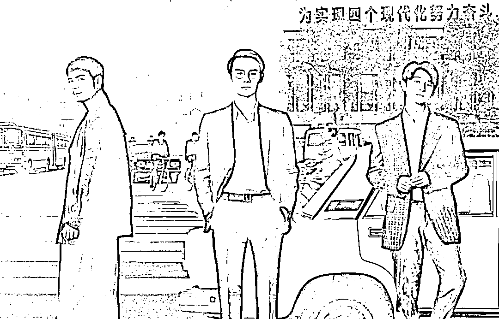

# 《大江大河》里的宋运辉是励志逆袭的典范么？

> 原文：[`mp.weixin.qq.com/s?__biz=MzU3NDc5Nzc0NQ==&mid=2247486011&idx=2&sn=a68e70d9bc4f4361993e9c34a7fc4a45&chksm=fd2da8e5ca5a21f3c9772ae9daf4cc0e8b6469aff769ff4cc4f2c6d153b10545d4682b953e12#rd`](http://mp.weixin.qq.com/s?__biz=MzU3NDc5Nzc0NQ==&mid=2247486011&idx=2&sn=a68e70d9bc4f4361993e9c34a7fc4a45&chksm=fd2da8e5ca5a21f3c9772ae9daf4cc0e8b6469aff769ff4cc4f2c6d153b10545d4682b953e12#rd)

很多人质疑最近十几年的电视剧，题材都不接地气。

我记得当年我看过一本电视剧，叫做生存之民工，非常好。但很可惜，没能上映。

而热播的都是些什么呢？

要么是那些帝王将相家里的琐事，要么是神神鬼鬼的破事，或者高富帅与白富美的故事。

这个原因很简单，谁买单，拍给谁看。

我们作为观众，潜意识里是认为人人平等，但实际上，你站在运营商的角度，每个用户的 ARPU 值是不同的。

实际上，80%的收入，来自于 1%的用户，他们通常被称为高净值用户。

他们就是付费观众，或者会购买广告商品的观众。这些人维系了电影，电视的运营成本。

换句话说，所有的作品，它首先必须是先满足高净值客户需求的，如果有的多余，才考虑满足其它方面的需求。

假如你能想明白这一点，你回过头去看这种不咋地的电视剧，你就能明白到底为啥了。

半年前有一本剧，叫做《大江大河》，这本剧拍的是整个改革过程中青年男女的故事，应该对照了今天的 60 后。

电视剧很有年代感，估计 90 后完全看不懂，80 后看着挺有趣，70 后或许有印象，60 后也许被感动。

就这么一个很土的剧，却广受好评。

其实三个主人公之一的宋运辉应该算是一号男主。他家里成份不好，父亲是黑五类，一路坎坷艰辛，是剧中唯一一个通过读书改变命运的人，他通过考上大学，通过踏实肯干，在一无背景，二无运气的情况下，成为国企领导。

当然另两个其实我个人更喜欢一些，一个是图左他的姐夫，一个大队书记带领农民致富的乡镇企业家，另一个就是图右这位，那个年月最常见的致富方式，一个商人，颇有些我们曾经聊过的 W 的味道，呵呵。

我知道如果换了别人给你谈这个话题，他们会朝什么路子上引......

他们通常都会说如下几个观点：

1、穷人的孩子早当家。

小宋同学父亲是黑五类，而且老实巴交，自己又是家里唯一的男孩，还生性腼腆。他没有别的出路呀，他除了硬拼成绩，也没有其它的办法改变自己，和家庭的命运。

2、用努力感天动地。

小宋同学读书后遭遇了很多不公平。比如大学毕业求职的时候，被有背景的同寝室同学顶替了他的岗位，比如刚入职就被迫卷入了企业的内斗，被厂长和总工猜忌，被下放到车间当工人。最后，硬是通过自己的努力，以一个应届生的能力，写出论文，推翻人家国营大厂很多人很多年的科研成果，最后 30 岁不到就成了总工。

.......

这样的观点可以无休止的发散下去，你想罗列多少，就可以有多少。

如果我只是给你一味的聊，宋运辉同学，很爱学习，踏实努力，埋头肯干，又遇上了好时代，所以做出了成绩。

那就不是我们号了。

我们号一贯都能够看到别人看不到的地方，这是我们的特色。

我之所以不那么看，是有我的道理的。

就像如果你不是学霸，你一定会去这么理解学霸。

可如果你自己也是学霸，你会很清楚，学霸并不是外界传闻的那样，通过奋斗来维持好好学习，天天向上的。

学霸也好，企业战士也罢，都只是某个人养成的某种习惯而已。

我给你举一个贴身的例子。

我当年读初中的时候，从第二次开始，就一直，或者说始终是年级第一。而且是远远把年级第二拉开距离的那种。

比如各科总分满分是 500 分，年级第二比我低 35 分，年级第三比我低 49 分，你往后面去，一分里面会有很多人，而前面就以大比分被拉开了。

我记得某一年，按照惯例在全校面前介绍学习方法的人，不是我。而是换作那个学期的年级第二。

为什么是他呢？因为进步神速。他从全年级五十名开外，一举拿下年级第二。所以，学校就让他对全校同学介绍自己的学习心得与经验。

我也很好奇，很仔细的听了他的演讲，还弄清楚了事情的前因后果。

当然这个故事听起来有点像小说，但它是真的。

这个哥们有个女友，得了绝症。这里要插一句，初中生不可以谈恋爱，初三也不可以，对此我们表示反对。

那么这哥们呢，是个情种。可再情种，他一个初三的孩子，能干啥呢。啥忙也帮不上。

我的理解，他是希望自己加速成长，在那个女孩有生之年，能够帮到她。当然，最后也没能如愿。

他和我都是我们初中唯三的考上了顶级高中的学生之一，我和他在高中阶段仍是同学。我很清楚他俩的结局，结局是那个女孩仍然走了。

但悲伤，就是他的动力。

他的目的很明确，他别的也做不了啥，毕竟，当年他只是个孩子。

那么所有的悲愤也好，执念也罢，全部化作动力，于是形成了无与伦比的短期加速的学习效果。

这就是很多人理解的，所谓奋斗。

当然，我很感动，我们是朋友嘛。

但是，这个话题我当年就跟他说过，我今天在这里再把自己初三的时候表达的意思，用成年人的措辞，再复述一遍。

我认为，**人最重要的，是养成一个习惯，而不是企图不停的打破习惯。**

所谓的奋斗，是指，你平时养成了一个不怎么紧凑的习惯，你用外力，用巨大的情绪来压制自己的惯性，短期内用打破旧习惯的方式产生了巨大的动力和效果。

你今天看加班，冲刺，打鸡血，其实都这个路子。

可为什么不想想，如果你养成了好习惯呢？

那你打什么鸡血呢？

你自己就是鸡血石，天然的，纯粹的。

还需要打么？

什么叫做好习惯？

就是一睁眼，你就是积极努力的，你就是高效的，你就是勤于思考的，你就是敏锐的抓住一切机会的，你就是见缝插针的用华罗庚统筹方法来管理时间碎片的。

你就像呼吸一样，很自然的在维持这一切，直到你睡觉。

这中间，本来就没有杂念。

禅宗历史上有个公案。

五祖有个弟子是首座，叫神秀。

他做了一首偈子，叫做：时时勤拂拭，莫使惹尘埃。

但是有个砍柴的小和尚叫做慧能。

他也做了一首偈子，叫做：本来无一物，何处惹尘埃。

他就是后来的六祖，禅宗的开创者。

你觉得是时时勤拂拭长久呢？

还是本来无一物长久呢？

时时勤拂拭，就像奋斗，它是个不稳定的状态，它是你努力去克服原有的习惯，你得耗费无尽的力量去抵抗，只有一部分能够转化成效果。

而且，这不长久，因为随着你目标的达成，你就会动力下降。

比如你的目标是当总工，那等你当上了呢？

比如你的目标是改变家庭的处境，那等你日子过好了呢？

你还有动力继续奋斗么？

而本来无一物，它是一种习惯，是一种惯性。我本来就这样嘛。

我不需要对抗什么旧的习惯，我就是这样啊。我没有旧的习惯好对抗。

我有目标么？

没有的。

我做的任何事，都是没有目标，没有目的的。

这就像呼吸，你很自然的在呼吸，而不是你很努力的在呼吸。

无论你做到了什么，无论你达成了什么，你都会继续做。

因为你从头到尾，没有目标，也没有要对抗的地方。

你就是这么一个纯粹的，无目的的高效人士。从小到大，无休无止。

我当年对我的同学，表达了我对学习的看法。

是想告诉他，不要拿我当目标，我不是一个静止的靶子，等着你来打。

我是移动的，全身心移动的，养成习惯移动的，一醒来就移动的，不需要动力也能移动的，无目的移动的，始终在移动的这样的一个移动靶子。

只要我有生之年，就会一直这么移动着。

你以这样一个移动靶子做目标，把他当作竞争对手，那只会让你很累很疲劳。

因为你要燃烧很多的“动力”，而他不需要。

你要克服很多的情感障碍，他也不需要。

久而久之，你就会绝望，因为这种对手，不似人，而似机器。

所以我小时候的外号本来就叫做“机器人”，又称“时钟”。

意思就是这个人像钟表一样，他只要活着，永远滴答。

你也不见他累，也不见他烦，也不见他停，他就始终那么滴答下去，无始无终。

事实上我的告诫，他没能听进去，他的神速，无法维持，到了高中后，下降的很快。

当然，这不影响什么。

拳脚小功夫，做人大丈夫。

他的人品是第一流的，那他这个人就是第一流的。其它的，那不过是游戏，是个玩意而已。

但是，我告诉他的，就是第一流的学习方法，第一流的工作方法。

**把一切都变成习惯。**

当你习惯了高效，当你觉得一切都像吃饭、呼吸一样自然。

你才真的能够像电视剧里那样面对一切不公和坎坷，如履平地。

因为现实中，你没有主角光环，你不会像宋运辉一样，第一任妻子娶厂长的女儿，第二任妻子更牛叉。

现实中，就像俞敏洪说的那样，这不是一场短跑比赛。

这甚至就不是一场比赛。

这是一场无休无止的奔跑。

当一场奔跑没有终点的时候，那谁跑的快就不重要，而跑的姿势反而很重要。

**因为能量转化的效率，决定了你能跑多久。**

一个跑的很累的人，是坚持不了多久的，他迟早会停下来。

只有你跑的很轻松，很惬意，很自然，你才能奔跑一生，就像你一生都在呼吸一样。

直到生命自然而然的结束。

最重要的是，你整个一生，还都很快乐，并没有觉得自己有什么被强迫过的迹象.......