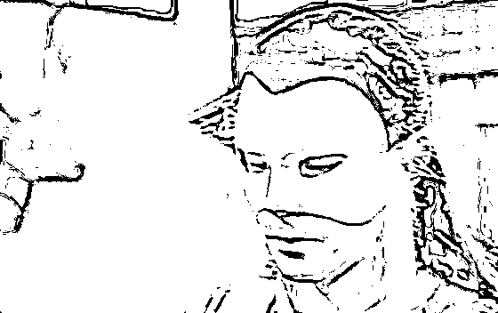
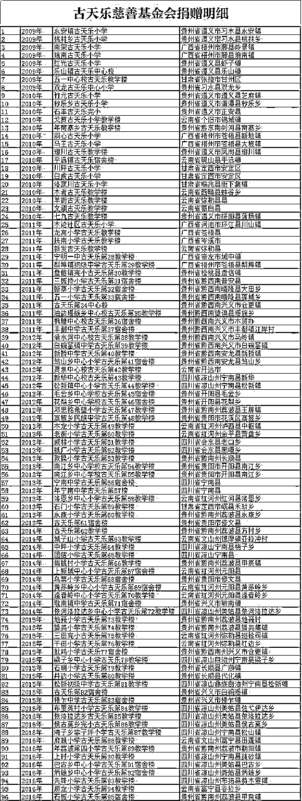

# 有一个人，除了太阳，没人敢黑他

> 原文：[`mp.weixin.qq.com/s?__biz=MzU3NDc5Nzc0NQ==&mid=2247485622&idx=2&sn=259b8ca18be484be7b3a77e7d51b6cbf&chksm=fd2daa68ca5a237e65bac224d07b5162ee8934ca253833ecc815871e77205093f971d1ab2746#rd`](http://mp.weixin.qq.com/s?__biz=MzU3NDc5Nzc0NQ==&mid=2247485622&idx=2&sn=259b8ca18be484be7b3a77e7d51b6cbf&chksm=fd2daa68ca5a237e65bac224d07b5162ee8934ca253833ecc815871e77205093f971d1ab2746#rd)

看完标题，古天乐的粉丝应该都知道我说的是谁了。

我写这篇文章不是为了给他的电影《犯罪现场》写影评，虽然这本电影我看了。

我写这本电影也不是因为他和宣萱再次合作，而且俩人还传出结婚的消息，当然，又被立刻否定。

话说古天乐真的好帅啊，我们聊过挺多次杨过，杨过大概就长他这样吧。

否则也不会有“风陵渡口初相遇，一见杨过误终生”。

高晓松曾经说自己年轻的时候，非常迷赵雅芝演的《上海滩》，他觉得冯程程就应该是赵雅芝年轻时那样。

那个时代电视没上映，他只能跑去录像厅看这部剧，每集一块钱，一天一集往前走，不重播。有一次下暴雨，他跑到录像厅门口才发现自己没带钱，回去拿就错过了，无奈的高晓松在雨地到处问人讨钱，就这么一毛、五分的凑，淋的个落汤鸡。

我小时候看了之后就惊为天人的女明星大概是年轻时的周慧敏。赵雅芝比高晓松大 15 岁，周慧敏比我大 14 岁。

女明星十几岁出道，三十岁正当红，而此时吸引的正是下一代青春期的少男。

通常少男都会被女明星吸引，只有少女才对着男明星怀春，我们那一代人里就有女生非常迷恋刘德华，甚至发誓非刘德华终身不嫁。

能以容貌震撼少男的男明星是很罕见的，毕竟同性相斥。

你或许会欣赏张国荣的才华，或许会欣赏周润发的气质，或许会被梁朝伟眼神逗乐，但遇见古天乐这样的，尤其是他年轻的时候，通常第一感觉是，嫉妒。

你没听错，男人也会嫉妒相貌。

我看古天乐版的《神雕侠侣》就是高中的时候，初看的反应就是嫉妒，纯粹的，没有别的情绪。

这哥们帅成这样，所有女生都爱他，确实让人不爽。

但看到后来，这种感觉反而消退了，这不是古天乐的魅力，而是他扮演的那个角色杨过的魅力。

杨过或许小时候油腔滑调，但终成一代大侠，他是令人服气的，不服不行，他令人服气的程度一点也不亚于郭靖，就像郭靖虽然小时候看起来很傻，但最后成长的高度让你仰望。

我们说，人家比你多一滴水，你往往看不起；人家比你多一碗水，你往往觉得彼此差不多；人家比你多一缸水，你开始嫉妒；可如果对方是大海，你剩下的，只有服气。

我高中的时候，剪头发，中间有几根刘海特别长，故意让理发师没有去掉，就几根而已，有时会飘下来，不靠近仔细看，发现不了。

我们班另一个也考过第一的同学立刻就猜到了我的心思，他调侃我，你这是在效仿《神雕侠侣》里杨过里的造型么？

我听了脸一红，小心思被人看出来了，还是被竞争对手。

这是古天乐还是小白脸的时代里，留给我最深的记忆。

下一个时代，就到了黑古的时代，他把自己晒黑了，起初我觉得挺难看，这个明星要废了，紧接着人家就拍了一本神剧，《寻秦记》。

完全另一个造型的古天乐，完全另一个样子，再一次打动了我。

要知道那时候我上大学了，正是迷茫的时候，我不清楚自己要做什么，自己该做什么。

打动我的是那句话，项少龙与元宗学武功，说了那句经典的名言：“明知不可为，而为之”。

整本《寻秦记》的核心就是这句话，谁也改变不了历史，但谁都可以按照自己的本心去做自己想做的事。

这就是生命的意义。

一个演员，能够在人中学的时候第一次打动他，在人大学的时候，第二次打动他，我觉得这个演员是成功的。

这就是影响力。

演员的成就，体现在你影响了多少人，是不是把别人往更好的方向影响，或者说，你的存在，你的表演，让别人成为了更好的自己。

说实话，那时候我对古天乐的了解就到此为止了。一个帅哥，一个优秀的演员，我希望他能够有非常成功与美满的一生。

但奇怪的是，二十多年过去了，这位明星再也没有出什么特别好的作品。

虽然我对他一直有好感，他的每部电影我都看过，但平心而论，没有什么好作品，再也没有回到过《神雕侠侣》，《寻秦记》的高度。

直到后来，我看到了这张表。

这是尔冬升导演在社交软件上晒出的一份古天乐捐建学校的统计表，这表没完，已经 100 多所了。

自从汶川之后，他就开始捐希望小学，连爱心水窖都捐了 1000 多眼。

有人质疑他用自己的名字命名学校，只是借机炒作，他说：“用我的名字，是为了建筑物以后出了任何质量问题，别人都可以追查到我。”

古天乐做过香港演艺协会会长，此前的会长是曾志伟，谭咏麟，成龙等人。

去年蓝洁瑛死的时候，我们写过一篇文章，作为纪念。

很多人不熟悉，可以自行去查，这个女子命运确实坎坷，确实遭遇了一些事情，以至于从明星沦落到经济拮据。但似乎肇事者们没有什么表态，而此后的会长们迫于各种原因，也没有给出任何说法，最后反倒是古天乐这任会长自掏腰包为她办葬礼。

这样的事古天乐做过很多。

演过很多江湖片的吴志雄欠了钱墙倒众人推，古天乐拿出一张 1000 万港币的支票解决问题，后来也不让他还。

“鬼婆”罗兰年老无儿无女，他每逢新年便一定会去她的家中拜访，反复叮嘱有事一定要第一时间联系自己。

这几年古天乐几乎把当年合作过，后来不是特别红的伙伴都找到新戏里演了一遍，这意思就是照顾别人，而且给人家面子。

这不是慈善，这是请人家来拍戏，请，你懂得。

话说古天乐一直零绯闻也不结婚让人很奇怪，毕竟他不像周星驰，有一本《大话西游》做铺垫，有一句经典的台词可以解释一切。

古天乐和宣萱为啥一直没走在一起，影迷们都很奇怪。

当年在《寻秦记》里，宣萱演乌家大小姐，就和他是欢喜冤家。

这次他突然现身大屏幕，扮演主播说财经新闻，最后突然抛出一句，“我刚刚订婚，晚安，播完。”

一时间媒体沸腾，大家都以为古宣终成眷属，但随后马上官宣，这是戏里的角色，看来又是炒作。

换作别人，早被骂死了，但是古天乐耍大家，大家也不生气。这真的是个很神奇的场景。

古时候“功高盖主主不疑，权倾朝野臣不忌”的只有郭子仪，现如今拍烂片粉丝不气的，也只有古天乐。

或许这就是人格魅力，香港电影走到今天，随着老一代明星们逐个退场，确实没落了。也许真的让杜琪峰当年一语成谶：“古天乐，是香港最后一个明星。”

但无论港剧怎么衰败，有古天乐在，我们这些昔日的影迷们，就依然愿意为这张电影票买单。

很多爱国剧都有很好的票房，动辄多少多少亿，但古天乐的剧是看得见摸得着爱的剧。因为我知道，从电影院出来，某一所小学的墙上又会多了几块砖。

你千万不要因为我这段描述就以为《犯罪现场》是烂片，还真不是。如果在三季度所有上映的电影里让我打个分，这本可以排前五。

但这是一本悬疑的破案片，所以我没法给你剧透，剧透就不好看了。

不过有一点我可以聊，影评的核心在于一句话：

“不要绝对的认为谁是好人，谁是坏人，很多时候，善恶只在人脑里的一瞬间。”

就像我们前面两天聊过拆迁，聊过超载，我无意抨击人性的贪婪，任何一座高山你远观都是巍峨的，近看呢，都是满地破石头子儿。

社会也一样。

你把时光拉长，看看 10 年的成就，50 年的成就，你会很感动，因为社会一定是向前走，可如果你看看当下这一天，肯定有很多负面的消息，有很多不让人愉快的事情。

《犯罪现场》也不过描述了一个案子，我相信是数万警察日复一日的破了无数像这样的案子，才能维系一个城市的治安，就像古天乐那 100 多所小学也是他一间一间建的。

有这样的明星给我们做榜样，告诉我们从小事做起，日复一日的坚持，是我们这些影迷们的幸福。

感谢他榜样的力量，也祝愿古天乐这样的帅哥早日找到属于他自己的幸福。