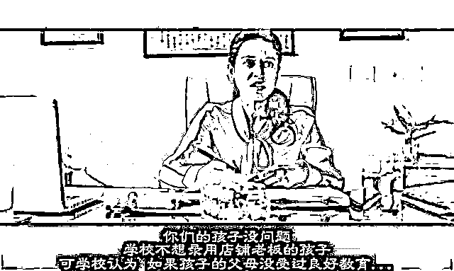
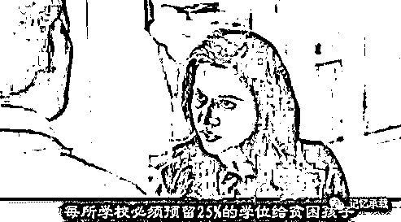
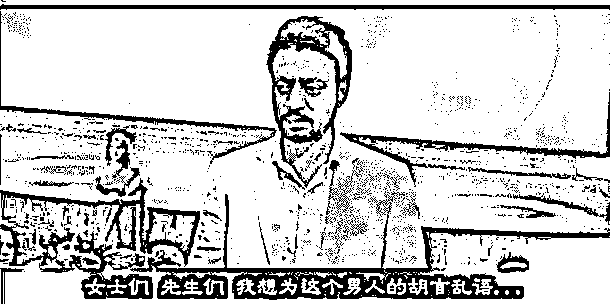

# 明知道挨骂还肯对你说实话的，是朋友；明知道是错事还肯为你做的，是兄弟

> 原文：[`mp.weixin.qq.com/s?__biz=MzU3NDc5Nzc0NQ==&mid=2247485237&idx=1&sn=e78bce4f1b9ae2edd3a61f6ad89cbc92&chksm=fd2da5ebca5a2cfdde3701d9b204d76680adcc50df870879c4f85c7425fbeb00ab59a80c15ae#rd`](http://mp.weixin.qq.com/s?__biz=MzU3NDc5Nzc0NQ==&mid=2247485237&idx=1&sn=e78bce4f1b9ae2edd3a61f6ad89cbc92&chksm=fd2da5ebca5a2cfdde3701d9b204d76680adcc50df870879c4f85c7425fbeb00ab59a80c15ae#rd)

《起跑线》是印度又一部神作。就像一部印度版的折叠社会。电影很好看，我们简单的概述下电影想描述的三点。

**1、教育考的不只是学生，也是家长。**

**拉吉和米塔是印度一对商人家长，在月光集市开服装店。为了让孩子能够上顶级学校。先是买了学区房混迹富人区，但是被只说英语的上层社会鄙视其各种生活作风。通过入学培训机构的各种辅导，孩子培训、服装改造、面试改造等等，最后还是因为家长是店铺老板，并非学校期望的上层社会而被打回。**

****

****2、当合法途径无法入学后家长采用非法途径。****

**拉吉尝试过很多方法，比如贿赂学校，比如买通官员，比如企图赞助，最后都失败后他们假装穷人，买通抽签老师，装扮穷人骗过家访从学校对穷人的 25%的录取名额中成功入学。**

****

****3、所谓的精英教育到底教的是才能还是品格。****

**拉吉一家在贫民窟受到贫民希亚姆一家的真诚对待。比如希亚姆不知道拉吉是富人骗录取名额的，他甚至为了给拉吉筹集学费用身体撞高速行驶的汽车只是为了获取赔偿让拉吉的女儿入学，但是拉吉的女儿最后却夺取了希亚姆儿子的入学资格。拉吉觉得自己的行为背离了教育的本质，所以当众挑战校长的权威。**

**影片的结尾，拉吉在学校大会上发表了一番演讲，向所有家长说了他自己装穷人骗名额的事也揭露了校长的灰色交易，让所有人动容。可笑的是，大家都很感动，也很愤愤不平，但是却没有一个人为拉吉鼓掌，甚至有站起来准备为拉吉鼓掌的人也被狠狠的拉下去，然后无动于衷的听着校长强行为自己洗白。**

**拉吉最后决定让自己的女儿上公立学校，和希亚姆的儿子做了同学。**

****

**电影拍的很好。下面我们聊聊影评。既然是影评，就是一家之言。我的言就是实话。**

**实话大多数时候都是错的，但它就是真实存在的，如果它错了，说明人类几千年来一直都是错的。**

****这世上就人类已知的历史而言，没有公平可言。****

****这句话不需要讨论。这句话当然是错的。我们人类追求的就是公平。it's unfair.是我们小时候最初学的英语 900 句里的一句话。公平对不对呢？当然对。不公对不对呢？当然不对。****

****但是我很好奇，为什么人类追求了几千年的公平？那只能是一种可能。就是人类几千年来一直都不公平。如果公平，那你追求个啥？****

****一个追求了几千年，都没追求到的东西。我们为什么不去思考下。why?****

****哪出错了？****

****我小时候看郑渊洁童话，我觉得这哥们太对了。人是一种生物是吧。动物也是一种生物啊。为什么人和动物如此的不平等？为什么为了保护一个人的安全就可以随意的杀死一只老鼠？这只老鼠如果叫皮皮鲁怎么办？****

****人长大了就会发现人类的历史和现实比郑渊洁描述的还要那啥一百倍。****

****我们假设公平是应该存在的。那很多问题都变得很奇怪。咱们由近及远的提问题：****

****都是人，汉人凭什么驱逐匈奴人？**** 

****都是人，白人凭什么杀死印第安人？****

****都是类人猿，智人凭什么杀死尼安德特人？****

****都是生物，人类凭什么圈养两倍于自身体重的动物作为口粮？****

****做个假设，假如一切都公平了，比如，****

****我们是匈奴人，是印第安人，是尼安德特人，是动物，那您觉得，我们还能在这儿写公众号，聊这个挺扯淡的话题么？****

****很显然，我们能活着，本来就是不公的产物。一个依靠不公才得以来到世间的生物，反而去批评不公，是个有意思的话题。****

****我没有说存在的就是合理的。我只是描述了下真实的世界，真实的历史，真实的现状和真实的结果。****

********虽然其实我很希望公平。********

********当然，我也没有某位号称七弟的老网红的自恋。我的赞同什么，反对什么，对改变世界屁意义都没有。********

********一个几千年都不曾改变的问题，不会因为我两句话就把世界变得美好了那么一点点。********

**********拉吉这个爸爸在电影结束的努力到底有没有意义？**********

******拉吉这个爸爸确实采用不道德不合法的手段为女儿谋取前程。用我们的话讲，就叫走后门。******

******我不想站在网友的角度去抨击走后门这种不良现象。因为有个比这更有趣的现象我都没弄懂过。******

******有记者做过调查：******

******在中国，他多次安排一个老太太在马路上摔倒，统计结果显示，摔倒后 99.99%的路人都不会去扶。******

******同样，他把这段视频发到网上，让网友投票。99.99%的网友都会义愤填膺的抨击这种不良现象。******

******这就引出一个很有趣的事实。******

******高素质的人都不上马路。低素质的人都不上网。******

******既然网上汇聚了这么多义愤填膺的高素质人群，那就不需要多我一个抨击的人。******

******所以这个世界是有趣的：******

******在网上抨击走后门，现实中挤破脑袋走后门；******

******抨击别人走后门，自己抢先走后门。******

******那你到底是厌恶走后门这件事本身？还是厌恶别人走了你没走到的后门你心里嫉妒呢？******

******这个话题不展开，展开了要挨骂。网上高素质的人太多。不能把话扯太透彻，否则一定挨骂，我是个很鸡贼的人，鸡贼的人从来不给自己惹麻烦。******

******回到电影，看看拉吉这个父亲，最后为了心中的良知，让女儿退学，自己一个人和整个上层阶级作对，维持了良知。当然，我知道假如电影不这么拍，在印度也发行不了。******

******但是，我还是很想议论下，这事到底有没有可能？******

******拉吉是个有钱人，这不假。他靠什么挣钱？卖服装。你看十几年前杭州武林门卖服装的老板都挺有钱，问题是，今天电商冲击下，还有钱么？******

******拉吉，一个实体服装商，凭什么以一己之力去企图打造一个牛逼的公立学校让女儿得到好的教育并且维持品格的完整？******

******我真的不知道。******

******人为什么会追求最好的教育？其实就是为了保持利益，其实就是为了阶层固化。没人会说自己很有钱所以孩子不需要最好的教育。清代的皇子六岁起每天临晨 4 点就要进上书房读书，除了年节帝后生日，没有寒暑没有周末。******

******你再有钱，你有皇上有钱么？皇上都做不到的事，你能做到么？******

******这只是其中一个问题。第二个问题，教育，是用钱就能打造的么？精英学校为什么精英？是因为学校有钱？你错了。是因为精英的孩子都送进去了。你在牛逼的环境里才能大概率牛逼，你在一个没有牛逼的环境里硬是凭借无与伦比的天赋生生窜出一个天才，这是小概率事件。你拉吉再有钱，你就算把你女儿上的公立学校的硬件靠一己之力打造的再好，最多也是个服装店水平，你有什么办法让其他精英们把孩子也送进来读书呢？******

******拉吉身为一个父亲，到底有没有可能为了良心就为女儿的前途做出选择，我不知道。我也不想评价。******

******我相信每个男人都是难做的，尤其是父亲。我从不愿抨击拉吉贿赂官员，骗取名额。因为我理解他是个父亲。拉吉如果只为了自己，他可以不学英语，可以不非要混迹上层阶级，可以不违背良心。他有能力让自己活的很开心很滋润。可是，他首先是个父亲。******

******他要考虑妻子的担忧，他要考虑孩子的未来。******

******男人很难做，父亲更难做。我也是男人，我也是父亲。所以，我不愿意抨击他，哪怕我也认为他做的某些事是错的。******

******我有句自己的名言。******

********人这一辈子，明知道会被骂还肯对你说实话的，是朋友；****明知道是错事还肯为你做的，是兄弟。********

******人生太复杂，太多事没法用合法不合法，合情不合情，合理不合理来评价。即使片尾拉吉没有服从良心，我依然理解他。******

******虽然我没法说什么，但是，人这辈子，有时候，很多话，本就不必说......******

******今日大号文案链接：[你想让自己的孩子去过大神叶修那样的人生吗？](https://mp.weixin.qq.com/s?__biz=MzU0MjYwNDU2Mw==&mid=2247487141&idx=2&sn=b8297e7565dd1cbdaef3eff6b4a9d134&chksm=fb1962d9cc6eebcf7d11a3f12d6ea058c63b13dad27757081de28e7b2c2b57a0dc28282ba230&token=2051944190&lang=zh_CN&scene=21#wechat_redirect)******