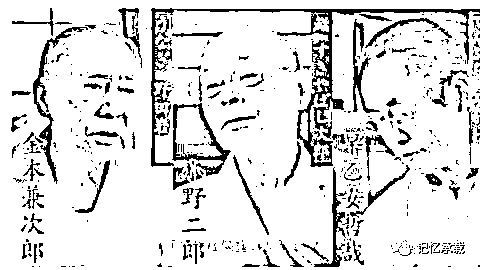
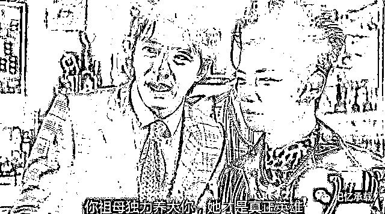

# 周星驰眼里，什么才叫成功人士？

> 原文：[`mp.weixin.qq.com/s?__biz=MzU3NDc5Nzc0NQ==&mid=2247485012&idx=2&sn=a942b6b9544def8df7f0e149e90a388c&chksm=fd2da48aca5a2d9cd73f8bbf95edadb7b452428999fd447a98132968b47160ab8dfb65e7ffc1#rd`](http://mp.weixin.qq.com/s?__biz=MzU3NDc5Nzc0NQ==&mid=2247485012&idx=2&sn=a942b6b9544def8df7f0e149e90a388c&chksm=fd2da48aca5a2d9cd73f8bbf95edadb7b452428999fd447a98132968b47160ab8dfb65e7ffc1#rd)

之前我们发[年少只知无厘头，读懂星爷已中年](http://mp.weixin.qq.com/s?__biz=MzU3NDc5Nzc0NQ==&mid=2247484992&idx=1&sn=1d33b6be7069ce6be905a9b377c45177&chksm=fd2da49eca5a2d8891b05acf0dedcd46dd0731461b1fdc66b39890b7f603d9ecab58ab0b7fbf&scene=21#wechat_redirect)

很多人可能没有理解，我描述的星爷到底和普通人理解的成功到底有什么区别。

首先我们聊的并不是一个穷孩子逆袭成为大明星的故事。

如果你说星爷的奋斗是为了从一个穷人变成一个有钱人，香港即使比他次两三个档次的明星，都非常有钱。

理解这意思吧，没有任何成就，以投机倒把，贪污腐败起家，比星爷有钱的人，车载斗量。

如果你按照王朔对成功的定义：“什么成功？不就是挣了俩钱，被 SB 们知道了吗？”

王朔没说错，成功原本就这点事。

但我们聊的周星驰的意义不在于成功。

一个人，想要做好自己想做的事，他努力的去做了，他真的有竭尽全力的去做，哪怕落一个片场暴君的名声，哪怕知天命之年茕茕孑立，形影相吊。他仍然义无反顾的去做了。

就是这样一个人。

应该说这是个很有意思的人。

或者说，他自己也不需要成功，也不在意成功，人家本来就是在做自己。

做自己的人有很多，比如江户前三味。

第一个人叫小野二郎。今年已经 93 岁了。

纪录片《寿司之神》拍的就是他。他的店在银座办公大楼地下室，颇为寒碜，木栅栏后只有十个座位，店里没有厕所，要上得去外面。

第二个人叫早乙女哲哉，天妇罗之神就是他。

啥叫天妇罗，就是炸蔬菜，炸虾，就跟咱们炸油饼，炸油条一个道理。

和上一位一样，他的店里也只能坐 6～8 个客人。但是，人家 56 年来炸了三千多万个天妇罗。

据他自己说，炸到三十多年的时候，他开始感悟，那不是一锅油，那是一锅能量。他有句名言，一生命悬，只做天妇罗。

第三个人叫鳗鱼之神，金本兼次郎。他们家的店叫野田岩，做鳗鱼饭做了 200 年，金本兼次郎是第五代传人，做鳗鱼饭做了 70 年，光用竹签字穿鱼这个动作，他就练了整整三年！

你用成功学去评价，我估计没人能够理解这几个厨子到底牛逼在什么地方。

他哥几个在北京二环内有几套房呀？

对不起，没有。

他们一年能挣多少钱呀？

您自己琢磨吧，反正就这么丁点大的店铺。

但他们就是神，日本料理界三神尊！合称江户前三味！

很遗憾，在成功学的价值观里，他们仨，都是屌丝。

但换一个价值观，他们就是神。

我理解这种价值观的定位方式，因为我打小看的日本动画片，日本漫画，日剧，玩的是日本游戏。

种族不同，立场不同，但价值观领域，我们这一代本来就是日本人教出来的。

当然，拿星爷和这三个比是很难比的，因为很显然的原因。

这三位终身只做一件事，就是做自己的料理。

所以你拿张国荣去类比是很形象的，张国荣一生都在演戏，他迷进去了。

所以你说张国荣是演员里的大师，工匠，非常贴切。

但周星驰还年轻，他这一生做过的不只有演员，也有导演，也有制片人，还有投资人，他未来做的，可能更多。

但有一件事是通的，这就是多维度的评价一个人。

比如我们评价张国荣，维度就是演戏，因为他就做过这件事，如果一个人无聊到拿张国荣去和煤老板比财富，那这个人的价值观肯定出了问题。

再比如周星驰，作为演员，他是顶级的，否则也不会叫做喜剧大师。

但作为导演，他导的片子，大部分都不怎么样。

作为投资人，也许他在房地产市场颇多斩获，但那点故事，和职业的不好比。

你看到了，这才是一个完整的人。每一方面都落在该领域内部去评价。

这种价值观，在日剧里有很多体现。

比如日本动画片《灌篮高手》把一个县（相当于我们一个省）里的高中篮球联赛讲的惊心动魄。

你要知道日本篮球在全球的地位可以说根本没他们什么事儿。

但这就是日本人的价值观，它在聊的并不是篮球，而是透过篮球聊局部环境内的哲学。

你看日本的历史，也很有趣。

伊达氏第十七代家督独眼龙伊达政宗晚生了二十年，他成人的时候，织田信长已经几乎统一日本。

他就抓着信长死后短短数年从 60 万石地盘扩张到 200 万石，但是很不幸，丰臣秀吉再次统一了日本，他又被缩减回伊达家 60 万石封地的原貌。

按照猴子丰臣秀吉定的标准，一万石养活 250 个士兵。60 万石也就是 15000 人的武装力量。而且里面大部分是足轻，就是农闲时的农民。

要知道所谓日本军神上杉谦信，也就几万兵。这放到中国的历史上，估计就是个低级武将。

所以我们会发现同样是日本光荣公司做的游戏。三国志系列，武将很少。而信长之野望系列，将星璀璨。

因为双方文化的评价体系不一样。

在我们眼里，三国就是二十几个君王将相的历史。

在日本人眼里，哪怕猿飞佐助、雾隐才藏这种小兵，也号称真田十勇士。

你要知道他们效力的家主真田幸村这个所谓日本第一兵，那段时期里自己也是个浪人。

这不是日本人标准低，而是他们在讲道理而不是在讲结果。

他们很清楚，人的结果取决于很多因素，政宗及他的家臣们的一生的努力不是没有价值，只是晚了几十年，没有结果而已。他们对政宗的尊重，甚至超越了对胜利者幕府将军德川家康的尊重。

如果你总是较劲结果。骆宾王《讨武氏檄》里写的很清楚，什么叫做一抔之土未干 ？就是人死了，都是黄土一抔，这就是结果，每个人的结果。

但如果你不要那么单一，你站在各行各业，各种事情自身的维度，站在多元化的思路去看世界。

就非常有意思。

有几本日剧，比如《女帝》、《派遣女公关彩华》、《OL 开始当女公关》等等。都是演的陪酒女郎的夜生活。

按说，这么漂亮的一群陪酒女郎，打扮的如此花枝招展，这样的内容，如果让男人们看，应该看得想入非非才对。

但实际上，这东西被小日本拍的角度很奇特。

比如有个细节，是陪酒女如何防止客人咸猪手，又不伤害客人的尊严，就是主动握住客人的手。

又比如头牌陪酒女，她的心得是用本子密密麻麻的记录下客人的姓名，爱好，星座，喜欢哪只球队，家庭成员，以至于人家女儿的爱好，全都有。

理解这意思么？一个在国人的文化里，下九流的行业，都能被演绎成励志传奇，被演绎成匠心独运。

虽然这看起来是如此的荒唐与好笑，但其实一点不好笑。

因为这骨子里面是什么？

就是多元化的价值观，多元化的评价体系。

回到我们的主题，星爷告诉过我们，他心目中的成功人士是谁。

其实应该就是他妈，因为他很小的时候就父母离异，他是母亲一手带大的。 

这个细节从他的电影里透露过一二。

《喜剧之王》里有个叫洪爷的小混混，有一次，洪爷跟几个小混混凑在一起，正商量要去哪里砍人，刚好被路过的奶奶撞见。

听说孙子又要去砍人，奶奶吓坏了，紧紧拉住洪爷的衣角，苦苦哀求，叫他不要去打架。

旁边的周星驰只好上来打圆场，信口扯了个谎：“奶奶，他不是去打架，是去排演话剧。”

奶奶信以为真，转忧为喜，忽然掂起小脚，在洪爷脸上亲了一口，欢天喜地走了。

当着众弟兄们的面，被奶奶如此纠缠，洪爷顿觉英雄气短，大失脸面。

他用手擦掉脸上的口水，仰天长叹道：“想不到我一世英雄，给她弄得一脸口水。”

周星驰指着奶奶干瘦的背影，冷冷说道：“你奶奶一个人那么辛苦把你带大，她才是英雄，你不是。”

