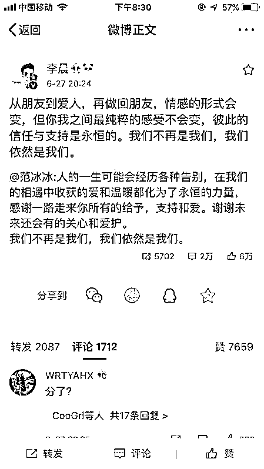

# 李晨和范冰冰分手了，宋慧乔和宋仲基离婚了，这事儿和唐僧有啥关系？

> 原文：[`mp.weixin.qq.com/s?__biz=MzU3NDc5Nzc0NQ==&mid=2247484917&idx=1&sn=2c92da7e493878fa5084b09a4e345397&chksm=fd2da72bca5a2e3d1ba59ac4c0e7c68dd8e2c3cf0332aaf2210216f12e32452badd9687a51bf#rd`](http://mp.weixin.qq.com/s?__biz=MzU3NDc5Nzc0NQ==&mid=2247484917&idx=1&sn=2c92da7e493878fa5084b09a4e345397&chksm=fd2da72bca5a2e3d1ba59ac4c0e7c68dd8e2c3cf0332aaf2210216f12e32452badd9687a51bf#rd)

有人想让我聊宋慧乔和宋仲基的离婚，也有人想让我聊李晨和范冰冰的分手。

说实话，人要离婚就离婚，人要分手就分手，你问我，我问谁去？

你说为啥这年头离婚，分手变这么普遍了呢？

为什么像查尔斯与戴安娜盛大的世纪婚礼那么多，但有好结局的，却很少呢？

为什么罗密欧与朱丽叶，梁山伯与祝英台都发生在古代呢？

是现代人爱情的信仰缺失么？

诸如此类的问题，不一一列举。

我给大家讲一个唐朝的故事吧。

唐僧大家都知道，耳熟能详。

唐僧的原型是唐玄奘，玄奘法师历史上确实西去那烂陀寺学习佛法，学成归来，在长安城外受到了极其盛大的欢迎。

历史上描述说长安城外老百姓夹道排出去几里，玄奘法师硬是用了三天才从喧闹的欢迎人群中走进城去。

与西游记中一开始唐僧就是受命于李世民前往取经不同。

实际上玄奘法师是偷渡出境，归国后才收到李世民的器重，从此出入内廷，地位相当于“国师”。

当然这个国师是打引号的。

唐朝的国教是道教，李世民姓李，尊李耳，也就是太上老君为祖先。

所以佛教排第二。

当时李世民安排唐僧翻译从印度带回来的佛经，他就成立了一个翻译小组。

其中最年轻的是辩机法师，他十五岁出家，师从著名高僧道岳长老，然后再拜玄奘为师。

那本著名的《大唐西域记》，就是西游记故事的原型，就是辩机撰写。

李世民最宠爱的是第十七个女儿，叫高阳公主，她嫁给了宰相房玄龄的二公子，也就房遗爱。

房玄龄我们知道，房谋杜断，房玄龄和杜如晦是李世民两个主要谋臣。

一个善于谋划，一个善于决断。

这场婚姻就相当于诸葛亮的儿子娶了刘备的女儿。

但是高阳公主呢，她不喜欢房遗爱这个赳赳武夫。

在一次出行的过程中，她爱上了英俊潇洒富有才华的辩机和尚。

辩机是个什么样的人呢？

看过古龙小说的人应该记得有个和尚叫做无花。

我觉得古龙就是参考历史上的辩机和尚，塑造的这个人物。

在《楚留香传奇》第一部《血海飘香》中，无花第一次登场就让读者惊艳。

他外貌姣好，惊才绝艳，下棋、弹琴、诗画、烧菜均是天下第一绝，是少林第一高才，号称“七绝妙僧”。

历史上的辩机，大概就这样子。

长安是当时国际第一都市，比今天的纽约+伦敦还强势。

大唐的公主沉迷于和尚，很显然，在唐朝的时候，比宋慧乔和宋仲基劲爆多了。

公主与和尚幽会的次数多了，难免送他很多礼物，虽然打着布施的旗号。

但布施的可未必是银子，还包括很多男女定情之物。

这里面有个很重要的东西叫做“金宝神枕”。

就是一个枕头，但是御用之物，皇家的。

这样的宝物后来被小偷偷走了，小偷拿着御用之物兜售，谁敢买呢？

一来二去，就被抓了。

抓进去一审，谁从谁那里偷的枕头，从辩机和尚那里偷的。

从此俩人的奸情大白于天下，李世民颜面大失，暴怒，一代妙僧，唐玄奘的弟子，就被杀了。

而且是腰斩弃市。

当然，据说也不算白死，高阳公主生的俩孩子，其实是辩机的种，虽然归在房家的族谱里。

我讲这个故事就是告诉你，不要迷信古代。

假如那个小偷没有被抓，这事情也就没人知道，几千年下来，也是当时的爱情神话。

所以，历史没有真相，只残存了一个道理。

古代究竟是怎样，我们不是拍《寻秦记》，谁也没去过，大家都靠猜。

我相信每个人都无法准确的描述自己的爷爷和奶奶的爱情故事。

因为长辈都会只讲美好的一面，次一级的长辈会为尊者讳。

一代一代传下来，形成的，就是历史。

所以，不要有那么多的强求。

两个人相爱，在一起了，两个人不爱了，不在一起了。

或者俩人当年也未必是因为相爱才在一起，人家或许还真是因为真爱了所以才分离。

你又怎么知道呢？

历史没有真相。

真相重要么？