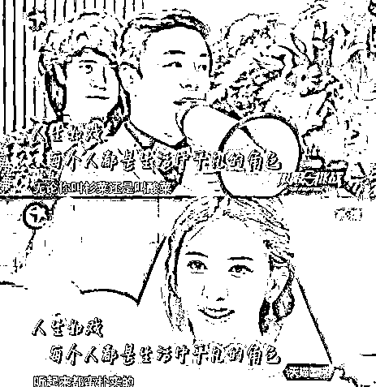
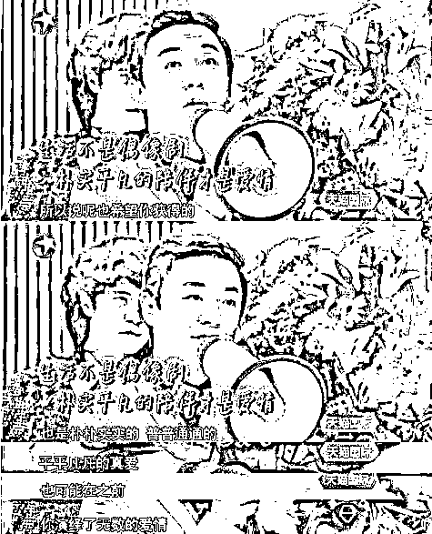

# 林志玲大婚，F4 全军覆没，究竟为啥？

> 原文：[`mp.weixin.qq.com/s?__biz=MzU3NDc5Nzc0NQ==&mid=2247484781&idx=1&sn=b9b63c7ac85967107eda267bff2ac671&chksm=fd2da7b3ca5a2ea5b47fdc79d2107f0ba6f4da2e64ee2485b17254694e91fcee3cb54f66e189#rd`](http://mp.weixin.qq.com/s?__biz=MzU3NDc5Nzc0NQ==&mid=2247484781&idx=1&sn=b9b63c7ac85967107eda267bff2ac671&chksm=fd2da7b3ca5a2ea5b47fdc79d2107f0ba6f4da2e64ee2485b17254694e91fcee3cb54f66e189#rd)

我们大前天就写过林志玲大婚的消息了，对象是日本艺人黑泽良平。

真可谓要相貌没相貌，要收入没收入。

那是志玲姐眼睛瞎了么？

一个人瞎我信，人人瞎恐怕就未必了。

我们的封面是黑泽良平的前女友 —— 长泽雅美。

长泽雅美很多热衷大河剧的应该都不陌生。

她演过《天地人》，演过《真田丸》，还包括大陆上映的电影《太平轮上》。

很明显，长泽雅美虽然不像志玲姐那样冠以亚洲第一美女的头衔，但实际上，是一个等级的美女。

俩美女，先后都瞎了么？这不太说的过去。

有网友说，志玲姐嫁给日本人，导致 F4 全军覆没。

F4 在 80 后的记忆中，是很有分量的一个组合。

想当年在大学校园里，《流星花园》是热剧，当时无数少女以 F4 作为自己理想中的情人。

十八年过去了。

大 S 结婚了，新郎不是周渝民；

林熙蕾结婚了，新郎不是朱孝天；

徐若瑄结婚了，新郎不是吴建豪；

现在，林志玲也结婚了，新郎不是言承旭。

F4，一个全员全军覆没的组合，呵呵。

翻开数据，你会发现一个有意思的共性。

周渝民比大 S 小 5 岁，恋爱时长 4 年。

大 S 和周渝民的恋情最早被曝光是在 2004 年初。

2007 年 9 月，周渝民送给大 S 一枚戒指，二人几度讨论结婚生子大事。

但仅 4 个月后，两人感情就急转直下。

2008 年 1 月，两人先后受访称，“我不敢和大 S 结婚，有小孩责任太大。”、“今年不会结婚，归宿还在寻找中。”

随后，大 S 发声明称，与仔仔的感情已升华，视他为一辈子的朋友。

朱孝天比林熙蕾小 5 岁，恋爱时长 5 年。

朱孝天和林熙蕾于 2005 年合作电影《东京审判》而相恋，2007 年公开恋情。

朱孝天在博客里隐晦地透露自己与林熙蕾分手的消息：“我背叛了你，因为我不知道该从何说起。我背叛了自己，是为了要完全失去你……”

有媒体联系上正在西安拍《夺命心跳》的林熙蕾时，她回应说与朱孝天“就是朋友”，当被追问是否已搬离两人共有的家时，她语气平淡：“不回应。”随即便挂断电话。

吴建豪比徐若瑄小 3 岁，恋爱时长 5 年。

2002 年 9 月，徐若瑄写给吴建豪的《想像十个你》令两人绯闻迅疾升温。

“出现在我梦里，在哭在笑在装生气，每个你都在触动我的心，想像十个你，出现在我梦里，我们紧紧抱着，守在一起。”

两人的恋情不温不火地持续了 5 年，直到 2007 年 4 月，两人公开分手。

到了 2008 年 5 月，徐若瑄更爽快答应帮吴建豪新书写序。

同年 8 月，徐若瑄参加了吴建豪的 30 岁生日派对。吴建豪表示：“(恋情)已是几百年前的事了。”

言承旭比林志玲小 3 岁，恋爱时长 4 年。

2005 年 3 月，林志玲紧偎言承旭的手机亲密照曝光，吃瓜群众热议俩人谈恋爱。随后林志玲用“姐弟关系”来回应这些照片。

2005 年 7 月，言承旭曾秘密飞赴大连，探望坠马受伤的志玲姐姐。

林志玲拍摄《赤壁》时，两人传出分手传闻。

而当林志玲和绯闻男友邱士楷一起出现在上海时，言承旭坦言：“如果她遇到好的对象，我会祝福她。”至此，两人感情趋于平淡。

我们能看到一个非常有意思的共性。

都是姐弟恋，恋情大约都持续 5 年左右，都是无疾而终。

这让吃瓜群众很不解，为啥帅哥往往娶了凤姐，而丑男们抱得女神归。

其实这个问题，很多年前黄渤就已经说透了。

在录《极限挑战》的时候，黄渤对林志玲说过这么一番话。

生活不是偶像剧，朴实平凡的陪伴才是爱情。

难怪在拍完《101 次求婚》之后，林志玲曾经说过，黄渤才是她理想中的配偶，只可惜对方已婚。

我们都当志玲姐在搞笑，毕竟两个人站在一起，风格实在不搭调。

但现在想来，这个道理非常简单。

美女要的，是有人爱，有人哄，有人宠，有人围着她，有人拿她当作手心里的宝，拿她当作世界里的唯一。

可是帅哥们呢，很难为一棵树，放弃整片森林。

或许这就是 F4，团灭的原因吧。

昨日大号文章链接：

[高考，有标准答案，接下来的人生，没有标准答案](https://mp.weixin.qq.com/s?__biz=MzU0MjYwNDU2Mw==&mid=2247486579&idx=1&sn=453f03b2a7b9d068167569ab6ded271f&chksm=fb19600fcc6ee919bb4b526fd0426765bb7462d9584a5d0d9bcfb3c1d9d1b090db3fa8e917d3&token=1317699445&lang=zh_CN&scene=21#wechat_redirect)