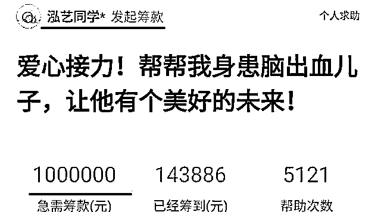

# 我怎么看郭德纲的徒弟脑溢血众筹百万

> 原文：[`mp.weixin.qq.com/s?__biz=MzU3NDc5Nzc0NQ==&mid=2247484512&idx=1&sn=0717d9fd1ab33dc596862bccdcf4f46a&chksm=fd2da6beca5a2fa80134d2ca004cc9feb77b249cf404d6393f0f0b9feb23cbebe4307f2bfccd#rd`](http://mp.weixin.qq.com/s?__biz=MzU3NDc5Nzc0NQ==&mid=2247484512&idx=1&sn=0717d9fd1ab33dc596862bccdcf4f46a&chksm=fd2da6beca5a2fa80134d2ca004cc9feb77b249cf404d6393f0f0b9feb23cbebe4307f2bfccd#rd)

郭德纲的这位徒弟是鹤字科的，叫吴鹤臣，和张鹤伦是同一个科的师兄弟。

吴鹤臣最近突发脑溢血，紧急被送往了医院，吴鹤臣的家人，确切的说是他太太为此以他妈妈的名义，在平台上发起了众筹，希望得到网友的救急，众筹百万来为吴鹤臣看病。

很短的时间内，她就筹到了 14 万多，但接下来，事情发生了一百八十度的大转弯。

第一个问题是，网友好奇为什么德云社不给演员上医保，以至于员工需要花费如此巨大的费用用于治疗。

要知道脑溢血，那是甲类，报销的比例很高，怎么产生的 100 万的费用，是网友们好奇的。

当然这个很快就被澄清了，德云社有给吴鹤臣上医保，这就更让人纳闷。

在网络的压力下，吴鹤臣的太太公布了 4 月 8 日动手术以来的花费大约是 7 万元，那么扣除医保之后，究竟需要自费多少，这是网友们关注的。

第二个问题是，网友们不明白，无论医保比例是多少，7 万块扣掉报销之后它也是小几万块。这么一笔费用，工作十来年的吴鹤臣为什么出不起，甚至都没有几个哥们，师兄弟，乃至师傅肯伸一把手？

所以网络就开始追溯吴鹤臣的家庭状况，经查，他在北京有两套住房。

这件事，吴的太太后来澄清了，房子是公租房，一套在父母名下，一套在爷爷名下，没有房本，无法出售。

而车是必需品，北京太大了，家里和医院相隔太远，没车出行不方便。

这一下网友们就炸了。

要知道，公租房虽然没房本，但它要是拿去抵押，或者以长租的方式出售一样有市场价格。

更何况车子。不要说车子，哪怕是车牌，京牌本身都有很大的价值，何止这点医药费，你真需要钱，不可能卖不掉。

何况这个资金缺口不大，你也就花了 7 万多，扣掉医保，这小几万块，怎么都能应付，何至于众筹。

第三个问题紧接着就来了，细心的网友看到了，吴的太太发的众筹消息来自 HUAWEI P30 Pro 手机，这一款手机是 4 月 11 日正式上市发售的。

而吴鹤臣本人是 4 月 8 日突发脑溢血被送进医院抢救。你注意时间，谁先，谁后。

更何况，这款手机的价格上万，网友们估计吴鹤臣的医疗费，自费的部分也不过两部手机。

可就是这样一个处境的家庭，众筹百万之巨，究竟为何，让人深思。

当然，吴的太太非常年轻，比吴鹤臣本人要小了十多岁，你说年少不懂事，也不是说不通。

但很显然，她的做法给德云社带来了巨大的公关危机，这才是她后来恐慌的理由。

所以频频上网解释，并关闭了众筹的通道。

但有些事，越解释，越复杂。

比如她是这么解释的：她医药费虽然没有花费多少，但是要在天坛医院附近整租两居室，月租五千，以两年计要十二万。护工一名，月薪 8000，时间长短不详。还有吴的误工费，耽误了挣钱等等。

因为后续的巨大开支，所以要求筹款百万。

这一点遭到很多网友的不满，因为很显然，后续她说的这些事儿，都不是应急。

我们通常说救急不救穷，你那会儿手头紧，大家筹了也就筹了，帮一把也说的过去。

可你已经不紧迫了，你说出院后的调养，生活无着，那其实这个社会上，有长期困难的人多了去。而社会资源并不是无限的。

这个事情吧，大概就是这个样子，我觉得应该是德云社出面给了某些承诺或者施加了压力，这位太年轻的吴太太消停了。

毕竟，再折腾下去，对德云社形象上的打击，那可不是区区几万块，或者区区几百万能承担的损失。

有人说，这是一个道德问题，让我来聊一聊。

我觉得吧，其实，这姑娘做的这件事，最根本的问题并不在于道德。

而在于我们是否应该开通网络捐款通道，这才是根子上的问题。

说到网络捐款，我拿另一件事来打个比方。

我是 06 年的淘宝会员，应该说是最早的一批。我非常清楚早期的时候，淘宝上的买家是犹疑的。

通过网络买东西，最大的问题就在于，你看不到，摸不到，你怎么知道人家会发货给你？你怎么知道人家不会货不对版？

答案是不知道。

所以当支付宝这个中介担保环节出现的时候，所以当卖家评分体系出现的时候，我就意识到，这件事要火。

早在 06 年之前很多年，比如 00 年之前，我就一直纳闷为什么火车站的东西那么难吃。

这道理后来我想通了。

因为是一锤子买卖。

你坐火车，中途到站停歇不过几分钟，大站不过十分钟。

这么短的时间内，你买个玉米，买个粽子，或者盒饭，都还来不及吃，火车就开走了。

也就是说，你与卖家总共就见了几分钟的面，可能今生都无缘再见。

那人家凭啥要卖给你一个好吃的东西呢？你也不想想！

**质量的保障并不是建立在道德的基础上，而是建立在长久合作的基础上。**

车站附近，旅游景点，这些外来人流量巨大的地方，往往商品质量都次，东西都不好吃。

为什么？

一锤子买卖，它不需要好吃呀。

可是你去看那些居民区，老牌店，为什么东西比较好吃？因为它做的是长久生意，做的是回头客。

你的客户就这一批，三十年，五十年就这一批，你可以坑他一次，难道你回回坑他么？那他还来么？

想明白这个道理，你就应该明白为啥我建议取消网络慈善筹款这种东西。

因为它的原理和火车站兜售商品，是一样的。

谁还能连续生两次大病，连续两次众筹么？

通过网络，你怎么去监督善款的使用情况？

人家筹款的人凭什么就非得是好人？要是坏人呢？你能咋地？

很显然，没有长久的合作关系，就没有什么人品的保障。

这就像百年老店未必是道德高，火车站流动摊贩未必是道德低。

只不过前者和后者的机制使然。

橘生淮南则为橘，生于淮北则为枳。

人是同一拨人，橘子是同一拨橘子，你不去改变这个底层交易的环境，光指望道德谴责和说教，那是不会有改良的。

网络慈善根本就不该存在，如果它要存在，这里面的信用体系也得先建立了，才行！