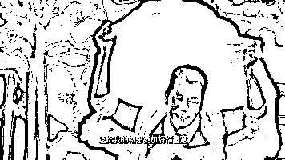

# 你确实改变不了你妈，但未必不能改变世界

> 原文：[`mp.weixin.qq.com/s?__biz=MzU3NDc5Nzc0NQ==&mid=2247483828&idx=2&sn=67f88f4cd89600f3f03dea73b1cca393&chksm=fd2da36aca5a2a7c8f68337d434fbac45946edfc618f020472e5ffc9ae740ce5084fc310dd5a#rd`](http://mp.weixin.qq.com/s?__biz=MzU3NDc5Nzc0NQ==&mid=2247483828&idx=2&sn=67f88f4cd89600f3f03dea73b1cca393&chksm=fd2da36aca5a2a7c8f68337d434fbac45946edfc618f020472e5ffc9ae740ce5084fc310dd5a#rd)

先插播一句通知：

记忆承载和记忆承载 3 每天至少有一个号会推送唯一的原创文章。这句话的意思就是说：两个号，不会同一天同时打广告。

所以，我们请铁杆读者们务必同时关注两个号。当某个号某天在打广告时，您就可以在另一个号阅读到本号每天至少一期的原创文章。

我们昨天大号记忆承载里这篇文章被删了，今天小号把它重发下，让没读到的读者再看下。

今年的浙商会上，马云说了一句很经典的话。

他说：别老想着改变别人，改变环境，改变世界，改变美国，改变川普，你连你妈都改变不了！

这话非常有意思。

但如果你仔细分析下，想要改变世界的人分成了两类。

一种叫理想主义者，他们是想把世界变成自己期望的样子；

另一种是巨婴，他们等着改变了之后的世界来拯救自己。

马云这话是说给想要指望靠世界改变之后来拯救自己的巨婴听的。

但如果我们思考下，假如你是个真的理想主义者，你要改变世界，会经过什么样的过程呢？

我认为，会分两个阶段：

第一个阶段，是让自己成为非主流，这就是世人所谓的努力奋斗，分分钟走向人生巅峰。

我们很多时候，都会低估或者高估自己的处境。

比如以前的一期

[新的一年里如何做一根不容易被割的韭菜](http://mp.weixin.qq.com/s?__biz=MzU0MjYwNDU2Mw==&mid=2247485494&idx=1&sn=58dcac78153f313c748e4e05d4adf3ee&chksm=fb19644acc6eed5c423f23fbf492ad5c0beadb8e7b29fb1ed02b46cb5c7c1b036065ca3dd461&scene=21#wechat_redirect)

里面我们说过，当一个事实已经发生的时候，从最初的万分之一响应完，到最后所有人响应完，需要一年。

其实我远远高估了数据。真相恐怕是，即使过十年，真的响应完的人，也只有十分之一。

如果你做一个调查统计，你会发现，十四亿人口里十三亿都没有受过高等教育，虽然很多公司在招聘的时候非 985，211 不要。

如果你还记得罗胖的跨年演讲，你会想起来他告诉你 2018 年淘宝这个家喻户晓的产品通过春晚打广告，结果把服务器搞崩了。因为瞬间涌入了数亿连地址怎么填都不知道的新用户。

这说明什么？这说明你自己其实就是非主流，而且你对这个庞大国家的主流人群一无所知。

我讲今天这番话是深有感触的，因为我经历过。

就拿我们号来说，在去年的 4 月份，我写过一篇一天之内被无数媒体转载阅读量几十万+的文章，是写关于中兴的，当然，它当天就被删了。

那篇文章里我没有像平日一样写复杂的逻辑，而是简单的点燃了情绪，瞬间就引爆了互联网。

我从留言就能看出来读者非常的广泛，因为当天留言就上千条，而且大部分是情绪化的，没有逻辑，没有思考。

事实上，我们号历史上所有十万+的文章都是我放弃固有风格，简化思维，写一些我认为非常简单的东西，引爆的。

这说明大部分人，其实看不懂我们平日里写的啥。

当初我们号只有五十人的时候，我几乎大都认识，不是企业家，就是投资人，或者高管。

到我们号有五百人的时候，它依旧是在小范围内传播，在一个移民或者准备移民的群体范围内传播。

当我们号有五千人，乃至今天有五万人的时候，其实我已经没法完全了解到每个读者的情况了。

但是我从名字就能看出来，大部分人是知识分子，因为很多人的名字上写了自己的职业信息。比如某某律师，分析师，精算师，工程师......

这说明，即使今天五万人了，我们仍然是个非常小众的号。它根本就没有真正传播到我们这个国家的主流人群中去。

这也说明，虽然我一直觉得我写的很简化了，但实际上，受众仍然觉得复杂，仍然无法接受。

这就是它没有传播更广的根本原因，大众不喜欢。

但是你反过来想想，这恰恰说明咱们这五万读者，全都是，非主流。

我知道有读者怎么想，有的人会觉得，我干嘛要做主流，我那么努力，考上了大学，在大城市里有体面的工作，过着中产阶级的生活。我追求的本来就是非主流，对不对。

你说的对，很多人都这么想过，这就是人生的第一阶段。

可是，如果你死守着这个阶段，接下来你就会发现，你做不成事儿。做不成任何事。

因为，让自己融入主流，然后去影响主流，就是你绕不开的第二阶段。

我曾经做过产品经理。

我们说一个产品有很多环节，当然有市场推广的环节，当然有技术研发的环节，当然也有工程落地的环节。

但你知道站在产品经理的角度上，什么最重要么？

是用户体验。

一个用户体验不好的产品，你其它做的再好都白搭，因为用户不会用。

这是我多年前最经常被骂的一句话。

那个时候我的 BOSS 总是骂我设计的流程过于复杂，他觉得我设计的流程只有程序员才会用。别说不识字的老太太，哪怕是他，理解起来都特别的别扭。

那个时候的我显然还无法完全意识到，我认为用户可以学嘛。

站在产品经理的角度，让用户去学，这是最愚蠢的想法，没有之一。

我们小时候都读过一个故事，李白每次写完诗，都会读给不识字的老太太听，如果老太太能听懂，而且觉得很好听，那才叫好诗。

如果李白写的诗充满典故，那他永远成不了李白。

把一个特别复杂的事情说简单了，这叫做能力；

把一个特别理性的事情用情绪点燃了，这更叫能力。

一个人，最初都想脱离主流，可是脱离主流之后又会发现只有融入主流才能影响主流。

这是什么？这就是改变世界的过程。

到现在为止，你还没改变世界，但已经被世界改变过两回了。

这个第二阶段，我做过尝试。

七年前，我参与制定行业技术规范，我们为此创业，把规范变成了项目，把项目变成了产品，我们希望把它推广到全国去，在全国的范围内都落地。

我记得有一次在一个饭局上，思科中国区的总裁，就跟我们聊，说，你们公司未来十年的任务，其实就是把这件事推广，落地。把它在每个省，重复，重复，再重复，一遍遍的重复。等到全国都接受的那一天，你们就成功了。

当然，这件事最后没做成，这很遗憾，也不遗憾。如果理想那么容易实现，它就不叫理想了。

事儿没做成，但我想明白了一个道理。

一个人，为了刻意标榜自己是非主流，一味的拒绝接触主流，这是失去了自我；

一个人，为了刻意迎合主流，而灭杀自己的本心，这同样是失去了自我。

这两个错误，我年轻的时候，都犯过。

我被世界改变了两回，但啥也没改变，是不是很悲催？

呵呵。

后来的我不这么想了，如果你一定要以得到认可的方式来实现理想，那这个理想永远是不稳固的。

我给你举个非常典型的例子，曾经有个人，他得到过很多人的认可，很多人为了他拆掉了很多庙宇，四处树立他的雕像。

但是后来呢？众所周知，他的雕像被拆了，而庙宇，又纷纷树立了起来。

他都做不到，说明这事不是人力所能为。

如果把时光穿越到释迦摩尼诞生的历史节点，你觉得释迦想过要改变世界么？

我觉得他没有，他只是说了自己想说的话，然后就任其发展了，就像几千年前那个为了通关，不得以留下五千字的老子，是一样的道理。

但是世界随着他说的那些话的发酵和演变，就逐步的，自然的，改变了。

这告诉我们一个道理，世界就在那里，你跟它较劲，是较不过的。

但你反过来想想看，如果你只问过程，不问结果，那事情是不是就变得很容易了呢？

当然很容易。

改变世界有这么难么？

其实很简单的对不对？

你在地上撒泡尿，世界就因你改变了，多了一泡尿嘛。

就像我发出一篇文章，会有五万人收到，会有起码 5000 个人点击阅读，这 5000 人里面至少有 2500 个是认同我的，也许有 2500 个觉得我是个 SB，而且这反对我的 2500 个里面，或许就有我妈。

如果我非要让 5000 人都认为我是对的，不说服所有人誓不罢休，那我就真的是个 SB。

但你反过来想，我干嘛非要让所有人都认可我，才算改变世界呢？

当我点击发送按钮的时候，当我的想法送达到五万读者手里的时候，我已经改变世界了。

如果你想明白了，如果你活明白了，做自己的想做的事情就行了呀，无论你做什么，世界都将因你而改变。

只要你做了你想做的事情，无论是点击了发送的按钮，还是在地上撒泡尿。

你都没有白活。

花一辈子的时间去跟所有人较劲，是傻的冒青烟了。

人，有今生，没来世的。

为自己活，活给自己看，做自己想做的，不求有功于世，但求无愧于心。

就够了。

至于结果，结果不是你能左右的。

今日大号记忆承载头条链接：

[历史上被删掉的那些原创爆文......](https://mp.weixin.qq.com/s?__biz=MzU0MjYwNDU2Mw==&mid=2247485544&idx=1&sn=a949d2c7612f5cc46c5dc233fb615728&chksm=fb196414cc6eed02f825aa983a43bf84c9ef37254ed309f00b8f99c70eb70d5851622959ad21&token=322639938&lang=zh_CN&scene=21#wechat_redirect)

请读者关注记忆承载，因为两个号不会同一天打广告，每天至少有一个号必会推原创。 

扫如下二维码可立即关注大号：记忆承载。

