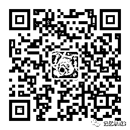

# 什么样的人，是不可以得罪的

> 原文：[`mp.weixin.qq.com/s?__biz=MzU3NDc5Nzc0NQ==&mid=2247483776&idx=1&sn=1bf5475cac4f079fe2502f4e323aac4f&chksm=fd2da35eca5a2a48fe2f39c9103c5f802f29d35cb74675f2a01a1e8c3f886788372be4d48596#rd`](http://mp.weixin.qq.com/s?__biz=MzU3NDc5Nzc0NQ==&mid=2247483776&idx=1&sn=1bf5475cac4f079fe2502f4e323aac4f&chksm=fd2da35eca5a2a48fe2f39c9103c5f802f29d35cb74675f2a01a1e8c3f886788372be4d48596#rd)

在大号记忆承载的文章：

[失信的 ofo，嗜血的啸虎，落寞的欧神](https://mp.weixin.qq.com/s?__biz=MzU0MjYwNDU2Mw==&mid=2247485439&idx=1&sn=67488dac34f6c1d0304077f4e92bbfd8&chksm=fb196b83cc6ee2950e8fa6b61fef887ec0a8737340b3bb367ec897fc24b2b43528e2ddbc9d9b&token=1294180506&lang=zh_CN&client=tim&ADUIN=2491712017&ADSESSION=1546050767&ADTAG=CLIENT.QQ.5579_.0&ADPUBNO=26833&scene=21#wechat_redirect)

里面，有人给我留下一个很搞笑的留言，我都没好意思让编辑加精放出来。是想等冷却了，改日再聊：

那篇文章里我对所有人都语多调侃，无论是 ofo 的戴威，还是朱啸虎兄妹，亦或者欧神，但是很尊敬的提了一句，朱的老爹是大学者朱德明。结果这哥们就留言里放话，说：“朱德明有啥用，一个教书匠，又没钱又没权的，云云。”

所以我说认知，真的是人与人之间最大的差距。

天底下有两种人，切莫开罪。一种叫名医，一种叫大学者。

人这辈子哪有不老不病的，钱确实能解决很多问题，比如可以让你去最好的医院。但也有很多问题解决不了，比如花了同样的大价钱，有人能治好你，有人，他就治不好你。

对于一个不知道哪天就能定自己生死的名医，客客气气的，捧的高高的，拍拍马屁，这并不丢人；

你说你再牛逼，当你病了，落在人家手里的时候，躺在手术台上的时候，你都是弱者。这种弱，不是财力上的，不是权力上的，而是信息不对称上的。

那个医生到底有没有尽力，他的治疗方案站在更长一段时间内来看，到底是埋下了祸根还是长长久久，其实你并不知道，甚至，你都没法让其它名医来确定性的弄清楚。

医学本就是高科技门类，它属于不确定的学科。在一个充满未知性的领域里。权力，财力是没有用的。

你注意为什么人类在原始社会的时候，会形成巫师的地位比酋长还要高，这就是因为巫师掌握的是未知。

巫师就是后来的精神领袖。

比如西方就是教皇，比如日本就是天皇。你要注意天皇首先是精神领袖，他是神道教的领袖。而幕府将军才是实际的日本国王。

你在中国感受不明显，是因为我们自古就是政教合一的。比如乾隆，他不仅仅号称大清的皇帝，同时也号称自己是文殊菩萨转世，所以叫文殊菩萨大皇帝。

这就是教皇与国王集中在一个人身上的体现。所以我们自古其实也是有精神领袖的，和西方，和日本一样。

对于未知，即便是酋长，依旧是恐惧的。

你想想看，人类的恐惧来自什么？

怕穷，怕病，怕老，怕死，你怕的不都是未来么？如果现在上帝给你拍胸脯，直接告诉你未来你的命运，你还怕么？

怕个毛啊，人生既已注定。还怕啥？

这就是为什么我们会形成对未知领域的恐惧，这就是为啥我告诉你，当一件事没有办法彻底量化的时候，你都得心怀畏惧。

你可以不怕那个帮你搬木头的，因为木头很粗重，它可以计时，它可以计件，这个人不搬，你可以找人替代他。

可遇见少有的几个名医之一，当你无法替换对方的时候，你应该明白对方的价值。当然，这个前提自然是你的命足够贵。如果你根本不拿自己当回事，或者你付不起医疗费，那拍他马屁也白搭。

另一种人是什么呢？不是大人物，而是大学者。

大人物不一定很可怕。因为世界是彼此掣肘的。就像在欧洲，法国，德国，俄国，英国四大强国林立的环境下，依旧有无数小国存在。

你觉得小国存在靠什么？靠的就是大国之间不可能是铁板一块，他们一定有不睦，那就有缝隙。

夹缝中求生存。

同样的道理，大人物不一定能把你怎么样，即使你得罪了他，如果他要把你如何，那就会给其他大人物以口实，以此为借口找他的麻烦。这就形成了一种平衡。

这个道理很好理解，今天就算有人很强势的要欺负人，那我们把他曝光嘛，放到网络上，当其他大人物看到，或者群情激愤的时候，就会对他形成制约的力量。

可是，有一种人，你去招惹，除了给自己惹麻烦，不会有任何好果子吃。

就像有人问我，在一所顶级大学里，是校长的地位最高么？

你要是这么认为，说明你根本就不懂行。一个顶级大学里，硕果仅存的那几个老的不能动的大师，大学者，他们才是元老院的存在。

为啥？我们经常说，一个师父的地位不是由他自己决定的，而是由他的弟子们决定的。

大学者，和学者，是两码事。你在所有媒体里成天见的那些，那都叫学者，顶多叫知名学者，这种满大街都是。

啥叫大学者？国内仅有的那几所学校里，已经老的不能再老了，奠基人，鼻祖，满系满院都是他门下的，那种老祖，才叫大学者。

不知道大学者的能量么？去参加下自己学校的校庆就知道了。当然，仅有的那几所学校。

我当年曾经参加过自己学校的校庆，想停车，校内的位置全是预留给大人物的。让我停到校外指定的地方去。因为车上有老人，有孩子。我就不想停的远走路步行，通融了下，门儿都没有。我老婆就笑话我混的真背。

后来在校外指定的停车场里见到很多熟人，年轻时的 CTO，现在已经做了 CEO，班里已经创业成功的独角兽掌门人，各种论坛上的精英们，平日里看起来人五人六的，这会儿全都在排队，我就笑了。一聊天，很释然，因为校内的车位是留给远道而来的有世界级影响力的大人物的，全球牛人跑来祝贺庆典，这种场合下，我们都是渣渣啊，还想就近停车？没让你打车来已经很照顾校友们了。

没资格停在校内的，终究是绝大多数。在仅有的几所顶级学校里，你想知道自己的地位，回校参加一次校庆马上让你知道。

和我同一届的，80 后，有人的身家已经是马云的 1/5 了，这世上混的比自己好的同门实在太多了。但你往上推，不都是一个师父门下的徒子徒孙么。而所谓的大学者，人家才是所有人共同的祖师爷。

你说哪个不开眼的，去惹祖师爷干啥？这是好惹的么？人家门生遍天下。越老的掌门越如此。

你也不想想，连自己这一届里面出类拔萃都混不到，人家门下弟子几十届了，是咱惹得起的么？你也不知道人家哪个初代的弟子已经做了天了，为了拍老师马屁，一句话就把你打回原形，回山里重新修炼去吧。

当然，还是那句话。我个人真的不欣赏这种数千年如一日的等级森严，我理想中的状态是人人平等。

大家过日子嘛，平等，才是最开心的相处方式。但东方文化就是这样，别说我们，隔壁的日本，论资排辈更严重，它更不会给你平等。

更何况，我去说教，要相互理解，要相互平等，有人鸟我么？我说让大家改变大家就改变？

你当我谁啊？武林盟主啊？

呵呵。

别说我们，就是真的大的不得了历代天下一人，难道还有本事把几千年的文化传统给改了？

我们这辈子能不被环境改变，不被别人的目光左右自己的路线，能坚持做自己，已经很知足了。

昨日大号记忆承载文章链接：

[一个愤青的成长史](https://mp.weixin.qq.com/s?__biz=MzU0MjYwNDU2Mw==&mid=2247485484&idx=1&sn=a8d95fe6cfc5480932219c8285dcb23a&chksm=fb196450cc6eed4642f93927aec37aa319c2767eafe88558814d65fe5a1352c1befa3c86c0e4&token=410508506&lang=zh_CN&scene=21#wechat_redirect) 

扫如下二维码可立即关注大号：记忆承载。 

