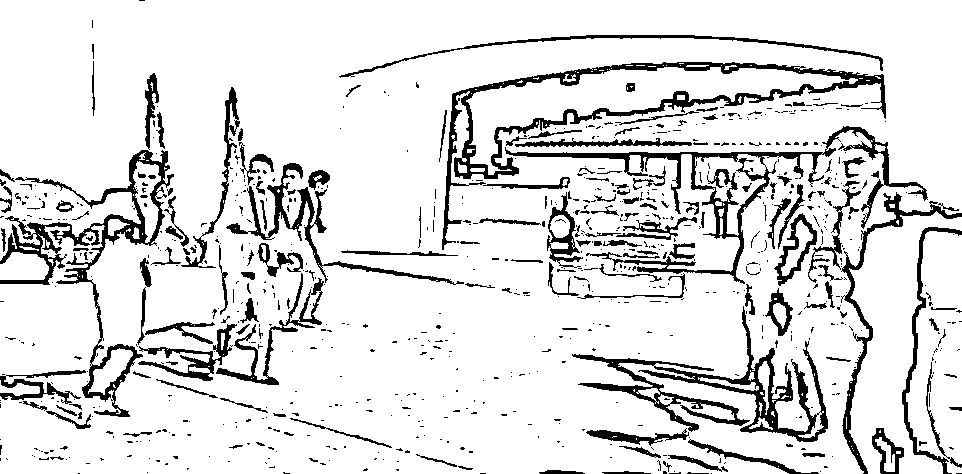
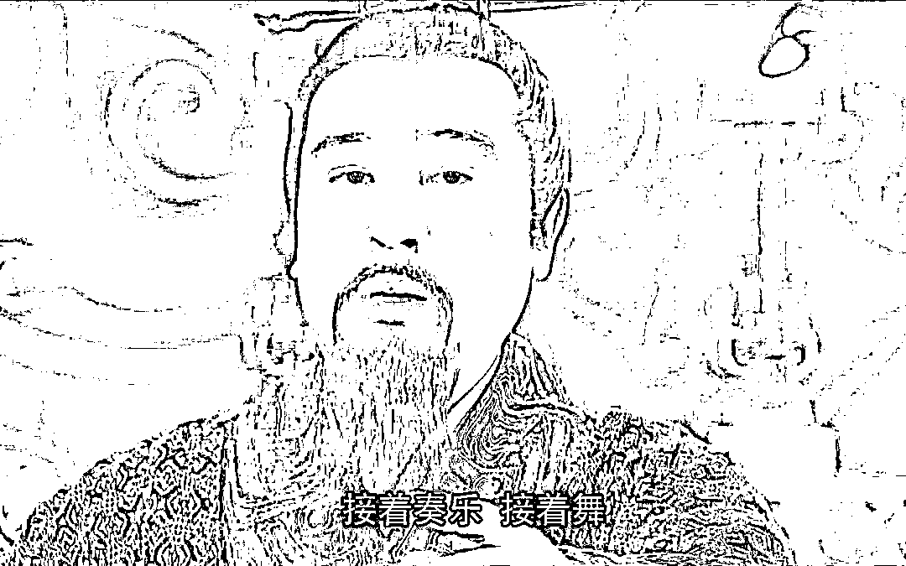

# 李佳琦也很无奈：臣妾真的做不到啊

> 原文：[`mp.weixin.qq.com/s?__biz=MzU0MjYwNDU2Mw==&mid=2247512158&idx=1&sn=acb77a9ed6627037f47011d09f03c733&chksm=fb1adc22cc6d5534677a2719d22b09951f9ad1df85055e3183c4f550ac1d4bf154bd4cf9cc67#rd`](http://mp.weixin.qq.com/s?__biz=MzU0MjYwNDU2Mw==&mid=2247512158&idx=1&sn=acb77a9ed6627037f47011d09f03c733&chksm=fb1adc22cc6d5534677a2719d22b09951f9ad1df85055e3183c4f550ac1d4bf154bd4cf9cc67#rd)

李佳琦在直播间怼了观众，理由是 79 块钱的眉笔。

有观众表示眉笔怎么还涨价了，李佳琦脱口而出，一直都是 79，哪里有涨过价。

本来到这里就结束了，话赶话，意犹未尽的李佳琦接着输出了一大通。

从刺激消费，变成了刺激消费者。

大概的意思是说，79 块钱的眉笔你还嫌贵，有时候要多找找自己的原因，这么多年了工资涨没涨，有没有认真工作过？

结果引起轩然大波，连老胡都出动了，表示要尊重收入不高的网友，要**保持与他们的共情**.......

圈重点，老胡一针见血。

保持共情，说白了就是装的。

李佳琦不可能真的和网友共情，调查报告提供的数据，互联网平均月收入低于 5000 块，而李佳琦的年收入十几二十亿。

说白了你不能因为周星驰演屌丝逆袭你就真的以为他是屌丝。

邓超在美人鱼里面演的那种住在天比高山顶豪宅里的，才是星爷的真实生活。

这就是为什么多年以后，当大家还是很期待星爷拍过去那种题材电影的时候，作为资深影迷，我很清楚，他没办法再给我们呈现那种效果。

所以你看他后期的电影，更多的是向自己向往的前辈李小龙致敬。

我们回过头来看李佳琦，也许在事业的最开始，他是一个非常完美的口红导购，一个完美的销售。

从销售到大销售，从大销售到头部 IP，现象级全民销售，李佳琦自己的身份已经发生了质变。

今天的李佳琦，真正适合他做的，就是资方，或者说，孵化方。

以自己现有的百亿资金为基础，加上多年的经验，名气，和能够撬动的千亿资金规模，从现象级网红走向平台级幕后操盘手，这就是他唯一能做的。

事实上也是他唯一该做的。

我们很清楚，他没有这么做，因为各种各样的原因，他仍然被裹挟着，被死死的按在大销售前台的这个角色上。

对今天的李佳琦来说，再每天无休止的直播，多赚个几十亿，有什么意义呢？

没有实际意义的。

资本自己积累，自己滚雪球的速度，已经超过了你工作带来的增值部分。

李佳琦也是人，他也会累，也会腻味。就像我曾经分享过的那个观点。

我说一个人很努力很努力，是因为有钱赚，有大钱赚，或者说自己的财富可以指数级飞速前进。

如果很努力也不能让自己更富有了，或者说努不努力，反正财富滚雪球的速度都会超过自己奔跑的速度，那还有多少人，愿意为了赚钱而努力工作？

一个人最初可能为了买第一套房子 996 给人家打工，如果他已经有 50 套房子在收租，他赚不赚那几十万的年薪，有什么区别呢？

这种局面下，他还愿意做的事情只有两种，要么是对他有用的，比如资本运作；

要么是他真正喜欢的，比如那个有七栋楼在收租依然喜欢卖卤鸭饭的广州大叔。

李佳琦已经出来道歉了，为自己的冲动向网友们道歉。

表示老胡批判地对，自己的确没能做好时时刻刻与网友们共情，今后要努力工作，继续保持自己大销售的本色。

我相信，这是出于无奈，或者说，是身边人的要求。

因为另一方面，在私下场合里，李佳琦曾经多次表达过下面的观点。

1、真的不在状态了，无论如何也找不出刚出道时的那种感觉。

2、真的不想再直播了，自己的钱十辈子也花不光。如果不是这么多的同事还有后面的供应链厂商一再要求，他真的想放弃直播，去做点喜欢的。

说穿了，不是他放不下，而是那些从他身上能赚到钱的利益关联方，不希望他放下。他在被情感绑架着。

有部分网友表示理解，这是人之常情。

就像《甄嬛传》里的皇后娘娘，她说臣妾真的做不到啊，是发自内心的实话。

她已经坐到皇后的位置上了，这是事实，这就是当下的实际情况。

你要她像最初刚进宫时那样，你要她像一个小答应，小常在那样，使出浑身解数去展现一个妖艳贱货的做派，真的没办法呀。

我们说的难听点，你去东京银座找个小姐姐，今天给她一百万，她惊喜；明天给她一千万，她狂喜；后天给她一个亿，你看她还喜不喜？

她没有办法喜了，明白不？

用周星驰在《喜剧之王》里的话说，表情包已经用完了。

她有了一个亿，明天就跟妈妈桑告别了，同时，也跟你告别了。

她如果一辈子都在银座做女帝，除非这份工作本身就是她喜欢的。

但是做女帝这件事，是很难长久喜欢的，因为什么？

老胡已经告诉你了，因为需要共情。

**情这个东西，就像表情包，一定有用完的那天。** 

所以当很多网友骂李佳琦的时候，很少去想这件事的本质。

说白了，你想别人演戏给你看，你想别人用好听话哄着你的情绪，一天，两天，三天，总有一天，会结束的。

明白么？

总有一天，这种情绪服务会结束的，因为对方是个人，不是个情绪提供机器。

傅首尔和那个她口中的窝囊老公老刘，据说要离婚了。

很多人说傅首尔太强势，做女人这么强势，男人受不了。

也有很多人说老刘终于熬出头了，这么多年的婚姻，钱也能分不少。

但我觉得还有第三个答案。 

傅首尔口中的老刘，是一个情绪提供者，用她自己的话说，无论自己多强势，在外面怎么打拼赚钱，自己的老公虽然窝囊，虽然不会挣钱，但永远都是安抚自己的那个人，永远都是包容自己的那个人。

其实她这句话就已经暗示了结局。 

你要一个人哄你一天可以，哄你一辈子，对方没可能有这么多表情包的，库存总会耗尽。 

喜剧之王里精通演员的自我修养的星爷都做不到，何况一个普通的老刘。 

六年前，我就关于咪蒙这个话题回答过读者。 

那时候就有好多读者问我，你说话可不可以温柔一点？你能不能照顾一下我们的情绪？ 

我们已经很累了，也许你说的是对的，也许你说的是真的，可我真的很累。

我不想疲惫的面对完社会，还要看到你那些刺目的真话。

我想求抱抱，于是那时候我就给读者推荐了咪蒙。 

我说，她就是个女版的咆哮帝马景涛，她可以抱着你，摇晃着你的肩膀对你说，山无棱，天地合，乃敢与君绝。

明白我这意思么？ 

这个世界上有不同的产品，你要自己学会挑选组合。

咪蒙当时一年能赚 1 个亿的，她愿意为了这 1 个亿去尽情展示她的表情包，而且她的确也有与人共情的特殊才能。

后来她没了，但是你可以找到很多替代品。

所谓动物世界里某只动物很容易消失，但是生态位没那么轻易消失。 

用老胡的话说，你能找到很多人来跟你共情的。 

俗称求认同，有人专门来认同你的。 

所以六年前我就跟读者讲的很透彻，我说，相处之道，在于什么？在于成本。 

**只有成本足够低，才能处得久。**

你看我一篇文章的时间和我写作这篇文章的时间，几乎是相等的。 

你花了 10 分钟看，我也就差不多花了 10 分钟去写，这才是我们能够年复一年，日复一日总相见的前提。 

如果你要求我每天花十个小时琢磨你到底为啥不开心了，再花十几个小时去哄你开心。

那要不了几个月，我先受不了了。 

何况哄人开心，并非我所长。 

换句话说，选择权理应在你手里。 

你需要什么，就去寻找对应的选项。 

你想放松一下，可以看岛国爱情动作片，可以看韩剧欧巴，你想精神按摩一下，有各种情感大 V，你想猎奇一下，有各种土味网红。 

某一天李佳琦干不动了，不卖口红了，或者说你不喜欢他了，还可以有王佳琦，张佳琦，赵佳琦，有的是直播间让你选。

铁打的银座，流水的姐姐。

**人这一生，需要的角色很多，而这些角色，是不同的人来共同完成的。**

刘备三顾茅庐，并不是三顾夜总会，他是去问方案的，并不是请卧龙先生给自己跳一曲草裙舞。

你不要以为刘备不去夜总会，他去的，他只是不跟这儿去。

要去夜总会干嘛非得去卧龙岗呢？城里多的是。

这个世界并不是没有人哄你，职业哄你的多得是，前提是你找对场所，并且愿意花一点点小钱。

人这辈子，首要的就是认清时间是有成本的，在互联网上到处求免费的抱抱，是不划算的。

你都不知道网络那头抱抱你的是不是抠脚大叔，还耗费那么多精力。

这些精力原本有可能把你变成一个高收入的人。

我无意劝说谁放下什么，我只是实话告诉你，无论你恨不恨李佳琦，他都是百亿富豪，已经是了。

其实真正重要的不是他，而是你。

俗称你有什么？你要什么？你愿意放弃什么？