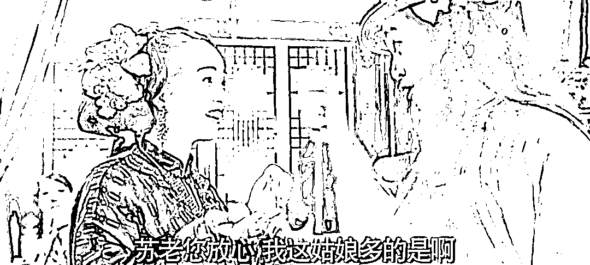

# 看不懂这一代年轻人不稀奇

> 原文：[`mp.weixin.qq.com/s?__biz=MzU0MjYwNDU2Mw==&mid=2247511857&idx=1&sn=e6a0d10f54b4f77372af6341b619de40&chksm=fb1ac34dcc6d4a5bedc384120af0266a126ba498f4a8f99f48f8e7ec042c2a497cb22600de13#rd`](http://mp.weixin.qq.com/s?__biz=MzU0MjYwNDU2Mw==&mid=2247511857&idx=1&sn=e6a0d10f54b4f77372af6341b619de40&chksm=fb1ac34dcc6d4a5bedc384120af0266a126ba498f4a8f99f48f8e7ec042c2a497cb22600de13#rd)

[昨天写了 TFBOYS 演唱会引爆西安，一个古老的城市配上最时髦的消费生态。](http://mp.weixin.qq.com/s?__biz=MzU3NDc5Nzc0NQ==&mid=2247525290&idx=1&sn=7fad6057559740f1c0a76ee8d5277832&chksm=fd2ec174ca59486206fe0fcd183a0668018f08e79ee6af65923cf468d3c2655a57d7030573b1&scene=21#wechat_redirect)

很多人看了之后仍然直呼看不懂。

消费从产品力走向产品内涵，也就是从实物走向实物的代入感，实物背后的故事，这一点他们看懂了。

但是他们发现怎么样的故事这件事，仍然看不懂。

这一代年轻人的消费步入代入感他们明白了，但是，具体哪种代入感，还是不懂。

就像 TFBOYS，自己觉得不好听呀，为什么能吸引十万人肯花钱，而且是大价钱？

研究新一代的消费市场，不能孤立的看现象，要多维度，多角度，对比式的去琢磨。

你比如一部最近热播的武侠剧，莲花楼。

这个剧情的设计非常有意思，金庸古龙如果活过来，看了这种新武侠，估计一口老血喷出来，又继续躺进棺材里了。

正如传统的武侠剧，莲花楼也有正反派的设定。

正派老大四顾门门主，剑神李相夷，反派老大金鸳盟盟主笛飞声，两个人在东海大战，惊天动地。

然后李相夷因为身中奇毒，输了半招，俩人一起拼到重伤落海，这就是开局。

接下来的剧情很容易猜，无非就是养好伤继续打过，或者反派想要一统江湖，正派想要阻止，又或者正派黑化了，反派其实才是明教云云。 

你让金庸，古龙来写，必然这个套路。 

权力，财富，名声，你总得要一样，侠之大者，不为自己的利益，那也一定是为了团体的利益。

就是武林最后一定是围绕着争什么，这个内核是不会变的。

但是你看莲花楼，很神奇，除了开篇有传统武侠的影子，后面全变了。 

李相夷死里逃生之后，化名李莲花，盖了一座楼，命名莲花楼。楼下是客厅厨房楼上是卧室，用两匹马拉着，这就叫房车，古代的房车。

然后周游全国，四处行医，做了一个游方医生。 

自己中了毒也不解毒，老和尚告诉他只剩十年寿命也无所谓。自己的女友在家等他十年也不回去相认，自己的门派四分五裂也不出面阻止。

每天就是快快乐乐的住在他的房车里，睡到自然醒，晒晒太阳浇浇花，喝着茶水自己烧菜吃，还烧的是创意菜......

一边驾着房车游走江湖之中做个行骗的郎中，一边寻找自己师兄的骸骨，只想十年后兄弟俩一起埋在师父坟头。

直到遇到了他师兄唯一的儿子，一个初出茅庐想要当刑侦探长的公子哥，就帮着他一起破案。

笛飞声倒是比较正常，养伤养了十年，出山来寻李相夷，倒不是为了杀他，也不是为了一统江湖，只是为了治好他的毒，与他再堂堂正正打一次。

这个人设设定还算正常，接下来就让人大跌眼镜。 

笛飞声，李莲花，师兄的儿子三个人，竟然携手游历江湖，四处破案，好的像穿一条裤子，快乐的不要不要的。 

你能想象么？这还是武侠？ 

就像某一天马云和马化腾再也不斗了，俩人携手帮助王思聪去泡妞....... 

就是这样一部无厘头的武侠剧，火了，你知道为什么火么？ 

作为上一代人，我是看不懂的。 

我理解的武侠，就像徐克电影里任我行跟令狐冲说的那句话，有人的地方就有江湖，你怎么退出江湖？ 

说到底，不存在华山亦或者牛背山，只要有人，就有利益纷争，有纷争，就是武侠。 

换言之，武侠就是斗，斗来斗去才是江湖。 

顶多代入一些反思，令狐冲喝酒吟诗，皇图霸业谈笑中，不胜人生一场醉，东方不败若有所思的看着他。

你注意，不胜，说明皇图霸业还是存在的，一场醉，说明人们只是想暂时忘记现实，而不是抹去。 

莲花楼另类就另类在他完全不按套路走。 

任何时候，年轻人要否定老人，新一代要否定上一代都很正常。 

你爹在村里盖了一栋楼，他希望你住进去就可以了，但是你不愿意，你非要把他盖的楼拆掉，重新盖一栋。

因为你要证明自己，所谓你来过，你存在过。

但是你注意，这叫否定么？不，这叫肯定。 

你否定的只是你爹，你肯定的，是盖楼这件事。

当你争天下第一的时候，你已经肯定了天下第一这件事，你只是不满于别人当，你要自己来。 

莲花楼这部剧中，让李相夷主动改名李莲花，让李相夷执意不解毒赴死，让李相夷否定此前的所有一切，让李相夷完全换一种活法，本质上是在否定什么？ 

是在全盘否定此前几十年当中，以金庸，古龙为代表的老一代武侠小说构建的价值观体系。 

如果只是到这里，如果只是李相夷一个人，那顶多算挑衅，但是有意思的地方在于，连李相夷的对手笛飞声也被他带动了，被他带着一起犯傻，偏离了轨道。

这个讽刺的意味就更浓，你看，不是李剑神一个人这么想，连反派武林第一也这么想。 

我当然知道这个编剧很荒诞，这与几十年如一日打怪升级的传统武侠比，是一种离经叛道。 

传统武侠的本质就是打怪升级，无非反派为了野心，正派为了正义，有时候正派反派还会切换切换，就这么点事情。 

把武侠世界变成跑男游戏，是上一代读者从未想过的。 

但是热播，就说明认可，新一代的年轻观众在认可这种全新的价值体系，至少有部分年轻人观众在认可。

我一直说，商人的重点是研究市场，尊重市场，而不是拧巴市场。 

你自己吃肉夹馍要不要放青椒是你的事儿，你的口味不重要，客人的口味才重要。 

客人哪怕要放西葫芦，你也得放。 

其实站在我本人的视角，我更接近电影里任我行的价值观，有人的地方就有江湖，怎么可能退出江湖，甚至说服反派大佬和自己联手退出江湖。

原因很正常，因为我们这一代人实际上是野蛮生长的产物。 

[就像那天有很多读者跟我说医生比码农稳定，而且越老越吃香。](http://mp.weixin.qq.com/s?__biz=MzU0MjYwNDU2Mw==&mid=2247511846&idx=1&sn=ccc38755f7471c37e5ea8fcfb1b79c7b&chksm=fb1ac35acc6d4a4c7e6960b1cbd5b5b23548bacd2f4acdb656047c03203920f5bad751e4a3ab&scene=21#wechat_redirect) 

这么想很正常，今天上岸学正处于巅峰，就像 2007 年，我老婆单位有个快退休的同事，他说他把他的股票仓位都想好了，1/4 留给儿子，1/4 留给女儿，1/4 留给老伴，最后 1/4 自己随便花。 

那一年，股市 6000 点。 

后来很多年我听过很多相似的逻辑。

有人把所有钱都拿去买女装街或者电子市场的商铺，所谓一铺旺三代；有人跑去四五线城市买了一整个单元，说那里的房价好便宜，未来留给子孙一定行。

很正常，电视剧县委大院里面一边胡歌在发愁，他们县城年轻人都没有了，连过路跑长途的都绕道，想罚个超速违章停车都罚不上来，另一头仍然有很多人热衷上他们小县城这个岸，等着胡歌给他发工资。 

我是待过甲方的，从来不裁人是真的，但是不等于你不会下岗。

办法有很多种，具体就不方便讲了。有些东西，你的人生阅历到那份上了，你就会懂，没到，别人也没法提前剧透。 

所以我是不相信铁饭碗的，我只相信利用价值。 

我也不相信什么许诺，说到底，是因为我自己玩阴的玩太多回了，明白么？

一个背信弃义过很多次的人，是没有办法相信承诺的。

可是野蛮生长出来的人，他一定是这样的，他唯一能够相信的只有平衡。

俗称你拿我没辙，我也拿你没辙，其实你也想捅我刀子，我也想捅你刀子，只是双方无可奈何，只能暂时达成平衡。

很显然，莲花楼是另一种认知体系里的产物。 

剧中李莲花的诉求真的很另类。

天下第一你不要，四顾门的权力你不要，满地金银财宝你不要，甚至连痴心等你的武林第一美女，你还是不要。

........ 

什么都不要，甚至连武功都失去了，你能安安全全地用两匹马拉着莲花楼悠哉游哉么？

只能像武状元苏乞儿里的老鸨那样说一声，如今的年轻客人真个性。

但是，只要客人有需求，我可以去开发牛背山退出江湖一日游，牛背山退出江湖风景旅游度假区。

天大地大不如客人大，客人的需求最大。年轻人你放心，我这儿产品多的是。 

上一代客人想要屠龙刀，你要打造屠龙刀，这一代客人要莲花楼了，那你就要打造莲花楼。 

否则你囤了一堆屠龙刀，只会占库存，只会让你的资金链崩掉。