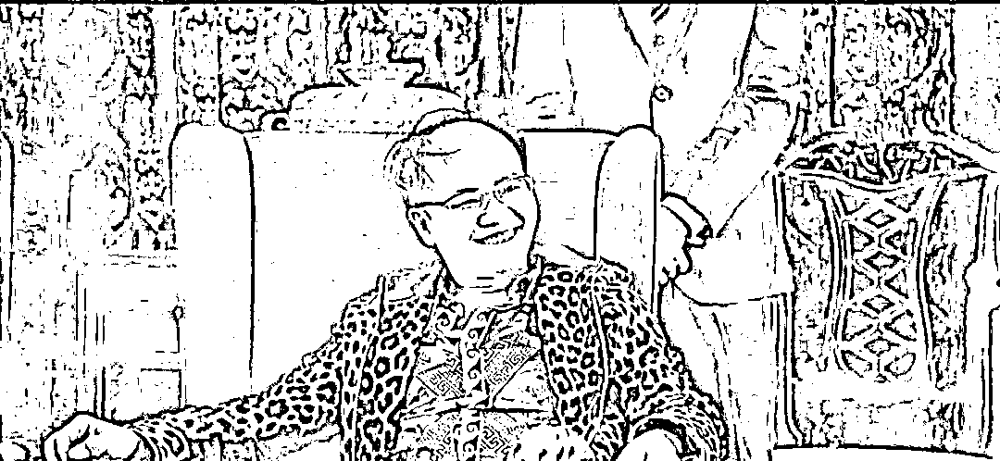
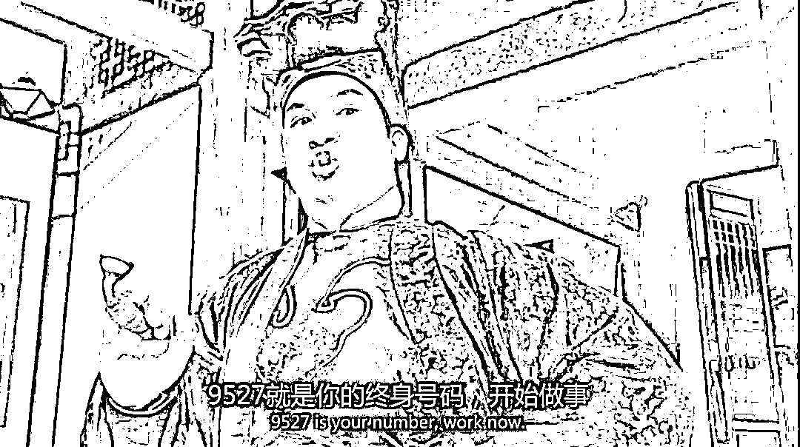
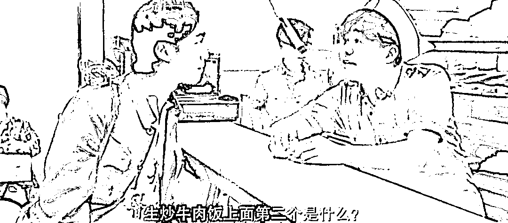
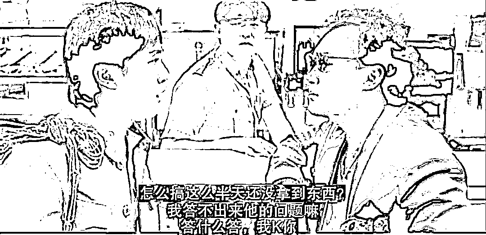
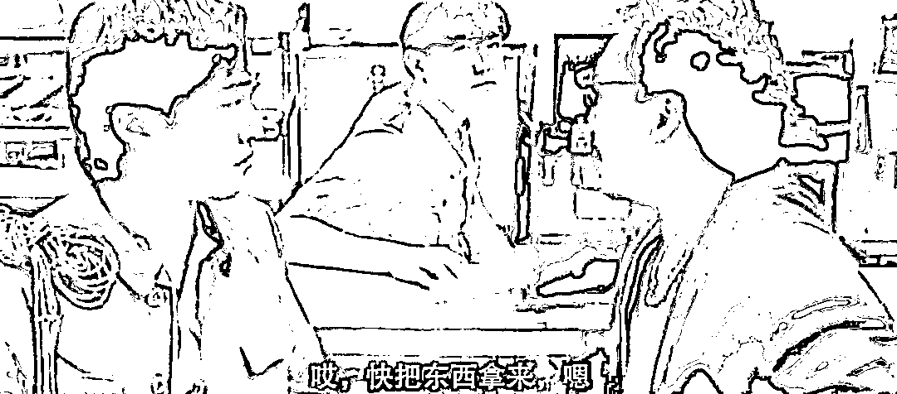

# 国泰航空的空姐，值得挖掘的地方很多

> 原文：[`mp.weixin.qq.com/s?__biz=MzU0MjYwNDU2Mw==&mid=2247511183&idx=1&sn=cf41ab0fab7fccd1f646d645e738b2cc&chksm=fb1ac0f3cc6d49e5fdc68f1c88df64364563eefe4cda5125b56c8e4b3efa073dbb5b98faa498#rd`](http://mp.weixin.qq.com/s?__biz=MzU0MjYwNDU2Mw==&mid=2247511183&idx=1&sn=cf41ab0fab7fccd1f646d645e738b2cc&chksm=fb1ac0f3cc6d49e5fdc68f1c88df64364563eefe4cda5125b56c8e4b3efa073dbb5b98faa498#rd)

事情发生的那天，就有很多人让我写这件事。

我一直在等热度过去，是因为热点本身，过于单薄了。

国泰航空有几个空姐，态度倨傲，背地里用粤语议论客人。事情经网络发酵后，航空公司出面道歉，把三个空姐开掉了。

航空公司的说法是空乘人员涉嫌歧视非英语客户，她们背后议论客人不会讲英文。

其实是在避重就轻，确切地说，这几个空姐是在歧视内地客户。

不相信我们换个方式，你去讲法语，你看她会不会歧视你？她听不懂她也会想办法打手势，试图和你沟通，而不是背地里议论你不会讲英文。

这个热点本身就两个维度。

一个维度就是把三个空姐扩大到地域黑，扩大到整个香港。

结论就是随着内地的客人越来越有钱，还保留有 30 年前收入差距念头的人，心里酸了吧唧，于是针对你。

另一个维度就是反思，反正搁啥事儿都先反思一把，是不是自己不够国际化，没能很好地入乡随俗。

但是我想聊第三个，聊一个你在别地儿看不到的观点。

首先我们说，三个空姐有酸了吧唧的想法，或者说地域歧视，是普遍的。

全世界的人，几乎都有一个习惯，叫做标签化，不仅仅是给别人贴，也是给自己贴。

比如我是 A 地人，你是 B 地人，A 城市的能级高于 B 城市，于是我在内心的鄙视链里面自动地把你排在我下面。

比如我是 A 校人，你是 B 校人，A 学校的排名高于 B 学校，于是我在内心的鄙视链里面自动地把你排在我下面。

比如我是 A 公司人，你是 B 公司人，A 公司的平台大于 B 公司，于是我在内心的鄙视链里面自动地把你排在我下面。

........

这是非常正常的，尤其是中产阶级。

因为本质上讲，你不掌握生产资料，或者说，你本人实际上是生产资料的一部分。 

于是你就会产生一个想法，其实也是你的老板不断植入你内心深处的一个想法，那就是他给你贴标签，你也很配合地主动给自己贴标签。

俗称我是 A 的。 

等你某一天脱离了中产，当你变成资产的时候，你的思维方式会发生一次根本性的变化。 

**你会从我是 A 的，转换成 A 是我的。**

这仨空姐，本质上讲，是因为她们处于中产的最底层。她们有且仅有一份工作，而且是基层工作。

站在她仨的角度，唯一值得炫耀的，就是我是哪儿人。 

她觉得她是香港人，她所在的城市的人均收入，比这个乘客所在的城市的人均收入要高，这是她唯一的骄傲。 

其实本质上就是我前面说的，标签鄙视链，给自己贴，给别人贴。 

我年轻的时候，因为业务往来，接触过很多香港人，整体上非常好，有礼貌，有教养，热情。 

关键词我给你划出来了，热情。 

但是你注意，我接触的香港人，大都是五百强高管，大公司 VP 这种，彼此有业务往来的。 

他们看似热情，实则有着同样的习惯。 

他只是不会去强调自己是香港人罢了，因为这个标签太弱了，想变成香港人太容易，自己手底下任何一个小弟随随便便就能做到，于是没有人会去强调。 

但是他依然会强调自己的其他标签，比如，他是大公司 VP。 

因为在他看来，VP 是他最大的依仗。 

你想清楚标签这回事儿，你会发现很多事很有意思的。 

比如什么叫精英？ 

穿西装，打领带，皮鞋擦得锃亮，会讲英文，深谙宴席上每一个礼节，这个就叫精英对吧？ 

**精英实际上是资方埋在中产脑子里的一个概念。** 

我问你个问题，喝红酒的时候，那个杯子应该怎么拿？ 

所有专业教你礼仪的人，都会告诉你，贵族喝红酒，是用食指和中指夹住杯角的，你不能去碰那个杯身，否则手的温度会影响酒的口感。

那你去看看已故的英国女王是怎么喝红酒的。 

当着媒体的面，她至少几十次被拍到直接用手抓杯身，就这么握在手心里，老娘喝红酒，想咋喝咋喝。 

她哪怕像小孩子一样倒在瓶盖里喝，谁敢说个不？ 

你说英国女王没有贵族风范？ 

人家告诉你说，老娘不介意重新定义贵族。 

你以为你照着规矩喝红酒就是贵族？老娘说你不是，你就不是了。 

所以你看到很多大佬，人家是穿着汗衫，踩着布鞋的。走路的样子两只手摆幅很大，一摇一晃，好像刚学会走路。

就像星爷电影《美人鱼》里面的郑总。

这才是大佬。 

其实今天很多大佬都是受过高等教育的，都是学霸出身。

人家不是不会讲英语，他是想告诉你，我已经混到不需要会讲英语了。 

人家不是不会写字，他是想告诉你，我已经混到只要会写自己的名字就足够了。

甚至更大的大佬穿着布鞋走路走得像帕金森病人，他只是想告诉你，我已经混到不需要会走路了。 

所以英国女王，她是故意那么拿杯子的。 

这就叫 A 是我的。 

我不需要优秀，对一个马场主来说，不需要优秀，我有很多优秀的赛马，这就足够了。 

我给你揭示这件事的本质，就是想告诉你，标签这东西，很无聊。

**只有你把自己当一匹马，你才会因为拥有一副新的马笼头，而沾沾自喜。**

那仨空姐拥有的马笼头，就是马笼头里面等级最低的一副。

你想想看，如果一个人，职业前途美好，会去做服务员么？

同样是伺候人，为啥我不去 500 强做个 VP 呢？至少我伺候的客户的层面上升了呀。

我每天三班倒，端茶递水伺候那么多人，才挣那么一点点钱，那我为啥不去伺候的人更少一点，赚得更多一点呢？

这是我们的第一部分，我借这三个空姐给你揭示了这件事的本质。

我知道有人会讲，他现在的问题不在于不理解人性，而在于怎么样才能得到更好的服务？

这就是我们的第二部分。

我跟你说，你指望反思反思再反思，是没用的。

**你不可能通过反思的方式来得到更好的服务。**

**这是你从小接受的教育和那些资本为主体的地区接受的教育的差别，引起的。** 

你从小接受的那个教育把人际关系定义为同志。

你去看《我爱我家》，小保姆被老傅定义为家庭服务员，我做局长你做保姆仅仅是分工不同，工作不分高下。

所以你在内地雇保姆，和你去雇菲佣，你对比下，会发现双方有着很大的不同。

内地雇保姆，实际上她的自我定义像《我爱我家》里那样，她实际上是家庭服务员。

但是你去雇菲佣，你会发现她们很神奇，她们似乎永远不会出现在你面前，但是人家又能够把所有的工作都做完。

说明在菲佣心里，主仆有别。 

**这是两种从小完全不同的教育导致的自我认知。**

金庸请聂卫平吃饭，聂卫平连吃了十三只大闸蟹，半斤一个的大螃蟹。螃蟹是寒凉之物，金庸家的保姆看到这人这样，忍不住露出鄙视的眼神。 

她觉得这人没见识，这么多大闸蟹吃下去不生病才怪，她觉得聂卫平没吃过螃蟹才会如此，所以流露出看不起他的眼神。

正好这个眼神被金庸看到了，等客人走后，就把她开了。 

这件事媒体的解释是金庸觉得保姆不尊重人，尤其是没有学会尊重客人。这是咱们内地人的看法。 

其实本质原因不是这个，本质原因是金庸要驭下。 

**驭下之道，说穿了，不过 PUA 而已。**

做主人的，要让下人明白，主就是主，仆就是仆，主人的客人就是主，主人怎么做都是对的，女王想怎么拿红酒杯就怎么拿红酒杯，大佬想怎么走路就怎么走路，如果你质疑，你就会卷铺盖走人。 

他就是要反复给你洗脑，让你觉得你只有两根手指捏着红酒杯角，才是懂规矩的，才是骄傲的，而我，我哪怕用脚趾头夹着红酒杯，也是高贵的。 

就是反复洗，洗到哪怕我不强调，你也会像菲佣一样主动这么想。 

你认了，就给你加薪升职，9527 就可以进内院了，说不定某天还可以升为高级护院，资深护院。

如果你不认可，那对不起，你就像金庸的保姆一样，被毕业了。

资本的模式，就这回事。

所以你用你从小接受的教育去试图定义关系，你会发现碰壁的。

因为人家小时候跟你小时候，学的内容不一样。

你指望用入乡随俗的方式是解决不了问题的。

你想想看，《龙的传人》里面，星爷点餐，服务员是怎么刁难他的？

星爷师叔怎么解决的？

看懂了？很简单的，在资本市场里，你又不是去见国营商店的服务员。你和她之间又不是同志关系。

她和你之间，就是一种纯粹的交易关系。

如果你觉得人家提供的服务不到位，不给小费就是了。

如果你进一步觉得她很讨厌，搞到对方失业就是了。

如果像这件事一样，很多顾客都有意见，那网络发酵起来，搞到这家公司一批人失业就是了。

就这么简单，就这么纯粹。

[我那天刚说过，在就业这么难的当下，我们为了在竞争中脱颖而出，都要把话题上升到时空作弊的高度了。](http://mp.weixin.qq.com/s?__biz=MzkwMzQ1MzczOQ==&mid=2247483875&idx=1&sn=74db4d4bb7f902924fc38f84cf40ea57&chksm=c0974ca7f7e0c5b1a9e80687d4c5bd71d48e57e6f754f6e8a408501d29fe4581f7f3dba9006d&scene=21#wechat_redirect)

居然还有人这么傻，你应该感谢。

职场上正是因为有人要送人头，你才更容易升级。