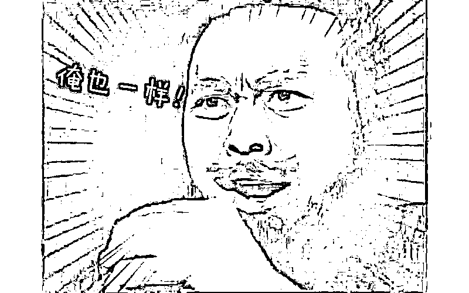

# 漫长的季节完全不同于隐秘的角落

> 原文：[`mp.weixin.qq.com/s?__biz=MzU0MjYwNDU2Mw==&mid=2247510695&idx=1&sn=15bc7556897ecbbf2387eef8d85e30dd&chksm=fb1ac6dbcc6d4fcd8abfee21e89069567c9984fb72a4cfa2759690cddfb212f1e1af2dda4138#rd`](http://mp.weixin.qq.com/s?__biz=MzU0MjYwNDU2Mw==&mid=2247510695&idx=1&sn=15bc7556897ecbbf2387eef8d85e30dd&chksm=fb1ac6dbcc6d4fcd8abfee21e89069567c9984fb72a4cfa2759690cddfb212f1e1af2dda4138#rd)

有读者让我点评漫长的季节，它的口碑很好，打分超越了前作隐秘的角落。

隐秘的角落我们都知道，爬山的故事。

原班人马，昔日爬山的秦昊这次来演龚彪，两个主角之一，另一个是范伟演的王响。

俩人以前都是一个厂子的，东北的国营厂，桦钢，王响是开火车的，火车头司机，在那个年代很有地位。 

大概类似你出去说你是阿里 P8。

龚彪是厂办刚分进来的大学生，在人群中的比例大约等同于今天清华读了个本科，耶鲁念了个硕士，然后去鹅厂做管培生。

故事就发生在这俩人之间，阿里的 P8 和鹅厂的管培生。 

王响是中年人，老婆罗美素，是个病秧子，那时候厂里效益已经不好了，她几万块做心脏支架的钱，还没给报。

还有个儿子，叫王阳。王响想着儿子能进厂，不说做 P8，做 P5 也可以呀，因为他的世界里，进厂才是唯一成功的标准。 

但是王阳上不了大学也进不了厂，所以父子关系很僵。

罗美素有个表妹，黄丽茹，是厂医院的护士，人长得漂亮也风流，龚彪很喜欢她。

因此龚彪这个管培生才会主动接近王响，就是想要和他做连襟。

那么黄丽茹的态度是怎样的？

在她眼里，龚彪只是个舔狗备胎。

龚彪约她第一次看电影，她就说得很清楚，问对方分房了没有，没有就没有下文了。 

黄丽茹喜欢成功人士，和已婚的厂长有一腿。她又怀了孕，于是就想让龚彪接盘，毕竟在 20 年前那个年代，她名声臭了在这么小的圈子里没法混。

结果没想到和龚彪订婚后，厂长的老婆杀来了，大闹一场，她流产了，并且终身不孕。即便这样，龚彪还是义无反顾地接了盘，还为了她和厂长大打出手。

20 年后，很显然厂子早就不在了，无论王响或者龚彪都是出租司机。

故事就从 20 年前厂里的一宗碎尸案开始，就像隐秘的角落，这是一部悬疑剧，我就不剧透了。

这部片子火不了和年代感有关，和价值观也有关。

隐秘的角落更容易被今天的人所理解，因为所有的线索都围绕一个利字。

朱朝阳，会不会就是未来的张东升，我们不晓得，但是那种围绕自身利益诉求展开的一系列行动，是今天的人更容易理解并认可的。

漫长的季节则不然，它围绕着情。

我们不说与案件有关的那些感情线，即便是龚彪和黄丽茹之间也是有感情的。

黄丽茹没有爱过龚彪，但是她对龚彪有感激之情。龚彪接盘娶了不能生育的黄丽茹后，自己开出租，黄丽茹开美容店，同时出轨有钱有势的郝哥，做了对方的姘头。

有人可能会说她爱钱，但实际上，她爱的不是钱，她爱的是有钱有势的男人。

你注意落脚点，是男人。

钱只是修饰语，你爱制服是说你爱这身衣服，你爱穿制服的男人，是说你喜欢这种打扮风格的人。

最后的落脚点是完全不同的。

今天还喜欢男人这种品种的女人，其实远比那个年代少。

因为你很快就会发现商品社会的选择很丰富，只要你有钱。

所以男人不值得爱，钱值得。

今天的舔狗和龚彪也有着极大不同。

龚彪实际上是为情而舔，他舔的义无反顾，他知道黄丽茹不爱他，他也知道黄丽茹无论婚前婚后都和不同的男人鬼混。

但他还是喜欢黄丽茹，对方提出离婚后，他作为无过错方，反而主动选择净身出户，把财产都留给黄丽茹。 

所以我说他是为情而舔。 

今天的舔狗实际上是格雷厄姆的信徒，他们本质上遵循的是捡烟蒂理论，白嫖。

俗称只要我舔得足够多，总有让我白吸一口的烟屁股。 

明白这里面的区别么？ 

今天的舔狗和龚彪的区别大了去，龚彪是说我这辈子就认准一个烟屁股，他是以负责任的态度去舔。

今天的舔狗实际上是说，甭管哪个烟屁股，只要不花钱，我都愿意嘬一口。

这是变化的一面，我让你看两部剧差异很大的一面。漫长的季节和隐秘的角落完全不同的一面。 

正因为这种价值观的巨大落差，漫长的季节很难火。 

因为你没有代入感，你很难理解当事人的逻辑。你会觉得这些人都活得不真实，其实他们特真实，在那个年代特真实。

有不同的地方就有相似的地方，我拿阿里 P8 和管培生的故事来打比方，就是暗示你，相似的地方很多。 

你比如王响的价值观是一种标签式的。 

我是厂里的工人，我骄傲，我在工人这个群体里还是开火车头的，我更骄傲。 

你对应过来，别人告诉你说，我是阿里的 P8，其实是同一个意思。 

**标签的内涵在变，可是标签化思考的方式本身没有变。** 

王响认为自己的优点包括但不仅限于热心，厂里的事儿都喜欢掺和，今天阿里 P8 同样会有此类标签。 

比如认为自己善于加班。 

王响对于子女教育非常焦虑，他总是在想，我这么牛，我都已经是个工人了，还是个很有地位的号称厂里积极分子的开火车头的工人，可是我的儿子居然进不了厂，焦虑啊焦虑。 

今天的人一样的，海淀妈妈也会焦虑为什么人家的孩子幼儿园都可以背 3000 个单词了，我的孩子连 ABCD 都认不全。 

你说像我这样这么成功的阿里 P8，如果我的孩子将来进不了阿里，可咋办呢？ 

是不是有种王响穿越的感觉？ 

我这么牛了，我都是桦钢的工人了，我孩子进不了桦钢，可咋办。 

过去的人，今天的人，中年以后的经历也是相似的。 

王响第一次从龚彪嘴里得知自己在下岗名单上的时候，他的表情也是难以置信。

我？我下岗？我是王响啊，我是厂里的积极分子啊，我怎么可能下岗呢？ 

你对应过来，同样的场景只是换了台词。 

一个人到中年的 P8，他也会惊讶，我？我被输出到社会上当人才？我是谁？我可是 P8 啊。我昨晚刚加过班啊，我可是重要项目负责人啊。

然后 P9 的上司飘过，拍拍他肩膀说，别难过，作为产品负责人，我和你一样。

俩人正准备抱头痛哭，整条产品线的负责人 P10 飘过，留下四个字： 

其实相似的不仅仅是遭遇，连备选的后路都一样。

P8 的王响和管培生的龚彪下岗之后去开出租，今天被输出到社会上的人才去开滴滴。

商业形态变了，内核没有变。 

我讲这一切不是我有什么高见，我马后炮事后诸葛亮想要告诉王响或者龚彪什么新奇的想法。

不是，我没有任何高见。

我曾经说过一句话，我说普通人想要这辈子不普通，唯一的办法就是不做普通人。

这话听起来像绕口令，实则是一句废话。 

言外之意就是说，普通人就是得过普通的生活。啥时候都一样。

我想，王响这辈子最后悔的事情恐怕就是他对儿子王阳吹胡子瞪眼，横竖瞧不上。

这是一部凶杀悬疑剧，王响后半生所有时间都在查儿子的死因。 

那无数个日日夜夜里，不知道他是否懊悔过此前的父子关系。 

其实作为普通人，真没什么值得用破坏亲情的方式强迫孩子非得学自己的地方。 

人家谢逊骂张无忌，因为他自己是四大法王，因为他让无忌背的是武功秘籍。 

谢逊好歹是江湖成名人物，好歹证明过自己，大多数普通人，所知道的不过是人家让你知道的，所理解的不过是人家让你理解的。 

就这水平，一定要逼迫孩子背自己的所谓经验么？ 

难道照着一个错误的样本临摹，足够努力就能临摹出正确的？ 

或许，这才是悬疑下面埋藏的悬疑，隐线下面埋藏的隐线。