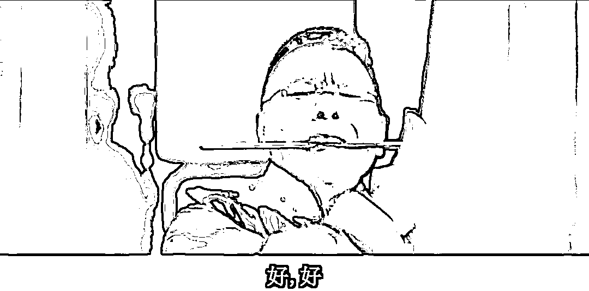

# 美联储这次 25 个点的加息，是不是我去年讲的转折点？

> 原文：[`mp.weixin.qq.com/s?__biz=MzU0MjYwNDU2Mw==&mid=2247510213&idx=1&sn=981164c76a9df2e560645bf6601c2002&chksm=fb1ac4b9cc6d4daff2e565b0ad39a2e1573567d05b0a53424fe2d45e423071964928dea39d70#rd`](http://mp.weixin.qq.com/s?__biz=MzU0MjYwNDU2Mw==&mid=2247510213&idx=1&sn=981164c76a9df2e560645bf6601c2002&chksm=fb1ac4b9cc6d4daff2e565b0ad39a2e1573567d05b0a53424fe2d45e423071964928dea39d70#rd)

我本来不想写这篇，因为问的人很多很多。 

可能是我自己挖的坑，我要负责填起来。 

去年我说过下面这些话，从 15 个月之前就开始说，说了一年多。

1、美联储加息很难解决通胀。

虽然美联储成天说，要把通胀降到 2 以下，不然誓不罢休。但是实际上通胀问题很复杂，我去年给读者分析过前后数万字。

我们十几个月看下来，的确如此。通胀有所下降，但远未到美联储的目标位。 

2、美联储加息周期下，我们的宽松货币是有空间约束的。

这句话很好理解，就是说，咱们是有底线的。上个月有读者问我房贷能不能再降些，我说，别想了。 

就这意思。

下面的空间很小很小，因为汇率的约束。他在加息，你能减的空间就那么多。 

减就是银行让利。 

银行不让你提前还款，其实已经说明，能让的利真没多少。

就像你去买东西讨价还价，商家跟你讲，真不能再便宜了。 

3、我说过，只有美联储进入降息周期，我们才有可能那啥。 

那啥你明白，俗称懂的都懂。

但是这里面有个问题，美联储他没那么容易快速降息，这句话我去年就讲过。

我去年说，美联储就算想降息，也得等美国经济真的衰退了，通胀自解，然后他才能顺坡下驴。 

事实上你看到，通胀没有解。 

今天也没有呀。 

我去年花了数万字分析美国通胀，告诉读者一个事实，美国的通胀是供应链紊乱引起的。 

有人理解说供应链紊乱是疫情，现在疫情的影响降低了很多，为什么还是供应链紊乱呢？ 

因为美国正在逆全球化。 

美国逆全球化不是疫情引起的，疫情前就开始了。懂王时代就开始了。 

**如果没有逆全球化的过程，美国是很难遇到通胀的。** 

因为在全球化进程中，美国消费的商品与服务，大都是我们提供的。

现在不是，你去看下美国的进口，看下我们的出口。会发现美国把很多昔日来自我们的进口切换到了别的国家。 

他们在用多个供应商来替换昔日我们这个最大的供应商，这个过程叫做逆全球化。 

这就带来了美国的供应链紊乱。 

换句话说，美国的富人，没有办法再享受来自我们的优质的产品，和高性价比的服务。 

于是通胀了，他们自找的。 

这种通胀并不是你从自媒体上看到的那种美国各大超市里面的东西涨价了，大家都很不满意这一个维度。 

你注意，这部分描述是事实，但只是一个维度。

美国的商品涨价了，可是服务也涨价了。服务是谁提供的？是美国的穷人，或者说美国的普通人提供的。 

也就是说，美国的商品涨价了，美国的服务也涨价了，普通人加薪了。 

我们习惯了加薪，几十年来年年加薪，觉得加薪很正常。发达国家加薪是个新鲜事儿，几十年不加薪有的是。因为他们的服务很多都是从第三世界国家采购的。 

你站在美国普通人的视角下，商品贵了，但是他提供的服务也贵了，他加薪了。与此同时，美联储加息，导致美国富人加杠杆不容易了，挣快钱不容易了。 

他内心世界是怎样的？

其实是五味杂陈的，有不满，对商品涨价的不满；也有满意，对自己加薪的满意，对富人挣钱不像以前那么容易的满意。

我们要注意一件事，美国是一个多种势力交错的复杂国家，你从昔日懂王和睡王背后各自的 7000 万人就能看出来。 

如果站在美国富人的视角，也就是我去年告诉你我最希望发生的视角。 

美联储最好的方式就是迅速加，赶紧加息加到两位数，然后让美国陷入衰退，接着再降息，放水。

这种巨大的波动，有利于让美国的普通人，失去工作，失去积蓄，失去房屋，就像 1929。

这样投资人就可以有更高的套利空间。并且我讲过，只有他们进入降息周期，我们才能够进一步宽松，才能挣那些更容易挣的钱。

但问题是，这事儿我说了又不算。 

我几个月前跟读者分享过国际市场上的主流观点，美国这次衰退，大概率是中等规模，也就是类似 00 年的互联网泡沫破灭。 

你看到了，00 年那次和 1929 完全不一样。

00 年那次的特点很明显，就是美国的共识经济部分发生衰退，美国的农耕经济，工业经济波动不大。 

这三种经济我一个多月来写过多篇文章，老读者都懂，这里就不重复了。

如果是类似 00 年那种针对共识经济的衰退，你自己想想看，美国的因为供应链体系紊乱引起的通胀，有可能快速自解么？ 

共识经济衰退受到打击的是华尔街，是硅谷，是大厂的高收入群体。美国的通胀是因为他们逆全球化，强行切换供应商。 

这两者没联系呀。前面说了，通胀是因为美国强行切换供应商，导致服务成本上升，导致美国普通人加薪带来的。

你要解决美国通胀，只有让美国的普通人都失业，像 1929 年那样。光靠那几个被裁的硅谷高收入者，有毛用？ 

而美国的通胀不解决，他们会快速步入降息通道么？会么？ 

所以标题的答案已经出来了，你指望的这次加息只有 25 个点，不是 50 个点，就预示着美联储马上要降息。 

那你恐怕要失望了。 

我清楚来问这个问题的读者想什么，其实你就是想等着他们降息，然后我们宽松，然后你好赚钱。

这个我懂，大家都是懂行的，知道钱不是挣来的，钱是赚来的。

我讲过自己年轻的时候，我从来没有想过要做什么产品，卖出去，收回尾款，然后这么一个子儿一个子儿的挣。 

从来没想过。

我第一次创业的时候也没想过要做什么产品，从没。 

我第一次创业的时候想法很大众化，因为当时的创业者也都是这么想的。 

我们就是烧钱，赶紧扩张，占据更大的地盘，如果最后能上市，比如去美国敲钟，皆大欢喜，投资人也有回报，创业者也有回报。

如果不行，那就干脆赚投资人的钱，俗称赚富老头的钱。

真的指望公司盈利，一单一单卖产品，卖到猴年去。 

但是这需要一个十分宽松的环境，不只是国内风投很热，包括国际上都得很热。 

得有很多热钱，才可能允许你拿张没写完的 PPT 融资，只有美国市场风险情绪很高，才会让你一个根本没盈利的公司去敲钟。 

**这一切都需要美联储的低利息作为支撑。** 

换句话说，个人命运要和全世界的周期结合起来，不仅仅是国内这部电梯上行，你就可以赚到钱。 

我这里其实也顺便回答了另一部分读者的提问，他们不是站在国内投资的视角，**他们是站在国内求职的视角。**

我去年聊美国可能步入衰退，他们很兴奋，以为美国步入衰退，自己就会有高薪工作了，就能洗盘子也月入 15000 了。 

我解释了好几次，不是这样的，没人听，于是只能作罢。 

今年就业不太好，很多人又来问我，美国啥时候衰退，是不是衰退了，他就能发财。 

其实是反过来的。

美国衰退，你更难找那种容易赚钱的差事。 

因为美联储即便不再加息，也不降息，就维持当下的利率水平，市场里的热钱也会很少很少。

热钱不是把钱加热的意思，热钱是说钱的杠杆大，**只有利息低了，杠杆才能大。** 

美联储现在的利息水平，很多资方是不会做天使投资人，投你的 PPT 的，他们宁愿躺着吃利息，更别说借钱投你。 

**市场上热钱没有，那些科技企业就没有兴趣烧钱在那些当下不产生收益的预研类项目上。** 

于是就是你看到的，大厂纷纷向社会输出人才。大厂的校招从 C9 直接变成了 TOP2。 

换句话说，如果画一张拓扑。

**美联储的利息决定了杠杆，杠杆决定了热钱，热钱决定了大量像我年轻时那种画张 PPT 就去忽悠富老头的创业者的数量。** 

而我年轻时那种创业者喷涌而出，才会跑到学校里撒钱招兵买马。

你想想当年我们为什么动辄三倍薪，五倍薪的挖人？**因为反正花的不是自己的钱。** 

**你指望国内的热钱是很难的**，这个话题我聊过。

[我用司马迁在《史记》里写的陶朱公救子的故事跟你描述过国内富老头的心态。](http://mp.weixin.qq.com/s?__biz=MzU3NDc5Nzc0NQ==&mid=2247523222&idx=2&sn=6006fee6d2b5e82526e921aceb760fca&chksm=fd2e3948ca59b05e4a247625dff4c071007ca4c171297fdd12d2927ff2bff23c8d43857c6e0d&scene=21#wechat_redirect)

他们是富一代，小时候穷过，烧起钱来不大气。宁愿买房子买地，都不乐意烧钱。

**你要忽悠这堆国内的富老头，除非美国那边热钱很多，他觉得前脚被你忽悠了，后脚就可以去硅谷忽悠下家，那他是乐意当个掮客的。** 

换句话说国内的这帮富老头太抠了，一个菜不点还想饶一个。

现在美联储利息这么高，美国人傻钱多的环境不存在，这帮国内的富老头，是很难忽悠动的。

他们连自家公司那些不挣钱的产品线都咔嚓掉，连跟了自己多年的高管都要输送到社会上去当人才，咋可能还跟你身上花钱。 

所以你发现你就业不容易。 

这个事情最终只有两个解决方案。 

一种就是我最希望的，我希望美联储赶紧给我猛加息，把美国直接拉到 1929，然后美联储大放水，全球投资人狂欢。

咱们的投资人和求职者也会沾沾光。就像我年轻时那会儿。

另一种，假如美国这帮红脖子不肯就范，美联储把利息维持在高位，拖拖拉拉的话。

你就得有点耐心了。你不可能像你叔我当年那样摸着鱼唱着歌就把火锅给吃了。

说白了就是，如果美国在逆全球化的道路上死不悔改，那咱只有踏踏实实的产业升级，并且进一步构建完善我们的消费市场。 

这个过程里，你就是要放低预期，你就是要主动脱去自己的长衫。 

因为这个过程叫挣钱。挣钱和赚钱是不一样的，挣钱是很辛苦的。 

赚钱是钱追着你跑，挣钱是你真的要一单一单去做，真的要问客户要尾款，真的要做到盈利。

这种事儿，急不来，你要沉下心。入关不是短视频里的三分钟，是一代人。