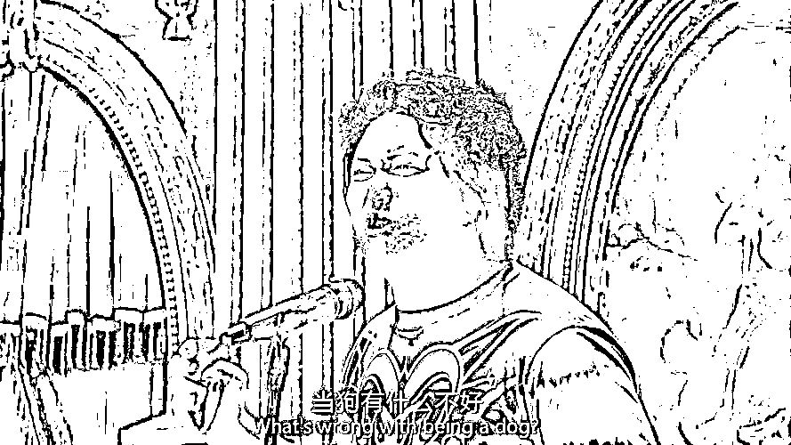

# 怎么看西虹市里的“当狗有什么不好？”

> 原文：[`mp.weixin.qq.com/s?__biz=MzU0MjYwNDU2Mw==&mid=2247510150&idx=1&sn=34561cb2fe9c8b31b10aa5449306109a&chksm=fb1ac4facc6d4dec40d8b01cccd2ef322b0599148cc280b75d67e8d298d48af2efe80e822599#rd`](http://mp.weixin.qq.com/s?__biz=MzU0MjYwNDU2Mw==&mid=2247510150&idx=1&sn=34561cb2fe9c8b31b10aa5449306109a&chksm=fb1ac4facc6d4dec40d8b01cccd2ef322b0599148cc280b75d67e8d298d48af2efe80e822599#rd)

[那天好些人问我，什么是妖精里的七十二般变化。](http://mp.weixin.qq.com/s?__biz=MzU3NDc5Nzc0NQ==&mid=2247523202&idx=1&sn=d0ef6e3df95afd2f2ee89301de833ca5&chksm=fd2e395cca59b04a0b639ed9ea15f0f0e03c59d5ccd0c328c500b69d2dd75f8488f7a7458bba&scene=21#wechat_redirect) 

说明这个话题，我先给你看下面这张图：

这是西虹市首富里的一个配角的台词，主角沈腾接了一个月内花光十亿的活儿，他是沈腾的哥们。

看过电影的，或者听我描述过这个片段的，你有什么感想？ 

觉得一人得道，鸡犬升天？ 

亦或者觉得这就是富豪身边的走狗？ 

还是觉得他恬不知耻，有奶便是娘？

其实我当时第一次看电影的时候，听到这句台词，我以为的剧本走向是这个人后来会害沈腾，或者出卖沈腾。 

这种剧情走向很常见的，当狗总是有目的。 

所以，听到这里，你对我的预判是，我曾经以为他是个反派？后来导演不按常理发牌，他和沈腾之间的友谊小船从来也没翻过？

这是你的理解？ 

所以我说我们不在一个频道上，你用过汽车上那个调频收音机吧，人家电台的频道和你的接收不同频，我们电台放的是音乐，你听的是沙沙声。 

听不懂的就算了，能听懂的继续。 

《三国演义》里面有个桥段，青梅煮酒论英雄。 

曹操说：天下英雄，唯使君与操耳。刘备大惊，观众都很担心，担心曹操害刘备，担心刘备玩穿帮。

其实这不是重点，重点是曹操的那番话。什么是英雄。

曹操说，英雄就是龙，龙能大能小，能升能隐；大则兴云吐雾，小则隐介藏形；升则飞腾于宇宙之间，隐则潜伏于波涛之内。

这番话是重点，至少我认为是重点，我很小的时候读三国演义，吸引我的就是这段话，并不是那句著名的唯使君与操耳。

后来老版三国上映，我还是个初中生，吸引我注意力的还是这番龙的定义。

龙能大能小，大能有多大？鲲之大，不知其几千里也，想必龙之大，遮天蔽日。 

龙有天那么大，所以龙傲天。

小能有多小？大概蟑螂那么小。

所以蟑螂就是龙，龙就是蟑螂。 

龙能升能隐，升起来天地为之变色，世人仰起鼻息，惶惶不可终日。

隐起来，大概就像一条狗，对着你谄媚地摇尾巴。 

所以到底该怎么理解龙呢？ 

很简单，人生如戏，全看演技。所谓龙，就是演员当中的影帝。 

换句话说，龙之所以有七十二般变化，是因为它学过《演员的自我修养》。 

有人听了不禁哑然，演员？那不就是戏子么？戏子也配称龙？

这话从哪儿说起呢？从一次对话说起。

我从小和爷爷奶奶长大的，6 岁读小学才回到父母身边，此后所有的周末和寒暑假仍然回到爷爷奶奶家。 

小时候我看我爷爷看电视，总喜欢看戏，不一定是传统戏剧，也包括现代戏剧，文艺晚会之类。

我不喜欢这东西，我打小就只喜欢相声小品。

我问过我爷爷，这东西有什么好看的？ 

他反问我，那时候我已经念小学高年级了，读过很多名著。他说，你看过红楼梦，里面所有人都很喜欢看戏，贾母也很喜欢看戏；你读过很多史书，慈禧太后也很喜欢看戏；你读过外国文学，欧洲王室也在看戏。 

教育最好的方式不是给答案，而是反问。 

你不要来问我，我来问你。 

我听得懂他的反问。 

我经常说，听中国人讲话不容易，你不要光听人家说了什么，你要听人家没说什么。 

否则你听了个寂寞。

我爷爷显然不是在跟我打岔，他是在反问我。 

如果我认为一个人看戏很无聊，难道我就没有思考过，为什么历史上这么多人都看戏？难道他们都无聊么？

明白这意思么？ 

当你看到一个人排队抢购的时候，也许他蠢，当你看到所有人都排队抢购的时候，也许大家是暂时被蒙蔽了，犯了一个集体羊群效应的蠢。

如果你看到所有人长时间的，跨越了时间与空间的抢购，那你就该深思了。

这是他没有说出口的话，他其实在反问我。 

我听得懂，我打小受过很久的学会听人话的训练，自然知道他的意思，但是我想不明白呀。

于是就呆呆地看着他。

不说话也是一种交流，我的表情也是交流，我这个意思就是说，你的反问我明白 ，可是我想不明白。

于是他进一步问我，你读过道德经吧？开头怎么说来着？

道德经，并不是很多人理解的算命瞎子手里的武林秘籍，不是的，那就是一本启蒙读物，牵涉自然科学原理，人文科学原理，我认为每个小孩都值得看看。 

虽然不考。 

道德经开头怎么说？

道可道，非常道；名可名，非常名。

名可名，东西可以命名；非常名，但名字只是个代号，并不是那个东西。

我爷爷想表达的无非是说，戏子有狭义的，有广义的。

你以为舞台上的，为了挣俩赏钱的是戏子，太狭义了，其实舞台下看戏的贾母，慈禧太后，都是戏子。

只是前者在显性的舞台上，后者在隐性的舞台上。

大家其实都在演戏，大家其实都在舞台上，你不要以为摘下面具之后就是真面目，不是的，摘下面具还是面具，摘下面具还是面具，面具嵌套面具，没有真面目的。

就像盗梦空间，梦里有梦，梦里有梦，其实没有现实。因为人生如梦，现实还是一个梦。

这就是方生方死，无醒无梦。

我那天倒是额外想通了一件事，此前我小学低年级期间，总是和同学议论嘲笑美国人为啥选了个演员里根当总统。

那天我忽然间觉得，演员也没啥不好，因为广义上讲，大家都是演员。

如果都是演员的话，你想过一个问题没有？

到底什么是二郎神，什么又是通天犬呢？ 

二郎神是个角色，通天犬也是个角色，也许这场戏你演的是二郎神，下场戏你演的就是通天犬。

你还觉得这里面是当狗的问题么？ 

如果第一场戏，你演二郎神的时候，觉得那个演通天犬的同事是低人格的，说明什么？

说明你没有理解，你只是在演二郎神，你并不是二郎神。

想不通你就再去回忆前文，名可名，非常名。自己品。

品不出来，那只能说道可道，非常道了。有些东西，说出来的未必是本意，你自己想不明白，也就想不明白了。 

如果到这里，你还能明白，我们继续往下。

这点事儿你想通了之后，你还是人么？回答我，你还是人么？

想一想，名可名，非常名，究竟什么是人呢？什么又不是人呢？

其实你不是人，你是神，你是狗，你是宇宙，你是小强，你能大能小，能升能隐，可化世间万物，你不就是曹操嘴里的龙么？

我小学高年级的时候读过一本书，禅宗大全，很厚，读了好些年，读到初中毕业才读完，仅仅是读过一遍，没有精读，因为很厚，字又小，意思又难懂，很吃力。 

我刚读完的时候一直在想，金刚经里的一句话，无我相，无人相，无众生相。 

什么是我呢？什么又是人呢？什么又是宇宙呢？ 

也许我一眼睁开，宇宙开了，也许我一眼闭上，宇宙灭了。所谓一眼开世界。

我觉得我都明白了，其实我高中的时候就觉得自己什么都明白了。 

后来我是个好演员，广义上的。 

再后来很多年，[就像我那天描述的那个肖申克的救赎一样的场景，](http://mp.weixin.qq.com/s?__biz=MzU3NDc5Nzc0NQ==&mid=2247523202&idx=1&sn=d0ef6e3df95afd2f2ee89301de833ca5&chksm=fd2e395cca59b04a0b639ed9ea15f0f0e03c59d5ccd0c328c500b69d2dd75f8488f7a7458bba&scene=21#wechat_redirect)当我花了几十年的心思挖地道终于走出肖申克的那一刹那。 

我觉得自己像安迪一样，拥抱宇宙。那一年我 33 岁。

到我 36 岁的时候，我才明白，其实我不明白，或者说，这个游戏，实际上是一关一关的。 

职场是一界，市场是一界，资本市场是另一界。跳出三界外，不在五行中，只是一种美好的愿望而已。 

至少我本人，曾经被分分钟教做人。

我 36 岁的时候有段时间很消沉，倒不是因为蒙受了什么损失，但是我经历了人生最大的挫折。 

因为我怀疑，我曾经绝对自信的整套系统，是有问题的，更糟糕的是，我不明白，问题在哪儿。

我找人，没人能给我解答。

很多人老问读什么书，**其实读书就像打抗生素**，你真正读明白的越多，就打的越多，最后抗生素是对你不起作用的。

一旦你的精神领域病了，那就一点办法都没有。因为所有的药都你吃过了。

说白了，你啥都明白，谁还有能力捞你出来？ 

那些所谓的心理医生，只怕未必比我更懂人。

我自身的抗体太强了，你要救一个溺水的人，需要把他打晕，问题是，他太强壮，你下水救他，先被挣扎的他把你给打晕了。

也许巴菲特这种人能捞我，问题是，他会搭理我么？

那时候我读了一本书，以前从来没读过的，就是王阳明。打了那么多抗生素，就恰好没打这支。

当时我都 36 了，很久不读书了，觉得没啥好读，有意思的是，小时候读过很多， 唯独漏掉了王阳明。 

我有次开车在路上，听到王阳明的那句，你未看此花时，此花与汝同归于寂；你来看此花时，则此花颜色一时明白起来。

险些撞了。 

很多事儿吧，其实没有变过，就像那句话，看山还是山，看山不是山，看山，还是山。 

道理始终那么点道理，无非第一关的能量等级和第三关不一样，于是你第一关明白了，第二关迷糊了，第二关明白了，第三关又迷糊了。 

所以**不是道理的问题，是能量等级的问题**。 

我明白的是条小龙，小龙可以多小？可以比狗还小，王阳明明白的是条大龙，大龙可以多大？可以比天还大。 

所以他能捞我出来，虽然他已经死了几百年。 

我是个聪明人，遗憾的是，横向比较的话，只是有点小聪明。 

就像一杯水，它知道海比它大，但不知道大多少；有天它长大了，变成了一缸水，发现海还是比它大，不知道大多少；后来它又长大了，变成了一池子水，望着大海，这次它不想知道了，其实它已经知道了。

因为它已经长了那么多，海依然无边无际。 

这时候它就会思考，抬头看天空，看着银河，那何尝不是更大的海。

你又怎知游戏只有三关？也许三千大千世界，三千小千世界，连远隔数百年都能捞我出来的王阳明，亦不过是条虫子。 

如果你看到了这里都还没睡着，都还记得我在聊什么，回过头去看最开始。 

狗真的是骂人的话么？戏精真的是骂人的话么？ 

什么是狗？什么又是人？什么是大？什么又是小？什么是升？什么又是隐？ 

如果上帝知道咱们在想这些，他老人家一定笑了。人类一思考，上帝就发笑。 

扯远了，[我最后正面来回答读者那天看了那篇之后，关于妖精们的七十二般变化的疑惑。](http://mp.weixin.qq.com/s?__biz=MzU3NDc5Nzc0NQ==&mid=2247523202&idx=1&sn=d0ef6e3df95afd2f2ee89301de833ca5&chksm=fd2e395cca59b04a0b639ed9ea15f0f0e03c59d5ccd0c328c500b69d2dd75f8488f7a7458bba&scene=21#wechat_redirect) 

你就看一个人就行了，刘备。 

刘备半生当狗，一辈子演戏，他最后的谥号是什么？是狗还是影帝？

都不是，是汉昭烈帝。

《逸周书·谥法解》：明德有功曰昭，有功安民曰烈。