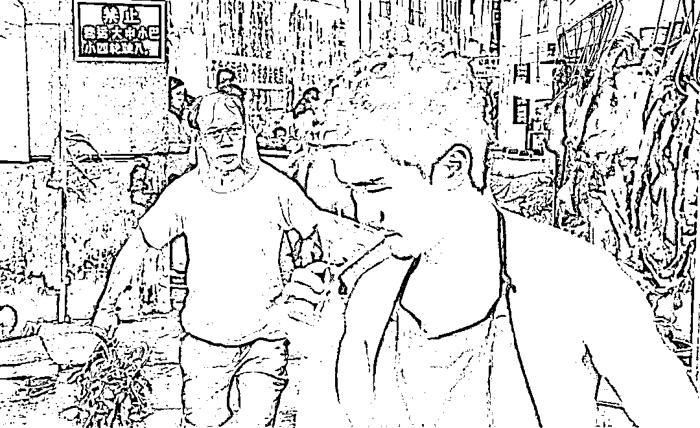

# 时代的一粒灰与个人的一座山

> 原文：[`mp.weixin.qq.com/s?__biz=MzU0MjYwNDU2Mw==&mid=2247509975&idx=1&sn=bf4c3467ab8c37dd49a787f3cf672b1f&chksm=fb1acbabcc6d42bdb0b5b2d99ed3c92754541dd9bec0770494b15ef0d37ddff1dd9696af1d77#rd`](http://mp.weixin.qq.com/s?__biz=MzU0MjYwNDU2Mw==&mid=2247509975&idx=1&sn=bf4c3467ab8c37dd49a787f3cf672b1f&chksm=fb1acbabcc6d42bdb0b5b2d99ed3c92754541dd9bec0770494b15ef0d37ddff1dd9696af1d77#rd)

[咱们之前有个读者](http://mp.weixin.qq.com/s?__biz=MzU0MjYwNDU2Mw==&mid=2247509960&idx=1&sn=f8678990a6a2c9b24b2add57f66e3741&chksm=fb1acbb4cc6d42a2bbe8ae7ca5067c96a036146c2047457fd150ab7c3bf4061d7bd24c288e08&scene=21#wechat_redirect)，给我分享了他们村的故事。

就是以他们这个村镇上发生或者正在发生的故事来看那个抢话筒的中学生。

故事很长，我整理整理，分享给大家。

在他看来，那个抢话筒的中学生，所在的学校也不是什么名校，这个少年和他的同学们毕业后，大概率是和咱们这位读者身边的儿时伙伴一样的生活轨迹，而非[我之前描述的宏大叙事。](http://mp.weixin.qq.com/s?__biz=MzU3NDc5Nzc0NQ==&mid=2247522949&idx=2&sn=bef8621320737a98c05562627cb685e7&chksm=fd2e385bca59b14d48a311699cacbd3c492b4f4e2e3c5c012ea31f47f6a4525f89c786e51138&scene=21#wechat_redirect)

说白了，他认为我之前的那种表达，有点像当初何冰给后浪的演讲，但他觉得，不是所有年轻人都会是我描述的那种后浪。

起码他身边的这些个样本不是。

这些小伙伴，除了他本人之外，没有人是咱们的读者，也没有人念过大学，都是初中或者高中毕业，他是另类，他是个大专生。

他们虽然不是 00 后，但都是 95 附近的人，如今也都 28 了。

往前推十几年，他们当中肯定有人有过和那个中学生类似的宏大叙事的念头，虽然未必有机会冲上去抢话筒。

那么现如今，他们都在打工，做体力劳动，绝大部分好友都在镇上，一个月大约在 3000 块左右，差不多都这水平，多的顶多 4000。他是另类，他念过书，现在在大城市里送外卖，好的时候 15000 也有，差的时候几千块也有，平均下来每年 12 万有的，也就是接近月均 1 万。

他这人没啥爱好，唯一的爱好就是睡前看看我们的文章。因为他念过大学嘛。

昔日的小伙伴到如今，基本上都是牢骚满腹，原因都是围绕钱。

虽然少年的时候大家都说过不为钱，但真的长大后能像罗老师那样不为钱交个朋友的还是极罕见的。

当然，罗老师也不是为了交个朋友，他还是为了还钱。

按说一个月 3，4 千，在镇上不算少，为什么会在 28 岁的年纪就每天为了钱发愁呢？

原因是没啥积蓄。

虽然都是十几岁出来做工，但是 95 后毕竟不像 60 后，70 后那么手紧，累了一天，总想大排档喝个酒，吹个牛，有时候还去按摩店里洗个脚，这样几百块就没有了。

后来过了 20 岁，大家开始都买车，买车的钱是父母出门当民工一辈子攒下来的，但是维护的费用总要自己出。

一辆车也要十几万，养车对于月收入 3，4 千的人是很贵的。

可是即便在镇上，你没辆车，连谈女朋友的资格也没有。所以不得不买。

谈女朋友，总要请人家吃饭，看电影，买衣服，自己那点工资肯定不够。

真到了谈婚论嫁，没有个几十万是不可能的，彩礼他们当地很少，但十万八万肯定要，县城里买套房子肯定要，婚礼的操办，各种采买，前前后后，几十万不仅掏空父母终身的积蓄，而且还要借债。

这个债是要他们自己来还的，而且是一个月 3，4 千的基础上，养车养老婆的基础上，未来还要养孩子的基础上，再还前面为了结婚落下的几十万亏空。

至于咱们读者，是个另类，不过他也没有结婚，也是没钱。不是在大城市里结不了婚，而是即便回老家，也结不了。

因为虽然他挣得多，但是家里两个老人都病了，没有生活能力，医疗费开支还很大，他的钱全都花在老人看病上了。

前段时间过年，他和村里的小伙伴聊天，彼此吐苦水，很多小伙伴说，现在的女人太花钱。

想娶个媳妇回家帮他们一起背负生活的压力，但实际上像供了个祖宗。

因为村里的姑娘不愁嫁，如果你对她不好，她离婚后仍然有很多人排着队拿着比你当初更多的彩礼登门求亲，而且是很多男的求娶一个二婚甚至三婚的女子。

可你离过一次婚你就再也结不起了。

那么换个角度，既然明日是如此的压力山大，今日就更加不想攒钱，过得一天算一天。虽然 28 了还打光棍在村里被人笑话，父母都很着急，但是这拨人，实在不想步入婚姻。

因为在他们看来，婚姻就是债务，一生儿女债，半世老婆奴。不如拿着这三四千的工资继续喝酒耍牌。

至于宏大叙事早就忘了，因为在他们眼里，所谓的读书人，也就是咱们这个读者，读了个大专又如何，无非是进城送外卖。

而且似乎很难提升，据这位送外卖的读者说，他现在的上司，最低级的管理层，管着几十个送外卖的，自己也要送外卖的这位小组长，是个硕士。

他只是个大专，觉得离人家差距很远。

故事到这里，分享完了，这就是一个微观叙事，一群曾经也是中学生，现在也还是年轻人的生活感悟。

他们似乎距离我们那天聊的爱因斯坦，图灵的世界，非常非常遥远。

我是这么看的，任何事都分两个视角，宏观视角与微观视角。

刘慈欣在写三体的时候，描述过一个非常有意思的事件。就是第一次接收到叶文洁发出信号的那个三体监听站的监听员，他背叛了三体文明，他向叶文洁回复说：不要暴露你们的坐标，否则三体就过来占领地球了。

当然，他没有想到叶文洁就是希望三体占领地球。

站在这个监听员的视角下，舰队司令问他为什么要这么做？

监听员说自己一辈子就生活在宇宙当中的一个监听站的狭小空间里，无数年十分寂寞的在等待着极低概率的来自宇宙的其他文明的信号。

这样的日子他过够了。

也许宇宙的第一法则是生存，也许三体文明最重要的目标是寻找适宜的移民地，问题是对他个人而言，他觉得生活一点都不快乐。

刘慈欣编这个故事很有水平，你能联想到很多很多。

比如孟姜女哭长城的传说。

我们小学的时候，老师就在课堂上让大家讨论过这个话题，孟姜女哭长城，到底怎么看。

站在孟姜女的视角下，她一定是悲伤的，因为她失去的是亲人。这是微观视角。

可是你站在宏观视角下看，站在历史的后来去看当年，假如没有修长城，很可能汉朝建立不久就挂了，是很难休养生息抵御匈奴，为后来的汉武帝营造时间与空间的。

到底是三体的存在重要，还是这个监听员的快乐重要，这是个问题。

到底是汉的存在重要，还是孟姜女的丈夫的存在重要，这也是个问题。

我们今天当然希望都重要，所谓一个也不要少。

刘慈欣写流浪地球，其实就是抛出一个话题，他问你，如果一定要选呢？

你们都看过流浪地球二，如果一定要在刘德华的女儿和地球之间选一个呢？

**这种问题没有标准答案的，一千个人眼里有一千个哈姆雷特。** 

站在宏观视角下，你重新去审视这个读者描述的他村里的小伙伴，你会看到问题的另一面。

我们假如连女孩子都不花钱，不要男朋友陪自己逛街买东西，看电影，吃饭，送花，各种消费，结婚也不要求买房，也不看重哪个男生是开车的，哪个是骑自行车的。

站在男生的视角下，的确压力减轻了，负担小了。恭喜你，你终于找到一个一件衣服穿一年，从不下馆子，骑着自行车去菜场买菜，在出租屋里给你做饭，也不虚荣攀比的好姑娘。

但是，你想过没有，如果姑娘们都这样，你和你媳妇，还怎么找工作呢？

影院不开门，饭馆不开门，汽车卖不掉，房子卖不掉，家具卖不掉，超市，服装店，化妆品店，都没有人来。

你告诉我，你上哪儿去找你那 3，4 千的工作呢？

这就是个悖论，当孟姜女哭倒了长城之后，她同样会失去丈夫，而且会进一步失去父母，失去子女。

但是你不让她哭又没有道理，发乎情，这是人的感受。

回到这个读者分享的故事，人类在前进的过程中，始终是保持锥形阵列，而不是一字长蛇阵。

爱因斯坦，图灵，这是站在锥形阵列最头部的人，所以他们才能像瞭望员一样看到现有世界以外的部分。

后面的人，是跟着走的。

爱因斯坦在基础物理世界上做出了突破，后面有大科学家兼大工程学家才能提出应用科学领域的原子弹，才会有组织者有大批科学家入驻这个领域，去实现它。

如果把这批科学家看作野战军，那么商人，资本就是工程队，俗称部队的养猪场。

那个三体监听员觉得自己一生极其枯燥且卑微，你风叔我何尝不觉得？

我每天在交易市场里枯燥的盯盘，反复的套利，分析整理各种信息，我能像爱因斯坦，图灵一样看见宏大叙事么？

不能。

我只是一个卑微的养猪员，每天守着一口狭小的猪圈。度过自己枯燥且平凡的一生。

可到这里并没有结束，那些个年薪百万的白领，只是搬运工，猪草的搬运工，他们排成一列列，每个年薪百万的负责一辆车，几个年薪几十万的做助手，拉着一车车猪草，正在往养猪场的一个个小猪圈里送。

锥形阵列再往后，是给他们这些人做后勤，送饭的，也就是咱们这个送外卖的读者。

你再往后才是你看到的村里的小伙伴，他们生活的镇，只是大城市里的一个配套车间。也许咱们这个读者小伙用的塑料袋，外卖盒，都是他们镇生产的。

你考上了大专，你去送了快递，你如果中学时全省前一二百，也许你就是那个送猪草队伍里拉架子车的年薪百万的高级白领。

此时此刻正趾高气扬的抬着头，走在洒满阳光的道路上，有时也会暗自偷想，如果自己再进一步，是不是就可以进猪圈，也能亲手摸到猪了。割了这么多年猪草，都没见过猪长啥样。

一个人当然可以在整支人类远征大军里奋斗，往前挤挤，但是整个人类，好多个百年里面，数十代人里面，也许就出那么几个爱因斯坦，图灵。

我虽然也蜷缩在一个狭小的猪圈内，但是我没有三体监听员的心理扭曲，是因为我想通了。

不是人类不给我机会做爱因斯坦，而是我做不到。

我也想做第二阵列的科学家，甚至第一阵列的大科学家，甚至无数代大科学家里面才出一个的爱因斯坦。

问题是我够不上，我肯定至少有某一轮未曾通过考核，也许是很多轮都没通过。

每个人的位置其实都是无数次选拔的结果。

不是每一个许三多都有那么多奇遇硬是挤进钢七连，你风叔我在红三连五班看守了半辈子油场了。

又能如何呢？

**宏观视角与微观视角之间，有时候就是詹姆斯·邦德版的零零七，与国产凌凌漆的距离。** 

电影中，文西来找阿漆，告诉他组织没有忘记你，你有机会被重用了。那只是一个梦。

大部分阿漆，就跟你风叔一样，尽管有着忧郁的眼神、唏嘘的胡茬子、神乎其神的刀法，还有那杯 drymartine。

那又如何？还不是得一辈子守着个猪肉摊。

但这不影响我的精神世界，可以像漆黑中的萤火虫一样，那么鲜明，那么出众.......

