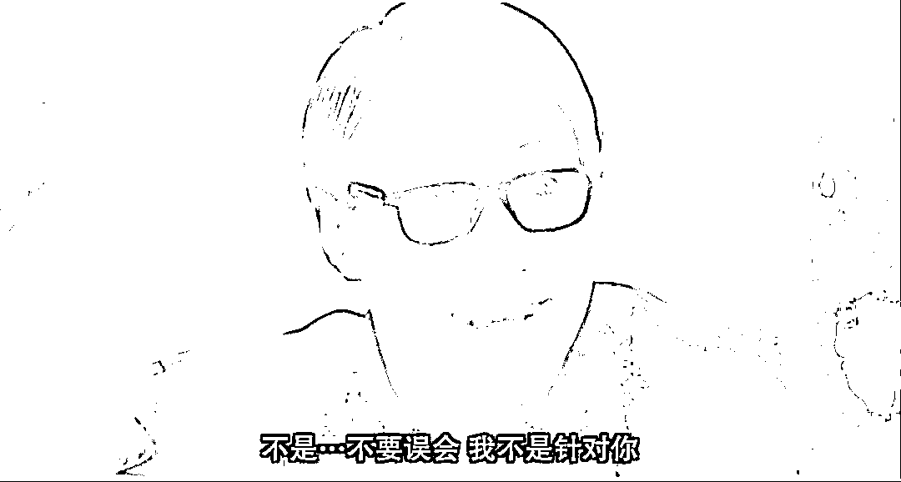
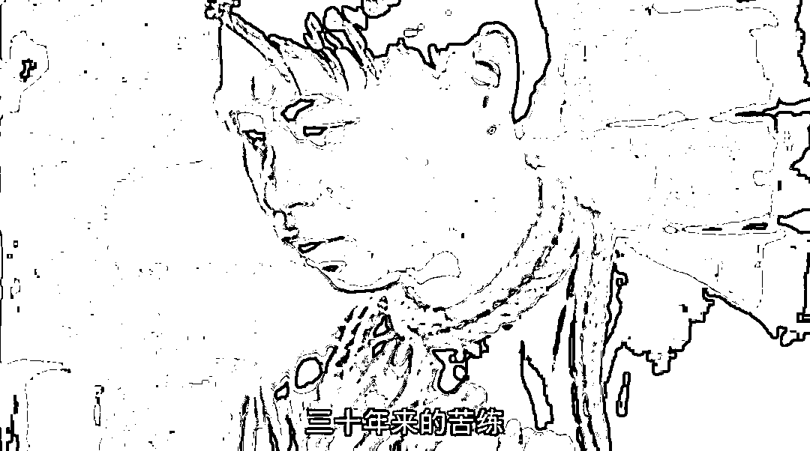

# chatGPT 唯一的价值，只在于告诉虎妈，你鸡娃鸡错方向了

> 原文：[`mp.weixin.qq.com/s?__biz=MzU0MjYwNDU2Mw==&mid=2247509815&idx=2&sn=4fd136f45d8f4e7287cc4d347c1ef458&chksm=fb1acb4bcc6d425d57b1a4c283b202fbcba3346e44b573f1f7ba534d1a432dcb0ff07e4cff38#rd`](http://mp.weixin.qq.com/s?__biz=MzU0MjYwNDU2Mw==&mid=2247509815&idx=2&sn=4fd136f45d8f4e7287cc4d347c1ef458&chksm=fb1acb4bcc6d425d57b1a4c283b202fbcba3346e44b573f1f7ba534d1a432dcb0ff07e4cff38#rd)

[之前聊 chatGPT，我说它不是纸老虎，它是真老虎。](http://mp.weixin.qq.com/s?__biz=MzU0MjYwNDU2Mw==&mid=2247509569&idx=2&sn=69da702f66e65693e134bbc41a7b6150&chksm=fb1aca3dcc6d432b61301135f308a47417506ce94d9839052b08679929db266b5d91f0c88aeb&scene=21#wechat_redirect)

确切地说，它也不是老虎，它是灰犀牛。

灰犀牛有个特点，你看着他在远处慢慢的向你走来，你没当回事，当你察觉危险想跑的时候为时已晚。

AI 的影响，我们不是今天才聊，大概 2019 年我就聊过了。

确切地说，只不过这件事搁在今天，成了热点而已。

有句话怎么说来着，一件事你以为全世界的人都知道了，其实要过去一整年，才会有几百万人知道，再过去好几年，才会有上亿人知道，也就是说，几年后，仍然有几十亿人都还不知道。

我们五年前论证过 AI 迟早取代人类，全方位的。

这是个不用思考的事儿，无限迭代到最后一定能够全方位取代你。就像海啸来了，你用手挡不住，难道用腿就能挡住？

这就是个过程，海啸是逐渐淹没，先填低谷，再一个个攻克更高的山头，最后无论多高，珠穆朗玛峰，AI 的海啸也给你填了。

chatGPT 只是个雏形，就像在海滩上戏耍的人群忽然发现远似有潮声，抬头一看，chatGPT 带来的。

它现在只能做一些简单的工作，就像一个受过非常好教育的，十分顶级的实习生。你注意，还是个实习生。

但是这个实习生受过全球最顶尖的填鸭教育，它同时读过哈佛耶鲁清华北大所有学校所有课程，人类已知的知识，理论上它都知道。

它是个优秀的数据库。但是也是个没经验的实习生。

现在老板派它来给你当助手，你多多少少有些心理压力，因为它不要工资嘛，它 24 小时加班。

chatGPT 第一个阶段试图完成的是所有**边界清晰**的工作内容。

我们注意，机器人，或者说工业自动化取代工人的第一步是什么？

就是取代一切边界清晰的，之前需要人工做的工作。

你看那个麦当劳的厨师，就很容易被做饭机器人取代，因为步骤特别清晰，什么饼，从哪个袋子里取，烤多久，夹什么都是步骤定死，时间卡死的。

中餐馆的厨师很难取代，因为太非标了。你也可以认为太乱了，一千个厨师能炒出一千个味道的宫爆鸡丁。

现在 chatGPT 在做的事情，就像机器人在做的事情，只不过它针对的对象，是白领。

十多年前我做架构师的时候，为了降低成本。把开发过程模块化，高工负责整体，系统级的，刚毕业的，两三年以内的熟练工，就负责填模块。

头文件给你写好了，编译系统给你写好了，框架给你搭好了，每个模块的输入输出都给你定死了，你就负责填空，自测。然后交给 QA 再测。

重复。

如果当时有 chatGPT，其实这批人就会被取代。

当下的，初级阶段的 AI 的特点就是这样，只要是定死的，只要是边界清晰的，人能做，它都能做。

这个影响范围非常广。

你比如拉客户的房产中介，它现在还做不了，但是那个负责材料的，走流程的房产经济的差事，它能做。

再比如，接线员的工作，客服的工作，文档白领的工作，包括各个大厅里面，无论事业还是企业，那些处理规范化流程的工作。

甚至包括老师，批卷，改卷，辅助授课，它都能做。

明白这意思么？目前初级形态的 AI 取代的是什么？是一切不需要创造的部分。

蓝领工人是怎么训练的？就是通过普鲁士教育让他具备熟练度，然后重复。

白领工人是怎么训练的？同样是通过普鲁士教育让他具备熟练度，然后重复。

你要学过拧螺丝，才能像卓别林表演的电影里那样，你要事先学过很多相关的知识，你才能像房地产流程经纪人一样去处理文案。

机器人拧螺丝，比人更擅长，而 AI 可以学完所有行业留下的所有知识。

所以前者试图取代蓝领工人，并且已经取代了相当一部分；后者试图取代初级白领，即将取代相当一部分。

不用去讨论怎么解决，无法解决，这不是问题，这是趋势，如果你不适应趋势，你才是那个问题。

有些人说，考公，然后用规定的方式规定不许用 AI 就可以解决。这种想法，是幼稚的。

60 年前，没有长三角珠三角这个概念，哈尔滨是北方的上海，它地上铺的哪儿是红砖，那分明是一枚枚银元。

前有日本人的工业开发，后有挨着前苏联。那时候你知道深圳的存在么？深圳只是个渔村。

60 年前的深圳人绝对想要成为哈尔滨人，他们绝对不嫌冷。

问题是，很多东西并不以人的意志为转移。

东北任何一个城市的经济都远不如深圳，并不是东北不努力。而是随着全球化的展开，作为港口，深圳是趋势。

何况它还抢到了先发优势。

如果你执着于就是不用 AI，那么结果就是你的成本高，你卖不出去，你从此消失在商业生态链中。

就像当年如果我们不让深圳这个小渔村试试，结果并不是东北从此就能经济变强，不会的。

结果只能是大家啥也得不到。

[生态系统就这点事儿，你接受也这样，你不接受也这样。](http://mp.weixin.qq.com/s?__biz=MzU3NDc5Nzc0NQ==&mid=2247522396&idx=1&sn=95e15739e8772bc360ccbeb5185a81e1&chksm=fd2e3a82ca59b394b48830838f00951fe9c49f506cc232dc0c7b7e0afa3876a8172bab496e7e&scene=21#wechat_redirect) 

所以 AI 对于初级白领，或者说只需要重复一段学过的知识就可以一招鲜吃遍天的白领，确实是取代者的角色。

这个影响是广泛的，绝非只是就业。就像你现在规划了一个软件园区，准备发展的都是些做外包的，边界清晰定死的这种项目的公司。

你指望大量初级码农的入驻会带动这一片商业，进而带动周围的地产。房子都造好了。

结果产业变化，AI 的兴起使得规划不准确，你本以为会需要 10 万个码农，结果来了 1000 个，就够用了。

这就是影响，对原先规划的商业地产，住宅地产，商业综合体各方面的影响。

但这种是小影响，是局部影响。影响一个人一辈子也好，影响个别城市个别区域也罢，其实站在宏观视角下看，都是微不足道的。

所谓你头上的一座山，在时代看来，只是一粒灰。

真正的大影响是教育。

人类的近代教育就是普鲁士教育，德国人发明的，这个教育的目的就是为了培养产线工人。

那个年代想象不到机器可以操作机器，人们需要的是能操作机器的人。

所以连考试模型都是固化的，ABC 你选一个，就像机器上红黄蓝你选一个。

让你背书就好比让你将来背操作手册。

我小学的时候还学过珠算课，第二年计算器就普及了，计算机兴起了，算盘当然消失了，课程教了一半也消失了。

但是人类大部分课程的设计都是普鲁士教育时代留下来的。

这种教育最大的问题体现在你现阶段大部分努力，最后都用不上。因为 AI 一定比你学得更扎实。

就好比你苦练枪法十几年，最后发现你的任务并不是亲自去打枪，而是操控 AI 去打枪。

比打枪你一辈子都比不过 AI，就像李世石都下不过阿尔法狗。

但是操控 AI，你根本没学过。你把所有时间都耗费在了重复记忆，俗称记住那些已经发生过的事实，以及如何寻章摘句，皓首穷经的去在里面寻找，而非创新。

大家知道，别说今天知道，早就知道了，我小学的那个时代大家就知道了，人们已经预感到教育与时代脱节。

所以提出素质教育，创新教育。但是问题在于，这东西没法纳入考试，会引起不公平。而教育必然被考试所导向，最后只能不了了之。

**人们为了公平，只能选择眼睁睁看着灰犀牛一步步走过来。** 

到了 90 年代末期，人工智能还被当作骗科研经费的，再往后，又十多年过去，到了 2010 年以后，AI 的趋势已经确立了。

但是，**考试出身的这一代新生的城市中产阶级也形成了。这代人在自己已有的成功路径的依赖下，是会选择性的忽视 AI 这头灰犀牛的。**

所以你发现 2010 年之后，对于改变教育方式的声音，反而越来越弱了。与之相反，大量重复训练的补习越来越多。

俗称卷。

卷到最后就是互联网上那个段子，一个比一个分数高，最后分数线抬高了。

你分数再高，顶多考 100，现在 chatGPT 出来告诉诸位，我可以考 100 万分，服气吧？

其实对现有的人的工作的影响，并没有那么重要。

有句话怎么说来着，已经定型的人，这样了就这样吧。就像一张纸，都已经画成这样了，那还能咋样？

但是对于白纸，对于一个孩子，其实作为家长，真的应该深思。

你的孩子将来要面对的，是怎样一个环境，是怎样一个游戏，他真正的对手盘是什么？

**想想星爷电影凌凌漆里面那个铁腿水上漂。**

不要把算盘练了很久，以为自己是珠算第一人了，长大后忽然发现......