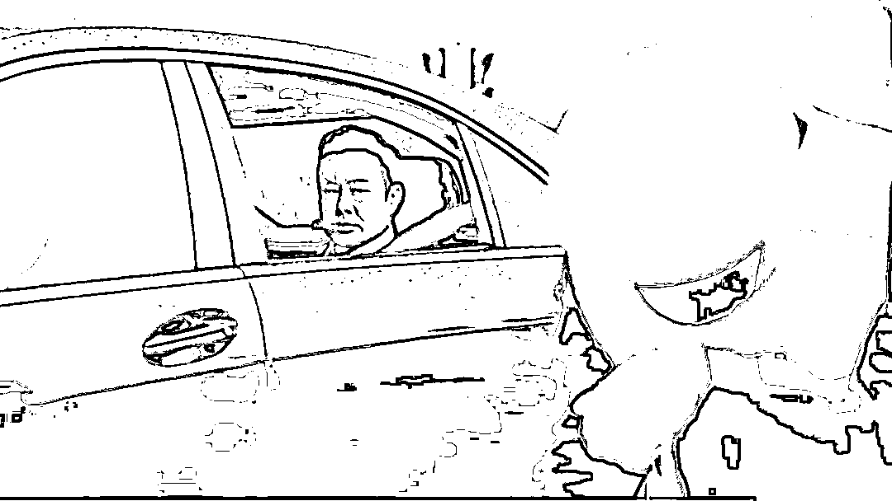

# 高启强？出身寒微不是耻辱，能屈能伸方为丈夫？

> 原文：[`mp.weixin.qq.com/s?__biz=MzU0MjYwNDU2Mw==&mid=2247509542&idx=2&sn=bc8c37420c0cb2a333f3110e16edb740&chksm=fb1aca5acc6d434c80d821b1ef4e8c97527e5587cfaec429bcbda1730d138cd1b93b16f907a0#rd`](http://mp.weixin.qq.com/s?__biz=MzU0MjYwNDU2Mw==&mid=2247509542&idx=2&sn=bc8c37420c0cb2a333f3110e16edb740&chksm=fb1aca5acc6d434c80d821b1ef4e8c97527e5587cfaec429bcbda1730d138cd1b93b16f907a0#rd)

越来越多的读者跟我讲，惊讶于我的未卜先知。

因为咱们此前聊过，[《狂飙》比《三体》好，好就好在拍着拍着跑题了](http://mp.weixin.qq.com/s?__biz=MzU3NDc5Nzc0NQ==&mid=2247522242&idx=1&sn=f919b58f6d96a61ff4fb220d27935f54&chksm=fd2e351cca59bc0ade1c14ff94abc82ec61f8fe57ee464f518c115a1e1bd8d3b49502aba8b74&scene=21#wechat_redirect)。

其实我写那篇的时候，两部戏都放了个开头，仅仅以开头的质量论，三体是胜出的。

我为什么在那个时候就给你下这个结论，原因很简单，三体的优点在于原著宏大，所以开头几集你看了很上头。

基于一个人最大的优点就是他最大的缺点的原理，一部作品也是。

过于宏大的文学作品是很难用一部戏的形式搬上荧幕的，所以你开始预期很高，后面接不上，未必是剧组不给力，有可能是视频这种表现形式原本就很难用一部戏去呈现三体的哲学意味。

但狂飙要容易得多。

我们现在回头去看狂飙，基本上可以确定，它是这一类题材里面封神的作品，如果放到更大的范围看，它的评价可能也超过了人民的名义。

它有很多细节太市井了，没有人民的名义那种对话的制作精良。

但是论深刻，它非常深刻。所以我们也难确定这部戏会不会像昔日的 1566，或者更早的走向那样不播了。

它的深刻性，各种隐喻，我不去展开，我今天聊两个人物，两个主角。

其实我知道，读者只关注一个，就是高启强。大家觉得他才是那个出身寒微不是耻辱，能屈能伸方为丈夫的。以至于一个负面形象最后成了观众眼里的“偶像”。

你们这么看，我不以为然。我们来对比下这俩人。

一个是最初卖鱼，最后成为剧中京海市大佬的江湖人物高启强，另一个是小警察安欣。

这俩人像绝代双骄一样，一辈子纠缠在一起。

大部分观众喜欢的都是前者，高启强是一个比祁同伟生动得多，复杂得多，深刻得多，也丰满得多的人物。

真要说胜天半子，他更合适。

很多观众都已经开始忘记了正确的三观，开始为高启强的命运担忧。这是很罕见的，我们都清楚，高启强是妖精，不是悟空。

但是很多观众对他的喜欢，近乎于悟空。

正因为如此，很多人不相信有安欣这种人的存在。

高启强之所以能发家，很大程度上起源于最初安欣对他的同情，他借助这份同情打着安欣的旗号在市场里混成了老大。

安欣的父母应该是牺牲了，他被局长和副局长收养，一个是他叔一个是他养父。

因为这一层关系，使得没有人敢动他，也使得高启强最初能够狐假虎威。

安欣把后半辈子都耗在了高启强身上，为此他放弃了事业，到几十年后剧终，他仍然只是个科级。为此他放弃了爱情，他和局长的女儿本来青梅竹马。

他为了寻找证据抓高启强，几乎成了京海市的异类，到最后你会发现，他实际上失去了一切。

他昔日的小伙伴，基本上都和高启强同流合污，要么枉死，要么最后被安欣抓捕，包括他的亲人，都牵涉其中。

如果不和高启强同流合污，那么就消失，比如他的徒弟。

在调查组入驻之前的那么多年里，安欣实际上是孤家寡人。而调查组入驻之后，等安欣执法完毕，他最后仍然是失去了所有的亲人。

他也没结婚，也没孩子。

剧中交代得很清楚，他担心对方打击报复。用权游的话讲，你在乎的越多，你的软肋就越多。

安欣本人是个异类，因为他特殊的出生环境，外加最初的确是他帮助过高启强，所以对方始终也没有想过要动他。

这是剧情表达的，很多观众表示不相信。

你不相信的是一个人愿意为了你，而像安欣那样如何如何。

但是你没有想过，也许人家就不是为了你。

[我曾经讲过一个很重要的概念叫做生态位的背面。](https://mp.weixin.qq.com/s?__biz=MzU0MjYwNDU2Mw==&mid=2247509446&idx=1&sn=409f116f7569f4e6a89e144e8c0b1e29&chksm=fb1ac9bacc6d40acfa910f301efb783387a56003792f2f162f30e09f411b46cd8239b0c9a8e0&token=1736509126&lang=zh_CN&scene=21#wechat_redirect) 

老罗这人，其实还没有真的理解到生态位是阴阳二体的原理，他说相声是无人可敌，但在这事儿上，不如雷军远甚。 

当老罗看到一个苹果的时候，他的想法是给自己树一个乔帮主转世灵童的旗号，而雷军看了扑哧一笑，就转身抢占苹果背面的生态位去了。

就像有的人学曹操学不成，而刘备上来就操以急，吾以宽；操以暴，吾以仁；操以谲，吾以忠。每与操反，事乃可成。

他抢的是曹操背面的生态位。

你看盗墓笔记，鬼吹灯里面都有种说法，如果看到一个仙草灵丹，比如巨大的灵芝之类的，往往旁边有什么？ 

有一条守护大蛇。

反过来，如果你被毒蛇咬了，往往七步之内，就有草药。 

这种传说的依据就是生态位原理，生态位的背面一定还有个生态位，和它相生相克。 

高启强其实是个生态位，我以前聊过，就我看到剧中所表达的那个环境，没有高启强，也会有张启强。 

就像那句话怎么说来着？没有永恒的大哥，只有永恒的大嫂。大嫂嫁给谁，谁就是大哥。 

大嫂嫁给白江波，白江波就是大哥，大嫂嫁给高启强，高启强就是大哥。

既然高启强是生态位，安欣就是他背面的生态位。

这个道理几年前我聊过，伯爵是一种生态位，罗宾汉就是另一种生态位，伯爵背面的生态位。 

罗宾汉不一定是为了你，明白么？ 

我以前分析过，罗宾汉与伯爵相生相克是一种生态原理，只是后来人们在转述这个故事的过程中，更倾向于表达成罗宾汉是侠客，他是为了我和伯爵对着干。 

其实没有我，罗宾汉也会诞生，也会和伯爵对着干。

就像你被毒蛇咬了，七步之内找到草药，它就在那里，不离不弃，你不用它疗伤，它也会生长。 

每个人的成长环境是不一样的，他最后想要的，就不一样。 

这个道理很容易理解，就像你胡八万，别人胡幺鸡。没有为什么，仅仅因为你正好缺八万，他正好缺幺鸡。

高启强的弟弟高启盛有段打人的戏，把这种心态渲染得很充分。

他弟弟和同学聚会，同学喝醉了，在 KTV 里揭高启盛的老底，说他是个除了做题一无是处的穷光蛋，还当众让他表演做题。

高启盛当时隐忍，走出 KTV 用砖背后袭击把同学砸晕了。

其实高启盛的经历恰恰是高启强的经历，高启盛的遭遇恰恰是高启强的遭遇。

高启强十三岁就没了父母，一个人带大六岁的弟弟妹妹，买一碗猪脚面，妹妹吃猪脚，弟弟吃面，他喝汤。

问他，他说自己最不爱吃猪脚，其实他最喜欢吃猪脚。

就像他最不喜欢鱼腥味，但是他卖鱼把弟弟妹妹养大，供他们念大学。

多年当大哥的经历，使得高启强有日后当社会大哥的潜质，多年被欺压的经历，使得高启强有着出人头地的欲望。 

你观察剧中的描述，高启强家中颇有民国时杜公馆的味道。 

野史记载，杜公馆每天开伙供门徒吃饭，一日三餐，每餐席开十桌。过年的时候，杜月笙直接开流水席，然后给每位门徒及门外排队拜年的人亲自发红包，每人一块现大洋。

高启强的人生经历决定了他的人生追求，而他养着一群小弟的做派，不违法都难。 

你仔细想想看正常公司因何招聘？ 

正常公司都是根据你的价值来招聘的，俗称你能为老板赚 10 块钱，老板分你 2 块钱你就满足，他才会招你。 

你说你忠心，老板会不会用你？ 

忠心有毛用。

这跟高启强的用人态度是截然不同的，他实际上把自己出生的，也是受过欺压的，也是后来翻身扬眉吐气的旧厂街那一带，都划归了势力范围。 

长期养活那么多并无盈利能力的门徒，他必然会违法。 

一直到剧末，他的伞之一，让他跑路，他都不肯跑，说自己生在旧厂街，长在旧厂街，就可以看出来，他身上的那种大哥情结。 

他有一种通过所谓罩着别人来获取自尊，实际上是获取虚荣的心理需求。 

我们反过来看安欣，他身上没有。而没有的原因也和他的成长环境息息相关。

安欣实际上无父无母，这就使得他几乎没有亲戚，收养他的是市局的局长和副局长，这就使得当地不会有人瞎了眼来欺负他。

再加上安欣实际上是个非常专注的人，他如果学习成绩好，也许可以当科学家，像华罗庚那样。

这一切都使得他沉迷于办案本身，而与外界关联甚少。 

你想象一下，安欣就一个人，他不喜欢排场，路边安安静静吃碗面就是他要的，需要钱么？

安欣也不喜欢权力，我们从头到尾都能看出来，他甚至不喜欢指挥人。他在带徒弟的过程中都没有展现出对支配别人的欲望。

再加上后来的种种原因，他终身不婚，不育，那就更加没有牵挂。 

所以后来他有个昔日的同事，被抓起来的后来的刑警队的队长在审查室里说，我们学不了你。

每个人都有每个人的弱点，有的人家里穷，被高启强收买了，有的人为了所谓配得上娶局长的女儿，和高启强合作了。 

安欣的那个徒弟，和他一样轴，但是没有他的背景，被谋害了。

这些都是常见的，但是不会因此改变生态位的背面是对称的生态位这个原理。 

所谓七步之内，必有良药。能诞生高启强，就会诞生安欣，只不过未必是以剧中的形式出现。

有人讲，如果该剧在第 26 集结束就封神了。 

26 集李响死于理想，安欣不再安心。安欣被调离了刑警队，成了一名交警，当他在指挥台上哭的时候，高启强开着豪车经过，拉下了车窗，看了他一眼。 

真要在这里结束，并不是神剧。

高启强与安欣，就像小偷和警察，警察也许某次没抓住小偷，但是小偷和警察这对相杀的生态位反向生态位始终存在。不可能任由小偷无限做大。

市场拢共就那么大点，还能都让小偷偷了不成。 

事实上，最后让小偷彻底消失的，是移动支付。钱包没了，小偷也就没了。 

这个在最初可能谁都想不到，因为生态系统变了。

生态系统，才是揭秘一切的钥匙。

[就像我们昨晚聊的，你想弄清国内的房价，国外的货币，你首先要弄清楚，全球市场联动国内市场，这个生态系统下的每一个生态位。](http://mp.weixin.qq.com/s?__biz=MzU3NDc5Nzc0NQ==&mid=2247522396&idx=1&sn=95e15739e8772bc360ccbeb5185a81e1&chksm=fd2e3a82ca59b394b48830838f00951fe9c49f506cc232dc0c7b7e0afa3876a8172bab496e7e&scene=21#wechat_redirect)