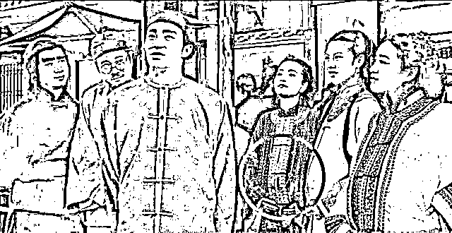

# 未婚生育其实只牵扯两件事，财产继承与姓氏随母

> 原文：[`mp.weixin.qq.com/s?__biz=MzU0MjYwNDU2Mw==&mid=2247509497&idx=2&sn=662a73b6e763eb1de57a93d968a8716a&chksm=fb1ac985cc6d40937e9bc425dab5a0801f8488fa80560fa3ee2919a9a79b5cb315e67d9f18b6#rd`](http://mp.weixin.qq.com/s?__biz=MzU0MjYwNDU2Mw==&mid=2247509497&idx=2&sn=662a73b6e763eb1de57a93d968a8716a&chksm=fb1ac985cc6d40937e9bc425dab5a0801f8488fa80560fa3ee2919a9a79b5cb315e67d9f18b6#rd)

很多人问四川出台的这件事，[这件事我们那天说了，也的确引起了热议。](http://mp.weixin.qq.com/s?__biz=MzU3NDc5Nzc0NQ==&mid=2247522342&idx=2&sn=b11b5f16c28ab02677724a8e5e4bc9a2&chksm=fd2e3af8ca59b3eefe8ef08289e8230782862cc690936f28f22ade9275978ad91dcb7a1dc44b&scene=21#wechat_redirect)

那天我主要解释了其中一个方面，就是有人担心让部分男性更难结婚。

对此我是这么分析的。

男性结婚的对象是女性对吧？如果是男性，那当我没说。

既然是女性，女性分几种？

其实就两种，有钱的和没钱的。

我那天说，女性在择偶时是慕强的，所谓 A 男娶了 B 女，B 男娶了 C 女，最后剩下的 A 女会不会嫁给 C 男？

不会的，A 女孤独终老也不会嫁给 C 男。

既然如此，限制也好，不限制也罢，A 女对于 C 男来说，如同镜花水月，看得见，够不着，永远够不着。

限制了，无非 A 女孤独终老。

没有限制，无非 A 女可以绕开男性有自己的孩子，仅此而已。

无论哪个选项，都不会改变 C 男的结婚难度。

那么除了这一点之外，另外两个影响主要体现在财产继承和姓氏问题上。

财产继承的问题很简单，比方有个人，他婚内有几个孩子，婚外和别人也有几个孩子，那么非婚生子女，是否有继承权。

这件事我是这么看的。

你首先要去看婚姻本身。

一个人的财产是分两部分的，所谓婚内财产和个人财产。

你在结婚前拥有的，这就是你的个人财产，你在结婚后赚取的，这就是夫妻共有财产。

假如这个人没有结婚，他没有婚内财产，或者说他临终是离异状态，这事儿就不存在问题。

他离异状态下都是个人财产，他怎么在此前的婚内子女或者婚外子女之间分配，那要看他遗嘱怎么写。

假如一个人，临终的时候是婚内状态，他有婚内子女，也有昔日的婚外子女。这个我们可以参考二婚的例子。

你想，如果有个人，之前结婚有子，此后离婚，二婚再次有子。他的财产怎么分配？

很简单，二次结婚后的婚内夫妻共有财产部分，他只能分配属于自己的那部分，而个人财产，随他分配。

你把这个事情想通了，就这么点事儿。

其实和他的子女的身份无关，和什么有关？和他的财产属性有关。

如果是婚内财产，那么他只能分配自己的那一半，如果是个人财产，随他分配。

其实他分配给谁都是他的事儿，你看到某些老人晚年的时候把房子给了保姆，没有给儿子，就是这个道理。

只要是他的财产，分配由他。只要是夫妻共有财产，他只能分配自己的那部分。

所以你看明白了这个本质，就会发现其实所谓引起财产继承的问题，并不存在。

第三个话题在于姓氏。

如果 A 女不嫁人，她拥有了自己的孩子，多半会让孩子跟自己姓。

这一点引起了部分争议。

姓氏的本质实际上是部落用来区分自己人还是别人。

在母系社会的时候，你想想，如果有姓氏，姓氏是什么？

姓氏就是妈妈的妈妈的妈妈的妈妈。之所以母系社会没诞生姓氏是因为不需要，你不需要标签就知道这个人的妈妈是谁，但爸爸可不一定了。

你今天去泸沽湖，仍然能看到母系社会，就是摩梭族。

摩梭族分成一个个部落，每个部落的主宰实际上是外婆，外婆的所有女儿里面最优秀的那个，会成为下一任的老祖母。

而舅舅们实际上是没有权限的，这是一个个没有私人财产的小部落构成的母系社会。

随着生产力的发展，父系社会形成的部落表现出了更强大的战斗力，很简单，舅舅们的主观能动性被提升了。在农耕时代，男人才是种地的壮劳力。

你看到的周天子分封诸侯，那些所谓的诸侯国，都是什么？都是宗族国。

大学讲修身、齐家、治国、平天下，这个家，是家族，这个国，是宗族国。

你只有整合了家族，才能整合宗族国，才能进而像周天子一样分封天下。

所以这些宗族国本身才是姓氏的起源，同姓的意思是说，你是自己人，不同姓的意思是说，他是外人。

外人和自己人，在各种权限，以及财务问题上是不同的。

但是随着工业文明，两件事发生了改变。

第一个是人类的财富定义不仅限于耕地了，女性开始赚钱了，而且表现出不亚于男性的工作能力，赚钱能力。

这就使得诞生于农耕的父权体系在逐渐缓慢的瓦解过程当中。

第二，二战后，现代国家的体系逐渐完善。人们的确源于宗族国，但现代国家，并不是宗族国的形态了。

换句话说，姓氏起源时的背景和今天已经不一样了。近似的话题我们说过，人类最初设计婚姻是围绕白鹿原上那块水田，一男一女就可以构成围绕水田这个生产资料的独立的自给自足的小农经济。

但是今天的生产方式和婚姻设计之初已经大不同。所以深刻的影响了 95 后的结婚意愿。

同样的道理，姓氏实际上已经没有了它最初设计的作用。

记住这句话，你再去看网民们热议的问题。

网民们热议的无非是自姓氏诞生以来，它的作用有两个，一个是追溯，所谓你爸爸的爸爸的爸爸的爸爸是谁，用来区分自己人和别人。

一旦一会儿随母一会儿随父，要不了几代人，姓氏就彻底没意义了，完全变成一个标签，打乱了，任何人都等于是百家姓这个全集里面随机选了一个，类似摇号车牌，什么也追溯不了。

另一个是给男性以责任感，男性天然是不愿意对一个人负责的，男性的本质就是不负责。

冠以姓氏实际上就是一个几千年来的禁锢，忽悠男人说，这事儿你要负责哦，因为和你姓，他是你的孩子。

你想想，动物界所有雄性天然都是倾向于不负责的。这才有利于基因的传播。

但是现在你议论的这两个话题随着工业文明的进展，逐渐变得和起初不一样了。

农耕时期每个女性都离不开男性，离开了就没法生存。今天是么？不是的呀。

今天至少有相当一部分女性完全不需要男性的帮助，这个群体还在扩大。

人家完全可以独立抚养孩子，这是事实。

第二个问题就是我前面聊的，姓氏的起源，它最初用于定义自己人的作用，在现代社会影响下，早晚会变成一个远古符号。

你是现代国家下的一个人，你又不是某个宗族国的人。你和老板同姓，他也不会因此录用你。

所以，那就只剩传统符号了。

两问题叠加起来，事实就这么个事实，现状就这么个现状。

有些事情怎么说呢？读者老问我认同什么。

在聊婚姻的时候我已经说了，其实我本人一点都不认同 95 后这种不想结婚的观念，完全不认同。

现在的问题在于，你认同他们也好，不认同也罢，事实就是如此，人家也不需要你认同什么，你也改变不了什么。

所谓环境变了，我们学的都是象棋，现在下的是围棋。

明白我的感觉了么？

无可奈何花落去。