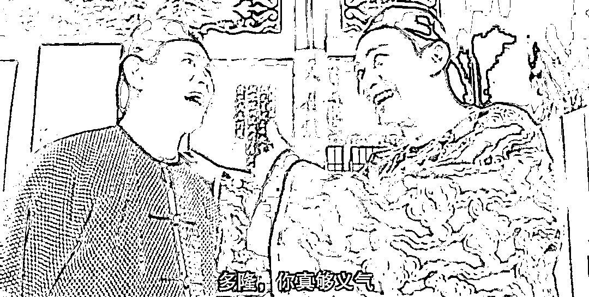

# 刀不磨就不锋利，刀太锋利了就容易断，人也一样

> 原文：[`mp.weixin.qq.com/s?__biz=MzU0MjYwNDU2Mw==&mid=2247509426&idx=1&sn=ee82fdba129bf011c1f1eb7b6baf6250&chksm=fb1ac9cecc6d40d800e263c8553f845aeb4b6e86e8be359567b16a56dc976f1fd6742cf5545a#rd`](http://mp.weixin.qq.com/s?__biz=MzU0MjYwNDU2Mw==&mid=2247509426&idx=1&sn=ee82fdba129bf011c1f1eb7b6baf6250&chksm=fb1ac9cecc6d40d800e263c8553f845aeb4b6e86e8be359567b16a56dc976f1fd6742cf5545a#rd)

正月初一，送读者点什么好？送读者一个道理。就是我们的标题。

[昨天我送了读者一个问题](http://mp.weixin.qq.com/s?__biz=MzU0MjYwNDU2Mw==&mid=2247509421&idx=1&sn=29880cf17db38d16f465daca6e985a35&chksm=fb1ac9d1cc6d40c79e3503906f120ddfe0428f65184a6f6d86f89d4ac898772fc4bc1fcdfe73&scene=21#wechat_redirect)，回答了这些年来有些人执着于想要了解的一个隐私问题。

有些人把我看成了狂热的圣徒，你想错了。

既然上次举三体的例子，趁着新鲜热辣，这回还举三体的例子。

三体剧版里面演过，叶文洁的女儿杨冬自杀了，编剧显然不理解，或者说，就是我那天讲的，电视剧很难像文字版一样多角度展开，于是只能简化。

这个故事被简化成了悬疑剧，申玉菲用了一些手段，在咖啡馆接触了杨冬，塞给她一坨资料，忽悠杨冬认为物理学不存在了，于是她自杀了。

剧中把杨冬描述成一个精神世界里只有物理学的天才女科学家。

实际上杨冬是怎么死的？

有看过原著的人说，是因为看了她妈妈叶文洁的笔记，发现叶文洁是背叛人类，是三体安排在地球上的组织头目，绝望而死。

这种理解还是不上道。

想明白杨冬在想什么，你要先看明白叶文洁在想什么。

叶文洁当初之所以把地球的坐标发出去，是因为她对人类绝望了而不仅仅是因为文革期间她父母的遭遇。

她父母的遭遇在那代人里面很普遍的，说白了就是夫妻本是同林鸟，大难临头各自飞，配偶之间，父母与子女之间的各种背叛，伤害。

搁在一般人身上，也许就变成了祥林嫂，哀怨命运。问题是，叶文洁是一般人么？

她是个科学家。

思考着思考着，到最后她就想明白一件事，人类是大海，邪恶是大海上浮着的冰山。

你之所以一眼能够看到邪恶，因为它有一部分浮出水面了，被你看到了。

思维的第一阶段是从浮出水面联想到水面下更大的冰山，从而联想到未被发现的邪恶才是主要部分。

可惜，叶文洁是思维的第二阶段，她进一步联想到，冰山和大海，也许是一个整体。

没有冰山无非是天气热，天冷自然会形成冰山，冰山就是大海的一部分。

我这里的比方你应该听得懂，天冷就是说大难临头，所谓 winter is coming。这映衬着前文说的夫妻本是同林鸟，大难临头各自飞。

思考到这里就结束了，接下来起作用的是什么？是性格。

其实老读者都知道，叶文洁想明白的这点事儿，我很早就给你们说过一万遍。

什么理论？生态链理论。

气候，大海，冰山，生态结构，人，好人，坏人，生态结构，狼，羊，草，生态结构。

我会不会绝望？不会，叶文洁想通的这点事儿我打小就想通了，问题是，我是个人渣。

人渣是不纯粹的，不纯粹的东西什么高？容错率很高。

越纯的东西越锋利，可是越锋利的东西越容易折。

这句话不是我说的，是汉武帝的一个大臣跟汉武帝说的。

汉武帝炫耀，说自己把霍去病培养的多好，多锋利的一把刀，于是就有大臣提醒他，越锋利的刀，越容易折断。

当然，这并不是预言霍去病后来在匈奴的地盘上喝了不干净的水，这个大臣的本意另有所指。

霍去病这个人的性格和后来的岳飞很像，就是才能集中在一个领域，开局就受到主要上司的特别赏识，被快速提拔。

说白了就是一帆风顺的人生外加情商低。

你看霍去病当着汉武帝的面就敢射杀李敢，李广的儿子。

李广他们家也是豪门。

而且霍去病还卷入继承人问题，这一点和岳飞很相似。

岳飞这人也是完全没有避讳，动辄卷入继承人问题，或者什么叫嚷着把你爸和你哥接回来.......

换个稍微正常点的，都不会这么说话。问题是，这俩人就敢。

只能说他们太纯粹了。

叶文洁就是这么一个纯粹的人，她是一个心目中容不下冰山的人。

能理解这意思么？

她需要理想，她的理想是总有一天，海面上没有冰山。

当她意识到大海和冰山是一体的时候，她的精神已经崩溃了，她觉得这样的大海没有必要存在。于是发出了坐标。

不纯粹的人好处就在这里，容错率非常非常高。我早就想通了生态链，然后告诉你们什么？告诉你们蛆虫有蛆虫的快乐。

别说我是一只火鸡科学家，我哪怕是只蛆虫科学家，一样可以很快乐。

明白了么？我没有洁癖，叶文洁有。

真正导致她女儿杨冬自杀的，并不是翻看了母亲的笔记，而是杨冬进而领悟了比黑暗森林更残酷的东西。

说白了，人类是蛆虫，三体也是蛆虫，歌者文明还是蛆虫。

作为蚂蚁不痛苦，但是当一只蚂蚁忽然意识到，自己整个种族和另一个种族为之征战一生的那个里程碑的事物，仅仅是某个小姑娘咬了一口不好吃，吐出来的裹着痰沫的食物渣的时候，它崩溃了。

它对一切的意义都产生了怀疑，自我怀疑。这就是杨冬的处境。

我常说，你到底是想要辩个输赢还是想赢？

杨冬最后的压力来自于她想不通，到底为什么要赢？

她觉得一切都太荒唐了，太可笑了，太卑微了，就像一个公主，被卖进青楼，当她意识到自己后半生的一切的时候，她忽然崩溃了。

这种时候，什么会起作用？性格。

你为什么会崩溃？因为你觉得自己是公主。韦小宝怎么就不崩溃？因为他的理想就是开丽春院，他开心还来不及呢。

你看三体里面史强会不会崩溃？不会的，罗辑会不会崩溃？不会的。

为什么？

因为说到底，他们骨子里像韦小宝一样，充满了低级趣味。

罗辑最初只是想骗经费，利用权力给自己弄个漂亮妞儿，要一处风景绝佳的大房子，快乐的打扑克。

他从头到尾都没有思考过人类命运，因为他觉得几百年后的事儿，关自己 P 事儿。

直到他有了孩子，他才开始做点正经事。

人渣性格的人，抗打击能力是非常强的，因为容错率极高。

我们聊过《雍正王朝》里面幼年的弘历，他和邬思道的对话。

邬思道给他讲曹睿劝曹丕不要射杀母鹿的故事，然后问他怎么看康熙热河狩猎？

弘历说，曹睿劝曹丕的时候正值春天，是万物生长的季节，而现在是秋天，万物收割的季节，所以皇爷爷没有做错，他的做法是顺应天时。

这就是典型的人渣性格。

他的性格深处没有冰山大海那种扯淡的纯粹的东西，他的性格深处是包容的，什么都有。

什么春天秋天，我给你用大白话翻译翻译，弘历的意思其实就是在说，一头驴正给你拉磨的时候，你不能杀它，还有用呢；等磨拉好了，就可以卸磨杀驴吃年夜饭了。

所以康熙一眼就相中他了，人才。人才不人才的，关键在于适合不适合，弘历很适合康熙交给他的差事。就像罗辑很适合去做面壁者。

所以当你明白了什么叫做人渣性格之后，有些担心是多余的。

之前还有读者担心我，当然，也是关心我。

你在不断的寻找市场缺陷，不断的建立规则，然后规则有效期到期被打断的过程，会不会产生火鸡科学家的幻灭感？觉得一切都毫无意义？

会，但是不足以影响我的心情。

我是一个上午佛祖拈花，我会心一笑，谈论佛经；下午就能拉着师兄弟们一起去看岛国爱情动作片的人。

我是一个上午拉着韦爵爷斩鸡烧黄纸要结拜；下午就能给他下麻药，然后贱兮兮的对他笑着说，恭喜你，韦大人，你猜对了，出卖你的人，就是我。

人的思维层面有很多种，与此同时，人的性格也有很多种。

诸葛亮能骂死王朗，他能不能骂死多隆？骂死韦小宝？骂死罗辑？

**一个人最大的优点，往往就是最大的缺点，反过来也一样。**

黄蓉特别聪明，但正因为特别聪明，她反而在武道上难以更进一步。

叶文洁骨子里很高洁，但正因为这种高洁，反而容易崩溃，自我怀疑。

就像恐龙大是优点，也是缺点，耗子小是缺点，也是优点。

三体原著刻画人物很细腻是优点，收罗了一批高水平的读者；刻画人物细腻同样是缺点，限制了它真正意义上的传播。

不过，这也是拍摄剧版的意义所在。

就像西游记是一本家喻户晓，耳熟能详的民间神话故事，但西游记原著，是一本暗黑官场小说。