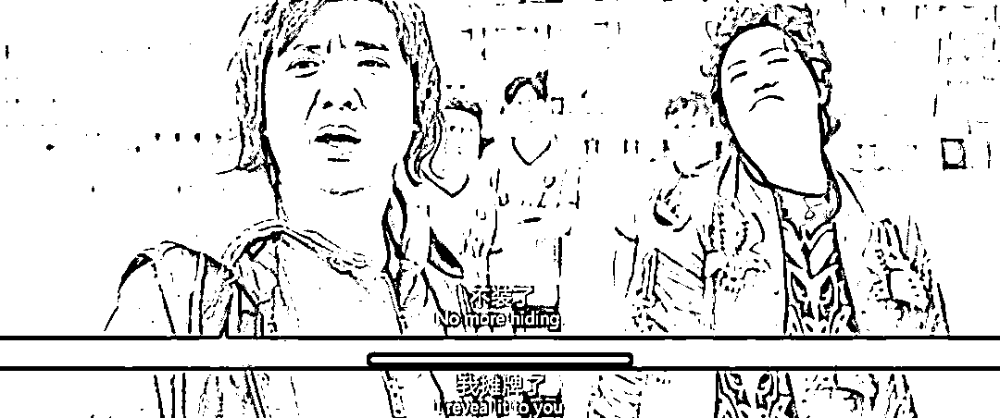

# 罗永浩和被他忽悠过的那些富老头们

> 原文：[`mp.weixin.qq.com/s?__biz=MzU0MjYwNDU2Mw==&mid=2247509368&idx=1&sn=b2248f672c8bc6f220c558825b4faa9e&chksm=fb1ac904cc6d401209ce2ecb24f9fa65d7336a2b715db7b83c51e9a4e14716677191650bb9f3#rd`](http://mp.weixin.qq.com/s?__biz=MzU0MjYwNDU2Mw==&mid=2247509368&idx=1&sn=b2248f672c8bc6f220c558825b4faa9e&chksm=fb1ac904cc6d401209ce2ecb24f9fa65d7336a2b715db7b83c51e9a4e14716677191650bb9f3#rd)

[咱们聊过忽悠富老头的话题](http://mp.weixin.qq.com/s?__biz=MzU0MjYwNDU2Mw==&mid=2247509321&idx=1&sn=ad057b4589c12103063ecd608768bc29&chksm=fb1ac935cc6d402371ded32bd855de8664cd0205f5359518db9601961611114ff86ff7740d07&scene=21#wechat_redirect)，有人用老罗的例子来说明，富老头不是那么好忽悠的，出来混，迟早是要还的。

老罗和他曾经的富老头之一，在互联网上开始了撕扯。

富老头说罗永浩忘恩负义，老罗则说富老头贪得无厌。

事情的起因很简单，富老头是老罗早期的投资人之一，后来我们都知道，老罗破产了，还曾经一度被限制高消费。

后来老罗以真还传为旗号，强势进军直播圈并又一次拿下了四哥的江湖地位，他曾经是七弟，一姐是芙蓉姐姐。

互联网老兵不死再次焕发新生，一个被手机行业耽误的相声大师。来自朝鲜族的彪悍的男人，一个连自己的脸都敢扇的创业者，东半球手机的守护者，抑菌鲨鱼皮材料的奠基人，钮祜禄氏·真还·行业冥灯·灭霸·罗。

让我们有请罗老师闪亮登场。

任我行说他佩服三个半男人，我平生也只佩服三个半男人。

三个分别是特朗普，马保国和罗永浩，最后半个是我们昨天聊过的叔孙通。

罗老师与昔日同床共枕的富老头互撕的这件事，从本质上讲，和投资没有半毛钱关系。

我打一个比方大家就明白了。

你从一个二手房东那里买了一套房，五年后，赚钱了，你会不会分他半毛钱？

当然不会。

那么五年后如果赔钱了，买亏了，你凭什么要求房东收回去，还替你付银行利息呢？

只要你认可这套逻辑，那么富老头对罗老师的要求，当然是贪得无厌的无理取闹。

投资的本质是什么？就是风险管理呀。

荷兰商人为什么要采取股份制？

他们早期是一个商人押宝一条船的，这条船上所有的货物都归一个商人所有，船如约从东方载着丝绸瓷器返回，暴富，在中途沉于海难，破产。

你去看西方同时期的小说描述过很多次这样的商人押宝船只的经历。

为了做好风险管理这件事，荷兰人把一条船拆分成十股，分别卖给十个不同的商人。

这就使得商人可以把自己原本投在一条船上的钱分散到十条船上，所谓鸡蛋不要放在同一个篮子里。

这样虽然不会暴富，可是也避免了万一某条船沉海，自己血本无归。

他们不再想要大起大落，他们想要稳定的盈利曲线。

今天的投资人都是这样做的，我就不相信哪个富老头会把全部身家交给罗永浩一个人。

他在投资老罗的同时必然投资了老张，老王，老李，老杨。

他原本赌的就是这其中有一个人会成功而不是赌每一个人都成功。

假如人家创业成功了，富老头获得千百倍的回报，人家创业失败了，富老头没有损失，拿回本金加利息。

还要富老头做什么？

有这样的好事，这样无本万利，保本的买卖，我们每个人都可以投，干脆全国人民都不要干活了，那么辛苦干嘛？都当投资人好了。

赢了一本万利，输了吃利息。

所以这个富老头的要求根本是在扯淡，如果他的主张得到支持，那以后就没有人创业了，大家也找不到工作了。

因为你等于给出了一个巨差无比的融资环境，你等于是在告诉创始人，千万别创业，赢了别人拿走你的果实，输了你还投资人的本息。

都去当投资人，还有创业团队可投么？你想想看？

如果你要求赚了算自己的，赔了房东加上利息回购回去，你想想看，你还可不可能买到房子？还有没有哪个傻房东会卖给你？

这样一个荒唐的理由是怎么产生的呢？

很简单，因为富老头和老罗之间并不是正常的投资人与创业者的关系。

这更像什么？更像昔日郑爽夫妻之间的对撕。

爽子是名人，是名人，是名人，重要的话说三遍。她是挣钱以爽为单位的名人。

如果爽子不给老公足够的封口费，那就闹，闹到最后，爽子失去的，绝对比她最初要付的封口费多得多。

这才是问题的本质。

富老头的说法是，老罗当年没钱，自己给他钱让他投资，他后来破产，于是也就不还了，自己也没有追究。

但是现在老罗有钱，有的是钱，日进斗金，而且老罗对于后续投资他的富老头，都给了钱，把人家的投资都还上了，为什么自己这种早期投老罗的，不肯还呢？

听起来很有道理，实则胡扯。

输掉投资人的钱，是不用还的，我前面说的很清楚。就像房东卖房给你，五年后哪怕这套房子跌成零，他也没有责任回购。

我十几年前第一次创业的时候输掉的富老头的钱，任何时期都不用还。

公司关门的那一天，我需不需要把创业期间自己领取的薪水，奖金退还？当然不需要。

那是我的劳动所得。

如果投资人不满意，可以去通过法律伸张自己的权益，法律不支持，就说明我说的是对的。

假如投资人到今天来找我要钱，就更不可能还。曾经的富老头不可能说我今天通过投资赚钱了，就让我去还昔日创业时落的亏空。

法律不支持。那是你的亏空，不是我的。我前面说的很清楚，投资的本质是买定离手。

通过法律途径无效的诉求有没有别的方式解决？有。

要看对方是谁。

如果我是一个连续创业者，老投资人是有可能拿回部分损失的。为什么？

因为我需要给新投资人一个念想，如果我能够给老投资人一部分自己二次创业的股份，那么新投资人就会觉得我这人念旧情，法律上可以不给的，我也给了。

他们会联想到自己，联想到是不是我这次又失败了，三次创业的时候也会这么对待他们。

所以这么做不是为了第一代投资人而是为了自己当下融资更方便，所谓管理投资人对自己的预期。

第二种可能，我一次创业失败就去打工了，去了大公司做高管。如果是这种情况下，我很可能在生意上有意的照顾昔日的富老头。

因为抬头不见低头见，还在一个圈子里混，万一哪天我又创业了还要融资。这就叫人情的事，人情了。那现任东家的利益卖前任富老头的人情。我不亏呀。

问题是，这两种都不是。我是个职业投资人，我也不打算创业，我不需要名声的，亦不需要人情。

不是所有的职业都需要名声和人情，所以昔日的富老头是绝对没有可能从我这里拿回一分钱的。

老罗不一样，他是一个连续创业者，还是一个名人，更重要的是，他是一个立着真还传牌坊的名人。

你老罗靠什么挣钱？靠有情有义四个字，靠交个朋友四个字。这就是你的牌坊。

榜一大哥凭什么上你的直播间把你捧成四哥？凭什么？凭你老还是凭你不洗澡？

难道是冲你？不，是冲你的人设，冲你的情谊，冲对你背后的投资人的同情。

是你郑爽自己说自己美丽温柔又单纯的，那你怎么能虐狗呢？

你就是卖单纯挣钱的呀，怎么能不单纯伤了粉丝们的心呢？

老罗被架在火上烤了。

用富老头的话讲，张三买你的房子，跌了，你回购；李四买你的房子，跌了，你也回购。凭什么我买你的房子，跌了，你就不回购了呢？

凭什么？

这是法律诉求么？你注意，是么？

不是。

这是威胁。你是个骗子，你有情有义的人设是假的。

老罗为什么怼回去？为什么？他傻么？他像爽子一样无脑么？

不，理由很简单，老子摊牌了，老子不装了，老子不玩了。

东半球最彪悍的男人，钮祜禄氏·真还·行业冥灯·灭霸·罗，郑重其事的告诉你，直播带货已经把钱捞够了，现在罗老师要回归创业者序列了。

罗老师又要去做乔帮主的转世灵童去了，这才是人家的人生追求。

人家不要人设了，你拿啥威胁？

