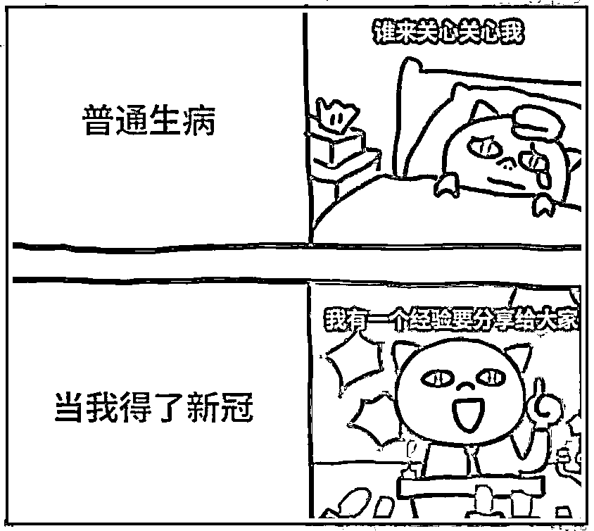

# 要避免的，不是死于病毒，而是死于混乱

> 原文：[`mp.weixin.qq.com/s?__biz=MzU0MjYwNDU2Mw==&mid=2247509150&idx=2&sn=8cc8d5567b2f0da52178ba2165140e3c&chksm=fb1ac8e2cc6d41f47d3e92a516b99ce685764bc1a7dfb3b55b639c0cf9c2bf62537d37e8346c#rd`](http://mp.weixin.qq.com/s?__biz=MzU0MjYwNDU2Mw==&mid=2247509150&idx=2&sn=8cc8d5567b2f0da52178ba2165140e3c&chksm=fb1ac8e2cc6d41f47d3e92a516b99ce685764bc1a7dfb3b55b639c0cf9c2bf62537d37e8346c#rd)

昨天那篇[，做事的是医护，被埋怨的是医护，现在要上的还是医护](http://mp.weixin.qq.com/s?__biz=MzU3NDc5Nzc0NQ==&mid=2247521442&idx=2&sn=dc009afbfbbacf5dbdb00d6af233196c&chksm=fd2e367cca59bf6ab6eea32affbe0f7a98dafea15935ce76970010bf32a3c742e546158ab3fe&scene=21#wechat_redirect)。推送了之后，有读者说，我又又又一次料事如神。

就在我推送后几个小时，华西医院通告，一名 23 岁的临床医学院的硕士研究生在阳性的情况下依然带兵上岗，引起了心源性疾病，导致猝死。

我知道很多人在骂院方，可是你想想，最不愿意发生这种事的，就是华西医院本身。

站在医院的视角下，这是一个无解的困境，一个电车难题。自己的员工和病患，到底保哪头？

两年前，一年前，我都写过，我反反复复地跟读者解释医疗挤兑是个什么概念。

我当时打过很多比方，这东西对我来说是很好理解的，因为 16 年前，我是做服务器的。

服务器这个东西相当于一个池，你就比如云游戏。假如每台服务器最多可以同时接入 10 个玩家，那么 10 台服务器可以服务 1000 个用户而不是 100 个。

为什么？因为 1000 个用户不会同一时间在线，张三在线的时候，李四下线了，所以服务器需要服务的不是总用户，而是并发用户，同时在线的用户。

一旦超过并发峰值怎么办呢？就启动冗余。比如有两台冗余的服务器之前是装管理软件的，现在也拿来跑游戏。

再超过峰值怎么办呢？那就强行突破硬件极限，本来跑 10 个游戏的跑 12 个，再突破怎么办呢？

很简单，拒绝新用户接入，所谓让新用户排队。停留在等待界面。

那么我问你，假如不允许拒绝新用户呢？

很简单，服务器会崩掉，你注意，不是有序的，是连锁性的，就像雪崩。

因为服务器里面有些是调度服务器，它崩溃了，会连带导致其他被调度的服务器也不知所措，然后又会导致其他运行的服务器负载过大，这个连锁的反应是一瞬间的。

有些人多年前用过那个什么火车部门自己开发的一个网络购票软件，春运开始一瞬间，它就挂了。就类似这个过程。

你把这事儿放在医院看也是一样的，医生忙不过来的时候，管理岗的那些人也得上前线，院长副院长也得去。

到后面什么保健科的，老中医的，都得上。甚至护士不够用了，保安，保洁都会帮忙回答排队就诊者的问题。

不要问我怎么知道的，我昨天刚去过医院，除了就诊的那一会儿，其余时间全程保安接待，保安负责回答问题，因为护士已经不够用了。

那个医院压力不算大，和北京的医院不可能比。他们顶多比原来的压力倍增而已，但是我看他们已经排长队了。

那么你想想，如果给他十倍的压力，会怎么样？

站在院长的角度 ，他可不可能说拒绝接诊？比如告诉医生，你要是病了，就回家好好休息，休满 7 天再来上岗？

可不可能？

当然不可能。就像我前面举的那个例子，挤兑的情况下，你怎么下线服务器？

你都恨不得把头发揪光，吹一口气，变出无数医生来，你怎么可能允许自己手头的资源变少呢？

可是反过来想，让医生带病上岗，有没有风险？一定有呀。

今天可能是这个医生自己出事了，明天也有可能是某个医生传染给某个动完手术的人，病患出事了。

无论什么事，都会让已经压力很大的系统，压力变得更大。

这不是哪个院长能够解决的，他解决不了。

因为医疗并不是一个纯粹市场化的圈子。

什么叫纯粹市场化的圈子？例如前文的云游戏。

纯粹市场化的意思是谁给钱多给谁干，你要咋干就咋干。

如果服务器资源不够，那就拍卖，价高者得，谁出钱谁玩游戏。

甚至，游戏行业还可以让付费玩家去玩免费玩家，这就是纯粹的市场化。

非纯粹市场化可不可能？不可能。就像我前面说的，这是一个不允许在超负荷的情况下进行用户分类的服务器集群系统，而且不允许拒绝新用户的接入。

那么严格意义上讲，这种系统靠自身的力量是不足以应对挤兑的。

明白我的意思了吗？

没有外力帮它，它是做不到的。换句话说，其他行业有义务，甚至可以说，必须在未来的几个月内，帮医疗行业分担压力。

我的建议有三条。

第一条就是分诊，建立线上问诊的渠道，你先让大家有一个在线问诊的途径。接待的人不需要是名医，甚至都不需要是医生。哪怕是护士，哪怕是药店的工作人员都行。

为什么？因为很多人其实只是不具备基本的常识，他问的都是些最基本的用药常识，普通感冒和新冠之间的症状区别。

那么经过这一轮筛查，剩下的，在线搞不定的，安排去社区医院，进行第二轮检查，治疗。

社区医院治不了的，马上开转院单，送去三甲。

这样就会把真正有必要的转入三甲，而不是让所有人一窝蜂地涌入三甲。最后让三甲的医生疲于奔命地回答一些基本常识。

这是行政部门，街道，区，县应该抓紧组织的。

第二条是感冒药的采购，这个我们聊过，怎么按照身份证来登记购买。怎么联网，不要让同一个身份证假冒八线小镇的居民把当地的发烧药买光了，然后快递给自己。

要赶紧联网了，互联网电商大厂要配合，绿码就是互联网大厂一夜之间做出来的，这事儿技术上不难。

这是行政部门要联合互联网电商大厂抓紧做的。

第三条是医疗常识普及。

我写了好几次了，我说大 V 们干点人事儿吧。无论是过高的渲染危害还是刻意耍二球误导粉丝轻视，都不是人干的事儿。

小 V 们蹭流量也就算了，你们都这么大 V 了，不至于吧？

到目前为止，这一轮因为病毒进 ICU 的没多少，因为过量吃药，混合吃药，乱吃药进 ICU 的有很多。

我见过有人贴的那玩意儿，什么第一天吃什么第二天吃什么第七天吃什么。

大哥，你这是去春游吗？

那是药又不是坚果。没有症状多喝水，高蛋白，补充维生素，适度锻炼即可。

适度，明白么？不是去跑一万米，是打打太极拳活动下就可以了。

至于吃药不是重点，重点是诊断。你确定你得的是什么病？

又不是说新冠来了所有病都消失了，没这回事。发烧的原因有很多种，你不问三七二十一先当新冠自己瞎治一通，最后治错了，发现根本不是新冠，耽误了病情，吃亏的是你自己。

我那天开玩笑说了句阳播之后， 全网都是阳播。搞得好像这个世界上只剩这一件事了一样。

明明一个很严肃的时候，被一群打着分享经验旗号的大 V 们搞得像 KTV 一样。

弄得这年头你不阳一次，都不像个搞自媒体的。

你在那里瞎说，你的粉丝们信以为真了，回头你吃什么药他也跟着吃什么药。搞出多少医疗事故？

希望大家不要被这些阳播误导。也希望各大互联网平台，这段时间把头条尽量让给不同科室的专业医生。

我没有足够的影响力，实在没法纠正这些现象。不过话说回来，责任难道不在你自己？

人家大 V 说他阳了，你就信？人家大 V 说他吃了什么药或者没吃什么药你就信？

就算阳了，就算吃了，连红楼梦里的古人都晓得，药岂能是混吃的？

说到底还是那句话，自己是自己健康的第一责任人。

就算上面的三个提议都打水漂，也希望作为第一责任人，我们自己不要先乱了阵脚。

病毒没那么可怕，但是不理智很可怕，混乱很可怕，自相践踏很可怕。

咱们的读者是一群高质量的思考者，远超互联网平均水平。希望你们都能做自己的主心骨，做家庭的主心骨，做同事们的主心骨。