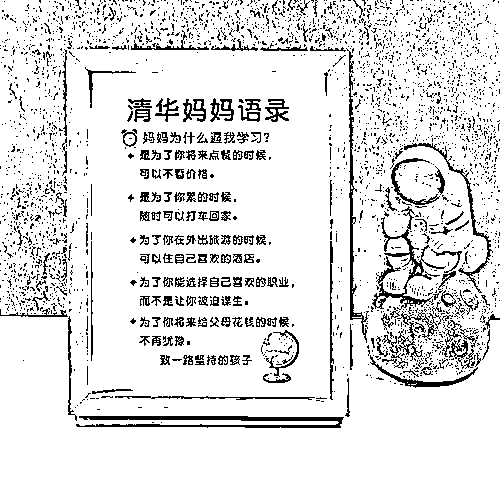

# 清华妈妈语录是不是毒鸡汤？

> 原文：[`mp.weixin.qq.com/s?__biz=MzU0MjYwNDU2Mw==&mid=2247508676&idx=2&sn=c0a2682a2872a7719a5be8bc2f857051&chksm=fb1aceb8cc6d47ae10bb30904df5fbb49186d8a01da99083f4cdcaa0ebb05e656369733d1bf6#rd`](http://mp.weixin.qq.com/s?__biz=MzU0MjYwNDU2Mw==&mid=2247508676&idx=2&sn=c0a2682a2872a7719a5be8bc2f857051&chksm=fb1aceb8cc6d47ae10bb30904df5fbb49186d8a01da99083f4cdcaa0ebb05e656369733d1bf6#rd)

最近这个商品被骂出圈了。为什么说是商品，因为实际上这就是一些电商卖家自己打着清华妈妈的旗号随便写了两句口号，当作小商品去卖的。

这个和很多年前那个所谓哈佛女孩刘亦婷还是不一样的，那个写书的妈妈，至少是个具体的人，写的女儿也是一个具体的案例。虽然很多年后，这个女孩，最终也同样变成了一个金融赚钱人。 

为什么这几句话被骂出圈？ 

因为很多网民觉得太功利了。你看看这些内容，什么点餐的时候不看价格，累的时候随便打车，说来说去就是钱。

读书难道就只为了赚钱？清华妈妈就这点觉悟？ 

高晓松很多年前不是在电视节目里喷过了吗？你一个清华的博士怎么能够只想着找一份高薪的工作呢？只有我高晓松这样清华毕不了业的才能只想着到处捞钱呀.......

笑话说完了，言归正传。

我的看法很简单，就两点。

第一、读书是不是只为了挣钱和语录里面写了哪几句话并不矛盾。

你可以有一千个读书的理由，但是没有人规定你非得都写出来。 

比如你可以说，我要好好读书的理由是能够让互联网上那些骂我的网民点菜的时候都不需要看价格，或者让互联网上那些骂我的网民累的时候都可以随便打车。 

你这么说是不是网民们的体验好多了？ 

这孩子，太懂事了。

其实不是太懂事了，只是太会来事儿了。 

人家孩子到底是为什么好好念书，到底是为什么非要考清华，没有办法弄清楚的。 

人心隔肚皮，你怎么知道那个书桌前贴着为了网民点菜自由的孩子内心深处不是为了自己打车自由？

你又怎么知道那个床头贴着为了自己打车自由的孩子其实内心深处不是为了网民点菜自由呢？

人这一生是复杂的，盖棺定论。没活到最后一刻，你给谁都无法下定义。 

第二、即便写了这几句功利的话，也没毛病。

有没有毛病，我们要回到劝人上进这件事的本质上来看。 

如果对着一个成年人，我劝你上进的理由很简单。因为这个世界是熵增的。

熵增是什么意思？ 

有序的终归会变成无序，存在的终归会化作虚无，大地白茫茫一片真干净的结局无可避免，这就叫熵增。 

你甭管人类盖了多少高楼大厦，最终都会消亡，人类自身都会消亡。 

陋室空堂，当年笏满床；衰草枯杨，曾为歌舞场。蛛丝儿结满雕梁，绿纱今又糊在蓬窗上。说什么脂正浓，粉正香，如何两鬓又成霜？昨日黄土陇头送白骨，今宵红灯帐底卧鸳鸯。金满箱，银满箱，展眼乞丐人皆谤。正叹他人命不长，那知自己归来丧！训有方，保不定日后作强梁；择膏梁，谁承望流落在烟花巷！因嫌纱帽小，致使锁枷扛；昨怜破袄寒，今嫌紫蟒长。乱哄哄，你方唱罢我登场，反认他乡是故乡；甚荒唐，到头来都是为他人作嫁衣裳！

《红楼梦》理解得很到位，曹雪芹虽然是文科生，但是对于爱因斯坦笔下的科学第一定律，熵增定律的理解，非常准确。 

既然这个宇宙的本质是熵增的，那么我问大家一个很简单的常识，那就是你应该如何渡过此生？ 

你是选择熵增还是熵减呢？ 

很显然是熵减的。也就是螳臂挡车去和熵增对抗。 

有人跟我说，既然熵增是注定的，大地白茫茫一片真干净是注定的，那我为什么还要徒劳无益的用瓢去从一艘注定沉没的船上往外舀水呢？

对呀，就因为注定的，所以你当然要这么做。当然要去做这个徒劳无益的动作。 

我们都学过数学，以无穷大为分母，以百年为分子，这个数值是多少？是零。 

生命是短暂的，死亡是永恒的，熵增是注定的，熵减是暂时的。

你我都是注定要死的，我们死后都会化为青烟化为一颗颗的粒子消散在天地之间。我们有无尽的时间轴去熵增。

你我作为青烟的无数年里想怎么熵增怎么熵增，那是无穷大的分母。

可是你活着的，有机会熵减的就这短短不足百年。 

《创世纪》里面叶荣添说过一句话，他说人死了有的是机会睡，想睡多久都可以，想平着躺，想侧着躺，想趴着躺，你想怎么躺平都可以，随便你。 

可是活着的时间很短，他不想睡。 

他之所以每天要睡觉是因为不睡觉会提前死，如果人类发明一颗药，从此不睡觉也不会提前死，那么他不想睡觉。 

因为活着的时间太短，死后有的是时间睡觉。

就这么简单的道理。你天天有米饭吃，今天有只帝王蟹，也许你这辈子就这一次吃帝王蟹的机会，你吃还是不吃？ 

数学学得好当然选择吃，帝王蟹罕见，米饭不罕见。活着罕见，死了不罕见。 

死了有的是时间去熵增，何必拿活着的时间去熵增？ 

听懂了吗？我们用一个很简单的物理定律就可以解释为什么明知不可为而为之，明知大地白茫茫一片真干净而为之。 

**因为活着是有限的，死了是无限的。因为死了之后只能熵增，而熵减这个选择，只有活着的时候才有。** 

那我现在问一个问题，这个什么清华妈妈语录里面的赚钱，属不属于熵减？ 

当然属于。

一切对抗熵增的行为都是熵减。 

你哪怕去工地上搬砖，依然是熵减。折腾就是熵减，生命在于折腾。

赚钱是折腾的子集，所以当然属于熵减。 

这份语录里面看似粗陋的话语体现的是什么？是选择权。 

什么的选择权？熵减的选择权。

熵减有很多种，你把砖搬来搬去也叫熵减，你在摩天大楼里决定金融市场的走向也叫熵减。

区别是什么？是选择权。 

打车回家的人，可以选择走路回家，打不起车的，只能走路回家。 

说穿了，**熵减有很多花样，可惜大部分都是付费的，你想体验多少种？你能体验多少种？** 

这份所谓的清华妈妈语录，说白了，无非是告诉孩子两个道理。 

1、等你老了，你有的是时间不好好学习，所以你现在最好去认真学习。

2、等你死了，你有的是时间躺平，所以活着的时候，最好积极努力。 

**而你积极努力的目的就是让你有更多花样去积极努力**，虽然大家都知道人类最终的结果是大地白茫茫一片真干净，但这仍然是你最好的选择。 

因为站在宇宙的视角下徒劳无益的事情，站在你这段生命经历的视角下，可未必。