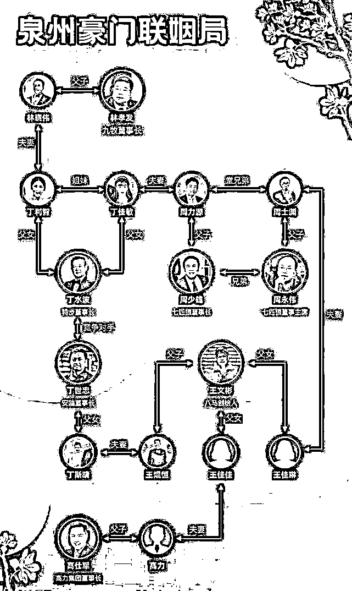

# 看到这个豪门联姻，我笑了

> 原文：[`mp.weixin.qq.com/s?__biz=MzU0MjYwNDU2Mw==&mid=2247507847&idx=2&sn=d3a085fd49ff2e71d56210709356da63&chksm=fb1ab3fbcc6d3aedfc6d6b572563cb54ce1d3cdd288b8f860ac205bed579014c6589c0969311#rd`](http://mp.weixin.qq.com/s?__biz=MzU0MjYwNDU2Mw==&mid=2247507847&idx=2&sn=d3a085fd49ff2e71d56210709356da63&chksm=fb1ab3fbcc6d3aedfc6d6b572563cb54ce1d3cdd288b8f860ac205bed579014c6589c0969311#rd)

这些天不知道为什么，很多人在后台转给我一张图，说所有大 V 都聊过了，希望听听看我的观点。

我把图贴出来。

是一对年轻人的订婚仪式。那么这有啥稀奇的呢？伴随这张图，还有下面的这张。

订婚的男女就是七匹狼老板的儿子与特步老板的女儿。

再配上这张图，妥妥的豪门联姻范儿。

于是乎互联网的大 V 们开始热议下面几种观点。

1、婚姻越发看重门当户对，使得通过婚姻逆袭的道路阻断了。

这话说的文绉绉，我给翻译翻译。其实就是说，本来还可以钓凯子或者傍富婆，现在富二代直接娶富二代，拼二手丝袜的“名媛”们，或者指望走女人道路的于连们，要失望了。

2、豪门开始强强联手。

从这张图上看，确实是董事长的儿子娶董事长的女儿，董事长的女儿，嫁给董事长的儿子。

给你的感觉这好像就是包办婚姻嘛。

3、为什么这么高调？

也有人看法超出了豪门本身，而开始思考一个话题。这件事是怎么流传开来的？是不是一个局？

为此有人联想到了历史上的胡雪岩嫁女。

胡雪岩当时的阜康钱庄其实是有困难的，但是越有困难，他在嫁女儿这件事上，就越要风光大办。

办给谁看呢？办给储户们看，这就叫给你们以信心。

让你们知道阜康钱庄钱庄没有问题，老板有的是钱，大家安心把银子存在这里，不要挤兑。

大概就这些观点。

我的看法，基本上都是胡扯。

咱们看第一个，门当户对。

什么时候门当户对是婚姻的绝对因素，或者讲不可逆因素？

只有一个，那就是包办婚姻时期，所谓父母之命，媒妁之言。你的婚姻并不是你决定的，当然是强调门当户对的。

你动动脑子，那个媒婆，她会不会在两个差距巨大的家庭之间说亲？会不会？

当然不可能，她又不管这对男女彼此之间是否相爱，对于媒婆而言，这个最不重要。这俩男女在婚前根本不会见面。

所以既然媒婆谈的是双方父母，那自然要首先确保双方父母之间在同一个对话平台。

好，理解了这一点，我们进入现代社会。

自从有了自由恋爱，为什么出现了很多不门当户对的婚姻呢？因为是两个年轻人在谈恋爱，并不是媒婆促成的联姻。

而我们之所以在几十年前会看到更多的门不当户不对，而在当下越发少见的原因，是因为最近的四十年带来的经济差距。

把话说穿了，就是因为这四十年来，越往前，大家的差距越小。大家还在一起玩。

越往后，你会发现大家不在一起玩了。

有的人上的是免费的学校，有的人上的是一学期十万块学费的学校。环境就已经把人分开了。

这种事情在美国比我们严重得多，他们的富豪是扎堆的，中产是扎堆的，穷人也是扎堆的。

如果两个人，从小到大都不会相见，怎么谈恋爱你告诉我？

换句话说，我并不认为古时候的门当户对又浮现了，**确切的说，是因为即便自由恋爱，也是消费能力接近的人，在一起相处的机会要比消费能力差距巨大的人在一起相处的机会，大得多。**

我们来看第二个观点，豪门强强联手。

豪门强强联手，肯定有，但是肯定不是这张图。

你仔细观察这张图，做衣服的，做鞋的，做厨卫的，......，几乎都是消费类板块的。

现在你告诉我，他们要强强联手，联手干啥？

商业上强强联手，无非三个途径。

第一个途径是和资方联手，商业大佬和资本大佬结成儿女亲家，这是为了互补，也是为了打通资本到实体之间的渠道。

第二个途径是产业内部联手，比如宝马与奔驰的老板结成儿女亲家，这是为了垄断。

第三个途径是甲方乙方通婚，供应商与营运商通婚。这是为了打通本行业内上下游的渠道。

现在你告诉我，一群做消费类板块的联姻，有什么商业目的？能有什么商业目的？

买衣服送鞋？还是买鞋送龙头？

这不瞎扯淡么。

第三个观点，抱团取暖，通常不成立。

抱团取暖，要么就是资本与产业结合。企业主借不到钱的时候，问银行家要，银行家遭遇资产荒的时候，企业主互补。

或者，高科技行业与传统行业结合，彼此躲避各自的产业周期。比如线下大佬与线上大佬结合。一旦遭遇疫情，线上可以支援线下，一旦疫情消减，线下可以为线上做背书。

可是同为消费终端的这些商家抱团，能怎么取暖？如果消费者没钱买衣服了，难道就有钱买鞋？

难道卖鞋的贷不到款，加上一个同样日子不好过的卖服装的，银行就肯借给你了？

这不还是瞎扯淡么？

说穿了，我认为这事儿什么原因都没有。豪宅区里就那么些人，抬头不见低头见的。

比佛利山庄长大的孩子嫁给了比佛利山庄长大的孩子，你说为啥？