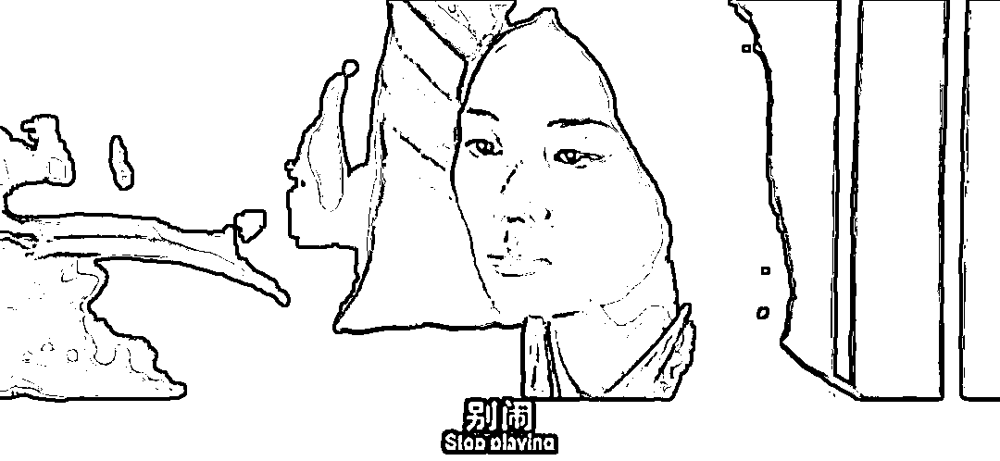

# 雷军称自己 37 岁已财务自由，are you ok？

> 原文：[`mp.weixin.qq.com/s?__biz=MzU0MjYwNDU2Mw==&mid=2247507816&idx=2&sn=eeeaff6e42e83712d8a722200a4f2109&chksm=fb1ab314cc6d3a027b28281d6a1dc7222116e40ae258c882605944c9a0fc7f8937c743d19a86#rd`](http://mp.weixin.qq.com/s?__biz=MzU0MjYwNDU2Mw==&mid=2247507816&idx=2&sn=eeeaff6e42e83712d8a722200a4f2109&chksm=fb1ab314cc6d3a027b28281d6a1dc7222116e40ae258c882605944c9a0fc7f8937c743d19a86#rd)

挺喜欢雷军的，知道为什么吗？

因为当大佬们都不说话的时候，还愿意跟我们说话的那个，要珍惜。 

悔创阿里杰克马，不知妻美刘强东，普通家庭马化腾，一无所有王健林。我记得那时候雷军就说过一句，are you ok？

叉这种东西，都被别人装了。我记得那时候连撒贝宁都出来蹭了一轮，北大还行撒贝宁。

雷军那时候在同级大佬里的形象，就像一个勤恳的老黄牛，一直是以昔日在金山时代的加班与坚持著称。 

现在当大佬们都退隐江湖，连黄峥这么年轻都退休的时候，还有个雷军给我们带来欢乐，是挺好的事情。

我不觉得他在刺激我们，犯不着，差距太大了。 

王健林当年讲小目标的时候，他是故意炫耀么？不会的，他和我们之间的距离太遥远，炫得着么？ 

他要炫耀，也是和马云之类的人，可真要是对着那些人，小目标，炫得着么？ 

所以，人家就是想到哪儿说哪儿，没有顾及我们这些听众而已。 

雷军说自己 37 岁财务自由，是有前后语境的，采访者问他，为什么创办小米。

雷军说当年随着金山的 IPO，他退休了，做了三四年纯粹的投资人，而且做得很成功，在投资圈里也算风生水起。

毕竟很年轻，还不到 40，想起当年 18 岁的时候看过的那本《硅谷之火》，于是又燃起热情，想要亲自操盘一家技术公司，去影响全世界。

你注意最后这个目标，最后这个落脚点很有意思。 

影响全世界。 

我们听起来有点像炫耀，在赚钱都这么难，求财都不可得的情况下，听到人家说自己的目标是影响全世界。 

罗永浩说出来，你或许笑笑，雷军说出来，你恐怕觉得就没那么好笑了。 

所以，are you ok？你的玻璃心，还好么？ 

雷军的故事，其实是最扎实的故事，你去复盘那些同级别大佬的每一步，会发现都充满了偶然性，雷军当然也充满了偶然性。 

但是，如果走向发生本质的变化，雷军和他们的结局，恐怕真不一样。

这就像什么，有些人是从台阶一，先去到了台阶二十，然后直接去到了台阶一百。 

而雷军，是从台阶一到了台阶二十，三十，四十，五十，六十，最后到了一百。 

走上坡路的时候，大家都是一样的，可是如果走下坡路，你要回到二十，可他只需要回到六十。 

这就是很大的不同。

**赢了都一样，可如果输了，就不一样了。**

成大功的人，都有很大的运气成分，可是每个人经历的中间步骤，是不一样多的。 

有的人真的是大气运加身，从一直接去一百的也有，但一旦反转，他很可能会回落到起点。这就是为啥某些传奇大佬，最后在街头卖卤鸭饭。说明这人的中间步骤太少了。 

我们来看下雷军，看看他都走过哪些中间阶段。 

首先雷军是学霸，他考上了武汉大学。这是很多人改变命运的第一站。 

你放在今天来看依然有参考价值，我明白有些人会讲，大城市里的，中产阶级以上家庭的孩子会得到更多的补课资源，现在名校里越来越少见偏远地区农村出身的孩子了。 

是的，但是你纵观全世界，我们在高等教育这一块，始终是最公平的，或者说，是最有机会的，没有之一。 

你想一想，在美国，一个穷人家庭的孩子，他面临的问题是不是补课资源这点事儿？ 

当然不是。 

他真正的问题在于他住的那个社区里面，全都是吸毒者，瘾君子。也就是说作为婴儿，他一睁眼，他看到的全部的世界，都和人家不一样。

明白我想表达什么吗？

你身边的穷人只是穷，不一定懒，也许很上进的。美国的穷人基本上都是有问题的，要么吸毒，要么酗酒，要么精神不正常。

所以我说，勤奋刻苦，考上名校就是大多数人走向成功的第一站。这意味着从此之后你有一个底线了。

雷军即使没有后面的一切机遇与可能，他一个武大的毕业生，找工作会相对于别人很容易，考研考公会相对于别人很容易，他只要不瞎来，保持自己前面 18 年的努力程度，妥妥的中产阶级。

这是他的第一步。他的第二步是什么呢？是进了大学之后，非常自律，专心学习，仅用了两年的时间，就修完了四年的学分。

很多名校的学生，栽的第一个跟头就是一进入大学，误以为从此之后应试教育就结束了，误以为人生开启了新篇章。

对不起，这么想，你就掉坑里了。

我讲这番话是非常有资格的，因为这个坑，我待过。

我到大四，和几个同样面临毕不了业压力的人，聊过这个话题。

我们说，自己还是 too young too simple，太傻太天真了。 

你看那些复读了三年，比我们大三岁考进来的人，我们班有一个，他就很成熟。 

他最后毕业的时候，各科平均分在 95 分以上，是保研的。 

大一的时候，我们都笑他傻，只知道埋头做题，和高四有什么区别。大学生活不应该是这样子。 

大四的时候轮到我们傻了。 

我曾经聊过一个人，山东省的高考前几名，他最后被退学了。我后来用考研的方式，才勉强过关。

我复习考研，包括把本科与硕士阶段的所有课程全通过，一共也就花了一年多点时间。这充分说明，高中刷题的学习方法论，是靠谱的。 

大学阶段只要你肯刷题，想要像那个平均分 95 分以上保研的哥们一样，是很容易做到的。 

**无非你是否意识到，这事儿很重要，这事儿需要大一就坚持去做。**

很显然，雷军是个聪明人，他生的那么早，生在最好的时期，依然懂得省两年时间出来。 

而我比他生得晚了十多年，机会窗口都几乎关完了，还荒废时日，把整个大学和研究生阶段都浪费掉了，这是我的愚蠢。 

很多人都有过相似的愚蠢，我见过很多大学之前很优秀的人，都踩过这个坑。有些人像我，是很幸运的，跳出来了，有些人真的就从此离开了牌桌。

那我们来看第三个阶段，这么优秀了，还要在学生阶段省出两年，他想干什么？ 

他想创业。他以技术入股，在 30 岁的时候，成为科技公司的 CTO。这是他的第三步，也是非常重要的一步。

**创业，最好的方式就是先跟着别人创业成功过一次。**

跟着别人创业成功过一次对你而言，意味着很多很多。 

首先你有经验了，你玩过一遍呀，其次你有人脉了，你凭什么结识一群客户？你凭什么了解各种供应商？你凭什么知道谁能打，谁不能打？ 

你不要以为上班就是上班，上班的过程中，这三样东西，你拿到了吗？ 

更重要的是，你有钱了，如果跟着别人创业成功过一次的话。 

这些如果你都不具备，没有钱，没有经验，对商业模式两眼一抹黑，对谁能做什么谁不能做什么，对人性都不了解，贸贸然开局，大概率就像刘强东年轻时，被谈恋爱的厨师和会计联手蒙。 

所以雷军的第三步非常稳。他即便遇到的公司没有上市成功，这辈子也是行业大咖，也是到处做高管。 

那么再接下来，第四步也很重要。他从一个上市成功的幸运儿，变成一个在投资领域风生水起的职业投资人。 

这是一个全新的领域，你能打，和让你判断谁能打，是两件事。 

到这个阶段，雷军才开始创立小米。小米即便做不成，他也会是一个成功的投资人。 

对比一下，很多人不是这么一步一步走过去的，他不是说步步为营的连续性成功，走到了某个台阶，再往上进一步，不是的。

我见过很多创业的人，他是根本就找不到工作，所以去创业的。 

我问他说你的盈利模式是什么？答不上来。我问他市场需求是什么？答不上来。产品演进路线是什么？答不上来。甚至连人都不了解，连自己的团队都不了解。

你不懂资本，不懂人性，不懂市场，也不懂技术，我都不知道你这老板是怎么当的。

他们以为说把父母的房子卖掉，租个办公室，开个招聘会，把人招来了，公司就起来了，以后就可以躺着赚钱了，从此开始剥削别人的生活。 

太幼稚了。

你都没有摸过鱼，你怎么知道如何防止别人摸你的鱼？你都没有身为高管哄骗过老板，你怎么知道手底下的高管是怎么哄骗你的？

很多时候，做成一件事之前，不知道要做砸多少事，要烧掉多少钱，要把多少公司搞黄。 

这些学费，难道是你爸妈付得起的？你爸妈又不是王健林。 

这么简单的道理，为什么没有几个人听得进去呢？ 

答案我来告诉你，很简单，因为他们连一步都迈不出去。

你告诉他们，要一步一步的去登天，他们费了九牛二虎之力，发现迈一步太难了，还是什么爽？还是干脆一步登天爽。

这就是为啥我一直都很推荐爽文，游戏这些东西，我从来不觉得这些东西迷惑人的心智。 

相反，我觉得，它们是在拯救大多数人。

一个人，连游戏，爽文都能迷惑，哪儿来的心？哪儿来的志？ 

就这还想创业？

别闹，玩游戏不香么？看爽文不爽么？

这世上唯一的一步登天的方案就是 YY，你去看霸道总裁文，自己幻想一下得了。最起码，你爸妈的房子保住了。