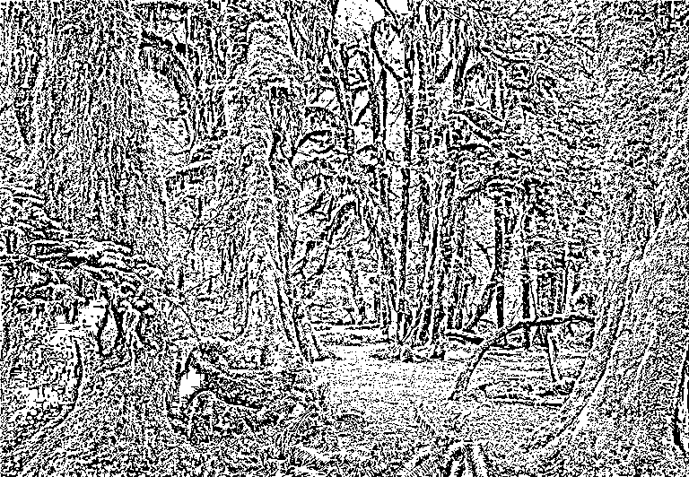
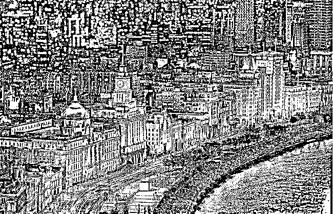
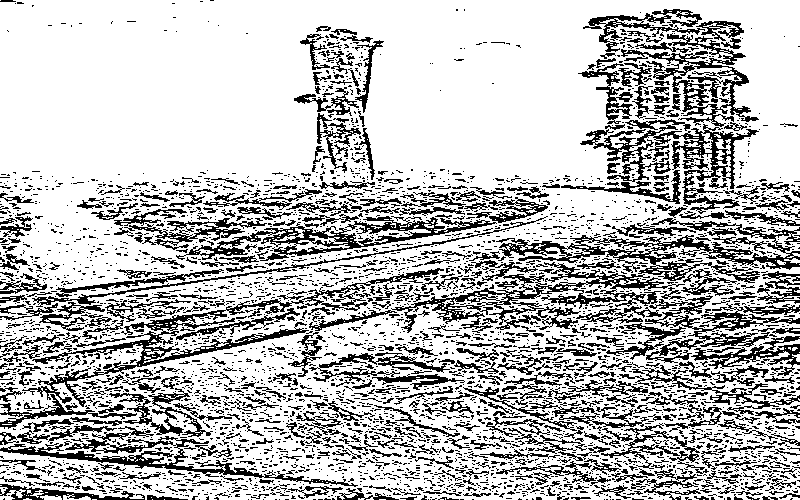

# 财富到底是怎么来的？

> 原文：[`mp.weixin.qq.com/s?__biz=MzU0MjYwNDU2Mw==&mid=2247507400&idx=1&sn=5c35e794a293905dfd949d7d6f0dadf3&chksm=fb1ab1b4cc6d38a207e9399d7889b712bc084df68da52ee8e49a0fc1a541a85cdc95b59fab23#rd`](http://mp.weixin.qq.com/s?__biz=MzU0MjYwNDU2Mw==&mid=2247507400&idx=1&sn=5c35e794a293905dfd949d7d6f0dadf3&chksm=fb1ab1b4cc6d38a207e9399d7889b712bc084df68da52ee8e49a0fc1a541a85cdc95b59fab23#rd)

[那天聊任正非的内部帖子](http://mp.weixin.qq.com/s?__biz=MzU0MjYwNDU2Mw==&mid=2247507386&idx=1&sn=1c993f8f613dac22b873eadf86a3eb58&chksm=fb1ab1c6cc6d38d04e65f2e5c19c693cfc6f76dc42c4eafdffc7b18ba0684fa43c4c6b300641&scene=21#wechat_redirect)，留言太多了，很多人放不出来。有人这么问。

他说，我确实一直没有理解消费拉动经济，总感觉理不顺。消费也是对资源的消耗啊，为啥会消耗越多、产出越多，能量还守恒呢？

这个误区很有趣，可能很多人也有，只是没有问出来。

让他困惑的地方是什么？是他没有明白，到底什么是财富。

我问你个问题，你想象一下，没有人类之前，比如类人猿时代，地球什么样？

地球这样对吧？

那么有了人类之后的地球什么样？

地球变成图 2 了对吧？

那么人类消失之后呢？地球什么样？

地球会变成这个样子。

你看到了？地球又在渐渐恢复它本来的样子，正如人类没有来过之前。

我问你，图几是财富？图 1，图 2，还是图 3？当然是图 2，图 2 就是我们人类创造的财富。

可是如果你牵条狗过来，你指着三张图问它，什么是财富？哪张图是财富？它会回答图 2 么？

狗的眼里是没有区别的，猫的眼里也是没有区别的，鸟的眼里，鱼的眼里，老虎的眼里，大象的眼里，都是没有区别的。

只有人类自己觉得图 2 是财富，俗称自嗨。

你现在明白什么是财富了？**财富是一种想象，财富就是自嗨，人类的集体自嗨。**

如果你是神灵，整个人类存在的时间对你来说只是一瞬间，那么你会怎么看待人类？

你会觉得，人类就像一个孩子，在沙滩上堆沙子。无论他堆出了怎样的城堡，起潮后都会淹没，退潮后第二天你去看，又会变成光滑的沙滩。

就像这个孩子从未来过.......

这就是人类的命运，**站在无始无终的视角看人类，就是一个自嗨的孩子。**

堆成城堡的那一刻，他很嗨，非常上头，就像 jack，搂着别人的未婚妻 rose 在船头高喊：I am the King of the world。

那一刻他觉得他拥有了全世界，关键词是拥有吗？不，是**觉得**。

**你觉得你有钱，这就叫内心富足，大家都觉得你有钱，这就叫富豪。**

我们切换一个视角，站在一条狗的视角下看世界首富马斯克和街边的一个乞丐，有什么区别？

谁更富有？不知道。因为狗的财富观和你不一样，猫也不一样，老鼠也不一样，其实这世上绝大部分动物植物都和你不一样。

我们人类只是自嗨的少数。

好，想清楚财富的定义了对吧？那我们想一个问题，怎么才能增加财富？

答案很简单，越嗨就越有财富，越上头就越有财富。

**热火朝天就是繁荣，什么都不做就叫萧条。** 

站在地球的角度看人类，它是不明白我们究竟在执着什么的。

地球上就那些东西，水，空气，火，石头，人类在那里堆金字塔，觉得自己创造了财富。地球不会理解为什么石头堆高了就是财富，为什么石头埋在矿山里就不是财富；石头雕刻过就是财富，石头原始的状态就不是财富。

地球不会懂的，因为它是神灵，站在超过人类命运的时间轴上看，石头无论堆多高，总会落下来，这叫万有引力；石头无论雕刻什么花纹，随着时间的流逝都会风化，这是大自然的魅力。

可是站在我们的视角看就有价值呀，那就是财富呀。正因为我们的寿命相比于地球足够短，所以我们才能够建立我们的财富观。

我们觉得很嗨嘛，大家把金字塔堆起来，围着它跳舞，那一刻与船头的 Jack 没有区别。

我们从原始社会走来，那个时候嗨的程度很低，就像你喝了一碗醪糟，稍微有一点点酒精度。

那时候人们的生活也很简单，采集狩猎，顶多在洞穴里画几幅画。

我们的自我感觉良好，我们觉得有壁画的洞穴就是比隔壁邻居熊大熊二住的那个没有壁画的洞穴更牛 B。

这就叫财富。

后来我们进入了农耕社会，开始有城邦，有军队，有这了那了的。

你看东周末年，各个诸侯在追求什么？在追求成为大王。

秦国希望别人叫他一声大王，魏国说你个养马的也配叫大王，秦王面子挂不住了，揍到你叫了为止。

揍到后来大家都叫自己大王，就觉得很爽，觉得自己这辈子的努力值了，奋斗值了。

大王的城邦，城墙要有多宽，要有多高，都是有规制的，每天把大门一打开，别人都管自己叫大王，好爽好爽。

其实在其他动物的眼里，比如当年的邻居熊大熊二的眼里，这帮猴子变的家伙，就是喝醉了。

这个时期，我们就像喝了黄酒，上头了。

因为它们不理解我们追求的那些东西到底有什么价值。

你其实站在原始社会的视角看农耕时期，也是不理解的。要城邦干嘛？还大门多高多宽，有洞穴里面冬暖夏凉么？

说的很对，你已经开始慢慢的在做那些站在动物的视角下，用不着的东西了。

那么再后来，我们进入了现代文明。就像喝了白酒。

你会发现现代文明下恩格尔系数是很低的，就是说，只有很少的收入是用来购买食物的。

其它钱用来干嘛了？用来买电脑，手机，汽车，很多很多稀奇古怪的东西。

这些东西实际上的作用是什么？就是酒精。你站在动物的视角下看，那就是酒精。

人类所必需的食物之外的绝大部分东西在动物看来，都是酒精，你就是为了上头嘛。

所以我们才说，人类是活在自我编织的意义之网上的生物。

那么财富是怎么扩大的呢？

很简单，扩充“酒精”的占比就可以了。

人类真正需要的和动物没啥区别，就是食物。这个是 1。

当你搞出了洞穴壁画，搞出了巫师祭天的时候，这就是 1：2，酒精开始在你的生活当中有占比了。

当你搞出城邦，军队，金字塔，陵墓的时候，这就是 1：10 了，酒精的占比在提高。

当你搞出手机，电脑，甚至搞出元宇宙，区块链货币的时候，酒精的占比就进一步提高了。

你说为什么元宇宙上一个图片可以拍卖几百万几千万？因为你嗨嘛，嗨就对了。

**这一切都是你想象的，实际上你只需要那个 1。** 

有一种思潮叫做简单生活，断舍离，就是这部分人发现众人皆醉我独醒，我并不需要那么多编织出来的意义。

他不想再继续加大酒精的剂量了，他想要回归动物定义下的生活的本质。

问题是，咱们前面说过，嗑酒精嗑嗨了就是繁荣，都断舍离了，会怎么样？会萧条。

我那天告诉你的就这点事儿。

**努力挣钱是为了自己活着，努力花钱是为了别人活着。** 

这个活着不是动物定义下的活着，是我们人类定义下的活着。我们的活着里面只有一份站在动物视角下真实需要的卡路里，其他一百份都是酒精。

就这么个游戏。

你要维持这种定义下的活着，才能维持繁荣，如果你想更繁荣，就需要嗑更多酒精，就需要进一步提高酒精的占比。

俗称让恩格尔系数不断的降低。

你把这点事儿想通了，你就会发现几十年前计划经济时代面临一个很大的问题，是难以解决的。

什么问题？

就是太理性了。

太理性了是很难繁荣的，因为需求拉不起来，因为需求的多样化达不到水准。

你去看纪录片，几十年前留下的影片，大部分人都是穿白色的上衣，蓝色的裤子，骑着个自行车，一个模子印出来的。

你纯粹站在生产效率的角度，是完全无法理解为什么 LV 一个垃圾袋标价 6000 块的。

你去看乔布斯生前怎么着装？黑色套头衫配蓝色牛仔裤，清一色。不是他不洗衣服不换衣服，而是他同一款买了几十件，不需要选择。

这就是理性，一个绝对理性的穿衣消费者，他和几十年前我们计划经济时代的人的着装几乎是一模一样的。

那么服装，或者说时装产业就发展不起来，需求不够多元化呀。

你想想看，为什么几十年前嘉庆道光的官窑几块钱一个？

因为那时候大家太理性了，凡是年代够不上博物馆藏的，就都是没有研究价值的老旧破烂而已。

那年月大家觉得钢丝床有价值，所以应该值一百块。道光的官窑碗有什么用呢？没有呀。

黄花梨有什么用？没有呀，它不比橡胶木更耐用。那些年人家下乡收黄花梨，一辆自行车能换一卡车。

有钱就要去买自行车，钢丝床，这些才是当年实用的。 

后来这些东西涨了无数倍，为什么？因为定义多元化出现了。我就是要买一个带牌子的衣服，你管它成本和那个不带牌子的是不是一样，我不关心，我关心的是看到那个 LOGO，我就爽。 

我不愿意戴塑料的手串，我就要戴黄花梨的。看到了吧？这就是财富。

我们如果觉得黄花梨不重要，那它就是烂木头，我们觉得很重要，那它就名贵了。 

你牵一条狗过来，它绝对喝不出茅台五粮液与二锅头之间的差别。问题是，我们觉得茅台更上档次。

**我不要你觉得，我要我觉得，每个人都这么觉得，财富就在扩张。**

我们不停地定义新的财富，新的生活方式，包括元宇宙，我觉得很重要，我觉得能够在虚拟世界里有自己的一方天地很重要。

于是就可以融资，就可以研发，大家就会借贷，**你买元宇宙下的想象，我研发元宇宙下的想象。估值越来越高，财富越来越大。**

财富本来就是我们人类想象出来的，如果大家都断舍离了，还有什么财富？

**换句话说，能量始终是守恒的。无论你怎么消费，你吃进去拉出来，在地球看来，什么都没有改变，还是元素周期表上那堆东西。**

有没有我们人类都一样。你千万不要以为你创造了什么，你什么都不会创造。如果站在宇宙的视角下。

我们就是海滩边堆沙子的孩子，我们要做的，就是嗨，更嗨，嗨起来。

千万别跟我说众人皆醉你独醒，那是瞎搞。众人皆醉你就要喝得更高，你只有喝大了，喝美了，你才能成功。

你注意，人类自从诞生起，一直这样。从原始社会开始就一直这样，这就是人类的方向。

因为人类是一种活在自我编织的意义之网上的生物。