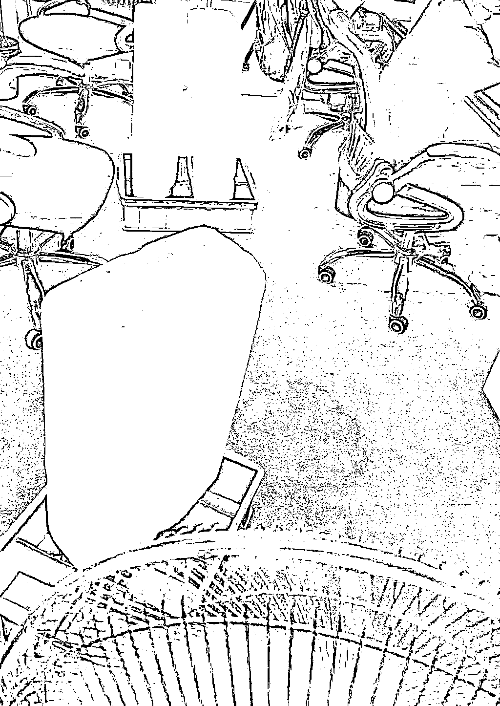

# 东部都欠四川一度电？

> 原文：[`mp.weixin.qq.com/s?__biz=MzU0MjYwNDU2Mw==&mid=2247507350&idx=2&sn=2ccf81ae68afc9033dc46d7d17b92776&chksm=fb1ab1eacc6d38fc74a4151da8f8baf63404114255041360d8afe884e8ef550dee5580db81da#rd`](http://mp.weixin.qq.com/s?__biz=MzU0MjYwNDU2Mw==&mid=2247507350&idx=2&sn=2ccf81ae68afc9033dc46d7d17b92776&chksm=fb1ab1eacc6d38fc74a4151da8f8baf63404114255041360d8afe884e8ef550dee5580db81da#rd)

昨天很多四川的读者在后台纷纷集中的转发一个说法，就是说东部的这些城市，通通欠四川一度电。 

为什么这么说呢？基于以下事实。 

1、今天夏天特别热，很多河道水量变小，水力发电站的发电能力不足。作为水力发电一哥的四川，只能用存量水发电了。

2、四川有些工业用电已经开始为民用让步，比如富士康，京东方某些大厂，都开始拉闸限电了，为了保障老百姓的空调。

3、成都部分地铁关闭了照明灯，有些写字楼也开始限制不必要的用电。

4、与此同时，我们都清楚，西电东输是供应给华东地区的，也就是说，四川在自己电不够用的同时，仍然在保障华东地区的供电。 

5、上海希望四川能够保障特斯拉的白天用电。因为关系到上下游很多企业，请求给予一定的资源倾斜。

这五点没有什么值得讨论的，我觉得这些大 V 都是基于事实。 

但是最后的结论，有些荒诞，因为我看到不止一篇了，这些大 V 在叙述完基本事实之后，开始抒情。

反正最后的结论是东部各省每个人都欠四川人民一度电，所以此时此刻，你们应该点亮在看，让我们传递这份爱.......

我不否认爱，但是爱不能发电，我今天是来科普的。因为我发现关于电力传输有很多常识是网民不具备的，似乎这些大 V 也不具备。 

我本科的时候是读 ISEE 的，不过我不和自己学院的人住一起，我和 EE 的人住一起。

他们那是公寓楼，条件好，四人一个寝室，我住进去了。后来三个室友里面两个都进了电力系统，那栋楼里基本上大部分人都进了电力系统。 

和外院的人住在一起，于是我对人家的专业，多少有些常识，毕竟看别人突击考试，看别人突击论文，听也听会了。 

我今天科普以下几点，有关电力的常识。 

**1、电这玩意儿，它不是大米。**

你说如果四川人民种了大米，自己不够吃，仍然供应东部省份，那么每个人省一口，还给人家，这是应该的，也是很有意义的。

我看到很多大 V 都提及了二战时期四川的贡献，四川不仅供应了参战最多，牺牲最大的川军团，也供应了粮食，弹药，几乎一切的一切。 

这个是历史事实，原因也很简单。老蒋抗战那会儿他跑到重庆去了，手里也就四川，东部都沦陷了。

但是发电和二战期间打仗送人送米它不是一回事。 

米面这东西你吃不了可以我吃，哪怕我给你了，你再还给我，我还能吃。

电不是这样的，电这东西发出来就得用，你不用，它也不可能变成电池呀。

能理解我的意思吗？ 

一个没有办法保存的东西，它怎么欠呢？ 

这是我要普及的第一个常识。一个没法还的东西，不存在欠。 

**2、为什么有西电东输。**

西气东输，和西电东输，不太一样。西边的天然气，如果不输送给东边，自己用可不可以？可以。 

西边的电，尤其四川这种水力发电为主的，不输送给东边，自己也留不下来。原因我前面说过了，电不是大米，不是燃气，没有办法存储的。

水力发电的本质是把水的重力势能，变成了电能，中学生都学过，我不详细拆解了。 

那么对于四川的水资源来说，也就是这个水的落差，你不利用它，它也不可能变成本地的财富，明白我的意思吗？ 

你们家有米，你不卖给别人，我能够理解，你可以自己吃。

你们家有石油，你不卖给别人，存起来日后自己用，我也能理解。

但是你们家有个瀑布形成的落差，你不卖给别人，对你自己而言，没有任何好处，你存不起来的明白吗？ 

所以实际上四川是把自己多余的水的重力势能，卖给了东部，这是双赢，皆大欢喜。 

那么为什么现在四川缺电呢？因为天气太热了，很多河道水位下降了，重力势能不够了。以至于发的电与此前的预计不符了。 

那么就有人会问，四川为什么不可以先紧着自己供应，先把东部的电掐了算了？ 

这就是第三个话题 。

**3、电网传输。**

我问你个问题，你觉得一天 24 小时，一年 4 个季度，一个地区的用电是一条直线吗？比如一直都是多少亿千瓦时？是这样吗？ 

当然不是，如果你见过电网大屏幕，你就会发现那是一条曲线，就像炒股的时候你看到的 K 线图。 

你放大到一年看，它是曲线，你缩小到一天看，它还是曲线。 

站在一年的角度，冬天夏天人们会开空调，春天秋天不会，站在一天的角度，白天是工业用电高峰期，晚上是居民用电高峰期。

所以那个用电一定是一张曲线。 

我们想一想看，既然有曲线，就有峰谷，如果真的可以四川不够用的时候，把东部的电停了给自己用，那么你反过来想想。

在往年，天气不热的时候，水量丰沛的时候，四川自己用不了的电，都卖给东部，不是更好？ 

全国一个曲线，谁多了就卖给缺的，皆大欢喜，岂不是更好？

你要是能解决这个问题，随时随地的削峰填谷，你还做什么网民，你早就成电网大佬了。 

别闹了，我当年那几个室友，哪个不是县状元，哪个如今不在拉电闸看机房？ 

为什么混不出头？因为他们电力系统是一个相当成熟的行业，能想出来的早想出来了，轮得到你么？ 

问题没有你想的那么容易解决，这又不是自媒体短视频，随你扯淡，人家那个一点改动，动辄千百亿的投入，牵涉面很广。

电这个东西，最大的损耗在于传输，远距离传输。所以传输到远方的不是你平日里用的 220V，那是几十万伏的高压电。沿途的线路都是设计好的。 

并不是说你想给谁就能给谁，你想拿回来就能拿回来自己用。 

四川当初建水电站的时候就算过的，几千亿千瓦时是给自己的，一千亿富裕的是给东部的。 

它算过的，就是说这个最高发电量是能够覆盖自己使用的峰值的，所以一般来讲，都不会限电。 

那么我问你，自己用不到峰值的时候，电是以什么形式存储起来的？ 

我们前面说过了，不能变成电池，那么难道白白浪费？ 

不，水电是以蓄水，提升水位的形式，以存储水的重力势能的形式存储起来的。

明白这意思吗？发的电如果用不了，那干脆把水位往高拉，把下游的水往上游抽，水的重力势能提升了，下次让它落下来，就又可以发电了。

所以我们回过头去看基本事实的第一条。四川用存量水发电，这就是常规操作呀。 

以前用不了的，被储存为重力势能的，现在紧张期，拿来发电。这只是技术手段之一，并不是人家把口粮给了你。

米和电，两码事。这是技术，不是情感。

同样的道理，上海发的那封信和四川自己电够不够用没有关系，人家是在讨论原本设计高压传输线路中输送给他们的那个电网里的峰值，会不会影响工业用电。

这和四川本地的老百姓夜里用空调，完全不搭边的事儿呀。

5 个基本事实，3 个科学常识我们讲完了，现在咱们回头看那些大 V 的建议。

他们建议说，你最好把空调调整为 26 度，节约用电。

节约用电这么顶大帽子扣下来，肯定是对的。问题是，我们要弄清楚为什么。 

1、如果你所在的区域根本不缺电，你看完这些抒情的文章，就去刻意省电，意义不大。 

如果说有意义，最大的意义在于替你自己省点钱，毕竟用电是花钱的。 

对于电网来说，没多大价值。因为咱们前面说过了，用电是有峰谷的，通常峰都在白天，工业用电频繁的时候。

你去开通峰谷电也会知道，晚上其实电价比白天低，说明你夜里开空调，根本不影响电网的峰值。那时候本来就不是用电高峰期，所以人家才会打折卖给你。

能理解我这意思吗？超市里说过了晚上 8 点，盒饭打五折，因为没人买他们就会扔了。你说你好心，为他们节省食物，宁愿不吃宵夜也不买。 

那你没有帮到他们，你这么干是双输。超市巴不得你半价买份宵夜，你也沾光，他也回本。因为他只能丢了呀。

2、即便你所在的区域缺电，比如你正好处在长三角，这个夏天特别热，用电压力很大，或者你就身处四川，那么最好的方式也是按照当地的通知配合行动。

我前面说过很多次，电不是米，不是你剩一口可以第二天做个蛋炒饭，或者给别人吃，做不到的。 

**只有超过电网图像里峰值的那部分限电，在那个特殊的时间段内的限电，才有助于缓解压力。** 

只要在峰值以下的，你自己瞎搞，是白费劲。比如下面这张图。 

你觉得这是在省电吗？绝对不是。

你动动脑筋嘛，今天又不是古代，这么大冰块哪来的？难道是天山童姥从西夏王宫冰窖里挖出来的？肯定是用电冻出来的呀。 

你用电，冻出这么大一坨冰，再通过冷藏车，电梯送到公司，最后放在办公室里拿风扇吹。

这能比空调更省电？

**如果这样都能比空调更省电，董明珠哭晕在厕所里了好吗。** 

她说老娘这辈子到底在奋斗个啥？研发了那么多技术，最后你告诉我空调的电耗比你这么原始的办法还高？ 

别逗了好吗？你等于发明了一台最原始，能耗最大的“空调”。所以这张图肯定不是为了省电，我第一次看到以为是停电了，估计人家公司正好有冰，后来一看风扇在转，那就不清楚。互联网上很多图都是未经考证的。 

最后，给出我的结论。 

用电这个事情是技术问题，我相信当地电力系统的人早就开始行动了。如果突破了峰值，他们肯定会想尽一切办法，比如重开火力发电 ，比如某些区域开始削峰。

至于咱们这些外行，说实话，我们的读者爱四川，就像你们爱全国的每一个省份，每一个地区，每一个直辖市。

但是爱在用电这件事上，只有一个表达方式，那就是一切行动听指挥。 

你应该听听看社区让你怎么做，居委会让你怎么做。该怎么配合怎么配合，这就是你能做的最大的贡献。

最后，我本人也建议你空调开在 26 度以上，我自己卧室里开 28 度的，不为啥，开低了会冷呀。