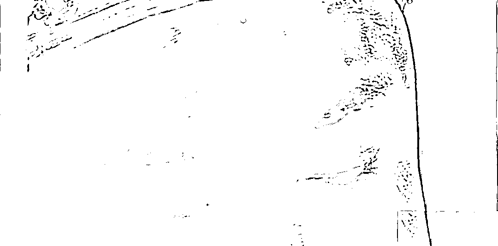
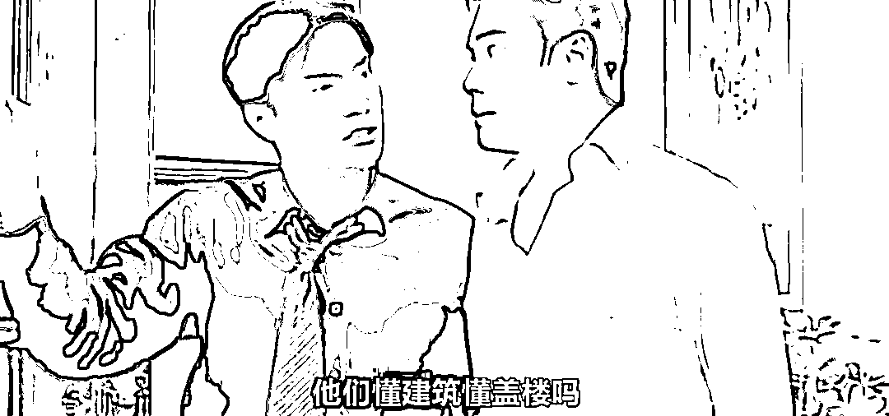
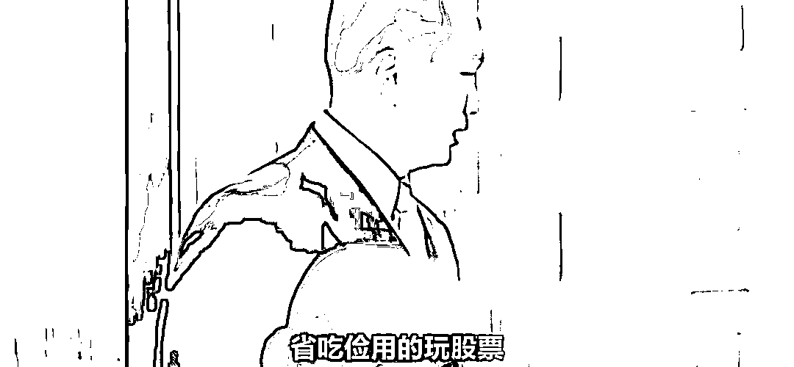

# 外面那些人懂什么房子？外面那些人懂什么股票？

> 原文：[`mp.weixin.qq.com/s?__biz=MzU0MjYwNDU2Mw==&mid=2247507307&idx=1&sn=02e18e2b83080855a2203e1e2a2e0cd4&chksm=fb1ab117cc6d38016230a710c0140a73df47333c2196f9b46a56fdafb0e3b285911a3ad5cb18#rd`](http://mp.weixin.qq.com/s?__biz=MzU0MjYwNDU2Mw==&mid=2247507307&idx=1&sn=02e18e2b83080855a2203e1e2a2e0cd4&chksm=fb1ab117cc6d38016230a710c0140a73df47333c2196f9b46a56fdafb0e3b285911a3ad5cb18#rd)

[之前聊起普通大学生](http://mp.weixin.qq.com/s?__biz=MzU0MjYwNDU2Mw==&mid=2247507275&idx=1&sn=e828738b3f2c5074ed818114a6c2b138&chksm=fb1ab137cc6d3821e30f2bf54b5e9fadff210059c247c15870a7163aa2661d1571b519bf2cff&scene=21#wechat_redirect)，不是很正能量，其实我很想正能量，但是问这问题的人，人家把话题就给我卡的很死。

人家提问者限定了，说不允许我再去聊身边那些二十年前二本逆袭的例子，或者十年前这了那了。

人家咬死了就问，你就说这三年，你见过的。说实话，有一说一。

那天有个读者的留言也很有意思，他说，其实二十年前同龄人中的二本的稀缺度，也许比今天一本还高。

你观察的很仔细，所以有些逆袭的例子也没有那么激动人心了，如果你较劲的话。

不过终究不是所有的读者都理性，那种非正能量的表达，还是让一部分人很不爽。

他们责怪我过于负能量。

其实那些有过人生阅历的读者，都清楚，我这人绝对谈不上负能量。

我应该属于那种比较飘的。

飘的意思是说，有话都拣好的讲，有事儿都往好里想，只要还可以，一般来说都尽可能正能量。

但我不是那种胡说的，就是说，我凡事都是讲理也讲数据的，我只是下意识的习惯于正面表述以及正向引导。

如果我这号的，你都觉得不够正，那只能说你太正了。正是对的，但纯粹为了正而正，那就不靠谱了。

事物一定是有很多个面的，就比如 123 这三个数字。

你正着去看，123。这很好，可这不是全部。

有 123，就有 321，还有 132，213，231，312。后面那些都是存在的。

什么叫罔顾事实的正？比如那天有些读者骂我，哭着闹着跟我说，你必须说 123，天底下只有 123，天底下就不存在 321，你再说 321 我就骂你，你再说 321 我就取关你。

我本人非常认同 123，只不过每个人的 123，得来的过程并不一样。

有些人，他经历过所有的排列组合，最后，他选定了 123。而有些人，他只是没见过其他的，他只见过 123，他以为只有 123。

如果你把这比作理想，前者的理想是经历过考验的，后者则没有。

就比如金庸的小说《鹿鼎记》，鹿鼎记里面相比于风际中，韦小宝是靠得住的。

韦小宝的经历很多，选择也很多，康熙拿他当兄弟，陈近南拿他当徒弟，俄罗斯公主拿他当情夫，神龙教教主拿他当心腹。

相比较而言，风际中的人生就单一的多。按说纯粹的风际中应该更靠得住，实际上风际中当了叛徒，康熙给了他一个小官，他就巴巴的出卖了天地会。

这里面的道理很简单，就像女性在择偶的时候有句话，她们不想成为某个男人的第一个女人，只想成为他最后一个。

为什么呢？

我猜，她们大约是在想，如果这个男人一个女人都没有经历过，嫁给他，难保他日后不会背叛。

风际中天天讲要忠于天地会，这只是一种说法，到底能不能做到，是需要考验的，有时候不背叛未见得是忠诚，也有可能是根本没有机会。

就像有的男人也许一辈子都没有出轨，有可能是人品过硬，也有可能是根本没人看上他。

我相信天地会里面有很多人，一辈子都没有风际中那样的机会，你不知道他忠不忠，他自己其实也不知道。因为就没有第二个人看上他，没有过其他选项。

我想，这里面有些人在面对选择的时候，会动摇，例如风际中，有些则不会。

至于韦小宝，你别管他看着有多么不靠谱，实际上，整本书里，他最靠谱。甚至靠谱的程度也许超过了陈近南。

韦小宝拿到的牌全书中仅次于康熙，在这种情况下，他都宁愿杀头也要救师父，我相信在其他考验下，他会做出同样的选择。

经过现实考验的理想，才叫真理想。

女儿国主跟唐僧说，你有本事就睁开眼睛看看，你睁开眼睛看着美女还能坚定的离去，这叫通过了考验。

紧闭双眼满头冒汗只能说明你心虚。

有人问我，睁开眼睛过不了关怎么办？

那我只能告诉你，如果睁开眼睛就过不了关，那么你闭上眼睛也到不了西天的。

有些事儿你是绕不开的，比如睁眼看世界，睁大眼睛，先学会认识世界。而不是从一开始就要求世界必须是我想象的那样，必须 123，123，如果 321，我就哭，我就闹，我就满地打滚......

**真正的理想主义者，一定是一个直面现实的人。** 

绝不会是一个满地打滚的人。

二十年前的互联网，并不像今天这样，那时候的年轻人，还是更多的愿意去了解他们即将要走向的社会的方方面面，当然包括自己不适应，也不喜欢的那些面。

很多人让我推荐神剧，他们问我，《大明王朝 1566》是不是神剧？《天道》是不是神剧？

艺术作品各有千秋，不过如果你是个还没有理解社会的年轻人，我建议你先看看 20 多年前的一本神剧，《创世纪》。

重点看两个人，一个是许文彪，他在冲着叶荣添发飙。

跟他讲，外面的那些人懂什么盖楼？他们只不过......，此处省略很多字，因为过不了审。

还有一个镜头是霍景良，他站在落地玻璃前，指着下面忙忙碌碌的人群，跟办公室里的人说，他们懂什么炒股？他们知道.......，此处也省略很多字，同样的原因。

这就是老剧的好处，今天过不了的东西，那时候是随便你看的。你去把那本剧追一遍，看到三兄弟过三关，买壳上市就可以打住了，后面没必要继续。

一个人在财务自由之前，不需要懂那么多的。因为也用不着。

你真要是能够白手起家财务自由，到时候你也不需要再通过什么神剧来让自己有所谓醍醐灌顶的感觉。

那东西本来就是给初出茅庐未入社会的学生看的。

我看的时候就是一个校园里的大学生，只不过不同的人看同一个东西，侧重点是不同的。

有人关注的是叶荣添他们家和富豪叔叔之间的家族恩怨；有人关注的是台词字里行间透露出来的不怎么正确却存在的那一面。

我给你推荐的就那两个镜头，如果说还有第三个，那就是三兄弟过三关，利用信息差，利用大佬互殴的当口，赚到买壳上市的钱。 

这就是性格不同，有人对情感感兴趣，有人对商业感兴趣。 

我不是反对前者，我只是告诉你，情感不是万能的。 

不是说你躺在地上打个滚，说宝宝不开森了，一睁眼世界就变了，不是这样的。 

我也没有建议你去学许文彪和霍景良，这俩都是反面角色，剧中最后都被收拾了。 

我只是建议你，先了解一下对方。 

你不是风际中，你最终注定要选择 123，这一点我相信，可是这并不影响你了解一下 321，了解一下没坏处的。 

就像一个警察，你想成为一个神探，难道每天背诵法律条文外加谴责坏人就足够了吗？

当然不可能。

你看柯南是怎么做的？就是模拟犯罪分子的行为，心理，方方面面。 

你得比那个坏蛋还懂他，你才可能制服他。包龙星他爹说得很对，贪官奸，清官要更奸。

贪官有 36 般变化，你要有 72 般变化，否则你拿什么制服他？ 

今天的年轻人如果穿越到 20 年前，你会发现当时虽然机会更多些，但也绝不是人人都能把握。 

那时候也有很多人每天哭天抢地的说，为什么 34567，不能压 45678，有很多的，任何时期大多数人都这样。 

即便是同一本电视剧看下来，你也会发现多数人的目光聚焦在许文彪当年没钱的时候，她的女朋友最终没有和他在一起，而是跟了富二代，为此愤愤不平。

又或者三兄弟从哥们义气到如同仇敌，为此唏嘘感慨。 

所以我写什么，并不重要。无论我写什么，一千个人眼里都有一千个哈姆雷特，你们看到的本就不是同一篇文章。 

说穿了，性格决定命运，而性格，不是别人能帮你改变的。

因为改变自己的是神，企图改变别人性格的，是深井冰。