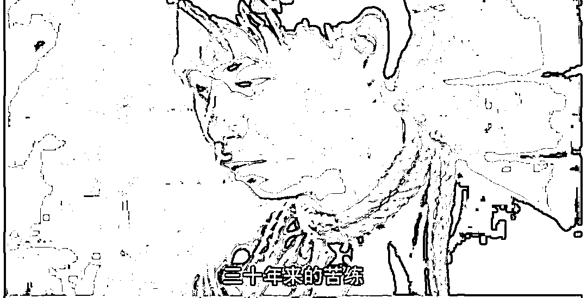

# 陈鹤皋的防身术，并不是万能的

> 原文：[`mp.weixin.qq.com/s?__biz=MzU0MjYwNDU2Mw==&mid=2247506265&idx=2&sn=1f287d0546f0fb03e5d42a193d9caaeb&chksm=fb1ab525cc6d3c3339723ee3c3e60081a8e3cbb98667bdb8a18966eda1985b02593d3630b3c2#rd`](http://mp.weixin.qq.com/s?__biz=MzU0MjYwNDU2Mw==&mid=2247506265&idx=2&sn=1f287d0546f0fb03e5d42a193d9caaeb&chksm=fb1ab525cc6d3c3339723ee3c3e60081a8e3cbb98667bdb8a18966eda1985b02593d3630b3c2#rd)

[我介绍过一期防身术，陈鹤皋的。](http://mp.weixin.qq.com/s?__biz=MzU0MjYwNDU2Mw==&mid=2247506184&idx=2&sn=6049b969e2cd0a770203bf3712f6bdb1&chksm=fb1ab574cc6d3c62f1b56a128606d92844cd0f332b6ff49a6a3bdf52979964fa5979d82423d7&scene=21#wechat_redirect)

他那套东西，在极端情况下，是非常管用的，但是我只是给你们介绍有这么个东西，并不是推荐大多数人去学那玩意儿。 

为什么呢？

三个原因。 

1、有成本。

2、有适用范围。

3、犯不着。

我们先来看成本。

这世上管用的东西多了，问题是，成本是什么？ 

庄子说，吾生也有涯，而知也无涯。

我们都学过，打小就背过，什么意思？ 

老师告诉我们的是知识是无穷无尽的，所以要谦虚，不要自满，要努力努力再努力，始终努力学习。是这个意思对吧？ 

但庄子还有后半句。吾生也有涯，而知也无涯。以有涯随无涯，殆已。

一个人的生命是有限的，知识是无穷尽的，用有限的生命去追求无穷尽的知识，是必然会失败的。 

你看到了，庄子并不是劝学，他是在劝你养生，劝你放过自己，劝你安耽点，平常心一点。 

到底谁是对的？ 

无所谓谁是对的，只有适不适合你。

老师刻意忽略了成本，是为了劝你上进，庄子提示你成本，也未必是劝你躺平。 

老师的意思和庄子的意思合起来，就是我常说的那句话： 

你有什么，你要什么，你愿意付出什么。

换言之，你能够接受的成本，是什么？

每个人能够接受的成本是不一样，这一点，你务必要想清楚了。 

比如陈鹤皋的防身术，学习它是需要时间的。

人的时间是有限的，你投入在这件事上，可能其他事情，就错过了，这是你要付出的机会成本。 

而且你学了防狼术，回头半辈子都遇不到狼，再正常不过了。

到时候你又会怎么想呢？这算是白学了吗？ 

你想想看，陈鹤皋为什么会去教警官？

因为警官用到的概率大，肯定比你大多了。可是即便如此，很多警官一辈子也遇不到的。 

遇不到他设定的这种以弱对强的反杀局。

那这个成本，你要不要承担？ 

时间成本，机会成本，还有一辈子无处施展的心理失落的情绪成本。

我们再来看第二个问题，陈鹤皋的这套东西，是有适用范围的。

我那天说了他的很多弟子们的传奇经历，一挑 N，还击杀击伤多名匪徒。 

问题是，你没有注意时间地点。时间大都是 90 年代，社会治安比较混乱的时期，而地点大都是在广东，广西，浙江等地，而且是在城市里，或者汉人聚集的村庄里。

这一点是很重要的。 

我们把环境换一下你想想，如果是在美国，你觉得陈鹤皋的那套自卫术，适用么？

或者在非洲，适用么？

在美国，很多时候，对方是有枪的。就算你上来刺瞎了对方的眼睛，仍然有可能在乱枪中，被打中。

在非洲，对方是有 AK47 的，别说你用什么剪刀，铲刀，哪怕你用枪，不能连射，你都很难从乱局中全身而退。 

这就是适用范围。 

你看到浙江的警官，聘请他当顾问，因为觉得有用。

很多大公司为什么不请他对经常出差国外的人进行培训？ 

因为没用。 

我们有些读者，是全世界跑的那种大公司的海外销售，你们已经很清楚我在说什么，因为公司都培训过。

你去看看公司培训，几乎什么都教过了。在什么地方，怎么请安保公司，通过什么流程，东西被偷怎么办，护照被偷怎么办，被抢劫怎么办，被劫持怎么办，甚至连人工呼吸都会教你们。 

为什么不安排学习陈鹤皋的防身术？

因为在很多海外出差的场景下，那东西是不管用的。 

这就是我们要讲的第三点。 

犯不着。 

你想想看《国产凌凌漆》里面，周星驰是怎么脱身的？ 

第一个人说他爸是陈局长，被打成筛子； 

第二个人苦练了三十年的铁掌水上漂，被火箭筒打成烟。

周星驰只用了 100 块钱，就脱身了。

所以你去看绝大部分大公司的海外出差培训手册，他们怎么教你的？ 

其实就八个字的古训：千金之子，坐不垂堂。你按照流程走，就能够规避绝大部分的风险。 

我来给你普及下这种很多大公司都有的不成文的，或者成文的海外出差规定。 

首先要把地区按照风险等级划分。

你像非洲的风险就比美国高，战争进行中的地区的风险为最高。 

那么国内地区的风险是什么级别呢？是非常安全这个级别。和出差日本，新加坡一样。

当然，国内地区内部也分风险等级的。边境省份的风险等级就比内地高，比如你出差新疆的风险等级就比一线城市高。 

只不过这种细微的风险，是不体现在文字中的，但是有默认的潜规则。 

例如出差新疆，能派男生去，就不会派女生去。这就叫潜规则。

那么如果出差新疆，和出差法国，怎么划分？ 

很显然，让男生出差法国，让女生出差新疆。 

因为内地省份，无论哪里，整体的安全度在全世界都是非常高的。 

同样，如果还是一男一女，出差地换成印度和法国，那么男的去印度，女的去法国。 

你注意，我说的是条件允许，可以互换，谁去哪儿都行的前提下，这就是潜规则。 

如果非要让一个女生出差法国。 

会不会允许她夜里 12 点还在外面，会不会？ 

不会的。 

天黑了就不许她离开酒店了，别说女同事有此规定，男同事也是如此。

一般来讲，能够突破规定的，都是有职位的，比如经理，比如副总裁，人家管不了你。 

管不了你的前提是认为你江湖经验足够老道，所以才允许你半夜在法国街头瞎逛。 

其实不是瞎逛，你肯定是有什么紧急的工作要处理，否则一个老江湖，不会亲身涉险。 

你去问问那些大公司的海外销售，有没有被人抢劫，甚至被人用枪指头的经历？ 

当然有，没有发生在自己身上，也会发生在同事身上。

但是你会注意到一个很有意思的点，那就是这类遭遇，大都发生在主管身上，发生在男同事身上。 

为什么？

因为公司从规定的角度，已经大幅度把女员工和那些经验不足的年轻员工，从危险的境地中，排除在外了。

他觉得你经验不足，或者觉得你身为女同志，有安全隐患，他就不批准你出差危险的地区，也不批准你在危险的时间段离开酒店。 

你去国外看看，那些比较乱的地区，五星级酒店都是有带枪的保安 24 小时巡逻的。 

你现在理解为什么有些大公司明文规定，海外出差，必须住五星级酒店，知道为啥了吧？

这就是安保的一部分。 

说到底，大公司的安全保卫措施并不是让员工变成十项全能的超人，而是尽可能地帮你规避不安全的人，和事儿。 

**很多事儿，不让你做，很多地方，不让你去，不是歧视，而是关心。** 

《红楼梦》里面，王熙凤把宝玉叫进车里，跟他说，你是个金尊玉贵的人，女孩子一样，不要像外面那些人，猴崽子式的骑在马上，来，和我一起坐在车里。 

这是歧视吗？ 

薛蟠可以骑马，宝玉不可以，是歧视吗？ 

不是的，是一种保护。

为啥天黑了就不让宝玉出门，为啥宝玉出门就不可以骑马，为啥宝玉不可以去青楼赌场，为啥薛蟠啥都可以？

为啥？

因为宝玉看着就像个好孩子，大家担心他出事，才告诫他，这个不许，那个不让。 

你看怎么就没有人担心担心我呢？

因为不值得担心。

我以前的领导曾经拿我开玩笑。 

他说，座山雕把谁抓了去，大家担心谁。可是座山雕要是把我抓了去，他肯定不担心我，他担心座山雕和他的兄弟们......

我很年轻的时候，就没有人觉得我是个好人，我在孩子的时候，就没有人觉得我是个好孩子。 

其实很多事儿，你仔细想想看。

什么样的人才会精通法律？要么是大法官，要么是什么？是哈怂嘛。

他要是一点坏心眼都没有，没事儿了研究那玩意干啥？

同样的道理，什么样的人才会琢磨人心人性？ 

要么是心理专家，要么还是哈怂嘛。

所以你发现精通法律，精通人心做不到，太正常不过了。说明你是个好孩子，你是个好人嘛。 

哈怂有哈怂的活法，宝玉也有宝玉的活法呀。 

宝玉总是招人疼的，我就不招人疼嘛。 

限制你，是因为大家疼你。而大家疼你，不一定是什么坏事。

就像 R5 风险的投资品种，对应的是 A5 风险等级的客户。

人的面前有两种模式。

第一种，你很早就成为 A5 了，于是什么品种你都能玩，什么危险的地方你都能去，别说出差去美国，去伊拉克都每次派你，这是一种人生。

还有一种，那就是跟着自己的等级走。你 A3 的时候，最高就玩到 R3，你 A4 的时候，最高就玩到 R4。

你会发现绝大多数的风险，也被屏蔽了。非常低成本的就屏蔽了，你根本就不用额外会什么。 

这种循序渐进的方式，其实适合更多人。