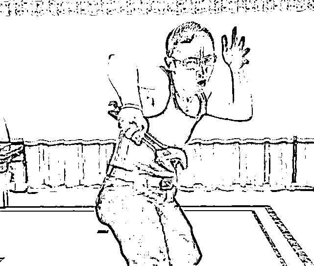

# 打架，要懂法，要懂人体，要懂人性

> 原文：[`mp.weixin.qq.com/s?__biz=MzU0MjYwNDU2Mw==&mid=2247506184&idx=2&sn=6049b969e2cd0a770203bf3712f6bdb1&chksm=fb1ab574cc6d3c62f1b56a128606d92844cd0f332b6ff49a6a3bdf52979964fa5979d82423d7#rd`](http://mp.weixin.qq.com/s?__biz=MzU0MjYwNDU2Mw==&mid=2247506184&idx=2&sn=6049b969e2cd0a770203bf3712f6bdb1&chksm=fb1ab574cc6d3c62f1b56a128606d92844cd0f332b6ff49a6a3bdf52979964fa5979d82423d7#rd)

[昨天我甚至都暗戳戳的跟你讲，某些美剧里，聊的不要太透彻。](http://mp.weixin.qq.com/s?__biz=MzU0MjYwNDU2Mw==&mid=2247506143&idx=1&sn=b8b71d41c5a0668f09fa38f2f574e202&chksm=fb1ab4a3cc6d3db53966a9a7b2b2039b040b297f296ec5e134bd2261843fd0c015f6bc16592e&scene=21#wechat_redirect)

很多人还是不懂，始终不理解怎么样能够低成本且有效地解决问题。 

他们一旦听到布局，就认为动辄需要忍气吞声个十年二十年，像黄裳一样躲在深山老林里憋大招，等大招憋出来，敌人都老死了。

其实是人和人的理解力不同。有的人我说一，他听一。有的人，我说一，他早就一二三四五六七了。还有的人，我说前门楼子，他一个劲的纠缠胯骨轴子。

呵呵。

没人给你说不能当场出气，想快点没问题，问题是，你方法得对呀。

那咱们就说打架这件事，打架不全是用拳头打的，明白么？ 

我昨天说，如果真的是一挑九，张伟丽去了也没用。 

因为这里面有个很关键的问题你没有弄清楚，那就是武学，包括格斗武学在内的武学，和打架，是两码事。 

武学，是一种贵族运动，这不是能不能打的问题，而是在什么条件下打的问题。 

你今天看到的有些武学其实就是健身体操，没有实战性。可是那些有实战性的武学，里面也分两种。 

一种是表演性质的，一种是竞技性质的。 

马保国老师经常喜欢点评，以武学大师自居，他还曾经放下狂言，说要教张伟丽怎么打拳。 

事实上我们都看到了，马保国老师第一回合就被业余拳手，KO。

那么反过来，竞技类格斗拳手就很能打，是这样吗？

不是的。

曾经有记者采访过成龙，成龙关于武学，讲过一段话。 

武学有表演类的，你比如李连杰练的那种，大开大合，打起来非常漂亮的，那就是表演类武学，主要是上台献艺。

也有竞技类，成龙认为如果打架，李连杰打不过他，理由就是自己学过竞技类武学。 

所谓竞技类武学就类似八角笼里，或者拳坛上，两个人对打，看谁得分高。

那么记者接着问，如果路上遇到一群混混，成龙可以一挑几？ 

成龙就说，如果这样，转头就跑。

因为即便是竞技类武学，和街头打架，也是两个路数的。

竞技类武学的本质仍然是限定条件下的，换句话说，是有底线，有规则的。

赛场也是一种舞台呀，无论是拳击，格斗，都是有底线的。你能撒石灰么？你能掏裆么？韦小宝那些招数你能用吗？

现实中打架，完全不是那回事呀。

所以即便找一个武学大师去打架，以他那种有路数有原则的打法，也不可能一挑多的。 

这一点我们被很多影视作品迷惑了，因为我们是一个武侠小说盛行的文化环境。 

金庸那些就不扯了，太玄幻。即便是近代的传说，什么黄飞鸿一个人打一群，或者叶问一个打十个。 

这些是影视塑造，不是历史真相。 

武学说到底，是贵族之间的游戏。 

就像春秋时期，两个国家打仗，是约定好了时间，地点，点到为止。 

为什么有宋襄公之仁的说法？因为他处在历史的转折点上，从那往后，战争不再局限于贵族之间了，战争的规则变了，变得没规则。

商鞅是怎么智取河西的？ 

他给公子卬写信，说要和谈。公子卬欣然同意，到了商鞅的营中就被扣下了，接着商鞅趁对方没有主将，发起进攻，大破之。

人家为啥来？是因为相信你有规矩，你为啥能赢？是因为你根本就没有规矩。 

所以你想想看，竞技类武学为什么能击败传统武学？因为不讲武德。街头打架为啥成龙遇到都跑？因为更不讲武德。 

所以怎么才能打败街头混混呢？方法已经浮出水面了呀，除非你比他们还不讲武德。

风清扬说过一句话，武功高不是万能的，无论你武功有多高，如果对方只是想赢，办法多的是。 

方法灵活一点，武德下降一点，大宗师都能干翻他，何况几个混混。 

所以我们站在烧烤店黑衣女子的视角下想一想，你方只有两名女子，对方一群男子。

当你拿起啤酒瓶敲对方头的时候，实际上你内心深处还是认定有规则的。

最起码，你以为他会遵守单挑的原则。

问题是对方守规则吗？没有。他们男打女，多打少，完全是耍流氓，没有规则的。 

理解了？ 

当你身处弱势的时候，你要么先逃再报警，要么，你就要一击必杀。

面对一头熊，你不能一击必杀的时候，又忍不住惊吓它，它会怎么样？它会扑向你的。

它是畜生，它没有底线的呀，明白了吗？

你怎么能默认对方就不会男打女，不会多打少呢？ 

我们今天就聊打架。 

如果真的要打，两个女人对一群男人，不是不能打，但是要有方法。

这个方法，我不是专业的，你可以去看陈鹤皋。

陈鹤皋，浙江杭州人，人称格斗陈。

他是浙江武警总队的特聘指导，专门教警官们徒手防卫，也就是说在没有携带武器的情况下，比如没有警棍，没有枪的情况下怎么制服歹徒。

那么陈鹤皋的秘诀是什么呢？ 

就是专门走下三路，插眼，踢裆，咬人脖子，抓蛋蛋，用扳手当双截棍，用剪刀，锅铲，各种击刺。

打架的时候，还要上蹿下跳，大声嚎叫，所以被传统的武术学派，视为疯狗流。 

这些名家大派为什么看不起他？ 

其实就是我前面说的，武术本质上是贵族运动，是有规矩的，你像他这种不讲武德的打法，严格意义上讲，不属于武术。

因为他非常符合我常说的那句话，你到底是要辩个输赢，还是要赢。 

陈鹤皋就是只要赢，赢就够了。

事实上，他的教学成果非常出色，赢麻了。 

因为他的教学重点从来不是武学，是什么？是法律。

你没有听错，他教弟子，先教法律，法律务必教到精通为止。 

为什么？因为太有自信了。

他有绝对的把握能赢，唯一担心的是事后怎么定性？ 

是正当防卫，还是防卫过当？

这就是为什么他的教学重点在法律上，而不在于格斗。 

他要确保你事后免责，而不仅仅是打退歹徒。 

陈老师教过的弟子，战绩辉煌。 

张泽忠一人对付 11 名持械歹徒，击倒 5 人，逃跑 6 人；

冯建汉一人打跑前来行凶报复的 12 名歹徒；

刘杰一人击倒 7 名手持凶器的行凶歹徒；

江兵华一人打散几十名围攻歹徒。

他还有一个很有名的弟子叫做罗神贵，这人因为见义勇为，被小偷打击报复。三个手持匕首的小偷围堵他一个人，结果被他反捅死一个，伤两人。

他没有被判防卫过当，而是无罪释放了。

你注意，歹徒 3 人，他 1 人，歹徒持有凶器，管制刀具，钢管，他空手，或者只持有剪刀之类的生活用品。

在这种情况下，本来就是没有争议的正当防卫。即便如此，他仍然不放心，你知道战后他的表现是什么？

他在这么辉煌的战绩之后，表现出的不是冷静，更不是像黄飞鸿一样摆 POSE。而是装作惊慌失措，一直演，一直演，被警车带走后还一直演。

他始终在说，我好怕怕，我好怕怕，我不知道发生了什么，他们要杀我，我好怕，这样神情恍惚的状态一直演到被无罪释放。

他需要给自己的辩护律师以足够的理由。

律师为他辩护，说我的当事人手无寸铁，曾经是个见义勇为的英雄。现在被三个手持利刃的歹徒围攻，他十分恐惧，惊慌失措，在巨大的精神压力下，崩溃了，上蹿下跳，大呼小叫，双手乱舞，无意识间不小心夺取了歹徒的匕首，又碰巧歹徒撞到他的刀口，导致死亡.......

你看到了，陈老师为什么教你先精通法律，然后像疯狗一样大呼小叫，上蹿下跳？

就是要表现自己已经被吓疯了，现在自己是疯子，自己是在精神错乱的情况下，发生后面的这些事儿...... 

换句话说，他早已做好了一切准备。他的备案可不只有一套。即便万一被判防卫过当或者互殴，他的律师也会按照他设计好的路数，给他打“在精神错乱的情况下的失手”这个方向。

你看到了，方案 A 如何，方案 B 如何，法官要什么，律师要什么，都准备好了，打架前就准备好了。

证据链齐备，这就叫专业。 

**打架需要的不是冲动，是专业。**

你一个女子，被男子调戏，第一反应是惊慌失措，高呼救命呀，杀人啦，不丢人的。 

做弱者从来不丢人，无论你多冷静，表现出来精神崩溃的样子不丢人的。你表现得越精神崩溃，越有利于后面事情的推进。 

你现在回头想想看，[小号记忆承载 3 聊深圳的宾利姐和路虎哥，一个躺倒，另一个马上躺倒。](http://mp.weixin.qq.com/s?__biz=MzU3NDc5Nzc0NQ==&mid=2247517636&idx=1&sn=0b468e01436dde405d7b877594b68b2a&chksm=fd2e271aca59ae0c2934d76559c26968fa90ff494ef57ed050c883ac5b8e155658dd40bec7c2&scene=21#wechat_redirect)

这就叫专业好吗？都是亿万富翁，碰瓷起来一个比一个内行。所以人家才能成亿万富翁，理解？

深圳那俩亿万富翁给你诠释的就是打架的时候最鸡贼的路数了，先躺平，假装心脏病突发，要求送医院，医疗费精神损失费等等等等，朝这个路数上走。

如果你说，咱丢不起那人，那就按照陈老师的路数走。

你要是理解了陈老师的路数，你就不会挑啤酒瓶。那玩意儿是空心的，除了皮外伤能有啥用？

而且这个动作，很容易事后被判定互殴，而不是正当防卫，假如他还手不那么狠的话。 

换句话说，如果你选啤酒瓶，你敲他一下，他敲你两下，然后罢手。很大概率最后被判互殴。他之前调戏你，那是另一项罪，和打架是两件事。

如果你敲他一下，他敲你二十下，互殴的风险是消除了，可是结果呢？你必然重伤。

所以无论这场架怎么打，选这个工具都对你不利。

以弱对强，只有两点。 

第一、怎么让摄像头认定你受到了生命威胁。第二、怎么样一招就结束战斗。

这个生命威胁法律认可的只有强奸，杀人，抢劫和绑架。从开始你就要想清楚这四点是怎么判定的，需要对方表达什么态度，需要对方持有什么工具，然后你准备以哪个为出手的理由。

接下来，你只有一招明白么？以强打弱才可能有很多招。以弱打强，你只可能有一次出手的机会，所以当然要做铺垫，当然要选择正确的工具，正确的方法，正确的目标。

其实说穿了，很简单的，要懂法，要懂人体结构，要懂人性。

这三个你都懂了，没那么难的。 

陈老师自己也不是练家子，但是他精通法律，精通人体构造，精通人心人性。他教警官们也是在教这些呀。

真论打架，这老头不牛的，如果有第二次出手的机会，他谁都打不过。

问题是，他就不给强者第二次出手的机会。想通了吗？而且因为他精通法律，他非常清楚什么模式下，将来怎么判。

而对面那个强者，他做好准备了吗？没有的。

他以为他是个男人，他以为他很强大，他以为还有很多轮的。在第一招的时候，他绝对没有想过要把事情搞大，因为他也不想被判。 

**他只是来打架的，而你根本就不是来打架的，所以他才会输给你，懂了吗？**

就像昆山那个宝马纹身哥，他拿刀背吓唬人的时候，想过真的要伤人吗？

其实没有的。他只是抖威风。

但是他无意间点亮了对方正当防卫的全部先决条件，而那个你看着唯唯诺诺的脚踏车小哥，他才是真的狠人。

他就不是来打架的，他是来结束打架的。所以这个案例最后就是正当防卫。

有人老在问，对方一群人怎么办？说明你根本没有思考的习惯。

陈鹤皋为什么先教你精通法律？因为他这些套路，只对混混有用。

如果你面对的是国际雇佣兵组织，你还这么做，你死定了。方法不是乱用的，是有目标受众的，你面对的是混混。

陈鹤皋的弟子为什么动辄一个打几十个？怎么打的？成龙，叶问都做不到的事情，怎么做到的？

因为不用打完几十个呀，混混欺负人，什么后果都想过，什么打着打着受伤了，或者被关几天，他们都想过。唯一没有想过的，没有心理准备的，就是第一招，大哥已经没气了。

面对这种情况下，他们只有两种反应，要么一哄而散，要么就是他们先报警了。 

所以陈鹤皋才花费 90%的精力教你法律，教你如何界定正当防卫与防卫过当。因为后面才是重点。解决当场的问题不算完，你得被判正当防卫才算完。

我知道有些读者特别轴，一定要我把馍嚼碎了，我非得手把手教你怎么点亮那几个无限正当防卫的先决条件，然后桌上选什么，对方身上瞄准什么，怎么抓住别人的心理，怎么怎么怎么。

问题是，这些细节我没法说呀，理解吗？

陈鹤皋是报备过的，就像开锁，你去看看，哪家开锁店门口没有贴警方报备这几个字？

哪家开锁店的老板敢随意教授开锁方法？这是不被允许的明白吗？

我没有资格，没有这个资质，没有这类业务的牌照。

我能够做的仅仅是告诉你，其实锁，是可以开的。