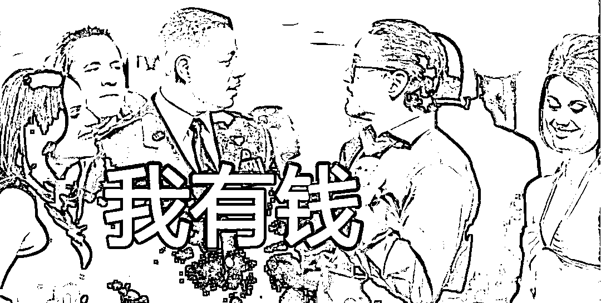

# 有功夫瞎琢磨解封后的上海楼市，不如研读一下统一大市场

> 原文：[`mp.weixin.qq.com/s?__biz=MzU0MjYwNDU2Mw==&mid=2247504935&idx=2&sn=5580239c9384b780df3979f3bd8178b7&chksm=fb1ab85bcc6d314d7cf8be23d2796712a82ecc51547047c3efe01ebbbfbf0bb883bf011ba429#rd`](http://mp.weixin.qq.com/s?__biz=MzU0MjYwNDU2Mw==&mid=2247504935&idx=2&sn=5580239c9384b780df3979f3bd8178b7&chksm=fb1ab85bcc6d314d7cf8be23d2796712a82ecc51547047c3efe01ebbbfbf0bb883bf011ba429#rd)

有个上海的读者跟我说，他担心解封后，他们家房价不保。理由是最近他在朋友圈里，各个业主群里看到的都是负面情绪，牢骚。

大家都说，要把上海的房子卖了，搬到深圳去，搬到江浙沪其他城市去，甚至，要搬到国外去......

于是他就问我，那你说这么多人都有卖房的意向，自己怎么办才好？

我觉得这个问题很可爱，可爱到不值得思考。

你去看看武汉的楼市，后来怎么样了？两年前武汉封闭期间，也有很多牢骚，也有很多人说要卖掉房子搬到别的城市去，然后呢？

然后就没有然后了。

人的情绪来的快，去的也快，所以避险情绪，风险情绪会引起股市，汇市，商品期货市场的巨大波动。因为有了情绪马上就可以付诸行动嘛，交易周期短，点点鼠标就开仓了。

情绪能不能影响楼市？几乎不能。

影响楼市三要素，金融，土地，人口。为什么会是这样？

因为房子挂牌交易的周期太长了。你今天脑子一热挂牌出售，想要搬到别的城市去，几个月没卖掉，你的情绪已经恢复了，该干啥干啥，就这。

你以为搬家很容易么？重新找工作，给孩子联系学校，那是一个系统工程，不是头脑发热就能搞定的。

所以你跟我讲情绪会影响房地产的价格，我笑了，那你倒不如去看看统一大市场，我觉得这东西从某种意义上讲，影响力恐怕都比你的情绪强。

统一大市场，背景是什么？这句话诞生的前提是什么？是市场其实还是不够统一，或者说，地方保护主义，小圈子，包括垄断，都是存在的，所以才会把统一大市场作为重点提出来。

举个例子，就说上海。上海的浦东新区和南汇区之间，曾经路是不通的。为什么呢？道理很简单，不愿意企业流出。

你想嘛，站在浦东新区的角度想，你这儿发展的好，企业都来了，人才都来了，什么高？地价就高。

地价高了企业就有外溢的动力。南汇区最北边和你浦东新区最南边是接壤的呀。我办个公司弄在南汇区，或者买房买在南汇区，享受你浦东新区的配套，是很近的嘛，挨着。

浦东新区肯不肯？当然不肯。不肯的办法是什么？就是让路不接壤。修路不修通两个区，在两个区交界处还建满住宅区。

路不通，你就没法享受配套，你要享受就要兜圈子绕远路。这样对南汇区的发展肯定不利，但是对于浦东新区而言，肥水不流外人田。

这事儿后来怎么解决的？只能撤掉南汇区，并入浦东新区。

你注意，我没有黑上海的意思，这种事在各地都十分普遍。比如杭州，杭州的读者不要介意，既然点名了上海，你们出来陪站一会儿也好。

杭州西湖区的西边与余杭区的东边接壤，西湖区经济发展的好，也是这个路数，修断头路，然后建一排房子，还专门建别墅区，把路堵住，就是不通余杭区。

原因和浦东新区是一样的，为了自己的高地价。

不过这件事后来被结束了，终结者是阿里，阿里主动越过那片别墅区，跑到西边的余杭区建总部，带动了一堆巨头过去开公司，结果余杭区咸鱼翻身抖起来了。地价噌噌噌地涨。

抖起来的余杭区还算大气，把与西湖区之间的路修通了。以德报怨。这故事你去阿里参观做客，人家都会讲给你听，他们总部当年建起来的那些小段子。

上面两个例子我能够当玩笑开，说明其实还不算很严重，我没有点名北方，不是北方没有，恰恰是因为更严重，以至于我都不方便当笑话讲了。

山头主义，保护主义，垄断，会带来一个什么问题呢？就是让资源无法顺畅地流通。

流通与不流通之间的差异有多大呢？我们举个例子，对比一下。

日本战国时期，有很多大名，这里面绝大部分都是采取地方保护主义措施的，但是有一个例外，这个例外的人就叫做织田信长。

信长有个政策直到后世都很有名，叫做乐市乐座。

乐市乐座就是 400 年前，日本安土桃山时代的超地域自由贸易活动。

乐市乐座并不是说税没了，而是说收税的中间机构没有了。 

这个中间机构在日本安土桃山时代就叫做座。

座，实际上就是行会，玩过太阁立志传系列的都知道座是什么。 

那么除了座之外，就是寺庙，这一点游戏里都有体现。 

座是一种商业行会，[寺庙其实也是一种商业机构，这一点我们说过两期了。](http://mp.weixin.qq.com/s?__biz=MzU0MjYwNDU2Mw==&mid=2247504855&idx=2&sn=48581034a586d5a50d323aac3d886624&chksm=fb1abfabcc6d36bd0fe5fd8f238ec34f39a615f80976eb7e69c1a5bda12748554e68a4888f59&scene=21#wechat_redirect)

他们做什么事呢，就是放高利贷，垄断商圈以及收过路费。 

你像游戏中堺这个地方，豪商云集，实际上有自己的武装力量，而石山本愿寺，这个寺庙社团和大名也没啥两样了。

那么一旦成立了座，也就是行会，就会排它。排斥外部的商人进入，实际上就是垄断。 

而且小商人要缴纳大量的利润，大商人也就是行会的控制者也就会越做越大。 

这一点很多读者应该都有体会，你看电商平台就能看出来。

比如淘宝的商家很多都在抱怨，说自己大部分的利润都拿来买排名买流量了。 

不买，你就做不下去，买，赚的钱又回到了平台兜里。

回到日本战国，战国时期的这些商人社团和僧侣社团越发强大的结果就是大名们实际上是收不到商业税的。 

因为你像石山本愿寺，占据着后来的大阪，僧兵很猛，玩过幕府将军系列的都有体会，而堺这种地方不仅仅是豪商云集，也是铁炮云集，所谓铁炮洋枪队，附近那些小大名，还不见得能打得过人家。

乐市乐座这个策略并不是信长首创的，早在天文十八年，六角家就在观音寺城，就是后来的安土城搞过城下町，所谓石寺新市。今川家也搞过。但问题在于，他们控制的区域太小了。

就好比人家商业行会，或者说座的经营范围是 100，你的实际控制区才 2，你在 2 这个范围内搞自由贸易，对人家 100 的经营范围而言，没有什么真正的影响。

但是信长就不一样了，到了安土桃山时代，他已经占据了日本 1/3 的地盘，而且都在近畿地区。

这也意味着，他可以推行真正有效的自由贸易。因为实际上他有能力说了算。

那么这个时候，小商人就不需要再去巴结商业行会，也不需要看寺庙的脸色，可以直接行商了。

这极大地促进了信长领地内的商贸繁荣。换个角度想，信长也就很有钱了。

这是信长能够打破多次其他大名针对他组建的包围网的最重要的实力之一。就像蜘蛛侠问钢铁侠的超能力是什么？钢铁侠回答：我有钱。

换句话说，信长是个调度资源的高手，就像[我们之前小号聊的](http://mp.weixin.qq.com/s?__biz=MzU3NDc5Nzc0NQ==&mid=2247515317&idx=1&sn=566bee993e4100b7ce5c192fa86e3194&chksm=fd2e1e6bca59977dde63c95aacd82ceee541577fd5492e35e9a051868c10f55d5b8dd3aa9f5a&scene=21#wechat_redirect)，他能够让资源充分的流动，从而产生更高的经济效益。 

所以统一大市场这件事如果能够充分地落实，效果一定是巨大的。 

当然这里面有难度，难度是显而易见的。 

你想一想，浦东为什么不愿意与南汇分享？西湖为什么在通往余杭的路上修别墅阻挡？ 

原因只有一个，人性。 

我聊过很多次《白鹿原》，你说白嘉轩是不是个好人？肯定是。

但是白嘉轩有没有局限性？绝对有。

他地多，打的粮食多，如果周济下族人，他是肯的。但是如果让他把好地分给族人一些，他就不肯了。

明白这意思么？他愿意给你鱼，不愿意给你渔。 

他的先发优势，他的相对优势，是他不愿意放弃的。 

你想嘛，有钱人就那么多，如果有钱人流入隔壁区，把房价洼地抬上去，那么这个区，就可能每平米少涨那么一两万。而且如果人家发展得比你还好，可能你就被超越了。 

这是切身的利益。 

但是，这是一种短视，换句话说，你只看到了人家当下分走你的肥水，你没有看到把蛋糕整体做大之后，你可以拿到更多。 

这就是统一大市场为什么会被提出，而且我相信会被强力推行。 

因为你想把蛋糕做大，指望下面的执行者是很困难的。当自己切身利益相关的时候，人都是短视的。

部门经理们是打不破部门墙的，只有利益无关的更高一层站出来，才能打破部门墙。

而部门墙打破之后，公司又会迎来新一轮大发展。