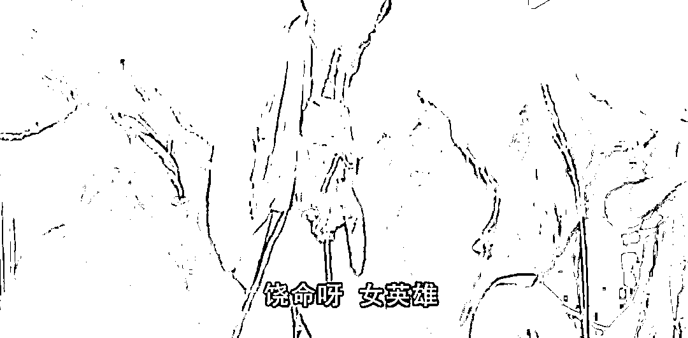
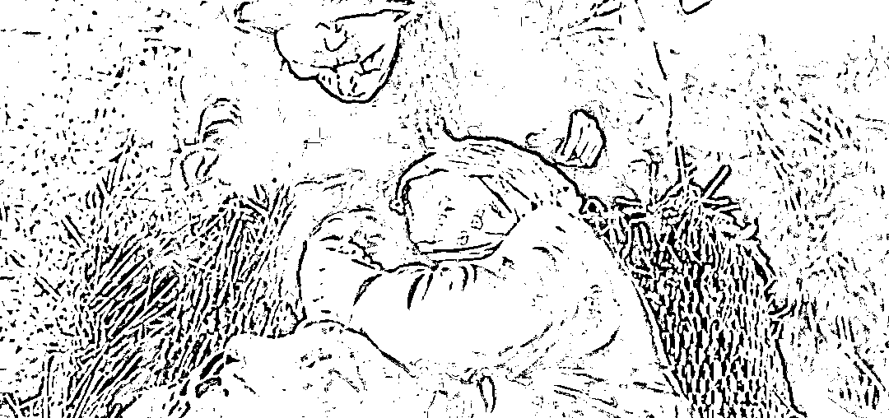
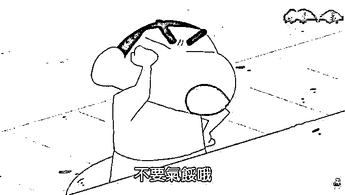

# 我们是至尊宝，病毒才是春三十娘

> 原文：[`mp.weixin.qq.com/s?__biz=MzU0MjYwNDU2Mw==&mid=2247504701&idx=1&sn=0ac4660981fd7e714b582c4e481f9eae&chksm=fb1abf41cc6d36575ef75a7ac0ed35b6b9951de2ccc7c7d90551744d3b863baf7127417a7556#rd`](http://mp.weixin.qq.com/s?__biz=MzU0MjYwNDU2Mw==&mid=2247504701&idx=1&sn=0ac4660981fd7e714b582c4e481f9eae&chksm=fb1abf41cc6d36575ef75a7ac0ed35b6b9951de2ccc7c7d90551744d3b863baf7127417a7556#rd)

[昨天夜里的 2022 年有什么机会](http://mp.weixin.qq.com/s?__biz=MzU3NDc5Nzc0NQ==&mid=2247514883&idx=1&sn=e3ac3d7ab72b558f929b1aa0642d8c25&chksm=fd2e19ddca5990cb20f2e62dd48a3f38953f07b52c980223c0af6ad76c065987e5fad8aac1fb&scene=21#wechat_redirect)，很多人应该都看过了。

其实我说话还是委婉了，真要是放开了说，就是本山大叔那句话，还要啥自行车呢？

人这东西吧，首要的是认清现实。

如果说 2019 年之前的人类是泰坦尼克上的灯红酒绿，觥筹交错，那么此后就是撞冰山。

人类遇到疫情的过程跟泰坦尼克撞冰山没有什么实质性的差别。

就像有人老问原油的价格什么时候能回归正常，所谓回归正常就是从高点开始腰斩。

这个问题很容易思考，你这么想就明白了。

如果原油价格始终这么高，那只有两种可能，一种是美元要变成金圆券，因为石油是以美元计价的嘛；第二种就是人类的经济，你懂的。毕竟人类经济能够接受的油价在什么范围内，国际市场心里明镜似的。

所以换句话说，什么时候油价正常了，不仅仅是俄乌战争结束，也是经济恢复正常。

什么时候正常？那你要去问欧洲了。

泰坦尼克撞冰山了，美俄掉在水里，都想找块木板，找不到，于是只好把欧洲的脑袋按在水里，拿他当木板使。

你说到底能按多久，要看欧洲的肺活量了。 

说穿了就这么回事嘛，你以为俄罗斯打乌克兰，军费谁出的？就是欧洲出的呀。

俄罗斯那么穷，哪来的钱打人？他就是因为知道打了人才有钱，所以才打人呀。

他是个卖能源的，打了人，能源涨价了，他才有钱继续打。

能源价格只要恢复正常，俄罗斯马上不打了，没有金主爸爸，用什么打？

涨价后的能源谁买走了？欧洲。

是不是很有意思？这个逻辑听起来很搞笑，合着欧洲出钱，请俄罗斯出面打乌克兰。

欧洲不想的，架不住美国想。因为美国也需要钱，美国需要让欧洲的富豪觉得欧洲不安全，不适合投资。

你看，泰坦尼克撞冰山，美俄看着有仇似的，其实不约而同的把欧洲按在水底下当木板。

我经常说兔子以德服人，但实际上兔子也没少按。

兔子以前和鹰酱家的大统领签能源订单，价格是固定的。现在兔子发现，能源价格涨了，于是动心思，那我何必自己用呢？我干脆把鹰酱家的能源，二手高价卖给欧洲，挣个差价，回头从大毛那里多进口点平价能源，我不还是有得用么。还白挣一笔。

当然，这么做是道德的，原因很简单，是美俄把欧洲按在水里当木板，我们只是发现他已经是木板了，忍不住也按了两下，借助点浮力。

毕竟说穿了，我们也找不着木板，能省点力气也好。

这个过程中没有谁是赢家，大家都是苦中作乐，你以为我在说笑，其实我在苦笑。

大毛不想打架，鹰酱不想煽风点火，欧洲不乐意憋在水里，我们也不想当二道贩子。

没有一个人乐意今天的局面，没有。

如果你把人类看作一个整体，到目前为止，我们被病毒按在地上摩擦，没有一个赢家。

所谓我们号称地球村最靓的仔，实际上是下面这样一种形式。

病毒就像春三十娘，她根本就是蜘蛛精，人类就像至尊宝那帮山贼，完全被对方碾压。

无论欧美还是日韩，都被春三十娘随意的扇耳光，我们所谓表现的最好，仅仅是说我们像星爷一样，护住了脑袋，趴在地上，撅起屁股，说，别打脸。

这就是现实，这不是电影。看电影的时候你觉得泰坦尼克撞冰山，一群人在往水里扑腾很滑稽，看电影的时候你觉得春三十娘要看至尊宝一群山贼的脚底板很滑稽。

那是因为与你无关。

现在你，我，他，我们全都人在局中。

黑山老妖要吸阳气，唐僧搬起悟空的脸，悟空搬起唐僧的脸，都想让对方先被吸。

好笑吗？一点也不好笑。因为我们不在看电影，我们分明就是电影。

你以为互联网裁员跟什么有关？跟经济有关。

说到底，互联网是管道，又不是财富的两端。

财富的两端是消费者与生产者，互联网仅仅是个收过路费的，当过路的客商变少的时候，你管谁收过路费呢？

[就像小号昨夜说的](http://mp.weixin.qq.com/s?__biz=MzU3NDc5Nzc0NQ==&mid=2247514883&idx=1&sn=e3ac3d7ab72b558f929b1aa0642d8c25&chksm=fd2e19ddca5990cb20f2e62dd48a3f38953f07b52c980223c0af6ad76c065987e5fad8aac1fb&scene=21#wechat_redirect)，你觉得普宅不涨豪宅涨是好事么？当然不是。

普宅不涨说明普通人对自己的工作预期下降，豪宅涨说明商人对自己的事业同样预期下降。

而当下真正影响人类经济活动的最大的制约因素，就是疫情。

疫情真正的问题不在于死亡率而在于传染率。这一点我解释过八次，从三年前就开始解释。

你觉得手足口有啥死亡率么？没有。但是这东西传染率高呀，传染率高，就会影响经济活动。

你出门吃饭，会感染手足口，你还去这家饭店吗？你看一场演出，会感染手足口，你还会去看吗？

你的意愿一定是下降的，这跟死亡率无关。

这就是为什么欧美躺平了之后，经济指标仍然没有好转。因为传染率变强了，而不是变弱了。

我们人类没有那么强，起码没有想象中那么强。如果科技真的很牛，不至于三年过去了，也没找出办法。

所以我前面那个比喻并不夸张，病毒相较于我们，就是黑山老妖，春三十娘。

人类到目前为止能够想出来的所谓办法，仍然属于死道友不死贫僧这个范畴内的。

问题是，欧洲能在水里憋多久呢？

所以其实全世界都在积极的找办法，你不要以为各种搞笑的办法就不是办法，比如唐僧把悟空的脸掰过来，让黑山老妖先吸他。

人，要是有不搞笑的办法，谁也不乐意用搞笑的办法。

每一代人都有每一代人的难，上上一代人经历过二战，上一代人经历过贫穷。

我们后台每天能收到无数问题，隔离的问题，看病受影响的问题，买菜的问题，工作上的问题，行业没落的问题.......

其实抱怨是好事，明白吗？

抱怨，嘈杂，说明什么？说明我们没有被黑山老妖给吃了。

人活着就是要解决问题的呀，解决不了也得苟着，就这么苟着，苟下去。

你们的父母已经退休了，你们的子女还没有成年，我也一样，我们都一样。

你指望谁去呢？

我也很想跪在春三十娘面前喊两句：女英雄。然后她就念在我男儿膝下有黄金的份上，把我当个 P 放了。

问题是生活不像电影，没有这么多喜剧的选项。

我们这一代人，已经是社会的中坚力量了。不管你乐意不乐意，你就是。

如果你是老板，睁开眼睛你就得开工资，如果你是员工，睁开眼睛，你就得拿钱回家养妻儿老小。

即便当着春三十娘的面，当着黑山老妖的面，也得如此。

全文都是负能量，结尾来句积极向上的。

借用蜡笔小新的那句话：打起精神来。

