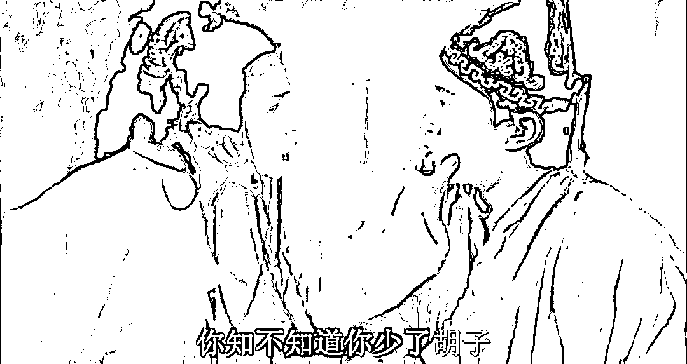
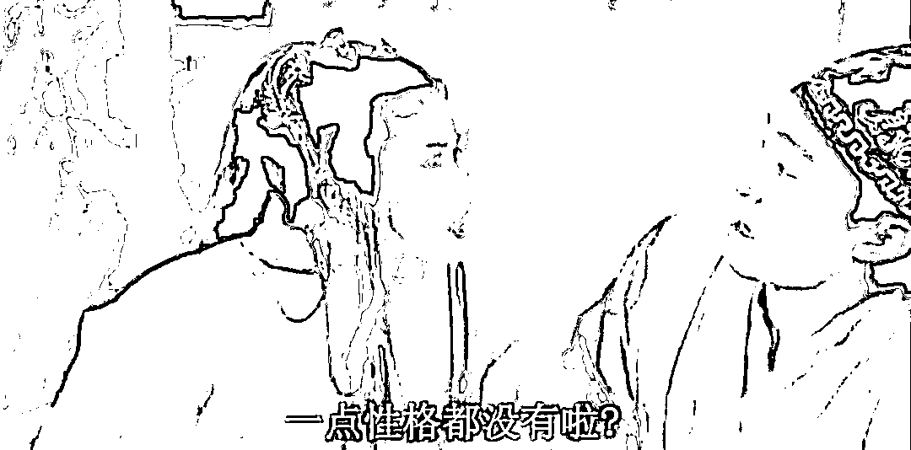
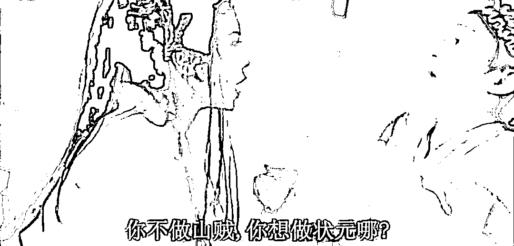
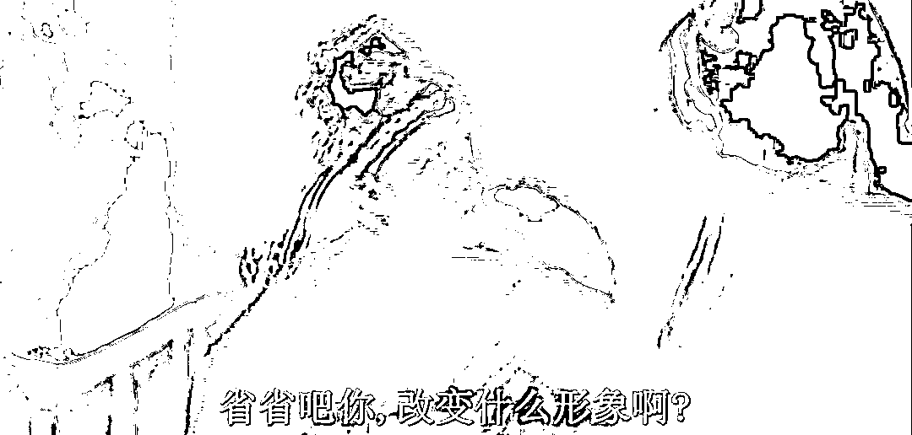
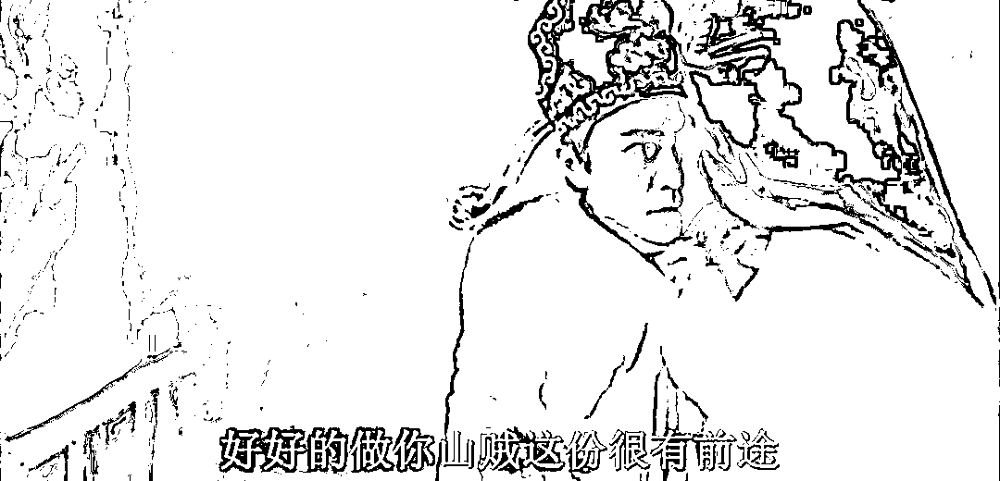
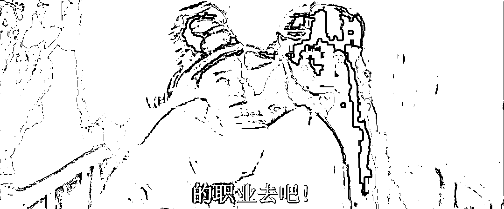

# 美国禁止俄罗斯部分银行 SWIFT 结算，意欲何为？

> 原文：[`mp.weixin.qq.com/s?__biz=MzU0MjYwNDU2Mw==&mid=2247504307&idx=1&sn=3fd54c1f0b229ef6f81d2585bc84efb9&chksm=fb1abdcfcc6d34d9d8fe8d0bd692f6d33b3c65fe4f5d78067c13e613eaac913a67e922ff114e#rd`](http://mp.weixin.qq.com/s?__biz=MzU0MjYwNDU2Mw==&mid=2247504307&idx=1&sn=3fd54c1f0b229ef6f81d2585bc84efb9&chksm=fb1abdcfcc6d34d9d8fe8d0bd692f6d33b3c65fe4f5d78067c13e613eaac913a67e922ff114e#rd)

一直有读者在大号问，怎么看俄罗斯被美国踢出 SWIFT 结算系统。 

我看了下后台数据，还都是那种铁粉在问，铁粉就是几乎篇篇读，有大量互动的那种。 

不应该，这种问题不应该。因为我全都写过的。

我很早就提到过，一笔带过，我说美国如果不能打，那唯一能做的就是继续制裁。问题是，美国一直在制裁俄罗斯，还能怎么制裁？俄罗斯最大的贸易伙伴是我们好不好。

你美国再制裁俄罗斯，又管不着我们，俄罗斯仍然是想买啥工业品，都能买到。 

至于俄罗斯和西方世界之间，弄清楚谁求谁。俄罗斯是能源大国，又不是工业品大国。 

我听过工业品的怕制裁，我还没听过卖原材料的怕制裁的。 

你怎么制裁一个卖原材料的？你动动脑子，卖原材料，卖的又不是附加值。

这个道理很简单，卖原料的基本上都是光脚的，你卖的产品附加值越高，附加值利润越高，你才会考虑与人交流，合作这些问题。

农民卖粮，你买，他挣钱，你不买，他留着自己吃。雕爷牛腩这种，成本 15 块，卖出去 150，这种才是要维护好与客人之间关系的。

弄清楚这一点，你就不会替俄罗斯操这份心。

俄罗斯的经济真要是好了，他们就不会选择打仗，因为他们穿鞋了。问题是，他们经济不好，人家是个光脚的，难道还怕美国这个穿鞋的吗？ 

踢出 SWIFT 系统，是一种制裁手段，这种手段不会一次到底的。

你彻底把俄罗斯踢出去，欧洲人怎么取暖？怎么买天然气？怎么买石油？

至于我们，我们笑死了好不好，求之不得。本来也是用 RMB 结算，本来也没打算用美元结算。 

换句话说，这么傻的策略，你觉得睡王是睡过去了吗？他怎么可能采用呢？ 

他当然没采用，是你误解了这条消息。

准确的说法，是拜登把部分选定的俄罗斯银行从 SWIFT 结算系统里踢出去了。 

这个动作是很聪明的。 

买预期，卖事实，我说过很多次了。

拜登真要是上来第一次就把整个俄罗斯踢出 SWIFT，那他就是个棒槌，哪怕像懂王那么二了吧唧的人，也不会一上手就这么做的。 

因为预期才有威慑力呀，拳头缩起来才能吓唬对方我要打你。 

拳头伸出去，你把你的拳头直直地伸出去，谁还怕你？你还怎么打人？就像核弹，核弹不丢，将丢未丢，威慑力是最大的，真丢出去还有啥用。

拜登要真这么干，都不用俄罗斯，全世界投资人都笑死他。你等于给了大家一个确定性的交易机会，让全球投机者去薅原油天然气价格的羊毛。薅的还是西方交易市场的羊毛。

哪有第一步出牌就把底牌露给人家看的？

拜登要这么出牌，俄罗斯马上宣布，以后都用 RMB 结算。 

你拜登在选民面前还怎么下台？以后失去俄罗斯的美元，还是不是全球结算货币？ 

以后欧洲买天然气，买石油，用什么结算？也用 RMB 么？ 

睡王真要是第一张牌就这么打，除非美国连续两任总统都是我们最大的卧底，都是建国同志。

我想总不至于吧。

其实美国打的这张牌目标很清晰。 

**两个作用**，一个是禁止部分俄罗斯银行 SWIFT 的结算，意思是威胁。大毛，你是不是应该给点面子，否则拜登这边对选民也不好交待。 

虽然是鹰酱撺掇大毛打的二哈，但是大毛还是应该尊重鹰酱的面子的，这才是拜登想要的，他想要的，无非是选票嘛，让自己的选民看看，自己也不是很怂。 

毕竟，谁家选民也不愿意跟着一个很怂的老大。

另一个作用，是留有进一步制裁的空间，而且也没有像七伤拳一样，杀敌八百，自伤一千。

部分银行的意思就是说留着后门，欧洲还是可以绕着买嘛。

你看，两个目的都达到了。既没有走到亢龙有悔不可回头，既没有搞成卖事实的局面，又维护了自己的面子，争取了选民的支持，还给了俄罗斯适度的压力。 

这是非常成熟的政治选择。 

而且事实上，也只能这么做，牌要一张一张打，打架也是拳头收进来打出去，收进来打出去。 

你胳膊伸的直愣愣的，我都怀疑你小时候到底打没打过架？

拜登要是真一上来就那么出牌，直接把路彻底封死，让俄罗斯全面退出 SWIFT，连步骤都没有。 

那只有一种可能，就是拜登家亲戚在炒作大宗商品，比如石油，天然气。 

不至于吧？虽然美国很堕落，但一个现任总统这么明目张胆的赚这种投机倒把的钱，美国还不至于堕落到这份上。

那么这件事的后续，有没有可能最后走到不可收拾的地步，比如某一天，美国真把俄罗斯全面踢出 SWIFT？

可能性是存在的，但即使到那一步，也是一步一步走过去的。这是七伤拳。如果真这么打了，多半是美国民意产生的压力已经到了不得不那么做的地步了。

说实话，真把俄罗斯彻底踢出 SWIFT，主要受伤的还是欧洲，美国还好，毕竟那么干会导致石油暴涨，意味着美国的页岩油出口更有竞争力了。当然，代价是美元全球货币的位置也就被动摇了。 

我个人觉得，对美国整体利益而言，弊端远大于暂时的好处。

当然，不排除美国有可能最后走到这一步。毕竟美国总统更像大型外企的职业经理人，他关注的还是自己的职位，而不是公司的长期战略方向。 

但是从目前看，似乎没有这种迹象。

[个人感觉鹰酱与毛熊就是谈了一场恋爱，如同最初预测的那样](http://mp.weixin.qq.com/s?__biz=MzU0MjYwNDU2Mw==&mid=2247504281&idx=2&sn=82a009bbdffae680f412c1ee2fe25c56&chksm=fb1abde5cc6d34f34f6c2b5ed5fa5a8be71a9ca5d0eb365b29968f7d3759c96e41febf3f5941&scene=21#wechat_redirect)。

鹰酱就是不想加息，或者说想要拖延年初放话出来的加息，能拖就拖，能少加就少加。怎么做呢，撺掇毛熊打二哈。 

毛熊也很配合，知道鹰酱要什么就给什么，打了二哈一巴掌。 

让市场里的投资人唯一不确定的是毛熊到底想要把二哈打成啥样？是让二哈以后和毛熊一家亲，还是扇个嘴巴子就谈判。 

我们第一次的预测是倾向于后者的，因为这对于鹰酱和毛熊都是利益最大化的，双赢。

其实这也不算什么个性化的看法，应该说这才是从资金盘面来看，当下最主流的意见，我是指市场的主流意见。

你不要听一群野路子专家各种胡扯，消息满天飞，论扯淡，北京的哥司机才是专业的。

说到底，一个人没有真金白银砸进去，他说什么都是胡扯。市场的判断不一定就是最后结果，不一定日后就不会被纠偏，但是那起码是真金白银无数投资人用钱达成的共识。 

从市场盘面看，目前避险情绪有衰退的迹象。看起来鹰酱没有达成用忽悠战争来替代加息的目的，大资金目前整体上还是倾向于这件事就这样了。资金面预判毛熊会得到他们想要的，鹰酱没有彻底得到持续的避险情绪和足够的资金，但是多多少少得到了一部分。

我讲这些不是没有来源的，你比如从这篇文章定时推送的时间往前推两个多小时，你去看看高盛是怎么说的。高盛当然不会吃饱了撑的去讨论战争，但是从他们对美国加息的态度，就能看出他们对战争的看法。

另外，更重要的是，睡王的支持率上升了。你看，这才是聪明的 leader，无论鹰酱赢没赢，睡王自己先赢了。

成熟，我就喜欢这种成熟的人。

至于二哈，没有人会去管二哈的。世界的本质就是刘慈欣笔下的宇宙。

欧洲只要交了保护费，鹰酱的部分目的就达到了。鹰酱费这么大劲才弄到的保护费，不至于去打一架，轻易的烧掉。至于毛熊，毛熊给你鹰东家演了这么久的黑脸，你总得给分点吧，见面分一半是不可能的，但你好赖给点呗。

winter is coming，毛熊大冬天的披个熊皮大衣演 winter 也是很辛苦的。

当然，我们不排除毛熊真的想趁机多要点，鹰酱舍不得，一不留神搞大了。但是我个人始终比较倾向于咱们第一次的预测。因为那也是目前的资金面反映出来的方向。

毛熊其实只是想要自己的地缘更加安全一些，而鹰酱，也只是想利用二哈，迫使欧洲的避险资金回流美国，顺便再以保护欧洲的名义敲点保护费。能要多少是多少，要不了多少，睡王自己能换点支持率也好。

现在看来双方都已经达到目的了。无非都想多吃一口，就像明知道要谈了，上赶着都去卖给二哈过期武器的那些欧洲盟友，也想着能捞一笔是一笔。 

毕竟如果不打了，卖过期武器是最划算的，你又没地儿验证。

至于二哈家里负责采购的，同样是求之不得，你忽悠我，我装作被你忽悠，回头战争结束，一切都推说当时太乱了，实在搞不清楚钱花哪儿去了。 

回头过几年这批集中从欧洲采购的武器报废了，这事儿也就天知地知你知我知了。

想不明白？想不明白回忆那个盗贼与银行的例子。盗贼抢了五百万，回家看新闻，行长说被抢走了五个亿，盗贼哭了，心想，我特么挣得真是个辛苦钱。 

你看透了吧？这才是真实的世界。每个人想要的无非都是根据信息不对称的原则能捞一笔是一笔。

我没有骂谁，我又不是文人，没这毛病。 

围绕乌克兰，上有鹰酱，欧洲国家在捞，下有全世界各路投机倒把的，都在捞。 

捞就是工作呀，干一行爱一行，咱入的就是这一行。

这些天还老有新读者，不了解我是干啥的人跑出来骂我此前的分析，说我是个发战争财的。

我听了都哭笑不得。 

就像一个动物保护协会的跑去指责张飞，说猪猪多可爱，你怎么能杀猪卖肉。 

张飞也纳闷，我一个屠夫，我不杀猪我杀谁？我兢兢业业的工作在自己的岗位上我还有错了？

做国际市场的，哪个不是发战争财的？你是没见过疫情初期，巴菲特一天一个活久见那阵子，国际市场里的投机者们有多激动。开心呀，行情大呀。

至于当时美国有多少人怎么样了，那和我有什么关系？我又不是美国人。

兔子不吃窝边草，离开我家范围，你管我吃了谁家的草？你又不是居委会大妈，管那么宽，你怎么不改个名字叫宽宽？

我一个山贼，不去打劫，你难道要我去考状元吗？我去考状元，你养我啊？

