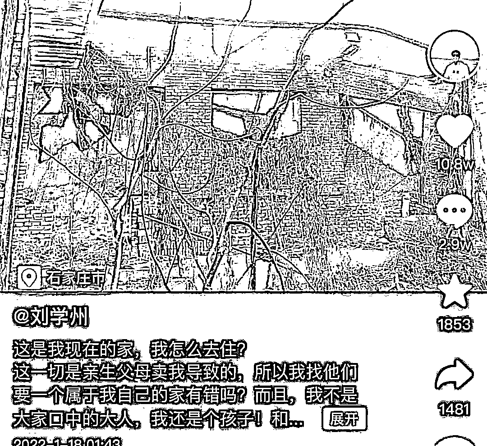
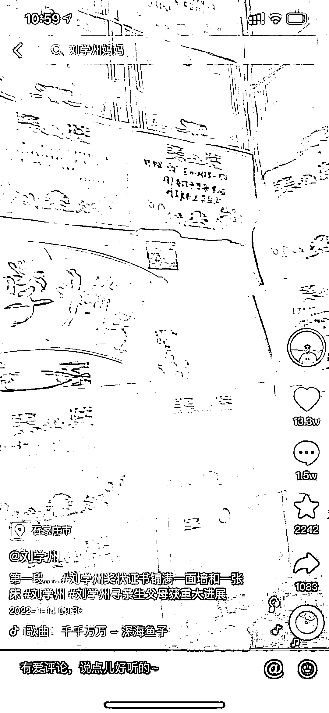

# 你出 7 万个豆子，我也不愿意教你 PUA

> 原文：[`mp.weixin.qq.com/s?__biz=MzU0MjYwNDU2Mw==&mid=2247503611&idx=1&sn=6faf443f945ba3f02ad3197b47f49d04&chksm=fb1aa287cc6d2b919b33e0b3d79ad32f4f6542235b4b2271858a69c58b8a29cda2466fa94fef#rd`](http://mp.weixin.qq.com/s?__biz=MzU0MjYwNDU2Mw==&mid=2247503611&idx=1&sn=6faf443f945ba3f02ad3197b47f49d04&chksm=fb1aa287cc6d2b919b33e0b3d79ad32f4f6542235b4b2271858a69c58b8a29cda2466fa94fef#rd)

昨天的文章，[普信男尝试做家务，温柔体贴男内助，为啥不是一条路？](http://mp.weixin.qq.com/s?__biz=MzU0MjYwNDU2Mw==&mid=2247503604&idx=1&sn=aa8a5cb4045943468edd95dabbbec1b2&chksm=fb1aa288cc6d2b9eead1250203b2b6b07752f33d22fddf5b4fde6150118e4a6009013e7725a2&scene=21#wechat_redirect)

文末我说了一句话，我说这个话题再升级，那就变成 PUA 了。 

然后就开始了一群人竞价，有人说，我出 70 个豆子，听西风讲一期 PUA，有人说出 700 个，最高有人加价加到 7000 个...... 

那我今天就来回复你们，出 70000 个也没用，不管你打着什么旗号，我认为想要学这种东西的人，居心都是不良的。 

PUA 是不可能教你的，但是反 PUA，防范别人对自己的 PUA，这个可以教，而且是免费的，是大力推广的，我希望人人都学会。

今天你们一个豆子都不用付给我，你们只要把自己学会的，教给身边的人，就是对我最好的学费。

这是我的一个基本态度，就像昨天文末说的，我终归是希望把世界变得美好了那么一点点，而不是不美好了那么一点点。 

PUA 这个东西非常常见，你在工作，学习，生活中，几乎天天都会遇到。也就是轻微的 PUA，俗称操控对方的预期。 

举一个例子，年轻的时候我和太太谈恋爱，每当我想让她做什么事情的时候，我不会跟她直接提，而是让她选。 

我会跟她讲，你有两个选项，一个是 A，另一个是 B，你选哪个？ 

其实 A 就是我希望对方选的，B 是我提供出来作为参考系的，我知道相对而言，她一定会选择 A，这就正中我的下怀。 

很多年后，我有次开玩笑，说她好傻，她为什么一定要选呢？你完全可以两个都不选嘛。 

她恍然大悟，哦，原来中了我那么多年的圈套。

这是一个非常常见的案例，美国四年一次的大选本质上就这玩意儿，你用川普的话讲，你选择希拉里，是选择资本家的代言人，你选择他自己，是选择资本家本人，他一语道破天机，就这么回事。 

看着好像你有选择，A or B，实际上无论 A 还是 B 都是别人设计好的，看似选择权在你手里，其实你的一切选择都在别人的预料中。 

你说这个故事拆穿了非常简单，那为什么我太太此前很多年都不能自察呢？ 

很正常，因为大部分人都是这样。你抛一个选择题给对方，对方下意识地就会去选，而不会思考为什么要选。

你说为什么我后来主动戳破这个游戏，拆穿自己呢？ 

因为这是迟早的事儿，她和我处久了，迟早能看破，我即使不主动告诉她，她早晚也会自己明白。

你像我儿子就不会上当，他三岁的时候你问他 A or B，他会告诉你普通的小孩子才会做选择，他当然是全都要....... 

我跟他讲，他妈妈年轻的时候很幼稚，会很老实的在 A or B 里面做选择题，他就会很诧异，怎么会有人这么想问题。

其实人都是环境塑造的，没有人潜移默化影响你，你也会是那样。换句话说，我们都是有样学样的。 

就像老员工总说，领导就会画大饼。你想过没有，为什么领导总是画大饼？

说明画大饼一定有人信嘛，你三十年的媳妇熬成婆，你不被忽悠，保不齐年轻人上来还是会被忽悠的。

年轻人会被忽悠是因为惯性，看着很简单的套路，大部分人就是无法辨别。

举个身边的例子，超市门口经常放着两种食物，薯片口香糖和临期的薯片口香糖。 

为什么这么做？就是 A or B。 

你来都来了，临走的时候不带点什么零食？带，或者不带，这是一种选择。 

临期的和不临期的，其实一样的东西，价格便宜很多，这是另一种选择。 

你所有的选择商家都想过了，所以这么设计，于是你就买了，也许你走进来的时候没想过要买，但是这一刻，你落入了选择题。 

商家 PUA 你了么？其实就是在 PUA 你， 在轻微的套路你。 

我今天给你讲的这个例子，如果你记住了，下次你走进超市，看到货架上的这个对比式商品排列，很可能脑子里第一浮现的就是我这篇文章。于是你不买了，这实际上就是环境在影响你，我影响了你。

所以罗永浩的儿子也许小学就能画大饼，贾跃亭的儿子也许初中就能写 PPT，为什么？环境的影响。 

曾经有个青年人，说自己为什么很难被赌场迷惑，因为他爸就是开赌场的，各种牌局，角子机。 

打小他爸就一台一台机器当着他的面拆解，跟他讲各种概率，以及各种 PUA 客户的方式，就像青楼里长大的孩子，你眼里的温柔，在他眼里全是套路。

人学会的套路多了，潜意识都会对别人下手。这就是我不愿意教你 PUA 的原因。PUA 就像吸星大法，你下意识地就会吸别人内力。

还举一个例子，还是我太太。 

我太太常常拿我和明星，确切的说是明星演的角色做对比 ，你看人家东华帝君，那么帅，宠妻狂魔，你看人家都教授，会瞬转，还是宠妻狂魔。

这实际上就是一种 PUA，潜在地打击对方的自信，让对方产生挫败感，然后加倍努力的对自己好，从而使得自己得利。 

这种手法咱们读者也会用，从前天开始就有女读者说，如果 C 男学习做家务，温柔体贴贤内助，说不定也有被小仙女垂怜的可能哦。 

这就是一种 PUA，画大饼，给你一点希望，A or B，A，就还有一点希望，B，就出局，你为了不出局，竭尽全力的把握那一丝的希望....... 

事实上只要认真分析，就像昨天聊的那些不怎么政治正确的话，你把各种概率盘算清楚，就知道这只是一个局。 

当然，面对局，转身离去，是不是唯一的选择？

并不是。

昨天有读者问我，如何向上管理，也就是你明知道领导在 PUA 你，你反 PUA 他，所谓的管理自己领导的预期。 

这个很难，知道为什么吗？ 

因为一个人他一定是学会了画大饼，许愿，PUA，才能做到管理岗位。 

换句话说，向上管理意味着你要 PUA 的对象本身就是 PUA 领域里的专业人士。 

这个专业人士会怎么做呢？他会假装被你 PUA 了。 

大部分有钱人都会这一招，否则他们是怎么变得有钱的？

他们都会假装很大方，假装不懂行，假装很好说话，假装对细节不关心，让你自以为得逞。

很多女孩子自以为傍大款很容易，因为大款会装嘛，明明精的跟猴一样，装成土大款的模样，让你以为得逞，自鸣得意。 

所以很多老板，他会装作被你向上管理管理成功了的样子，你以为他入了你的套，实际上你入了他的套。 

我第一次创业的时候，有次在公司门口一个小摊上吃饭，我们常务副总拿我开玩笑，点评我们大老板那个人，装的很辛苦，每天假装被下面的人忽悠了。然后点评我，说我假装没有看破大老板假装被下面的人忽悠了。

他的意思是说我们都在演戏，一群戏精。 

当然，他当时不知道，他不知道我是戏中戏。

前几天有个读者问，我当年是怎么在工作的同时并行处理了那么多事，直到最后同事同行们都没有发现工作并非我的主业。我没有回答是因为这个问题很复杂。

你演戏这是第一层，老板也对你演戏，你装作进入了对方的戏这是第二层，而上面这一切的一切本身仍然是你布置的一场戏，这是第三层。 

身在曹营一场戏；心在汉第二场戏；此汉非彼汉，其实你是汉献帝的人，第三场戏；夜深人静，无人之处，揭开面具，原来你是三体，第四场戏.......

PUA，反 PUA，反反 PUA，......，这是可以无限循环的，人生如戏，全看演技。

回到我们的主题，我没有打算开 TVB 演艺综合训练班，我们今天的主题仅仅是反 PUA，反最简单的 PUA。

这个办法很简单，就像我教我太太的那样。**跳出 A or B 就可以了。** 

昨天，一个寻亲的男孩刘学州自杀了，在网络暴力下，选择离开这个人世。

这个孩子出生的时候就被父母卖掉了，换彩礼。四岁的时候养父母又去世了。据他自己陈述，在校园里被欺凌，被猥亵。

他寻亲，是想要找到自己的亲生父母，他妈和网民却说，他只是想要房子。这就是他住的房子。

网民诽谤他学习差，这孩子拿出一整面墙的奖状。

他最后选择离开人世的地方是三亚，网民质疑他，你怎么有钱去那种地方，他解释，那是自己攒下的钱。

他用尽全力去解释，最后一句话是，你们想过没有？我只是一个 15 岁的孩子...... 

又一个六子，六子从一开始就输了。因为他一直在别人给他的选项里打转，出不来。 

他努力地向这群网民证明着自己是一个完美的受害人，可是这些人在乎么？ 

当六子剖开肚子，大家一哄而散，真的有人在乎他到底吃了几碗粉么？ 

他们在乎的，仅仅是赶着去围观下一个六子......

知道为什么我对这群网民没有气愤么？因为他们实在是太多了，比特么的蝗虫还多，多到我拿他们无可奈何。 

我能做的就是教给所有愿意听我一席话的读者一个最简单的自我保护的方法。 

我是免费教给你们的，免费，我巴不得知道的人越多越好。

那个办法就是，如果还有人问你到底吃了几碗粉。

你要怎么应对？ 

很简单，四个字：关你 P 事。

愿天底下，再也不要有像六子这么傻的孩子。