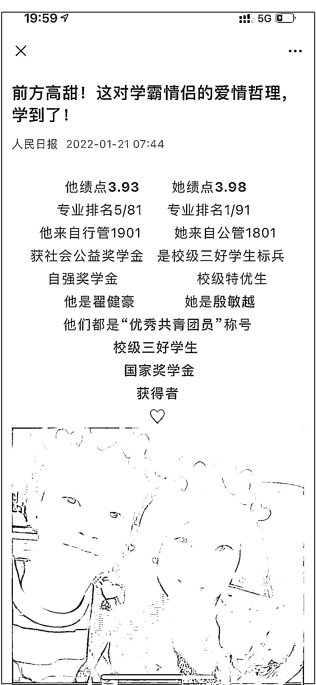
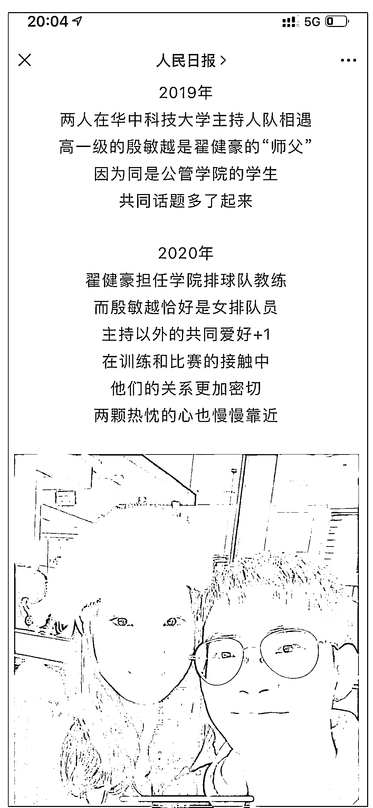
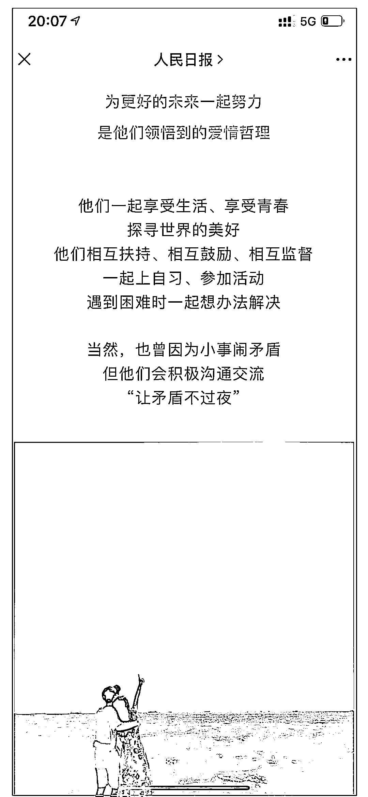

# 手把手教你春节反催婚

> 原文：[`mp.weixin.qq.com/s?__biz=MzU0MjYwNDU2Mw==&mid=2247503598&idx=1&sn=cd143b9f1ecaf9cbbbc75b733ba3f20d&chksm=fb1aa292cc6d2b84afc5f87e515c270e3ef185928454eb889dad6e4452df0aaa9ef9108de972#rd`](http://mp.weixin.qq.com/s?__biz=MzU0MjYwNDU2Mw==&mid=2247503598&idx=1&sn=cd143b9f1ecaf9cbbbc75b733ba3f20d&chksm=fb1aa292cc6d2b84afc5f87e515c270e3ef185928454eb889dad6e4452df0aaa9ef9108de972#rd)

又要春节了，很多读者留言跟我说不想回家，回家面对催婚，不知何所云，不知何所对。

你怎么应对，是辩论，是沉默，是逃避，那是你的事儿，我帮不了你。但是帮你把整件事捋一捋，我可以。

首先说到催婚，我们要弄清楚大背景，大背景不是你妈在催婚，而是所有人共同的“妈”，也在催婚。

这个看完后什么感觉？

我一直以为大学生谈恋爱，都像我们年轻那会儿，偷偷摸摸在小湖边，小树林坐一坐，保安拿着手电筒一会儿跑来照一照，一会儿跑来摇一摇。我当年研三领结婚证，去院里办手续，还被投以异样的目光。 

没想到，现在的年轻人谈个恋爱，都能谈到这种等级的版面上去，而且是头版头条。

让人怎么说呢？不连生三个，怎么对得起这样的器重........ 

我想，话说到这里，你应该明白了。我曾经以为那种级别的头版只能是天下大事，如果说大学生谈恋爱都能上去，只能说明，这就是当下的头等大事。 

你还怪你妈催婚么？

你妈哪里是催婚，你妈分明是侠之大者，为国为民。

这是大背景，所有一切的大背景。

在这个大背景下，我们思考一个问题，当下的年轻人为啥不结婚？

答案很清楚，找不到合适的。 

曾经有个理论，解释了 3000 万光棍的来源，也就是所谓的 C 女盯着 B 男，B 女盯着 A 男，于是 C 男剩下了。 

其实这个理论对男女双方是公平的。当乡村有 3000 万男性找不到老婆的同时，城市里找不到合适男生的女性，恐怕人数亦不少。 

这是为什么？实际上是因为绝大部分女性都盯着 A 男，如果嫁不到，有部分会向 B 男妥协，而剩下的，很大概率选择终身不婚。 

咱们小号聊过一个故事，[一对普通深圳男女的恋爱故事](http://mp.weixin.qq.com/s?__biz=MzU3NDc5Nzc0NQ==&mid=2247512098&idx=1&sn=82d8d7a1e32d94c19ecf32f34ba86c1a&chksm=fd2e12fcca599bea3cf41c0a1842b7d55c2fdd0a9c5aaff49cd043672488a895cf2c690f0d16&scene=21#wechat_redirect)。

故事中的女方原本希望嫁给腾讯的正式员工，她看到婚介中心提供的男方资料上显示该人就职于腾讯，看到腾讯的工牌，看到男友每天去腾讯上班，看到名片上的总监头衔，自己暗搓搓的猜测对方年薪百万起，能够在深圳买房定居。于是欣欣然地嫁了。

婚后才发现对方只是腾讯的外包人员，年薪不过 20 几万，完全没有能力在深圳定居，于是愤怒的指责婚介中心。 

这个故事我没有评价因为我对于狗血剧情本来就没兴趣。 

我感兴趣的地方在于故事之外。 

看这个故事，看网友们对故事的评价，我能够感受到，这个男性实际上是故事中女方眼里的 B 男，其实他也是网络定义下的 B 男。 

一个年收入 20 几万的腾讯外包人员，存款也只有 20 万，父母没有能力资助他在深圳买房定居。 

那么这样的 B 男在同龄男性当中的段位大概是多少呢？ 

我看过很多数据，对我们的 30 岁左右的男性的收入各自进行了采样，统计。应该说彼此相差太大，几乎没有办法关联。 

其中最乐观的，故事中的这个男性的收入以及家庭财产情况综合来讲已经超过了 99%的同龄男性。

而其中最悲观的，这个腾讯外包人员的收入以及家庭财产情况综合起来也超过了 90%的同龄男性。 

我们取最悲观的，100 个人，他排第 10。100 个 30 岁的男性当中，只有 9 个人的年收入会超过 20 几万。 

100 个同龄人里面他排第 10，他是 B 男，意味着什么？意味着 A 男很少，最多有 9 个，最少也许只有 1 个或者 1 个都不到。

如果按照故事中这个女的幻想的腾讯的正式员工，年收入百万起，恐怕在 30 岁的人群中，真的百分之一都不到。 

那么如果大部分女性都盯着这部分人，也就意味着，其实绝大部分男性，超过 90%的男性都不适合作为配偶。 

那我们把父母拉进来，一个钱包不够，三代加上去凑，看看给一点加成，是否能够多一些合适的男性选择对象。

一个人，如果年收入只有小几十万，想要在深圳定居，父母起码得凑出 300 万，在北上定居，父母得凑出 250 万，在广州定居，父母得凑 200 万，在长三角其他几个城市定居，父母得凑 150 万。 

没有这个钱，你就没有首付。即便你能够遇到一个愿意和你一起奋斗一起扛房贷的女孩子，你也没有起点。 

那么能够凑出这个首付的家庭，会有多少呢？占比绝对小于 10%，这个数字其实挺小的，我都不忍心说，你可以看各类统计家庭资产的表格。 

我们总的资产包可能很大，问题是，不均匀。就像你看到深圳最美房东一次性免了 1200 个人的房租，但是深圳这座城市其实拥有商品房的人数连 8%都不到。 

这个就不展开了。 

如果把父母加起来，仍然无法打造足够的 A 男，那么意味着什么？意味着 90%的适龄女性终归是无人可选的。

那就只能退而求其次，比如故事中的主人公，这个外包人员，也得纳入考虑了。 

那这时候就会有一部分女性想，我图什么？ 

是啊，我图什么？ 

他有钱么？没有。他有颜么？没有。他会哄我开心么？没有。他浪漫么？没有。他有才么？没有。 

他可能就是一个很普通的人，赚的也不多，也没有什么情趣，也没有什么想法，平日里加加班，你跟他在一起，也无非是搭伙过日子。 

那老娘一个人过，不香么？老娘为什么要给他生孩子，跟他一起攒首付，还要迁就他，照顾他，给他做饭，适应他的家人？老娘图什么？该他的还是欠他的？

一个人多好？想逛连卡佛逛连卡佛，想旅游旅游，就像流调中的北京女孩。 

说得太对了，你说到根子上了。 

这里面有部分女性会屈服，算了，凑合一下吧，找一个收入和自己差不多的，或者只比自己多一点的，权当下嫁。 

也有不会屈服的，那么不会屈服的，也许这辈子，就再也不会屈服了。 

我们每年都有几百万的适龄女性脱离生育周期，大家在漫长的等待中，始终没有等到那个让自己眼睛一亮的男性，于是决定，一个人挺好。 

这实际上就是事实，一个人，确实挺好。作为女性。 

那么我们回过头来看落到最后的那部分男性，也就是所谓的 C 男。你不用操心 B 男，故事中这个腾讯的外包总监他总能找到配偶的，他深圳呆不下去会去二线城市，二线呆不下去会去三线，他总会娶到媳妇的，他不是我们今天的主人公。 

那些绝对找不到配偶的，往往是没有文化，没有收入，家庭很一般的乡村留守男性。 

如果故事中这个 B 男中的佼佼者都会被人看不起，你觉得，他们最后能等来什么？难道真的能像董永一样等来七仙女么？

所以他们的选项是什么？很简单，出海，选择别国异性。 

换一个国家，他们就是 A 男，妥妥的。 

国与国之间是有收入差距的，你去看下越南，老挝，缅甸，俗称老药棉的收入，就知道即便月入 2000，也可以很有吸引力。 

换个国家就可以。 

有人说会不会引起人种结构的变化，你放一万个心。 

那些月收入几百块甚至更低的地区的男性有没有可能通过婚姻进入内地？有没有？ 

当然没有。如果他们有机会 ，我们的 C 男怎么会剩下呢？

而如果只是他们的女性进入内地，有什么关系？一个村里来了几个外国媳妇，她们还能把全村都异化了不成？ 

不会的，她们只会被同化，她们的后代和大家没有什么不一样。 

所以这个问题的答案非常简单，城市里部分女性遇到的问题是无解的，因为结婚对于她们而言，就是不划算的呀。 

而乡村部分男性遇到的问题是有解的，解决问题的答案，在海外。